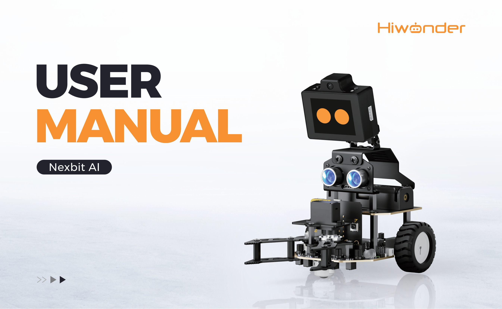
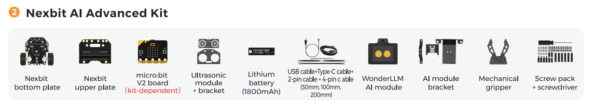

# 1. Nexbit AI User Manual

## 1.1 Product Overview

The Nexbit AI robot car is a compact smart robot developed around the micro:bit controller. The chassis is equipped with a 4-channel line follower sensor with adjustment knobs, a glowy ultrasonic sensor, an IR receiver module, high-torque DC geared motors, and a high-capacity lithium battery, along with multiple expansion ports. Powered by the WonderLLM AI module, the robot comprehensively analyzes voice commands and environmental sensor data. Moving beyond fixed pre-programmed scripts, the robot dynamically adjusts its operating logic based on live scenarios to achieve scene recognition and autonomous decision-making. This process cultivates computational AI thinking and problem-solving skills in students.

## 1.2 Product Specifications

| Parameter | Specification |
| :---: | :--- |
| Brand | Hiwonder |
| Product model | Nexbit AI Advanced Kit |
| Programming software | MakeCode graphical programming |
| Recommended age | 8+ |
| Electronic modules | WonderLLM AI module, DC geared motors, 4-channel line follower sensor, glowy ultrasonic sensor, robotic gripper |
| Communication | USB, Bluetooth |
| Material | Metal bracket |
| Product weight including packaging | 0.7 kg |
| Package dimensions | 19.8 × 13.0 × 9.2 cm |

## 1.3 Packing List

## 1.4 Precautions

- The products described in this manual, including both hardware and software, are provided on an **"as is"** basis. Every effort has been made to ensure accuracy during compilation. However, complete freedom from errors or omissions cannot be guaranteed. Documentation undergoes periodic review. Feedback and suggestions for improvement are always welcome.

- Product specifications and content may change as versions are upgraded. Contact customer support when placing orders to obtain the latest product information.

- Hiwonder assumes no liability for malfunctions, damage, or losses resulting from use under extreme conditions, unless such application is explicitly endorsed by Hiwonder.
