# 3. Quick Experience

## 3.1 Powering On and Charging

### 3.1.1 Powering On

Turn on the power switch. The power indicator illuminates red, indicating successful startup.

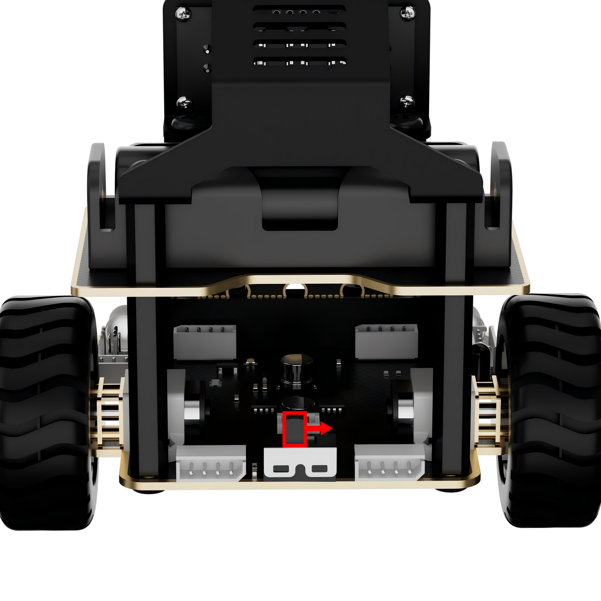

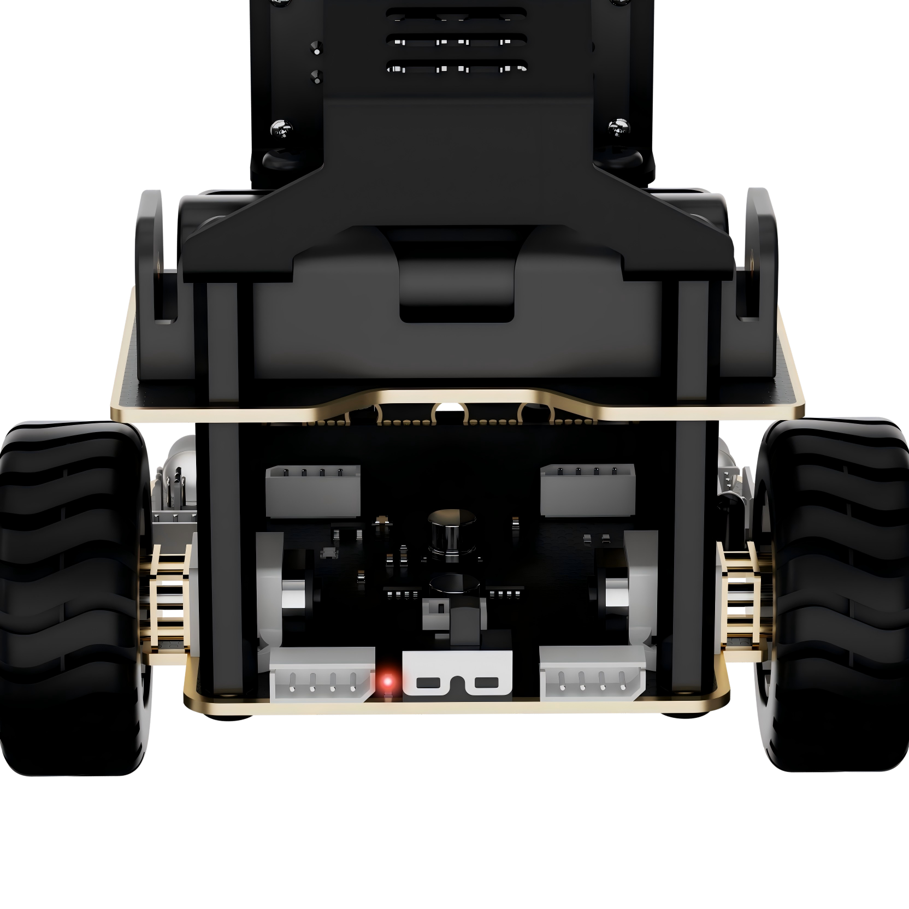

### 3.1.2 Charging

#### (1) Charging Instructions

Use a 5 V, 2 A charger to connect the included micro USB cable to the charging port on the battery board:

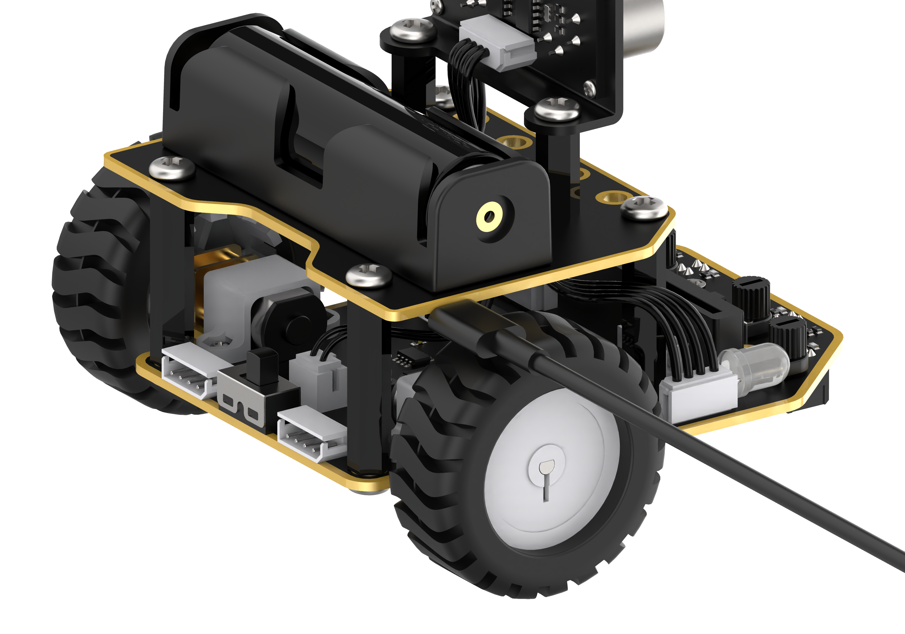

#### (2) Precautions

- During charging, the indicator on the battery board flashes red. When fully charged, the indicator remains solid red. Disconnect the charger and power supply promptly after charging completes to prevent overcharging from damaging the battery. A person must remain present during charging.

- The power switch must be turned off during charging. Otherwise, the battery cannot be fully charged.

## 3.2 MakeCode Programming Software Tutorial and Program Upload

### 3.2.1 micro:bit Programming Environment

The micro:bit programming environment is accessible through the online programming platform provided by BBC. Click [Microsoft MakeCode for micro:bit](https://makecode.microbit.org/) directly, or copy the URL below into any browser to open the editor:

```py
https://makecode.microbit.org/
```

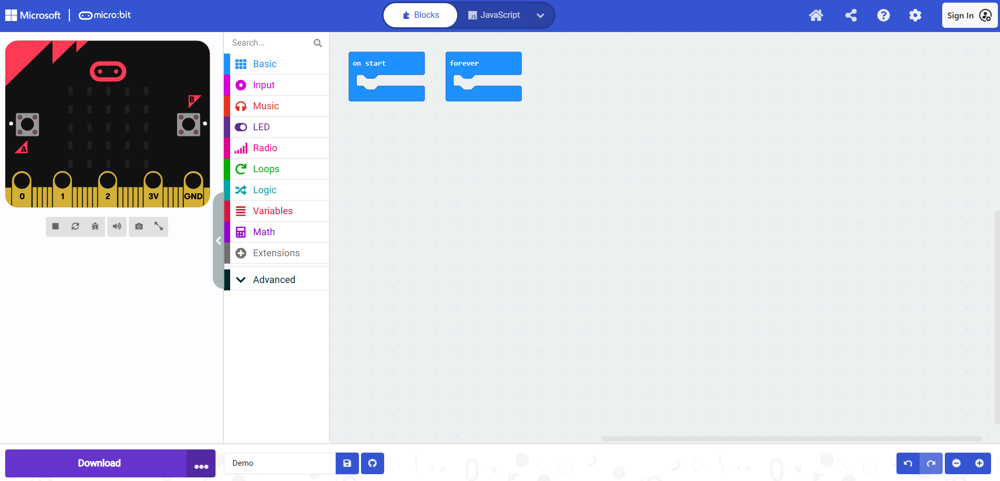

### 3.2.2 Adding Extensions

1. Click **Extensions**.


2. Copy the following URLs into the search bar under **Extensions** to add the corresponding extension packages for **Nexbit** and **WonderLLM_S3** respectively:

```py
https://github.com/Hiwonder/Nexbit
```

```py
https://github.com/hiwonderk12/WonderLLM_S3
```

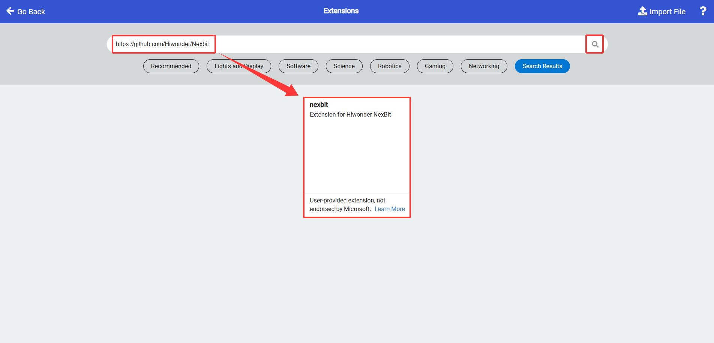

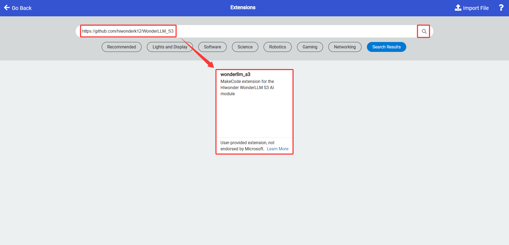

## 3.3 Multimodal AI Network Configuration and Device Binding

> [!NOTE]
>
> **This section provides a quick guide to getting started with the WonderLLM module. For advanced features and details, refer to [7.6 WonderLLM AI Module](./7.%20Software%20and%20Hardware%20Guide.md#section-7-6).**

<a id="section-3-3-1"></a>

### 3.3.1 Module Network Configuration

1. Once powered on, the module begins network configuration. The screen displays the **device Wi-Fi hotspot name** and the **browser configuration URL**, accompanied by a voice broadcast. The AI module activates its built-in Wi-Fi hotspot for connection and setup. Wi-Fi hotspot names vary across devices in the format of **Robot-xxxx**. The hotspot Robot-B7B9 is used below as an example.


2. Search for the corresponding hotspot on a computer or mobile phone and connect to it. This hotspot requires no password.


3. Click [Network Configuration](http://192.168.4.1/) to access the device configuration web page directly, or copy the URL below into any browser to open the configuration page:

```py
http://192.168.4.1
```


4. Enter the desired Wi-Fi network name in field ① and the network password in field ②. Then click **Connect** in field ③. The module searches for the matching Wi-Fi network in the current environment and connects based on the provided credentials.


5. If the following prompt appears, the Wi-Fi network cannot be found in the current environment or the password is incorrect. Re-enter the credentials.


6. If the following prompt appears, the module has located the Wi-Fi network and connected successfully. The module restarts automatically and reconnects to the network.


> [!NOTE]
>
> * **Do not enter Wi-Fi networks that cannot be detected in the current environment, have weak signals, or do not support Internet access.**
>
> * **If the module previously stored other network credentials, the newly saved credentials coexist with them. Upon subsequent power-ups, the module checks each stored network in order of configuration to establish a connection.**
>
> * **If the screen displays an error indicating that checking for a new version failed and will retry in xx seconds, the current network may lack Internet access or suffer from poor signal quality. Switch to another network.**

7. After network configuration is complete, the module must be bound to the platform agent. The module screen displays a **6-digit device ID** and the **platform binding URL**, accompanied by a voice broadcast of the verification code. Complete the device binding on the platform. The `XXXXXX` below the URL represents the device ID.


<a id="section-3-3-2"></a>

### 3.3.2 XiaoZhi Platform Account Registration and Verification

> [!NOTE]
>
> **Unverified accounts do not affect basic module usage, but certain functions remain restricted. The differences between verified and unverified accounts are shown in the table below:**
>
> | Feature | Unverified | Verified |
> | :---: | :---: | :---: |
> | Model selection | Xiaozhi Lite | Xiaozhi Lite, Qwen 3.6, DeepSeek V4, Doubao Seed 2.0 |
> | Bound devices | 10 | 100 |
> | Official services | Weather, Music, Knowledge Base | Weather, Joke, Music, News, Knowledge Base |

- **XiaoZhi Platform Account Registration**

1. Click [XiaoZhi AI Chatbot](https://xiaozhi.me/) directly to visit the device binding website, or copy the URL below into any browser:

```py
https://xiaozhi.me
```


2. Click **Console** to enter the XiaoZhi AI agent management platform.


3. For a first-time login, register a platform account first.


4. Fill in the required information and click **Send code** to obtain the verification code.


5. Check the box to agree to the user agreement and privacy policy, then click **Login**.


6. Fill in the required profile details and click **Confirm** to complete profile setup and log in.


- **Logging in to GitHub**

1. On the XiaoZhi platform, click **GitHub Verification** below the  icon. Once the page redirects to the verification page, click **Link GitHub**.


2. Wait for the page to redirect to the GitHub login page.


3. If a GitHub account already exists, enter the credentials to log in and proceed to [Binding XiaoZhi Platform with GitHub](#section-3-1-2-3). If no GitHub account exists, click **Create an account**.


4. Enter an email address, password, username, and country or region on the registration page, then click **Create account** to submit the information.


5. Click **Visual puzzle** on the page to start the image verification.


6. After completing the puzzle, GitHub sends a verification email to the registered address. Open the email, copy the verification code, and enter it on the web page.


7. Upon completing registration, the page redirects to the login screen, displaying a registration success notification.


<a id="section-3-1-2-3"></a>

- **Binding XiaoZhi Platform with GitHub**

1. Click **Authorize tenclass** to bind the XiaoZhi platform with the GitHub account.


2. Once authorization completes, verification on the XiaoZhi platform is finished. The browser returns to the verification page, displaying the confirmation message shown below.


<a id="section-3-1-3"></a>

### 3.3.3 Device Binding

1. After completing registration, login, and verification on the XiaoZhi platform, click **Agents** to enter the interface shown below.


2. Click the **∨** drop-down button next to **+ Add Device**, then click **Create Agent**.


3. Enter a name for the agent and click **Confirm** to finish creating the agent.


4. Click **Configure** to access the feature settings of the agent.


5. Click **Role** to set up the agent persona. Select the preferred conversation language in field ①, choose the character voice in field ②, and configure voice settings in field ③.


6. Click **Model & memory**. Select **DeepSeek V4 (Rich Personality)** for the language model. Disable the **Memory** function and keep the other options at default settings.


7. Click **Extensions**. Check all options under **Official Services**, keep the other options at default settings, and click **Save**.


8. Click **Devices (0)** to enter the device management interface.


9. Click **+ Link new device**. Enter the **6-digit device ID** in the pop-up window and click **Link**.


10. When linking succeeds, a **Device added successfully** prompt appears on the page. Select **Open Source** and click **Start Using**.


## 3.4 Free Conversation with Multimodal AI

Once preparatory steps are complete, wake up the module by saying the wake word **Hello Hiwonder** or **short-pressing** the button on the right to enter chat mode.

The module features built-in capabilities that can be triggered through human-robot interaction. Issue the following voice commands to the WonderLLM module to query all supported functions: **1. What can you do?** **2. Introduce your features.**

The following voice commands can be issued to invoke specific functions:

1. Weather inquiry: **"Check the weather in [Region]."**


2. News broadcast: **1. "Broadcast today's news."** **2. "Introduce today's trending events."**


3. Outfit recommendation: **"What should I wear when going out today?"**

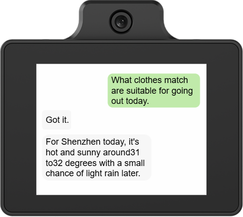

4. Joke telling: **1. "Tell me a joke."** **2. "Can you tell a joke to cheer me up?"**


5. Traditional calendar inquiry: **"Check today's almanac events."**

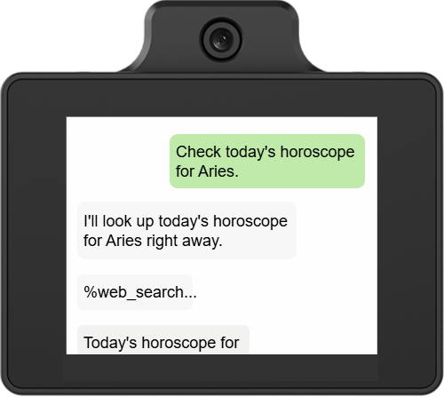

6. Music playback: **"Play a random song."**

> [!NOTE]
>
> **When using the music playback function, reducing the module volume beforehand is recommended.**


## 3.5 Multimodal AI Control

### 3.5.1 Program Presentation and Upload

This section guides hands-on exploration of diverse voice interaction cases powered by multimodal AI on the Nexbit AI robot car. The primary program is created on the [Microsoft MakeCode for micro:bit](https://makecode.microbit.org) graphical programming platform. Open the preset project via the link to upload the program to the micro:bit board.

- Program Link: [Click here to open](https://makecode.microbit.org/_33AYuhTkFiH0)

- The program can also be uploaded directly through the embedded page below:

<FeishuForm url="https://makecode.microbit.org/_33AYuhTkFiH0"/>

- Program Upload


> [!NOTE]
>
> **Power off the robot car before uploading the program to prevent the car from running unexpectedly and falling upon upload completion.**

### 3.5.2 Voice-Controlled Dot Matrix Display

- Voice Interaction Logic

Power on the robot car and wait for the AI module to complete initialization. After hearing the prompt tone, wake up the module by saying **Hello Hiwonder**, then speak a voice command into the microphone and observe the dot matrix display. Speaking **Display heart icon** shows a heart pattern on the dot matrix display. Speaking **Scroll and display hello** scrolls the text across the screen. Speaking **Clear screen** turns off the dot matrix display.

- Feature Demonstration

<VideoPlayer src="https://hiwonder.oss-cn-shenzhen.aliyuncs.com/videos/K12/Nexbit%20AI/02%E8%B1%AA%E5%8D%8E%E7%89%88/3.%E6%9E%81%E9%80%9F%E4%BD%93%E9%AA%8C-%E5%A4%A7%E6%A8%A1%E5%9E%8B%E8%AF%BE%E7%A8%8B/01%E5%A3%B0%E6%8E%A7%E7%82%B9%E9%98%B5%E6%98%BE%E7%A4%BA.mp4" type="video/mp4" title="Voice-Controlled Dot Matrix Display Demonstration" />

### 3.5.3 Sound and Light Interactive Control

- Voice Interaction Logic

Power on the robot car and wait for the AI module to complete initialization. After hearing the prompt tone, wake up the module by saying **Hello Hiwonder**, then speak a voice command into the microphone and observe the status of the RGB LEDs and buzzer. Speaking **Set RGB lights to red** illuminates the chassis RGB LEDs in red. Speaking **Play music** causes the buzzer to play a tune. Speaking **Stop music** stops buzzer playback. Speaking **Turn off lights** extinguishes the RGB LEDs.

- Feature Demonstration

<VideoPlayer src="https://hiwonder.oss-cn-shenzhen.aliyuncs.com/videos/K12/Nexbit%20AI/02%E8%B1%AA%E5%8D%8E%E7%89%88/3.%E6%9E%81%E9%80%9F%E4%BD%93%E9%AA%8C-%E5%A4%A7%E6%A8%A1%E5%9E%8B%E8%AF%BE%E7%A8%8B/02%E5%A3%B0%E5%85%89%E4%BA%A4%E4%BA%92%E6%8E%A7%E5%88%B6.mp4" type="video/mp4" title="Sound and Light Interactive Control Demonstration" />

### 3.5.4 Ultrasonic RGB Light Control

- Voice Interaction Logic

Power on the robot car and wait for the AI module to complete initialization. After hearing the prompt tone, wake up the module by saying **Hello Hiwonder**, then speak a voice command into the microphone and observe the lighting effects on the glowy ultrasonic sensor. Speaking **Set ultrasonic light to blue** sets the lights to solid blue. Speaking **Turn on red breathing light** makes the red light fade in and out gradually. Speaking **Turn off ultrasonic light** extinguishes the lights.

- Feature Demonstration

<VideoPlayer src="https://hiwonder.oss-cn-shenzhen.aliyuncs.com/videos/K12/Nexbit%20AI/02%E8%B1%AA%E5%8D%8E%E7%89%88/3.%E6%9E%81%E9%80%9F%E4%BD%93%E9%AA%8C-%E5%A4%A7%E6%A8%A1%E5%9E%8B%E8%AF%BE%E7%A8%8B/03%E8%B6%85%E5%A3%B0%E6%B3%A2%E5%BD%A9%E7%81%AF%E6%8E%A7%E5%88%B6.mp4" type="video/mp4" title="Ultrasonic RGB Light Control Demonstration" />

### 3.5.5 Smart Data Collection

- Voice Interaction Logic

Power on the robot car and wait for the AI module to complete initialization. After hearing the prompt tone, wake up the module by saying **Hello Hiwonder**, then speak a voice command into the microphone. Speaking **Detect front distance** triggers the AI to read the obstacle distance and announce the numerical value. Speaking **Read ambient temperature** prompts the AI to sample the controller board temperature and announce it. Speaking **Read line following status** allows the AI to read bitmask data from the 4-channel line follower sensor and analyze the current black line detection status.

- Feature Demonstration

<VideoPlayer src="https://hiwonder.oss-cn-shenzhen.aliyuncs.com/videos/K12/Nexbit%20AI/02%E8%B1%AA%E5%8D%8E%E7%89%88/3.%E6%9E%81%E9%80%9F%E4%BD%93%E9%AA%8C-%E5%A4%A7%E6%A8%A1%E5%9E%8B%E8%AF%BE%E7%A8%8B/04%E6%99%BA%E8%83%BD%E9%87%87%E9%9B%86%E6%95%B0%E6%8D%AE.mp4" type="video/mp4" title="Smart Data Collection Demonstration" />

### 3.5.6 Robot Motion Control

- Voice Interaction Logic

Install the battery and power on the robot car. Wait for the AI module to complete initialization until hearing the ready prompt tone. Wake up the module by saying **Hello Hiwonder**, then speak a voice command into the microphone. Saying **Car forward 2 seconds** triggers the AI to call the corresponding function, moving the car forward for 2 s before stopping automatically. Saying **Turn left in place** prompts the AI to invoke single-motor MCP control, using differential speed between left and right motors to execute a left turn. Saying **Set speed 50 and move continuously** calls the function to keep the car advancing. Saying **Stop** stops motor rotation immediately.

- Feature Demonstration

<VideoPlayer src="https://hiwonder.oss-cn-shenzhen.aliyuncs.com/videos/K12/Nexbit%20AI/02%E8%B1%AA%E5%8D%8E%E7%89%88/3.%E6%9E%81%E9%80%9F%E4%BD%93%E9%AA%8C-%E5%A4%A7%E6%A8%A1%E5%9E%8B%E8%AF%BE%E7%A8%8B/05%E6%9C%BA%E5%99%A8%E4%BA%BA%E7%A7%BB%E5%8A%A8%E6%8E%A7%E5%88%B6.mp4" type="video/mp4" title="Robot Motion Control Demonstration" />

### 3.5.7 Preset Action Execution

- Voice Interaction Logic

Install the battery and power on the robot car, then wait for the AI module to complete initialization. Wake up the module by saying **Hello Hiwonder**, then speak a voice command into the microphone. Saying **Execute action 1** triggers the AI to call the preset action group, causing the car to perform an in-place rotation sequence. The module does not respond to new voice commands until the action sequence completes. Once the motion finishes, issuing a new voice command executes the next action.

- Feature Demonstration

<VideoPlayer src="https://hiwonder.oss-cn-shenzhen.aliyuncs.com/videos/K12/Nexbit%20AI/02%E8%B1%AA%E5%8D%8E%E7%89%88/3.%E6%9E%81%E9%80%9F%E4%BD%93%E9%AA%8C-%E5%A4%A7%E6%A8%A1%E5%9E%8B%E8%AF%BE%E7%A8%8B/06%E9%A2%84%E8%AE%BE%E5%8A%A8%E4%BD%9C%E6%89%A7%E8%A1%8C.mp4" type="video/mp4" title="Preset Action Execution Demonstration" />

### 3.5.8 Multi-Mode Smart Driving

- Voice Interaction Logic

Install the battery and power on the robot car, then wait for the AI module to complete initialization. Wake up the module by saying **Hello Hiwonder**, then speak a voice command into the microphone. Saying **Enable following mode** causes the car to follow an object ahead. Saying **Enable obstacle avoidance mode** makes the car automatically steer around obstacles during forward travel. Saying **Enable color line-following mode** guides the car autonomously along the black line track on the ground. Saying **Disable autonomous driving** stops autonomous movement.

- Feature Demonstration

<VideoPlayer src="https://hiwonder.oss-cn-shenzhen.aliyuncs.com/videos/K12/Nexbit%20AI/02%E8%B1%AA%E5%8D%8E%E7%89%88/3.%E6%9E%81%E9%80%9F%E4%BD%93%E9%AA%8C-%E5%A4%A7%E6%A8%A1%E5%9E%8B%E8%AF%BE%E7%A8%8B/07%E5%A4%9A%E6%A8%A1%E5%BC%8F%E6%99%BA%E8%83%BD%E8%A1%8C%E9%A9%B6.mp4" type="video/mp4" title="Multi-Mode Smart Driving Demonstration" />

### 3.5.9 LLM-Controlled Robotic Gripper

- Voice Interaction Logic

Install the battery and power on the robot car, then wait for the AI module to complete initialization. Wake up the module by saying **Hello Hiwonder**, then speak a voice command into the microphone. Saying **Open gripper** opens the gripper fully. Saying **Close gripper** closes the gripper to clamp the object. The module does not respond to new voice commands while the gripper is in motion.

- Feature Demonstration

<VideoPlayer src="https://hiwonder.oss-cn-shenzhen.aliyuncs.com/videos/K12/Nexbit%20AI/02%E8%B1%AA%E5%8D%8E%E7%89%88/3.%E6%9E%81%E9%80%9F%E4%BD%93%E9%AA%8C-%E5%A4%A7%E6%A8%A1%E5%9E%8B%E8%AF%BE%E7%A8%8B/08%E5%A4%A7%E6%A8%A1%E5%9E%8B%E6%8E%A7%E5%88%B6%E6%9C%BA%E6%A2%B0%E7%88%AA.mp4" type="video/mp4" title="LLM-Controlled Robotic Gripper Demonstration" />

## 3.6 Wonderbit App Tutorial

### 3.6.1 Wonderbit App Overview

Wonderbit is a mobile control application developed specifically to support micro:bit series robots.

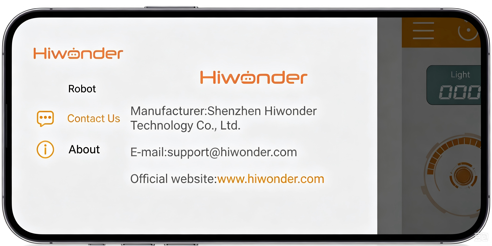

### 3.6.2 Downloading the Wonderbit App

- Click [Wonderbit](https://www.hiwonder.com.cn/download/foreignSofts?get_app=2) to download the app or scan the QR code to download:


- Open the app. In the pop-up main interface, click the menu button with three horizontal lines and scroll down to switch the device to **Nexbit AI**.

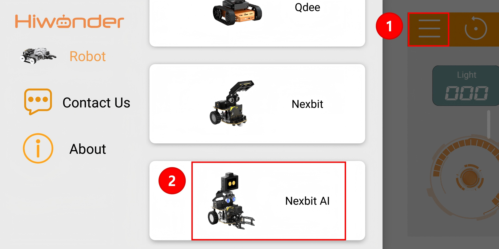

- Enter the main control interface:


### 3.6.3 Adding Extensions

1. Click **Extensions**.


2. Copy the following URL into the **Extensions** search box to add the **nexbit** extension package:

```py
https://github.com/Hiwonder/Nexbit
```


3. Search for **bluetooth** in **Extensions** to add the Bluetooth extension package:

```py
bluetooth
```


4. In the pop-up warning dialog, select **Remove extension(s) and add bluetooth**.

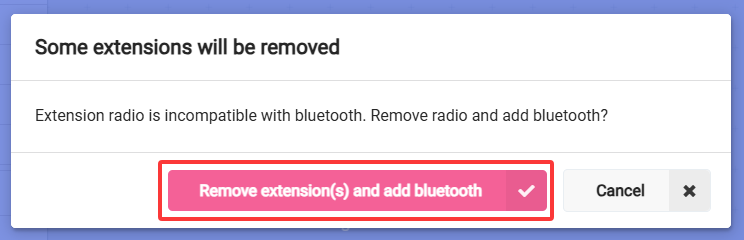

5. In Project Settings, configure the project to **No Pairing Required: Anyone can connect via Bluetooth**.

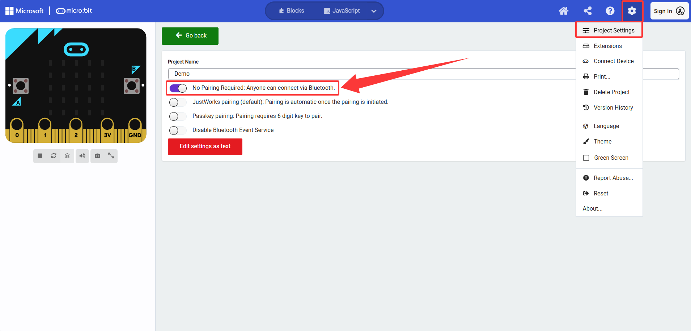

> [!NOTE]
>
> **Alternative program import method: Drag and drop the example program file for this lesson directly into the MakeCode web interface without manually adding extension libraries.**

### 3.6.4 Program Presentation and Upload

- Program Link: [Click here to open](https://makecode.microbit.org/_XTJMPqb6oTx5)

- The program can also be uploaded directly through the embedded page below:

<FeishuForm url="https://makecode.microbit.org/_XTJMPqb6oTx5"/>

- Program Upload Steps:


> [!NOTE]
>
> * **Power off the robot car before uploading the program to prevent the robot from running unexpectedly and falling upon upload completion.**
>
> * **After the upload is complete, power on the robot car and connect via Bluetooth in the app.**

### 3.6.5 Bluetooth Connection

1. Open the **Wonderbit** app and enter the **Nexbit AI** control interface.


2. Tap the search icon  to scan for devices.


3. Tap **BBC micro:bit** to connect. Returning to the main interface confirms successful connection, allowing control tests with the robot car.

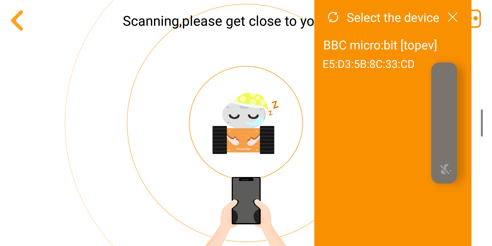


### 3.6.6 Feature Description

| Icon | Function | Icon | Function |
| :---: | :--- | :---: | :--- |
|  | When enabled, controls the robot's movement via gravity sensing | 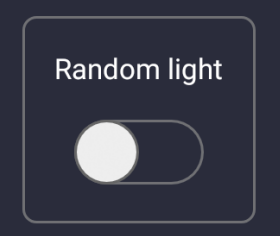 | When enabled, cycles onboard chassis RGB LEDs through random colors automatically |
| 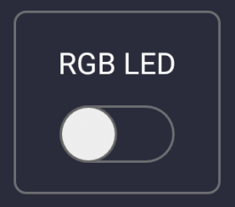 | Toggles RGB LEDs on and off | 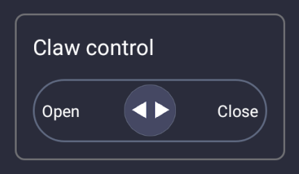 | Controls opening and closing of the robotic gripper. For details, refer to Chapter 6 of the Advanced Kit curriculum |
|  | Displays ultrasonic-detected distance and toggles obstacle avoidance mode | 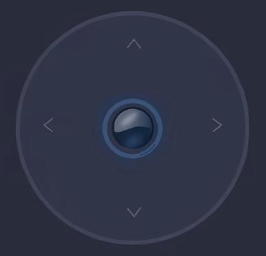 | Controls the robot forward, backward, and steering motion |
|  | Customizes and adjusts onboard chassis RGB LED colors | | |

### 3.6.7 Feature Demonstration

<VideoPlayer src="https://hiwonder.oss-cn-shenzhen.aliyuncs.com/videos/K12/Nexbit%20AI/02%E8%B1%AA%E5%8D%8E%E7%89%88/3.%E6%9E%81%E9%80%9F%E4%BD%93%E9%AA%8C-%E5%A4%A7%E6%A8%A1%E5%9E%8B%E8%AF%BE%E7%A8%8B/09Wonderbit%E8%BD%AF%E4%BB%B6%E6%BC%94%E7%A4%BA.mp4" type="video/mp4" title="Wonderbit App Feature Demonstration" />
