# 5. Multimodal AI Projects

## 5.1 Multimodal AI Network Configuration & Device Binding

<a id="section-5-1-1"></a>

### 5.1.1 Module Network Configuration

1. Power on the device. For first-time use, the Multimodal AI module must be connected to the network first. At this time, the screen displays the **device hotspot name** and the **browser configuration URL** alongside voice broadcast prompts. The module automatically activates its built-in Wi-Fi hotspot for configuration. Each device has a unique hotspot name following the **Robot-xxxx** format. The following steps use hotspot Robot-B7B9 as an example.

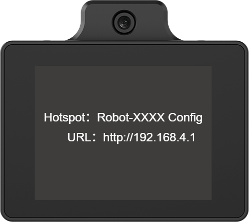

2. Search for the corresponding hotspot using a computer or mobile phone and connect. The hotspot requires no password.


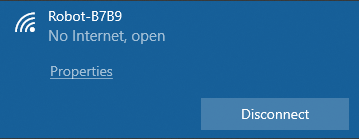

3. Click [Network Configuration](http://192.168.3.1/) to access the device configuration page directly, or copy the URL below into any web browser:

```py
http://192.168.3.1
```

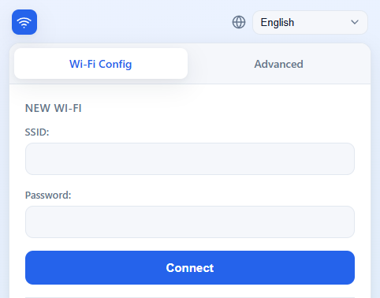

4. Enter the Wi-Fi hotspot name to connect automatically upon power-up in field ①, and enter the Wi-Fi password in field ②. Click **Connect** in field ③. The module will search for the matching hotspot in the current environment and connect based on the provided credentials.

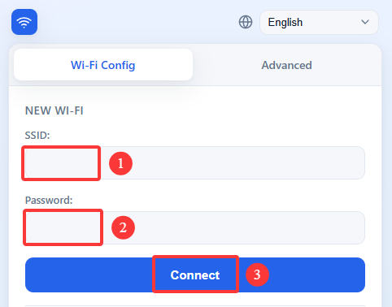

5. If the following prompt appears, the hotspot cannot be found in the current environment or the password is incorrect. Please re-enter the credentials.

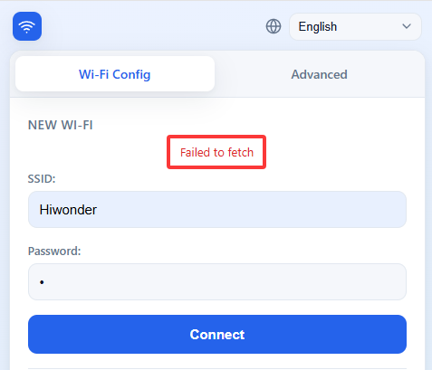

6. If the following prompt appears, the module has located the hotspot and connected successfully. The module restarts automatically and connects to the designated hotspot.


7. After completing network configuration, bind the module to a platform agent. The module screen displays the **6-digit device ID** and the **device binding website URL** while broadcasting the binding verification code. Bind the module device to the platform. The string `XXXXXX` beneath the binding URL represents the device ID.


### 5.1.2 XiaoZhi Platform Account Registration and Authorization

> [!NOTE]
>
> **If the platform account has not completed GitHub authorization, basic module operation remains functional, but features are restricted. The differences between authorized and unauthorized accounts are shown in the table below:**
>
> | | Unauthorized | Authorized |
> | :---: | :---: | :---: |
> | Model selection | Xiaozhi Lite | Xiaozhi Lite, Qwen 3.6, DeepSeek V4, Doubao Seed 2.0 |
> | Bound device limit | 10 | 100 |
> | Official services | Weather, music, knowledge base | Weather, joke, music, news, knowledge base |

- **XiaoZhi Platform Account Registration**

1. Click [XiaoZhi AI Chatbot](https://xiaozhi.me/) to visit the device binding website directly, or copy the URL below into any web browser:

```py
https://xiaozhi.me
```

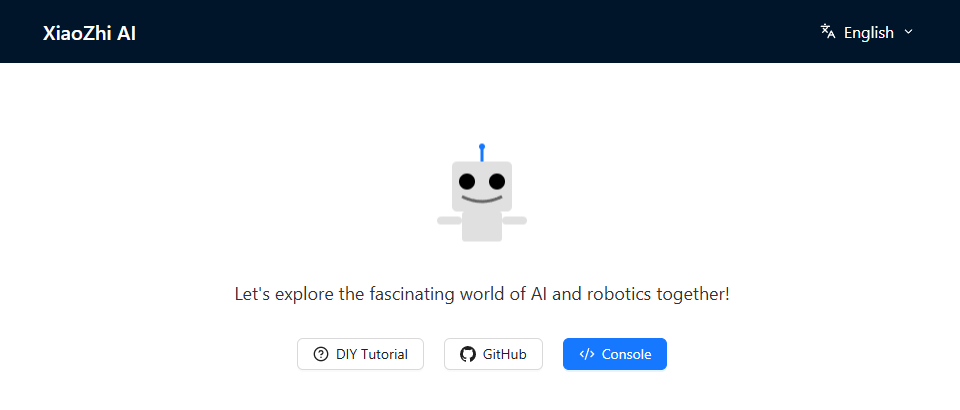

2. Click **Console** to enter the XiaoZhi AI agent management platform.

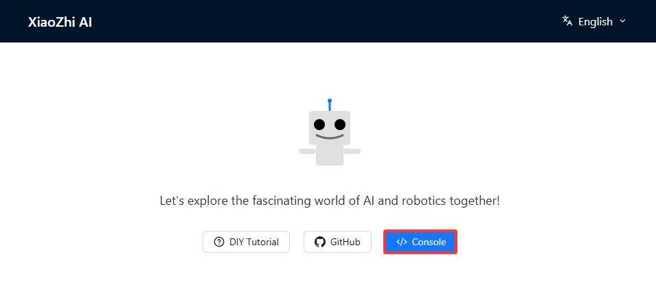

3. For first-time login, register an account first.

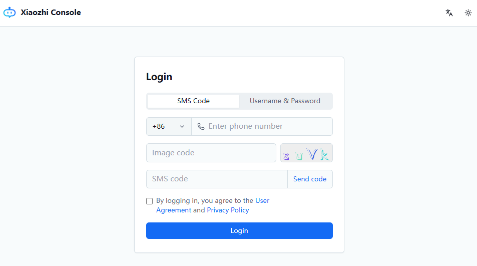

4. Fill in the required information and click **Send code** to obtain the verification code.

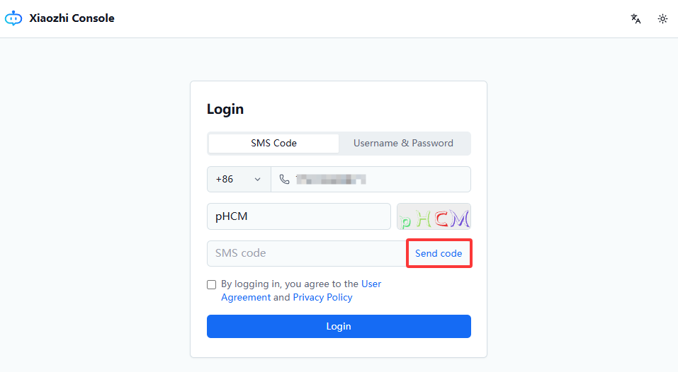

5. Check the agreement and privacy policy boxes, then click **Login**.


6. Complete the required profile information and click **Confirm** to finish registration and log in.

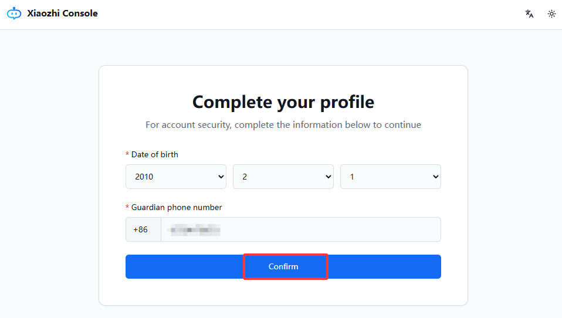

- **Logging into GitHub Platform**

1. On the XiaoZhi platform, click **GitHub Verification** under the avatar menu. After being redirected to the verification page, click **Link GitHub**.

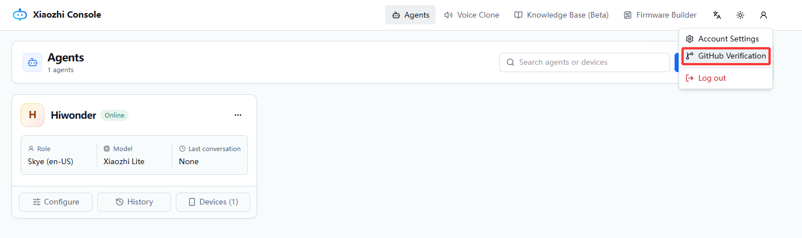

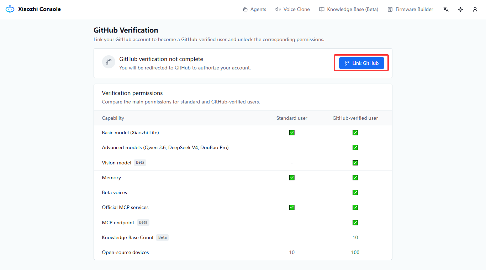

2. Wait for the page to redirect to the GitHub login interface.


3. If a GitHub account already exists, log in directly and proceed to [Binding XiaoZhi Platform with GitHub](#section-5-1-2-3). If there is no GitHub account, click **Create an account**.


4. On the prompt interface, enter the email address, password, username, and country or region information in sequence, then click **Create account** to submit.


5. Click **Visual puzzle** on the page to start visual verification.

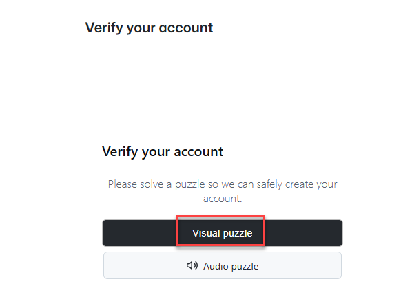

6. After completing visual verification, GitHub sends a verification email to the registered address. Open the email, copy the verification code, and enter it on the webpage.


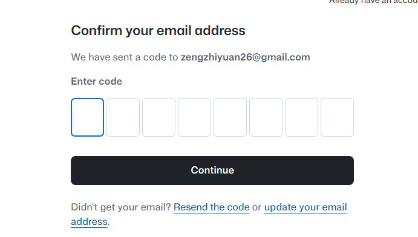

7. Upon registration completion, the page redirects to the login screen, and a registration success pop-up appears.


<a id="section-5-1-2-3"></a>

- **Binding XiaoZhi Platform with GitHub**

1. Click **Authorize tenclass** to complete binding between XiaoZhi and GitHub.


2. Once binding is complete, platform verification is finished. The page automatically returns to the previous verification screen, displaying the **GitHub verification complete** notification.

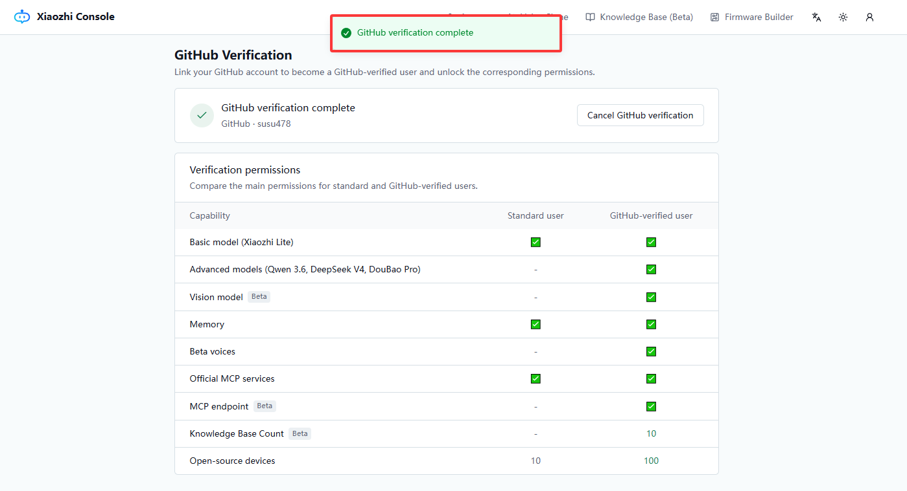

<a id="section-5-1-3"></a>

### 5.1.3 Device Binding

1. After completing registration, login, and authorization on XiaoZhi, click **Agents** to enter the following interface.

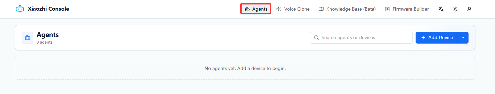

2. Click the drop-down arrow **∨** next to the add device button, then click **Create Agent**.


3. Enter the agent name and click **Confirm** to create the agent.


4. Click **Configure** to access agent feature configurations.

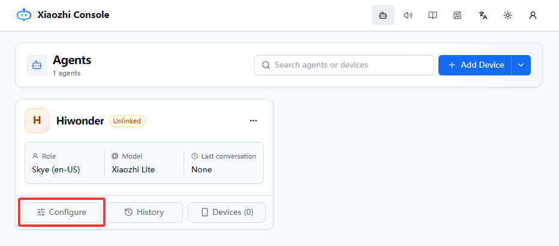

5. Click **Role** to configure the agent. Select the dialogue language in ①, select the voice in ②, and expand **Voice settings** in ③.

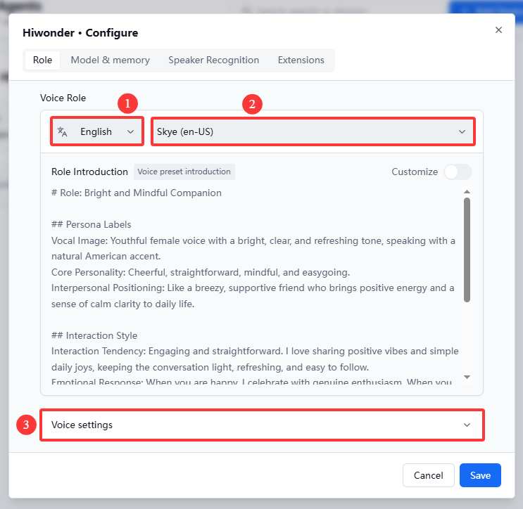

6. Click **Model & memory**. Select **DeepSeek V4 (Rich Personality)** as the language model and disable the **Memory** switch in ②. Keep all other settings at default.

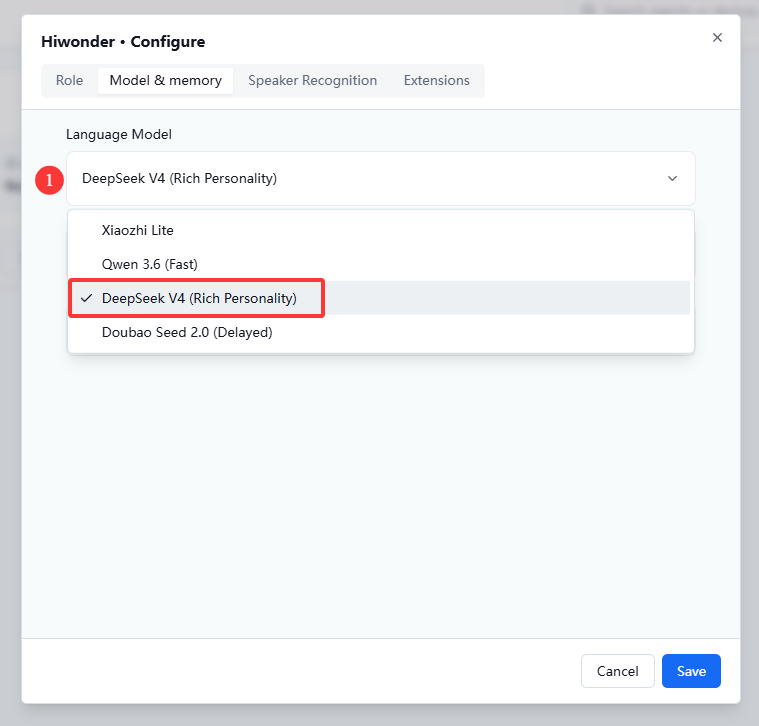

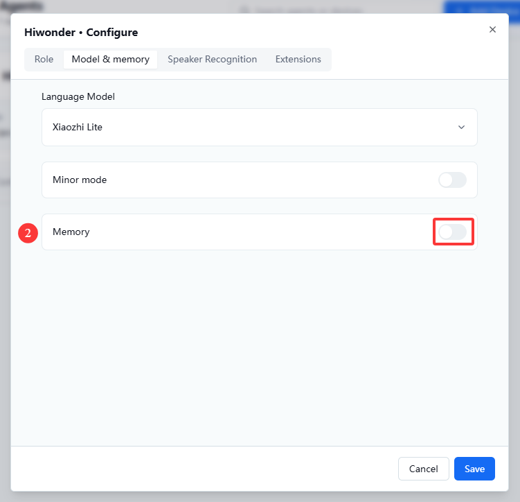

7. Click **Extensions**. Select all options under **Official Services** while retaining other default settings, then click **Save**.

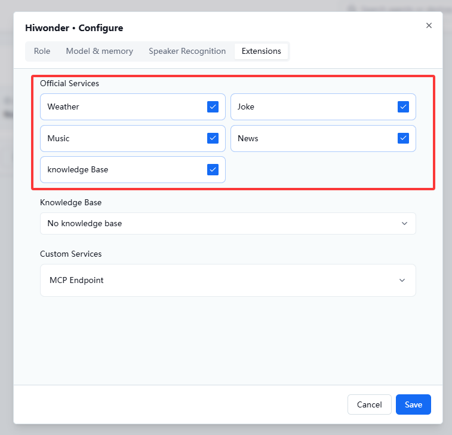

8. Click **Devices (0)** to enter device management.


9. Click **Link new device**. In the pop-up dialog, enter the **6-digit device ID** and click **Link**.


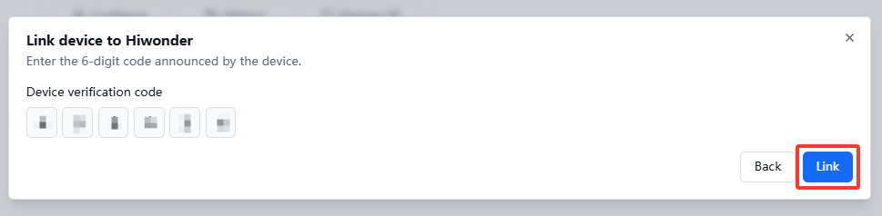

10. Once successfully linked, a **Device added successfully** notification appears. Select **Open Source** and click **Start Using**.


## 5.2 Voice-Controlled Dot Matrix Display

### 5.2.1 Lesson Introduction

This lesson focuses on voice-controlled dot matrix display projects with the Nexbit AI robot car, introducing the WonderLLM voice module and dot matrix command blocks. Issuing voice commands triggers the AI to call MCP tools, displaying numbers, text, icons, arrows, or clearing the dot matrix screen. Mastering the fundamental logic of AI tool calling lays the programming foundation for subsequent AI voice interaction projects.

### 5.2.2 Learning Objectives

1. **Knowledge Objectives**: Identify the micro:bit LED matrix display. Understand MCP tool-calling principles with WonderLLM, and recognize the full workflow from voice recognition to screen display.

2. **Skill Objectives**: Master adding the **nexbit** and **wonderllm s3** extension packages. Configure MCP display tools. Complete program upload and debugging to achieve a voice-controlled dot matrix display.

3. **Thinking Objectives**: Understand how multimodal AI models drive hardware interaction. Develop engineering thinking in parameter matching and troubleshooting.

4. **Application Objectives**: Master implementation methods for AI voice-controlled peripherals. Understand fundamental voice interaction applications in educational robotics.

### 5.2.3 Preparation

#### (1) Hardware Preparation

- Nexbit AI robot car

- micro:bit board

- Micro USB cable

- Battery

- Computer

> [!NOTE]
>
> **Pay close attention to battery polarity during installation. Reverse connection is strictly prohibited.**

#### (2) Software Preparation

- Access the MakeCode for micro:bit online programming platform:

  - [MakeCode for micro:bit](https://makecode.microbit.org/)
  
  - Copy the following link and open it in a web browser:

```py
https://makecode.microbit.org/
```

- Create a new project

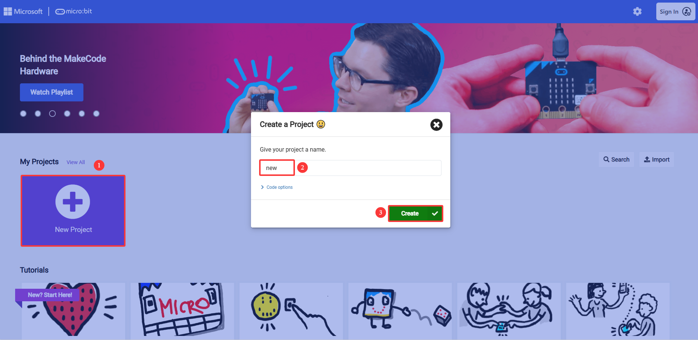

### 5.2.4 Hands-On Project

#### (1) Project Analysis

The core project of this lesson is controlling the Nexbit AI robot car to achieve voice-controlled dot matrix displays. The robot car features the WonderLLM AI module, which captures voice commands via its microphone. After parsing the command, the AI invokes the MCP display tool, passing the `display_type` and `display_value` parameters to drive the dot matrix display. Five display effects are supported: numbers, icons, scrolling text, arrows, and clearing the screen. Configuring MCP tool parameters and debugging voice interaction ensures reliable mapping from voice commands to screen visuals.

#### (2) Adding Extensions

1. Click **Extensions**.


2. Copy the link below, paste it into the search box in **Extensions**, and add **nexbit**:

```py
https://github.com/Hiwonder/Nexbit
```


3. Copy the link below, paste it into the search box in **Extensions**, and add **wonderllm s3**:

```py
https://github.com/hiwonderk12/WonderLLM_S3
```


> [!NOTE]
>
> **Alternative Program Import Method: Drag and drop the sample program file of this lesson directly into the MakeCode webpage without manually adding the nexbit and wonderllm s3 extensions.**

#### (3) Core Blocks

- **Core Block Analysis**

| Block | Category | Function description |
| :---: | :---: | :--- |
|  |  | Displays a specified number on the dot matrix screen. |
| 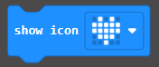 |  | Displays built-in preset icon patterns on the dot matrix screen. |
| 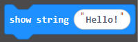 |  | Displays a text string on the dot matrix screen with scrolling support. |
| 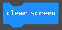 |  | Clears all content currently shown on the dot matrix screen. |
|  |  | Displays an arrow symbol pointing in a specified direction on the screen. |
|  |  | Assigns a specified numeric value to a variable. |
|  |  | Increases or decreases a variable value by a set increment. |
|  |  | Reads and returns the numeric value stored in a variable. |
|  |  | Performs four arithmetic operations, including addition, subtraction, multiplication, and division, outputting the result. |
|  |  | Rounds a decimal number, supporting rounding, ceiling, and floor modes. |
|  |  | Initializes the Nexbit expansion board hardware, starting ports and display drivers. |
|  |  | Initializes the WonderLLM AI module upon power-up and establishes communication. |
|  |  | Configures MCP tool information, defining tool name, description, input parameter format, and execution blocking settings. |
|  |  | Sends configured MCP tool settings to the AI module to take effect. |
|  |  | Reads returned data after AI tool execution completes. |
|  |  | Returns a specified numeric result upon function completion. |
|  |  | Calls a custom function named doSomething to execute internal code. |
| 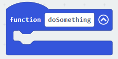 |  | Defines a custom function named doSomething, packaging reusable program logic. |
|  |  | Checks whether target text contains a specified character, returning a boolean result. |
| 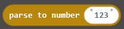 |  | Converts a text-formatted numeric string into a numeric data type for computation. |
|  |  | Concatenates multiple text segments and outputs a new merged string. |
|  |  | Finds the index position of a specified character within text. |
|  |  | Extracts a substring of specified length starting from a given index in text. |

- **MCP Configuration Analysis**

1. Tool name: `self.control.microbit_display`

2. Tool description: When you want to display numbers, characters, text, built-in icons or arrows on the micro:bit LED display screen, please use this tool. The parameter `display_type` must be one of `number`, `character`, `text`, `icon`, `arrow`, or `clear`. For numbers, `display_value` is the numerical value to be displayed. For characters or text, `display_value` is the scrolling content of the characters or text. For icons, `display_value` must be one of the following: `heart`, `small_heart`, `yes`, `no`, `happy`, `sad`, `confused`, `angry`, `asleep`, `surprised`, `silly`, `fabulous`, `meh`. For arrows, `display_value` must be one of the following: `north`, `northeast`, `east`, `southeast`, `south`, `southwest`, `west`, `northwest`. For `clear`, `display_value` can be empty.

3. Return parameters: `[["display_type", "string"], ["display_value", "string"]]`

4. Block until tool execution completes: `false`

5. Data returned to AI module: `false`

6. Function: This MCP tool enables the AI to call the micro:bit dot matrix display. It supports six display types. The AI automatically matches parameters based on voice commands to drive screen rendering.

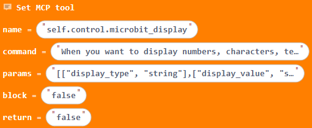

#### (4) Program Description and Upload

- Program Schematic

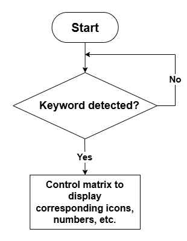

- Complete Program and Analysis

1. Upon startup, the Nexbit hardware library and WonderLLM module initialize in sequence, loading the MCP display tool configuration.

2. The program continuously listens for voice input. Upon recognizing a voice command, the AI calls the MCP tool, passing the corresponding display type and value to render visuals on the dot matrix screen.


Program Link: [Click to view](https://makecode.microbit.org/_dwMMJFDXo5wA)

The program can also be downloaded directly from the following webpage:

<FeishuForm url="https://makecode.microbit.org/_dwMMJFDXo5wA"/>

- Program Upload


#### (5) Feature Demonstration

Power on the robot car and wait for AI module initialization to complete. Upon hearing the prompt tone, speak voice commands toward the microphone and observe screen updates. Saying "Display heart icon" causes the dot matrix screen to show a heart pattern. Saying "Scroll display hello" causes text to scroll across the screen. Saying "Clear screen" turns off the dot matrix screen, as demonstrated below:

<VideoPlayer src="https://hiwonder.oss-cn-shenzhen.aliyuncs.com/videos/K12/Nexbit%20AI/02%E8%B1%AA%E5%8D%8E%E7%89%88/5.%E5%A4%A7%E6%A8%A1%E5%9E%8B%E8%AF%BE%E7%A8%8B/01%E5%A3%B0%E6%8E%A7%E7%82%B9%E9%98%B5%E6%98%BE%E7%A4%BA.mp4" type="video/mp4" title="Voice-Controlled Dot Matrix Display Demonstration" />

### 5.2.5 Expansion and Challenge

**Project 1: Multi-Step Sequential Display Interaction**

Issuing the voice command "Auto demo" causes the dot matrix screen to sequentially display a heart, clear the screen after a 2-second delay, and display the number 3. Speaking the command "Stop" interrupts the demonstration at any time. This project practices continuous MCP tool calling and voice interrupt control programming.

**Project 2: Adding a Buzzer MCP Tool**

Add an MCP tool for buzzer control. A single voice command can simultaneously control dot matrix display and buzzer audio output, such as "Display happy face and play prompt tone". This project practices adding MCP tools and understanding configuration workflows for multi-hardware cooperative control.

### 5.2.6 Q&A

**Question 1: What is MCP?**

Answer: MCP, also known as Model Context Protocol, is a tool-calling configuration mechanism. It defines hardware feature tools available to the AI module, specifying tool names, functional descriptions, and input parameter formats. This mechanism enables large language models to interpret voice commands and output parameters in an agreed format, allowing the underlying hardware to execute corresponding actions.

**Question 2: Why configure MCP?**

Answer: Large language models cannot directly manipulate hardware. Configuring MCP tools informs the AI module of available hardware features and parameter structures. This enables the AI to convert parsed voice semantics into executable command parameters recognized by the hardware, achieving AI voice control over physical devices.

**Question 3: What happens if MCP is not configured?**

Answer: Without MCP configuration, the AI module cannot identify available dot matrix display tools. It cannot parse voice commands or generate corresponding control parameters. Even if speech is recognized, the micro:bit dot matrix screen cannot be driven, preventing voice-controlled display features from functioning.

### 5.2.7 Technical Support and Product Discussion

Creative project ideas can be shared within the [Hiwonder Forum](https://forum.hiwonder.com/):

<a href="https://forum.hiwonder.com/" target="_blank" rel="noopener noreferrer">

</a>

## 5.3 Sound and Light Interactive Control

### 5.3.1 Lesson Introduction

This lesson focuses on sound and light interactive control with the Nexbit AI robot car, highlighting the use of RGB LED and buzzer music command blocks. Issuing voice commands triggers the AI to call MCP tools to switch LED colors as well as play and stop musical melodies. Mastering MCP tool calling for audio and visual peripherals establishes the programming foundation for subsequent multimodal AI interaction projects.

### 5.3.2 Learning Objectives

1. **Knowledge Objectives**: Understand the hardware structure of RGB LEDs and the buzzer. Master the principles of using MCP tools to control audio-visual peripherals, and learn RGB color encoding alongside basic musical note concepts.

2. **Skill Objectives**: Complete power-up preparation for the robot car hardware. Master adding the **nexbit** and **wonderllm s3** extension packages. Configure two sets of MCP tools, and complete program upload and debugging.

3. **Thinking Objectives**: Understand the logic through which AI parses voice commands and maps hardware actions. Develop engineering thinking in parameter calibration and troubleshooting.

4. **Application Objectives**: Master sound and light interactive control principles for wheeled robots. Understand basic implementation methods for AI voice-controlled peripherals.

### 5.3.3 Preparation

#### (1) Hardware Preparation

- Nexbit AI robot car

- micro:bit board

- Micro USB cable

- Battery

- Computer

> [!NOTE]
>
> **Pay close attention to battery polarity during installation. Reverse connection is strictly prohibited.**

#### (2) Software Preparation

- Access the MakeCode for micro:bit online programming platform:

  - [MakeCode for micro:bit](https://makecode.microbit.org/)
  
  - Copy the following link and open it in a web browser:

```py
https://makecode.microbit.org/
```

- Create a new project


### 5.3.4 Hands-On Project

#### (1) Project Analysis

The core project of this lesson is controlling the Nexbit AI robot car to achieve voice-guided sound and light interaction. The vehicle carries a WonderLLM AI module that captures voice commands. Upon recognizing instructions, the AI calls corresponding MCP tools. The `rgb_color` tool configures RGB LED colors, while the `microbit_music` tool directs the buzzer to play single melodies, loop music, or stop playback.

#### (2) Adding Extensions

1. Click **Extensions**.


2. Copy the link below, paste it into the search box in **Extensions**, and add **nexbit**:

```py
https://github.com/Hiwonder/Nexbit
```


3. Copy the link below, paste it into the search box in **Extensions**, and add **wonderllm s3**:

```py
https://github.com/hiwonderk12/WonderLLM_S3
```


> [!NOTE]
>
> **Alternative Program Import Method: Drag and drop the sample program file of this lesson directly into the MakeCode webpage without manually adding the nexbit and wonderllm s3 extensions.**

#### (3) Core Blocks

- **Core Block Analysis**

| Block | Category | Function description |
| :---: | :---: | :--- |
|  |  | Plays a melody by configuring note sequences, tempo in BPM, and playback mode, driving the buzzer to output musical tunes. |
| 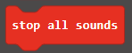 |  | Immediately stops all audio and melodies currently played by the buzzer, turning off sound output. |
|  |  | A for-loop with an index variable where the loop variable index sequentially takes values 0, 1, 2, 3, and 4, executing internal blocks once for each value. |
|  |  | Assigns a specified numeric value to a variable. |
|  |  | Increases or decreases a variable value by a set increment. |
|  |  | Reads and returns the numeric value stored in a variable. |
|  |  | Performs four arithmetic operations, including addition, subtraction, multiplication, and division, outputting the result. |
|  |  | Receives two numeric inputs and outputs the minimum or maximum value between them. |
|  |  | Rounds a decimal number, supporting rounding, ceiling, and floor modes. |
|  |  | Initializes the Nexbit expansion board hardware, starting ports and display drivers. |
|  |  | Sets RGB LED output brightness across a range of 0 to 255, adjusting overall illumination level. |
|  |  | Sets RGB color values for a designated LED, buffering the data without immediate lighting. |
|  |  | Refreshes and outputs configured LED colors, illuminating LEDs with corresponding hues. |
|  |  | Initializes the WonderLLM AI module upon power-up and establishes communication. |
|  |  | Configures MCP tool information, defining tool name, description, input parameter format, and execution blocking settings. |
|  |  | Sends configured MCP tool settings to the AI module to take effect. |
|  |  | Reads returned data after AI tool execution completes. |
|  |  | Returns a specified numeric result upon function completion. |
|  |  | Calls a custom function named doSomething to execute internal code. |
|  |  | Defines a custom function named doSomething, packaging reusable program logic. |
|  |  | Reads a specified array and retrieves data at the specified index position. |
|  |  | Retrieves the total count of elements stored in a specified array and returns the number. |
|  |  | Checks whether target text contains a specified character, returning a boolean result. |
|  |  | Converts a text-formatted numeric string into a numeric data type for computation. |
|  |  | Concatenates multiple text segments and outputs a new merged string. |
|  |  | Finds the index position of a specified character within text. |
|  |  | Extracts a substring of specified length starting from a given index in text. |
|  |  | Splits text from the first input into an array using characters in the second input as delimiters. |
|  |  | Reads the character count of a string and returns total length. |
|  |  | Retrieves a single character at a designated index position from a specified string. |

- **MCP Configuration Analysis**

**Tool 1:**

1. Tool name: `self.control.rgb_color`

2. Tool description: When you want to control the color of the RGB colored lights, please use this tool. 0 indicates off, 1 red, 2 orange, 3 yellow, 4 green, 5 blue, 8 purple, and 9 white.

3. Return parameters: `[["rgb_color", "int", "0", "9"]]`

4. Block until tool execution completes: `false`

5. Data returned to AI module: `false`

6. Function: Receives the `rgb_color` parameter passed from the AI to switch vehicle RGB LED colors. In non-blocking mode, the program does not pause after updating colors, continuing to listen for new voice commands.

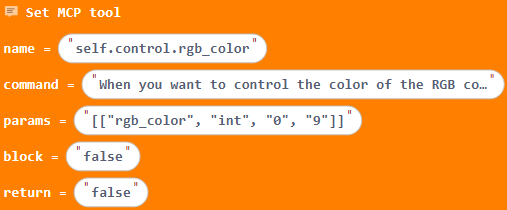

**Tool 2:**

1. Tool name: `self.control.microbit_music`

2. Tool description: Call this tool when you want the microbit to play or stop music. `music_mode` must be `once`, `loop`, or `stop`. `melody` must contain 1 to 128 MakeCode notes in a compact string, separated by one space with no leading or trailing spaces. Use `NOTE[octave]:beats`, such as `C4:1`, `C#4:2`, `Eb4:4`, or `R:1` for a rest. Use notes `A` to `G` and octaves `3` to `5`. When the user requests an existing song, reproduce its main melody accurately: preserve note order, octave, relative note lengths, rests, and original tempo. Do not improvise, simplify the rhythm, or make every note the same length. Use `:1` for short notes, `:2` for medium notes, and `:4` for long notes according to the song. Change the speed only when the user asks. Keep the complete tool call within 912 bytes. `tempo` ranges from 40 to 240 BPM. For `stop`, use an empty `melody` and `tempo=60`.

3. Return parameters: `[["music_mode", "string"], ["melody", "string"], ["tempo", "int", "40", "240"]]`

4. Block until tool execution completes: `false`

5. Data returned to AI module: `false`

6. Function: Receives playback mode, note sequence, and tempo parameters from the AI, driving the buzzer to play melodies. Single playback, loop playback, and stopping playback are supported. Under non-blocking mode, the robot car can still receive voice commands while music plays, enabling simultaneous sound and light switching.

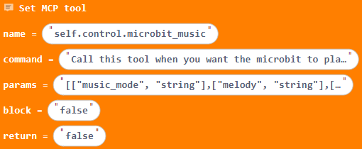

#### (4) Program Description and Upload

- Program Schematic

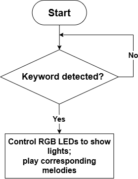

- Complete Program and Analysis

1. Upon startup, initialize the Nexbit hardware library and WonderLLM module, loading MCP configurations for both `rgb_color` and `microbit_music`.

2. The program continuously listens for voice input. Upon recognizing voice commands, the AI invokes the corresponding MCP tool to set LED colors or play and stop music.


Program Link: [Click to view](https://makecode.microbit.org/_9TTFgRYcJUii)

The program can also be downloaded directly from the following webpage:

<FeishuForm url="https://makecode.microbit.org/_9TTFgRYcJUii"/>

- Program Upload


#### (5) Feature Demonstration

Power on the robot car and wait for AI module initialization to complete. Upon hearing the prompt tone, speak voice commands toward the microphone and observe the RGB LEDs and buzzer. Saying "Set RGB light to red" illuminates the RGB LEDs in red. Saying "Play music" prompts the buzzer to play a melody. Saying "Stop music" silences the buzzer. Saying "Turn off lights" extinguishes the LEDs, as demonstrated below:

<VideoPlayer src="https://hiwonder.oss-cn-shenzhen.aliyuncs.com/videos/K12/Nexbit%20AI/02%E8%B1%AA%E5%8D%8E%E7%89%88/5.%E5%A4%A7%E6%A8%A1%E5%9E%8B%E8%AF%BE%E7%A8%8B/02%E5%A3%B0%E5%85%89%E4%BA%A4%E4%BA%92%E6%8E%A7%E5%88%B6.mp4" type="video/mp4" title="Sound and Light Interactive Control Demonstration" />

### 5.3.5 Expansion and Challenge

**Project 1: Sound and Light Alternating Automatic Demonstration**

Issuing the voice command "Sound and light demo" causes the LEDs to cycle through red, green, and blue, playing a short melody with each color transition. Speaking "End demo" stops the sequence. This project practices calling multiple tools cyclically and handling voice interrupt control to master timing coordination between light and sound.

**Project 2: Integrated Interaction with the Dot Matrix Screen**

Import the dot matrix display MCP tool into this project to enable voice control across the dot matrix screen, RGB LEDs, and buzzer simultaneously, such as "Display happy face, turn lights yellow, and play music". This project develops methods for configuring three or more MCP tools, deepening understanding of multi-peripheral coordination.

### 5.3.6 Q&A

**Question 1: With two sets of MCP tools configured in this project, can the AI invoke both tools simultaneously?**

Answer: Yes. MCP supports invoking multiple tools concurrently following a single semantic interpretation. Based on voice semantics, the AI populates parameters for both the `microbit_music` and `rgb_color` tools. The controller executes lighting changes and music playback in parallel, achieving synchronized sound and light interaction.

**Question 2: What does setting an MCP tool to non-blocking (false) signify?**

Answer: Non-blocking signifies that after a tool is called, the program does not wait for hardware actions to finish before continuing execution. It immediately returns to the main loop to continue listening for voice commands. Even during long musical playback, new voice commands can be received and processed.

### 5.3.7 Technical Support and Product Discussion

Creative project ideas can be shared within the [Hiwonder Forum](https://forum.hiwonder.com/):

<a href="https://forum.hiwonder.com/" target="_blank" rel="noopener noreferrer">

</a>

## 5.4 Ultrasonic RGB Light Control

### 5.4.1 Lesson Introduction

This lesson introduces ultrasonic RGB light control with the Nexbit AI robot car, focusing on ultrasonic RGB LED command blocks. Issuing voice commands prompts the AI to call MCP tools, configuring static light colors and breathing light effects. Mastering both ultrasonic lighting modes builds the programming foundation for subsequent sensor-linked lighting projects.

### 5.4.2 Learning Objectives

1. **Knowledge Objectives**: Understand the glowy ultrasonic sensor hardware. Distinguish between static color and breathing light modes, and master RGB three-channel parameter definitions.

2. **Skill Objectives**: Master adding the **nexbit** and **wonderllm s3** extension packages. Configure two sets of MCP tools, and complete program upload and debugging.

3. **Thinking Objectives**: Understand the logic through which AI parses voice commands and maps lighting actions. Develop engineering thinking in parameter calibration and troubleshooting.

4. **Application Objectives**: Master AI voice control methods for ultrasonic lighting. Understand the operational principles of breathing light visual effects.

### 5.4.3 Preparation

#### (1) Hardware Preparation

- Nexbit AI robot car

- micro:bit board

- Micro USB cable

- Battery

- Computer

> [!NOTE]
>
> **Pay close attention to battery polarity during installation. Reverse connection is strictly prohibited.**

#### (2) Software Preparation

- Access the MakeCode for micro:bit online programming platform:

  - [MakeCode for micro:bit](https://makecode.microbit.org/)

  - Copy the following link and open it in a web browser:

```py
https://makecode.microbit.org/
```

- Create a new project


### 5.4.4 Hands-On Project

#### (1) Project Analysis

The core project of this lesson is controlling the glowy ultrasonic sensor lights on the Nexbit AI robot car. The vehicle is equipped with a WonderLLM AI module to receive voice commands. Upon recognition, the AI calls the appropriate MCP tool. The `ultrasonic_light_color` tool sets static RGB lighting, while `ultrasonic_light_breathing` activates breathing light effects and configures transition duration between colors.

#### (2) Adding Extensions

1. Click **Extensions**.


2. Copy the link below, paste it into the search box in **Extensions**, and add **nexbit**:

```py
https://github.com/Hiwonder/Nexbit
```


3. Copy the link below, paste it into the search box in **Extensions**, and add **wonderllm s3**:

```py
https://github.com/hiwonderk12/WonderLLM_S3
```


> [!NOTE]
>
> **Alternative Program Import Method: Drag and drop the sample program file of this lesson directly into the MakeCode webpage without manually adding the nexbit and wonderllm s3 extensions.**

#### (3) Core Blocks

- **Core Block Analysis**

| Block | Category | Function description |
| :---: | :---: | :--- |
|  |  | Assigns a specified numeric value to a variable. |
|  |  | Increases or decreases a variable value by a set increment. |
|  |  | Reads and returns the numeric value stored in a variable. |
|  |  | Performs four arithmetic operations, including addition, subtraction, multiplication, and division, outputting the result. |
|  |  | Receives two numeric inputs and outputs the minimum or maximum value between them. |
|  |  | Rounds a decimal number, supporting rounding, ceiling, and floor modes. |
|  |  | Initializes the Nexbit expansion board hardware, starting ports and display drivers. |
|  |  | Selects the lighting mode and LED position, setting colors via red, green, and blue values. LEDs update to the corresponding color immediately upon execution. |
|  |  | Initializes the WonderLLM AI module upon power-up and establishes communication. |
|  |  | Configures MCP tool information, defining tool name, description, input parameter format, and execution blocking settings. |
|  |  | Sends configured MCP tool settings to the AI module to take effect. |
|  |  | Reads returned data after AI tool execution completes. |
|  |  | Returns a specified numeric result upon function completion. |
|  |  | Calls a custom function named doSomething to execute internal code. |
|  |  | Defines a custom function named doSomething, packaging reusable program logic. |
|  |  | Reads a specified array and retrieves data at the specified index position. |
|  |  | Retrieves the total count of elements stored in a specified array and returns the number. |
|  |  | Checks whether target text contains a specified character, returning a boolean result. |
|  |  | Converts a text-formatted numeric string into a numeric data type for computation. |
|  |  | Concatenates multiple text segments and outputs a new merged string. |
|  |  | Finds the index position of a specified character within text. |
|  |  | Extracts a substring of specified length starting from a given index in text. |
|  |  | Splits text from the first input into an array using characters in the second input as delimiters. |

- **MCP Configuration Analysis**

**Tool 1:**

1. Tool name: `self.control.ultrasonic_light_color`

2. Tool description: Call this tool when you want to control ultrasonic light color. When `red`, `green`, and `blue` are all 0, it means off.

3. Return parameters: `[["red", "int", "0", "255"], ["green", "int", "0", "255"], ["blue", "int", "0", "255"]]`

4. Block until tool execution completes: `false`

5. Data returned to AI module: `false`

6. Function: Receives RGB values from the AI to set static ultrasonic LED colors. When `red`, `green`, and `blue` are all 0, lights turn off.


**Tool 2:**

1. Tool name: `self.control.ultrasonic_light_breathing`

2. Tool description: Call this tool when you want to set ultrasonic lights to breathing mode. `light_mode` must be `breathing`. In this mode, `red`, `green`, and `blue` mean transition time in seconds, not brightness, and each value ranges from 0 to 10. `red=1,green=1,blue=1` means all three color components transition in 1 second. `red=1,green=0,blue=0` means only the red component fades on and off.

3. Return parameters: `[["light_mode", "string"], ["red", "int", "0", "10"], ["green", "int", "0", "10"], ["blue", "int", "0", "10"]]`

4. Block until tool execution completes: `false`

5. Data returned to AI module: `false`

6. Function: Activates breathing mode for ultrasonic lights and sets fading transition durations for each color channel, producing dynamic breathing effects.


#### (4) Program Description and Upload

- Program Schematic


- Complete Program and Analysis

1. Upon startup, initialize the Nexbit hardware library and WonderLLM module, loading MCP configurations for both ultrasonic lighting tools.

2. The program continuously listens for voice commands. Upon recognition, the AI calls the corresponding MCP tool to set static lighting or activate breathing light effects.


Program Link: [Click to view](https://makecode.microbit.org/_gAD04A5s2Ms1)

The program can also be downloaded directly from the following webpage:

<FeishuForm url="https://makecode.microbit.org/_gAD04A5s2Ms1"/>

- Program Upload


#### (5) Feature Demonstration

Power on the robot car and wait for AI module initialization to complete. Upon hearing the prompt tone, speak voice commands toward the microphone and observe the glowy ultrasonic sensor lights. Saying "Set ultrasonic lights to blue" turns the lights static blue. Saying "Activate red breathing light" causes the red light to fade in and out gradually. Saying "Turn off ultrasonic lights" extinguishes the lights, as demonstrated below:

<VideoPlayer src="https://hiwonder.oss-cn-shenzhen.aliyuncs.com/videos/K12/Nexbit%20AI/02%E8%B1%AA%E5%8D%8E%E7%89%88/5.%E5%A4%A7%E6%A8%A1%E5%9E%8B%E8%AF%BE%E7%A8%8B/03%E8%B6%85%E5%A3%B0%E6%B3%A2%E5%BD%A9%E7%81%AF%E6%8E%A7%E5%88%B6.mp4" type="video/mp4" title="Ultrasonic RGB Light Control Demonstration" />

### 5.4.5 Expansion and Challenge

**Project 1: Multi-Mode Lighting Transition Interaction**

Issuing the voice command "Auto light show" causes the ultrasonic LEDs to cycle through static red, green breathing light, and static blue in sequence. Speaking "Stop light show" interrupts the sequence at any time. This project practices alternating between two sets of MCP tools, understanding transition logic between static and breathing lighting modes.

**Project 2: Multi-Peripheral Linkage Expansion**

Import the dot matrix display MCP tool into this project to achieve concurrent voice control over both the dot matrix screen and ultrasonic LEDs. For example, speak "Display happy icon and activate blue breathing light". This project develops methods for combined configuration across multiple MCP tools, deepening understanding of AI-driven multi-hardware control.

### 5.4.6 Q&A

**Question 1: In the ultrasonic lighting MCP tools, how does the definition of RGB parameters differ between static color mode and breathing mode?**

Answer: In static color mode, `red`, `green`, and `blue` represent brightness values ranging from 0 to 255, determining fixed illumination colors. In breathing light mode, `red`, `green`, and `blue` no longer indicate brightness. Instead, they define the fading transition duration in seconds for each color channel across a range of 0 to 10. Larger values produce slower color transitions.

**Question 2: What lighting effect is produced when breathing light parameters are set to `red=2`, `green=0`, and `blue=0`?**

Answer: Only the `red` channel executes fading transitions, while the `green` and `blue` channels remain inactive. The resulting visual effect is a red light slowly breathing on and off, with `green` and `blue` LEDs remaining extinguished.

### 5.4.7 Technical Support and Product Discussion

Creative project ideas can be shared within the [Hiwonder Forum](https://forum.hiwonder.com/):

<a href="https://forum.hiwonder.com/" target="_blank" rel="noopener noreferrer">

</a>

## 5.5 Smart Data Collection

### 5.5.1 Lesson Introduction

This lesson focuses on the smart sensor data collection project for the Nexbit AI robot car, covering the use of command blocks for the ultrasonic sensor, 4-channel line follower sensor, and onboard temperature sensor. Through voice commands, the AI invokes MCP tools to read sensor data and transmit obstacle distance, ambient temperature, and line-following states back to the AI model. Mastering the logic of AI sensor data retrieval via MCP tools deepens understanding of data interaction between perception hardware and multimodal AI models, establishing a programming foundation for subsequent autonomous decision-making robotics projects.

### 5.5.2 Learning Objectives

1. **Knowledge Objectives**: Understand three types of sensors, including the ultrasonic sensor, line follower sensor, and onboard temperature sensor. Master the principles of reading sensor data via MCP tools, and comprehend the complete workflow from sensor acquisition to AI data feedback.

2. **Skill Objectives**: Master methods for adding the nexbit and wonderllm s3 extension packages. Configure MCP sensor tools, upload and debug programs, and achieve voice-controlled sensor data acquisition.

3. **Thinking Objectives**: Understand the interaction logic through which the AI acquires physical perception data. Develop engineering thinking in data interpretation, parameter tuning, and fault analysis.

4. **Application Objectives**: Master implementation methods for AI sensor data retrieval. Understand fundamental applications of robotic perception and AI decision-making.

### 5.5.3 Preparation

#### (1) Hardware Preparation

- Nexbit AI robot car

- micro:bit board

- Micro USB cable

- Battery

- Computer

> [!NOTE]
>
> **Pay close attention to battery polarity during installation. Reverse connection is strictly prohibited.**

#### (2) Software Preparation

- Access the MakeCode for micro:bit online programming platform:

  - [MakeCode for micro:bit](https://makecode.microbit.org/)

  - Copy the following link and open it in a web browser:

```py
https://makecode.microbit.org/
```

- Create a new project


### 5.5.4 Hands-On Project

#### (1) Project Analysis

The core project of this lesson is controlling the Nexbit AI robot car to achieve voice-activated sensor data collection. The robot car is equipped with the WonderLLM AI module to receive voice commands. The AI calls the `self.sensor.get_status` MCP tool, passing sensor type parameters. The controller collects the corresponding sensor data and transmits it back to the AI module. The system supports reading ultrasonic distance, controller temperature, and line follower sensor states.

#### (2) Adding Extensions

1. Click **Extensions**.


2. Copy the link below, paste it into the search box in **Extensions**, and add **nexbit**:

```py
https://github.com/Hiwonder/Nexbit
```


3. Copy the link below, paste it into the search box in **Extensions**, and add **wonderllm s3**:

```py
https://github.com/hiwonderk12/WonderLLM_S3
```


> [!NOTE]
>
> **Alternative Program Import Method: Drag and drop the sample program file of this lesson directly into the MakeCode webpage without manually adding the nexbit and wonderllm s3 extensions.**

#### (3) Core Blocks

- **Core Block Analysis**

|                            Block                             |                           Category                           | Function description                                         |
| :----------------------------------------------------------: | :----------------------------------------------------------: | :----------------------------------------------------------- |
|  |  | Reads ambient temperature data collected by the temperature sensor on the micro:bit board, returning the value in degrees Celsius. |
|  |  | Executes enclosed program code periodically at set millisecond intervals to achieve recurring execution. |
|  |  | Assigns a specified numeric value to a variable.             |
|  |  | Increases or decreases a variable value by a set increment.  |
|  |  | Reads and returns the numeric value stored in a variable.    |
|  |  | Initializes the Nexbit expansion board hardware, starting ports and display drivers. |
|  |  | Checks whether the corresponding line follower sensor detects a black line. Returns true when satisfied. Otherwise, returns false. |
|  |  | Reads the distance to obstacles detected by the ultrasonic sensor in millimeters. |
|  |  | Initializes the WonderLLM AI module upon power-up and establishes communication. |
|  |  | Configures MCP tool information, defining tool name, description, input parameter format, and execution blocking settings. |
|  |  | Sends configured MCP tool settings to the AI module to take effect. |
|  |  | Reads returned data after AI tool execution completes.       |
|  |  | Returns data to the AI module from within custom functions, passing the parameter as the result for AI parsing and subsequent actions. |
|  |  | Returns a specified numeric result upon function completion. |
|  |  | Calls a custom function named doSomething to execute internal code. |
|  |  | Defines a custom function named doSomething, packaging reusable program logic. |
|  |  | Checks whether target text contains a specified character, returning a boolean result. |
|  |  | Concatenates multiple text segments and outputs a new merged string. |

- **MCP Configuration Analysis**

1. Tool name: `self.sensor.get_status`

2. Tool description: Call this tool to get one sensor status at a time. The parameter `get_status` can only be `distance`, `temperature`, or `line_status`. Distance is returned in millimeters. The value `line_status` is a bit mask from 0 to 15: `S1=1`, `S2=2`, `S3=4`, `S4=8`. A set bit means that sensor detects a black line.

3. Return parameters: `[["get_status", "string"]]`

4. Block until tool execution completes: `true`

5. Data returned to AI module: `true`

6. Function: Receives sensor type parameters passed by the AI, collects raw data from corresponding sensors, and transmits the data back to the AI module for model analysis and voice responses.

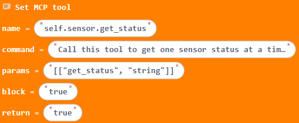

#### (4) Program Description and Upload

- Program Schematic

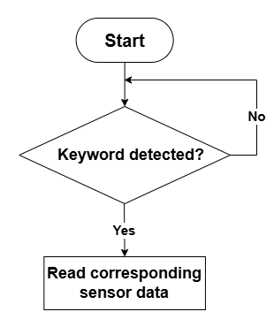

- Complete Program and Analysis

1. Upon startup, the Nexbit hardware library and WonderLLM module initialize in sequence, loading the sensor reading MCP tool configuration.

2. The program continuously listens for voice input. Upon recognizing a voice command, the AI invokes the sensor MCP tool to acquire ultrasonic distance, temperature, or line-follower states. The results are sent back to the AI module, and the AI generates corresponding voice responses based on the data.

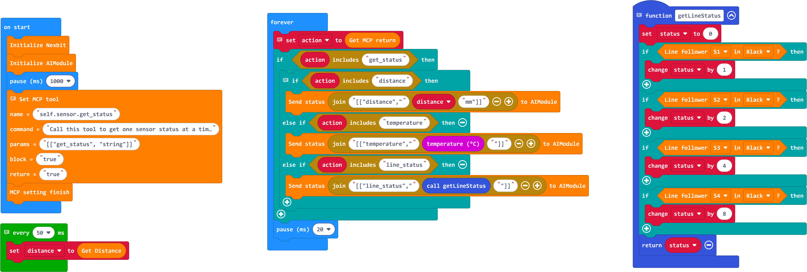

Program Link: [Click to view](https://makecode.microbit.org/_643AVpLCYTLM)

The program can also be downloaded directly from the following webpage:

<FeishuForm url="https://makecode.microbit.org/_643AVpLCYTLM"/>

- Program Upload


#### (5) Feature Demonstration

Power on the robot car and wait for the WonderLLM AI module to complete initialization. Upon hearing the prompt tone, speak voice commands into the microphone. Saying "Detect front distance" prompts the AI to read obstacle distance and announce the value. Saying "Read ambient temperature" causes the AI to collect the controller temperature and broadcast it. Saying "Read line following status" prompts the AI to retrieve the 4-channel line follower sensor bitmask and analyze current black line detection states. The demonstration is shown below:

<VideoPlayer src="https://hiwonder.oss-cn-shenzhen.aliyuncs.com/videos/K12/Nexbit%20AI/02%E8%B1%AA%E5%8D%8E%E7%89%88/5.%E5%A4%A7%E6%A8%A1%E5%9E%8B%E8%AF%BE%E7%A8%8B/04%E6%99%BA%E8%83%BD%E9%87%87%E9%9B%86%E6%95%B0%E6%8D%AE.mp4" type="video/mp4" title="Smart Data Collection Demonstration" />

### 5.5.5 Expansion and Challenge

**Project 1: Continuous Multi-Sensor Data Collection**

Issuing the voice command "Read all sensor information" causes the AI to call MCP tools in sequence to retrieve distance, temperature, and line-following states, summarizing all perception data in a voice broadcast. Speaking "Stop collection" interrupts the process. This project develops skills in sequential MCP tool execution and data aggregation.

**Project 2: Sensor-Triggered Sound and Light Feedback**

Building on this project, import the RGB light MCP tool. After reading sensor data, the AI automatically controls the lighting according to data thresholds. For instance, when the obstacle distance is under 100 mm, the red LEDs illuminate. When the temperature exceeds 30 °C, a blue breathing light activates, creating an integrated AI perception and hardware interaction project.

### 5.5.6 Q&A

**Question 1: What does setting `blocking` to `true` mean for this MCP tool?**

Answer: A blocking setting of `true` means that after the AI calls the sensor tool, the program pauses and waits for the sensor to complete data collection. Only after receiving the return result does it continue executing subsequent code and return the data to the AI. This ensures that the AI reliably acquires sensor readings, which is suitable for query tools that require returned data.

**Question 2: Why must the sensor MCP have "data returned to AI module" enabled, whereas the previous sound, light, and dot matrix MCP tools did not require it?**

Answer: Dot matrix and sound-and-light MCP tools are execution tools where the AI sends commands to trigger hardware actions without needing return data. In contrast, sensor data collection is a query tool where the AI reads physical world measurements. Enabling data feedback is therefore essential for delivering sensor readings to the AI model for evaluation and voice responses.

### 5.5.7 Technical Support and Product Discussion

Creative project ideas can be shared within the [Hiwonder Forum](https://forum.hiwonder.com/):

<a href="https://forum.hiwonder.com/" target="_blank" rel="noopener noreferrer">

</a>

## 5.6 Robot Motion Control

### 5.6.1 Lesson Introduction

This lesson covers the voice-activated motion control project for the Nexbit AI robot car, using the WonderLLM module and MCP tools to control chassis motors through AI voice commands. Three sets of motor control MCP tools are explored to achieve unified dual-motor speed control, independent single-motor control, and timed directional movement. Understanding the execution pipeline where the AI delivers motion instructions and motors execute physical actions enables mastering fundamental movements like forward, backward, turning, and stopping, preparing for subsequent autonomous navigation and obstacle avoidance projects.

### 5.6.2 Learning Objectives

1. **Knowledge Objectives**: Understand DC motor driving principles and differential drive steering logic. Master parameter definitions for three motor MCP tools, distinguishing between blocking and non-blocking MCP execution modes.

2. **Skill Objectives**: Add **nexbit** and **wonderllm s3** extension packages. Configure MCP motion tools, debug voice-controlled movement programs, and troubleshoot common issues such as motor stalling or inverted directions.

3. **Thinking Objectives**: Understand the interaction architecture where the AI model issues commands and robot hardware acts as the execution layer, developing engineering thinking in command-parameter-action workflows.

4. **Application Objectives**: Control the robot car to execute basic movements via voice commands, and select suitable motion MCP tools for different application scenarios.

### 5.6.3 Preparation

#### (1) Hardware Preparation

- Nexbit AI robot car

- micro:bit board

- Micro USB cable

- Battery

- Computer

> [!NOTE]
>
> **Pay close attention to battery polarity during installation. Reverse connection is strictly prohibited.**

#### (2) Software Preparation

- Access the MakeCode for micro:bit online programming platform:

  - [MakeCode for micro:bit](https://makecode.microbit.org/)

  - Copy the following link and open it in a web browser:

```py
https://makecode.microbit.org/
```

- Create a new project


### 5.6.4 Hands-On Project

#### (1) Project Analysis

This project implements voice-controlled movement for the Nexbit AI robot car. After power-on, the hardware and AI module initialize, loading three sets of motor MCP tools. When voice motion commands are issued, the AI selects the matching MCP tool, populates parameters, and transmits instructions to the micro:bit to drive the motors.

#### (2) Adding Extensions

1. Click **Extensions**.


2. Copy the link below, paste it into the search box in **Extensions**, and add **nexbit**:

```py
https://github.com/Hiwonder/Nexbit
```


3. Copy the link below, paste it into the search box in **Extensions**, and add **wonderllm s3**:

```py
https://github.com/hiwonderk12/WonderLLM_S3
```


> [!NOTE]
>
> **Alternative Program Import Method: Drag and drop the sample program file of this lesson directly into the MakeCode webpage without manually adding the nexbit and wonderllm s3 extensions.**

#### (3) Core Blocks

- **Core Block Analysis**

|                            Block                             |                           Category                           | Function description                                         |
| :----------------------------------------------------------: | :----------------------------------------------------------: | :----------------------------------------------------------- |
|  |  | Assigns a specified numeric value to a variable.             |
|  |  | Increases or decreases a variable value by a set increment.  |
|  |  | Reads and returns the numeric value stored in a variable.    |
|  |  | Performs four arithmetic operations, including addition, subtraction, multiplication, and division, outputting the result. |
|  |  | Receives two input values and outputs either the minimum or maximum value. |
|  |  | Rounds a decimal number, supporting rounding, ceiling, and floor modes. |
|  |  | Initializes the Nexbit expansion board hardware, starting ports and display drivers. |
|  |  | Sets operating speeds for both DC motors across a range from -100 to 100, where positive numbers drive forward, negative numbers drive backward, and 0 stops the motors. |
|  |  | Initializes the WonderLLM AI module upon power-up and establishes communication. |
|  |  | Configures MCP tool information, defining tool name, description, input parameter format, and execution blocking settings. |
|  |  | Sends configured MCP tool settings to the AI module to take effect. |
|  |  | Reads returned data after AI tool execution completes.       |
|  |  | Notifies the AI module that current MCP tool execution is complete, allowing the AI to generate subsequent responses and commands. |
|  |  | Returns a specified numeric result upon function completion. |
|  |  | Calls a custom function named doSomething to execute internal code. |
|  |  | Defines a custom function named doSomething, packaging reusable program logic. |
|  |  | Retrieves and returns data from a specified index position in an array. |
|  |  | Retrieves and returns the total element count stored in an array. |
|  |  | Checks whether target text contains a specified character, returning a boolean result. |
|  |  | Converts a text-formatted numeric string into a numeric data type for computation. |
|  |  | Concatenates multiple text segments and outputs a new merged string. |
|  |  | Finds the index position of a specified character within text. |
|  |  | Extracts a substring of specified length starting from a given index in text. |
|  |  | Splits text into an array using delimiter characters specified in the second input box. |

- **MCP Configuration Analysis**

**Tool 1:**

1. Tool name: `self.control.wheels_speed`

2. Tool description: When needing to control the speed of the wheels, use this tool. The parameter `wheels_speed` ranges from 0 to 100.

3. Return parameters: `[["wheels_speed", "int", "0", "100"]]`

4. Block until tool execution completes: `false`

5. Data returned to AI module: `false`

6. Function: Sets identical speeds for left and right wheels. The robot car maintains continuous movement without stopping automatically. In non-blocking mode, the AI can receive new voice commands while the car moves.

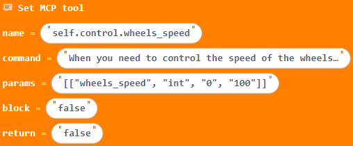

**Tool 2:**

1. Tool name: `self.control.single_motor`

2. Tool description: Call this tool to control one motor without changing the other motor. Parameter `motor_index` is 1 or 2. Parameter `motor_speed` ranges from -100 to 100.

3. Return parameters: `[["motor_index", "int", "1", "2"], ["motor_speed", "int", "-100", "100"]]`

4. Block until tool execution completes: `false`

5. Data returned to AI module: `false`

6. Function: Adjusts left or right motor speeds independently, utilizing speed differences to execute in-place pivots or curved paths for precise motion. As a non-blocking tool, execution returns immediately after sending commands.

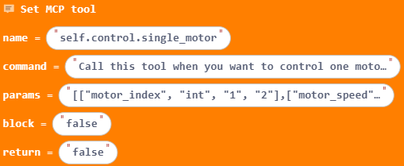

**Tool 3:**

1. Tool name: `self.control.wheels_movement`

2. Tool description: When it is necessary to control the movement of the wheels, use this tool. Parameter `direction`: 1 forward, 2 backward, 3 left, 4 right. Parameter `time`: 0 to 8,000 milliseconds, where 0 means stop.

3. Return parameters: `[["direction", "int", "1", "4"], ["time", "int", "0", "8000"]]`

4. Block until tool execution completes: `true`

5. Data returned to AI module: `false`

6. Function: Drives the robot car in a designated direction for a set duration, stopping automatically upon timer completion. In blocking mode, the AI pauses voice input during movement and resumes response once motion completes.

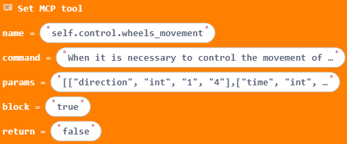

#### (4) Program Description and Upload

- Program Schematic

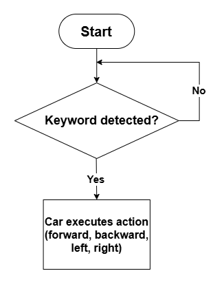

- Complete Program and Analysis

1. Upon startup, the Nexbit hardware library and WonderLLM module initialize, loading three sets of motor MCP tool configurations.

2. The program continuously listens for voice input. Upon recognizing commands, the AI matches the appropriate MCP tool, parses parameters, and sends them to the micro:bit.

3. The micro:bit drives the motors to execute motion. Blocking tools pause execution until movement finishes, while non-blocking tools return immediately to listen for voice input.


Program Link: [Click to view](https://makecode.microbit.org/_PjFR7U43U0ae)

The program can also be downloaded directly from the following webpage:

<FeishuForm url="https://makecode.microbit.org/_PjFR7U43U0ae"/>

- Program Upload


#### (5) Feature Demonstration

Install the battery and power on the robot car. Wait for the AI module to complete initialization until the prompt tone sounds. Speak commands into the microphone. Saying "Robot advance for 2 seconds" triggers `wheels_movement`, driving forward for 2 seconds before stopping automatically. Saying "Turn left in place" invokes `single_motor`, using differential wheel speeds to pivot left. Saying "Set speed 50 continuous forward" calls `wheels_speed` to maintain steady forward motion. Saying "Stop" halts motor rotation. The demonstration is shown below:

<VideoPlayer src="https://hiwonder.oss-cn-shenzhen.aliyuncs.com/videos/K12/Nexbit%20AI/02%E8%B1%AA%E5%8D%8E%E7%89%88/5.%E5%A4%A7%E6%A8%A1%E5%9E%8B%E8%AF%BE%E7%A8%8B/05%E6%9C%BA%E5%99%A8%E4%BA%BA%E7%A7%BB%E5%8A%A8%E6%8E%A7%E5%88%B6.mp4" type="video/mp4" title="Robot Motion Control Demonstration" />

### 5.6.5 Expansion

**Project 1: Voice Line-Following Motion**

Combine the sensor collection MCP tool from the previous lesson to start line-following mode via voice commands. The AI periodically reads the states of the 4-channel line follower sensor, and based on the black line position, calls the single-motor MCP tool to adjust left and right wheel speeds in real time, allowing the robot car to drive along the black line automatically.

**Project 2: Omnidirectional Obstacle Avoidance Task**

Add ultrasonic ranging. After reading the distance, the AI automatically selects whether to shift left or right to avoid obstacles, practicing the coordination between multi-sensor data and omnidirectional movement tools.

### 5.6.6 Q&A

**Question 1: What does setting `wheels_movement` to blocking `true` mean?**

Answer: When blocking mode is enabled, the AI pauses and waits after sending a motion command until the movement duration ends and the action completes before continuing to receive new voice commands. This is suitable for complete, one-time motion actions.

**Question 2: `wheels_speed` is a non-blocking tool. If a continuous forward command is issued without a subsequent stop command, what will happen to the robot car?**

Answer: The robot car will keep moving forward at the set speed and will not stop automatically. It requires issuing another voice command to change the speed or issue the stop command. This is suitable for continuous motion scenarios that need to be interrupted at any time.

### 5.6.7 Technical Support and Product Discussion

Creative project ideas can be shared within the [Hiwonder Forum](https://forum.hiwonder.com/):

<a href="https://forum.hiwonder.com/" target="_blank" rel="noopener noreferrer">

</a>

## 5.7 Preset Action Execution

### 5.7.1 Lesson Introduction

This lesson focuses on invoking preset action groups for the Nexbit AI robot car via voice commands. Using the WonderLLM module and MCP tools, the AI receives voice commands and directly triggers packaged action sequences stored on the robot, eliminating the need to control motors individually step by step. Configuring the preset action MCP tool illustrates action group encapsulation principles, triggers choreographed robotics routines, and reinforces understanding of blocking MCP execution, establishing a basis for interactive robotic performance projects.

### 5.7.2 Learning Objectives

1. **Knowledge Objectives**: Understand the concept of action groups, also known as preset actions. Master the parameter definitions of the `preset_action` MCP tool, consolidating understanding of blocking MCP execution workflows.

2. **Skill Objectives**: Add **nexbit** and **wonderllm s3** extension packages and configure preset action MCP tools. Debug action group execution programs, troubleshooting issues such as non-triggering or interrupted actions.

3. **Thinking Objectives**: Appreciate program encapsulation by packaging continuous motor and servo routines into modular action functions, simplifying AI interactions and improving program readability.

4. **Application Objectives**: Trigger choreographed robotic routines with single voice commands to achieve interactive robotics demonstrations.

### 5.7.3 Preparation

#### (1) Hardware Preparation

- Nexbit AI robot car

- micro:bit board

- Micro USB cable

- Battery

- Computer

> [!NOTE]
>
> **Pay close attention to battery polarity during installation. Reverse connection is strictly prohibited.**

#### (2) Software Preparation

- Access the MakeCode for micro:bit online programming platform:

  - [MakeCode for micro:bit](https://makecode.microbit.org/)

  - Copy the following link and open it in a web browser:

```py
https://makecode.microbit.org/
```

- Create a new project


### 5.7.4 Hands-On Project

#### (1) Project Analysis

This project enables one-touch voice triggering of preset action groups on the robot car. Multiple motor and servo routines are packaged into assigned action numbers in advance. Upon startup, the hardware and AI module initialize, loading the `self.control.preset_action` MCP tool. When voice commands are received, the AI extracts the `action_number` and invokes the MCP tool, allowing the robot car to execute complete action sequences autonomously.

#### (2) Adding Extensions

1. Click **Extensions**.


2. Copy the link below, paste it into the search box in **Extensions**, and add **nexbit**:

```py
https://github.com/Hiwonder/Nexbit
```


3. Copy the link below, paste it into the search box in **Extensions**, and add **wonderllm s3**:

```py
https://github.com/hiwonderk12/WonderLLM_S3
```


> [!NOTE]
>
> **Alternative Program Import Method: Drag and drop the sample program file of this lesson directly into the MakeCode webpage without manually adding the nexbit and wonderllm s3 extensions.**

#### (3) Core Blocks

- **Core Block Analysis**

|                            Block                             |                           Category                           | Function description                                         |
| :----------------------------------------------------------: | :----------------------------------------------------------: | :----------------------------------------------------------- |
|  |  | Executes enclosed code when the logo touch button on the controller is pressed. The dropdown menu toggles trigger conditions between pressed and released. |
|  |  | Plays built-in sound effects. In modes such as until done, program execution pauses until the sound finishes before continuing. |
|  |  | Repeats enclosed code for a designated number of times, exiting the loop upon counter completion to continue subsequent code. |
|  |  | Assigns a specified numeric value to a variable.             |
|  |  | Increases or decreases a variable value by a set increment.  |
|  |  | Reads and returns the numeric value stored in a variable.    |
|  |  | Performs four arithmetic operations, including addition, subtraction, multiplication, and division, outputting the result. |
|  |  | Receives two input values and outputs either the minimum or maximum value. |
|  |  | Initializes the Nexbit expansion board hardware, starting ports and display drivers. |
|  |  | Sets operating speeds for both DC motors across a range from -100 to 100, where positive numbers drive forward, negative numbers drive backward, and 0 stops the motors. |
|  |  | Initializes the WonderLLM AI module upon power-up and establishes communication. |
|  |  | Configures MCP tool information, defining tool name, description, input parameter format, and execution blocking settings. |
|  |  | Sends configured MCP tool settings to the AI module to take effect. |
|  |  | Reads returned data after AI tool execution completes.       |
|  |  | Notifies the AI module that current MCP tool execution is complete, allowing the AI to generate subsequent responses and commands. |
|  |  | Returns a specified numeric result upon function completion. |
|  |  | Calls a custom function named doSomething to execute internal code. |
|  |  | Defines a custom function named doSomething, packaging reusable program logic. |
|  |  | Retrieves and returns data from a specified index position in an array. |
|  |  | Retrieves and returns the total element count stored in an array. |
|  |  | Checks whether target text contains a specified character, returning a boolean result. |
|  |  | Converts a text-formatted numeric string into a numeric data type for computation. |
|  |  | Concatenates multiple text segments and outputs a new merged string. |
|  |  | Finds the index position of a specified character within text. |
|  |  | Extracts a substring of specified length starting from a given index in text. |
|  |  | Splits text into an array using delimiter characters specified in the second input box. |

- **MCP Configuration Analysis**

1. Tool name: `self.control.preset_action`

2. Tool description: Call this tool when the robot needs to perform a preset action group. Parameter `action_number` selects the action. Currently available: 1 means `twist`. Only use a listed action number.

3. Return parameters: `[["action_number", "int", "1", "20"]]`

4. Block until tool execution completes: `true`

5. Data returned to AI module: `false`

6. Function: Receives the action number passed by the AI and executes the complete preset motion sequence assigned to that number. In blocking mode, the robot does not respond to new voice commands during execution, releasing control only after the sequence finishes.

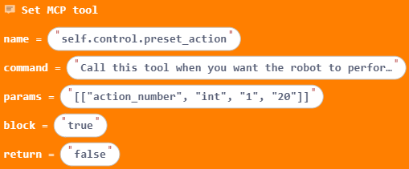

#### (4) Program Description and Upload

- Program Schematic

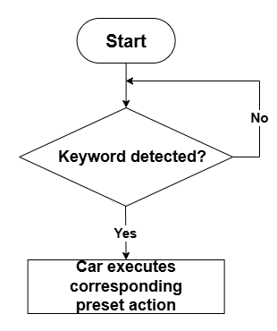

- Complete Program and Analysis

1. Upon startup, the program initializes the Nexbit hardware and WonderLLM AI module, configuring and deploying the preset action MCP tool.

2. The system continuously listens for voice input. Upon recognizing commands, the AI extracts the action number.

3. The micro:bit executes the corresponding choreographed action sequence, pausing in blocking mode until all motions conclude. Upon completion, it notifies the AI and awaits subsequent voice instructions.


Program Link: [Click to view](https://makecode.microbit.org/_fsy2tCd552Pa)

The program can also be downloaded directly from the following webpage:

<FeishuForm url="https://makecode.microbit.org/_fsy2tCd552Pa"/>

- Program Upload


#### (5) Feature Demonstration

Insert the battery and power on the robot car. Wait for the AI module to complete initialization. Speak commands into the microphone. Saying "Execute Action 1" causes the AI to call the preset action group, and the robot performs an in-place rotation routine. Before the action routine concludes, new voice commands will not be processed. After the routine finishes, new voice commands can be issued to trigger actions again. The demonstration is shown below:

<VideoPlayer src="https://hiwonder.oss-cn-shenzhen.aliyuncs.com/videos/K12/Nexbit%20AI/02%E8%B1%AA%E5%8D%8E%E7%89%88/5.%E5%A4%A7%E6%A8%A1%E5%9E%8B%E8%AF%BE%E7%A8%8B/06%E9%A2%84%E8%AE%BE%E5%8A%A8%E4%BD%9C%E6%89%A7%E8%A1%8C.mp4" type="video/mp4" title="Preset Action Execution Demonstration" />

### 5.7.5 Expansion

**Project 1: Adding Custom Action Groups**

Create a new action number 2 in the program, packaging a combined "forward, turn right, backward" routine, and update the MCP tool description to notify the AI of the new action. Speaking "Execute Action 2" commands the robot to follow the custom path.

**Project 2: Coordinated Action and Audiovisual Performance**

Expand the action group to illuminate RGB LEDs and play sound effects during rotation. Upon voice triggering, the robot spins while playing audio and shifting the lighting, creating a robotic stage performance effect.

### 5.7.6 Q&A

**Question 1: Why use preset action groups instead of having the AI issue individual motor commands step by step?**

Answer: Breaking complex routines into individual motor commands increases AI call frequency. In contrast, action groups encapsulated locally on the robot execute more reliably. The AI only needs to transmit a single action number to trigger the entire sequence, simplifying communication.

**Question 2: The parameter range for `action_number` is `1` to `20`, but currently only Action 1 is available. What happens if voice commands request Action 5?**

Answer: Because no logic is programmed for Action 5, the robot will not execute any action, and the AI will prompt that the requested action number is unavailable. Only predefined action numbers should be selected during operation.

### 5.7.7 Technical Support and Product Discussion

Creative project ideas can be shared within the [Hiwonder Forum](https://forum.hiwonder.com/):

<a href="https://forum.hiwonder.com/" target="_blank" rel="noopener noreferrer">

</a>

## 5.8 Multi-Mode Smart Driving

### 5.8.1 Lesson Introduction

This lesson focuses on the multi-mode autonomous driving project for the Nexbit AI robot car. Utilizing the ultrasonic sensor and 4-channel line follower sensor alongside WonderLLM voice interaction and MCP tools, the robot switches operating modes via voice commands. Three modes are supported, including following, obstacle avoidance, and line following, allowing the robot car to perceive its environment in real time and drive autonomously. Mastering sensor data acquisition and state transition logic provides insight into how the AI issues mode directives while the microcontroller maintains autonomous control, synthesizing motor, sensor, and MCP concepts from previous lessons.

### 5.8.2 Learning Objectives

1. **Knowledge Objectives**: Understand ultrasonic distance measurement and line follower detection principles. Master the operating logic of three autonomous driving modes, and understand non-blocking MCP mode switching mechanisms.

2. **Skill Objectives**: Add **nexbit** and **wonderllm s3** extension packages, configure `auto_drive_mode` MCP tools, debug multi-mode switching routines, and troubleshoot common issues such as sensor inaccuracy or failed transitions.

3. **Thinking Objectives**: Establish a hierarchical programming mindset where the AI oversees high-level command scheduling while the microcontroller handles real-time environmental perception and motion control, appreciating state machine applications in multi-mode systems.

4. **Application Objectives**: Switch autonomous driving modes via voice commands to achieve varied autonomous behaviors, including following, obstacle avoidance, and line following.

### 5.8.3 Preparation

#### (1) Hardware Preparation

- Nexbit AI robot car

- micro:bit board

- Micro USB cable

- Battery

- Computer

> [!NOTE]
>
> **Pay close attention to battery polarity during installation. Reverse connection is strictly prohibited.**

#### (2) Software Preparation

- Access the MakeCode for micro:bit online programming platform:

  - [MakeCode for micro:bit](https://makecode.microbit.org/)

  - Copy the following link and open it in a web browser:

```py
https://makecode.microbit.org/
```

- Create a new project


### 5.8.4 Hands-On Project

#### (1) Project Analysis

This project implements voice switching between autonomous driving modes for the robot car. Upon power-up, hardware, sensors, and the AI module initialize, loading the `self.control.auto_drive_mode` MCP tool. The AI receives voice commands, parses the `drive_mode` parameter, and toggles working states. The underlying loop continuously evaluates sensor readings, automatically driving motors based on the active mode.

#### (2) Adding Extensions

1. Click **Extensions**.


2. Copy the link below, paste it into the search box in **Extensions**, and add **nexbit**:

```py
https://github.com/Hiwonder/Nexbit
```


3. Copy the link below, paste it into the search box in **Extensions**, and add **wonderllm s3**:

```py
https://github.com/hiwonderk12/WonderLLM_S3
```


> [!NOTE]
>
> **Alternative Program Import Method: Drag and drop the sample program file of this lesson directly into the MakeCode webpage without manually adding the nexbit and wonderllm s3 extensions.**

#### (3) Core Blocks

- **Core Block Analysis**

|                            Block                             |                           Category                           | Function description                                         |
| :----------------------------------------------------------: | :----------------------------------------------------------: | :----------------------------------------------------------- |
| 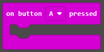 |  | Executes enclosed code when button A or B on the controller is pressed. |
|  |  | Plays background music melodies. The dropdown menu toggles built-in melodies. Selecting background mode prevents blocking during melody playback. |
|  |  | Executes enclosed code periodically at set millisecond intervals to achieve recurring execution. |
|  |  | Assigns a specified numeric value to a variable.             |
|  |  | Increases or decreases a variable value by a set increment.  |
|  |  | Reads and returns the numeric value stored in a variable.    |
|  |  | Performs four arithmetic operations, including addition, subtraction, multiplication, and division, outputting the result. |
|  |  | Receives two input values and outputs either the minimum or maximum value. |
|  |  | Initializes the Nexbit expansion board hardware, starting ports and display drivers. |
|  |  | Sets operating speeds for both DC motors across a range from -100 to 100, where positive numbers drive forward, negative numbers drive backward, and 0 stops the motors. |
|  |  | Checks whether the corresponding line follower sensor detects a black line. Returns true when satisfied. Otherwise, returns false. |
|  |  | Reads the distance to obstacles detected by the ultrasonic sensor in millimeters. |
|  |  | Selects lighting modes and LED positions for the ultrasonic sensor, configuring colors via red, green, and blue values. |
|  |  | Configures RGB values for specified LED indices into buffer memory without illuminating immediately. |
|  |  | Refreshes and outputs configured LED colors to illuminate the physical LEDs. |
|  |  | Initializes the WonderLLM AI module upon power-up and establishes communication. |
|  |  | Configures MCP tool information, defining tool name, description, input parameter format, and execution blocking settings. |
|  |  | Sends configured MCP tool settings to the AI module to take effect. |
|  |  | Reads returned data after AI tool execution completes.       |
|  |  | Returns a specified numeric result upon function completion. |
|  |  | Calls a custom function named doSomething to execute internal code. |
|  |  | Defines a custom function named doSomething, packaging reusable program logic. |
|  |  | Retrieves and returns data from a specified index position in an array. |
|  |  | Retrieves and returns the total element count stored in an array. |
|  |  | Checks whether target text contains a specified character, returning a boolean result. |
|  |  | Converts a text-formatted numeric string into a numeric data type for computation. |
|  |  | Concatenates multiple text segments and outputs a new merged string. |
|  |  | Finds the index position of a specified character within text. |
|  |  | Extracts a substring of specified length starting from a given index in text. |
|  |  | Splits text into an array using delimiter characters specified in the second input box. |

- **MCP Configuration Analysis**

1. Tool name: `self.control.auto_drive_mode`

2. Tool description: Call this tool to select the automatic driving mode. The parameter `drive_mode` must be 0 to turn automatic driving off, 1 to turn following mode on, 2 to turn obstacle avoidance mode on, or 3 to turn colorful line tracking mode on. Only one mode can run at a time.

3. Return parameters: `[["drive_mode", "int", "0", "3"]]`

4. Block until tool execution completes: `false`

5. Data returned to AI module: `false`

6. Function: Receives the mode index from the AI to modify the robot global operating state. A background loop reads sensors and continuously regulates motors according to the selected mode. As a non-blocking tool, the AI can receive new voice commands after updating the mode.

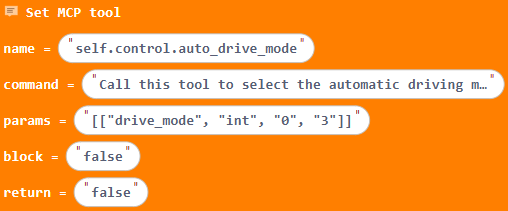

#### (4) Program Description and Upload

- Program Schematic

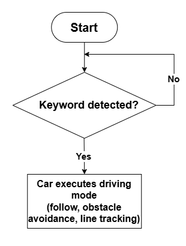

- Complete Program and Analysis

1. Upon startup, the program initializes the Nexbit hardware and WonderLLM module, configuring and deploying the autonomous driving MCP tool.

2. A background loop launches, continuously evaluating ultrasonic and line follower sensor readings to execute corresponding autonomous driving logic based on the active `drive_mode` state.

3. The system listens for voice input. When mode commands are recognized, the AI invokes `auto_drive_mode` to update the mode index, causing the loop to adjust control strategies immediately.

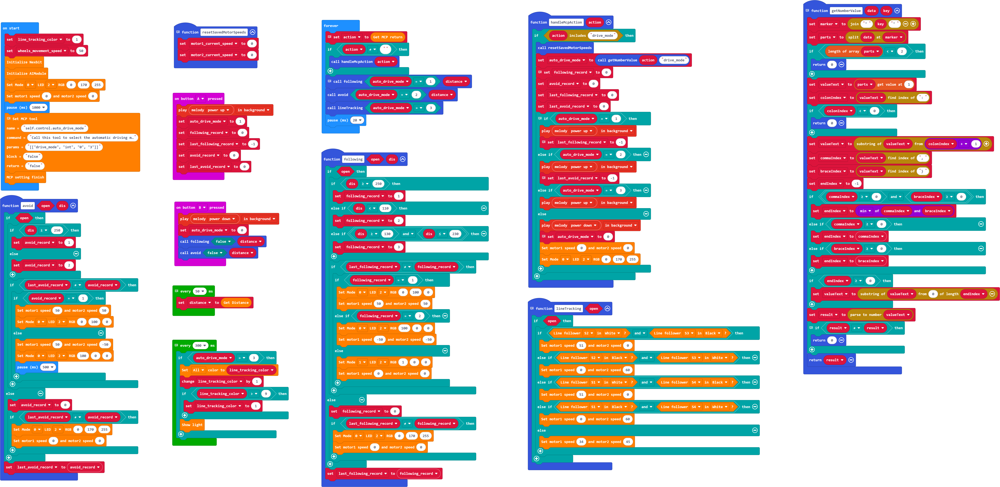

Program Link: [Click to view](https://makecode.microbit.org/_Xj4H0p9yU4wU)

The program can also be downloaded directly from the following webpage:

<FeishuForm url="https://makecode.microbit.org/_Xj4H0p9yU4wU"/>

- Program Upload


#### (5) Feature Demonstration

Insert the battery and power on the robot car. Wait for the AI module to complete initialization, then speak commands into the microphone. Saying "Enable following mode" causes the robot to follow moving targets in front. Saying "Enable obstacle avoidance mode" allows the robot to turn and steer clear of obstacles automatically. Saying "Enable colorful line following mode" guides the robot along black floor tracks. Saying "Disable automatic driving" halts autonomous movement. The demonstration is shown below:

<VideoPlayer src="https://hiwonder.oss-cn-shenzhen.aliyuncs.com/videos/K12/Nexbit%20AI/02%E8%B1%AA%E5%8D%8E%E7%89%88/5.%E5%A4%A7%E6%A8%A1%E5%9E%8B%E8%AF%BE%E7%A8%8B/07%E5%A4%9A%E6%A8%A1%E5%BC%8F%E6%99%BA%E8%83%BD%E8%A1%8C%E9%A9%B6.mp4" type="video/mp4" title="Multi-Mode Smart Driving Demonstration" />

### 5.8.5 Expansion

**Project 1: Audiovisual Cues for Mode Transitions**

Modify the program so that switching autonomous driving modes changes the ultrasonic LED colors and plays audio prompts. For example, illuminate blue for following mode, red for obstacle avoidance mode, and green for line-following mode, offering clear visual status distinction.

**Project 2: Hybrid Behavioral Logic Expansion**

Add boundary conditions to existing modes. While following tracks, enable ultrasonic detection concurrently. If obstacles are encountered, pause line following to execute avoidance maneuvers, resuming track navigation once obstacles clear.

### 5.8.6 Q&A

**Question 1: Can `drive_mode` be set to `1` and `2` simultaneously to enable following and obstacle avoidance at the same time?**

Answer: No. Only one autonomous driving mode can be enabled at a time. If two modes are enabled simultaneously, sensor control logic will conflict, causing abnormal movement of the robot car.

**Question 2: After obstacle avoidance mode is enabled, who controls the autonomous motion of the robot car, and does the AI still need to issue continuous motor commands?**

Answer: The autonomous motion of the robot car is controlled locally in real time by the micro:bit controller, which reads sensor data. The AI is only responsible for receiving voice commands and switching modes, without needing to continuously send motor motion commands.

### 5.8.7 Technical Support and Product Discussion

Creative project ideas can be shared within the [Hiwonder Forum](https://forum.hiwonder.com/):

<a href="https://forum.hiwonder.com/" target="_blank" rel="noopener noreferrer">

</a>

## 5.9 App Image Transmission

> [!NOTE]
>
> **This lesson introduces the image transmission feature. For app download instructions, overview details, and program analyses, refer to [4.15 App Control](./4.%20Nexbit%20AI%20Hands-on%20Projects.md#section-4-15).**

### 5.9.1 Image Transmission Overview

Image transmission is a feature that streams video in real time using the camera on the WonderLLM ESP32-S3 module. Upon power-up, the module creates a self-hosted Wi-Fi hotspot. Connecting a mobile phone to this hotspot enables the app to receive camera video feeds for remote viewing.

This feature serves robotic visual observation and scene monitoring, providing a foundation for AI vision projects such as visual recognition and object tracking. It allows direct observation of camera capture feeds to verify camera hardware wiring and image acquisition routines.

### 5.9.2 Firmware Flashing

> [!NOTE]
>
> **Flashing the image transmission firmware disables multimodal AI features. To resume multimodal AI coursework, refer to [7.6.10 (1) Multimodal AI Firmware Flashing](./7.%20Software%20and%20Hardware%20Guide.md#section-7-6-10-1) to restore the multimodal AI firmware.**

1. Connect the Type-C port on top of the WonderLLM module to the computer using a USB cable.


2. Open the **flash_download_tool_3.9.7.exe** file located in the folder [Appendix\WonderLLM Flashing Tool\ESP32-S3 Firmware Flashing Tool\flash_download_tool_3.9.7](https://drive.google.com/drive/folders/1hzuRXlqnWzxcf3HIhqwWyOVVGGoHmb6D?usp=sharing).

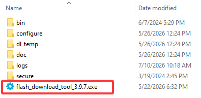

3. Select **ChipType** as **ESP32-S3**, retain default settings for remaining options, and click **OK**.

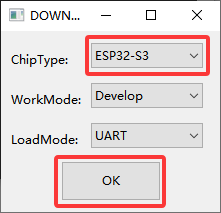

4. Once the tool opens, click **...** to select the firmware bin file. Navigate to the folder [Appendix\WonderLLM Firmware Files](https://drive.google.com/drive/folders/1T-IYEUdxbxuIeLbaYZeaS0nhT8nT6Mgi?usp=sharing) and select **Image_transmission.bin**.

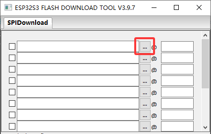


5. Check the checkbox on the left, configure remaining parameters as shown below, and select the COM port assigned to the module.

> [!NOTE]
>
> **If the module fails to operate normally after firmware flashing with SPI MODE set to DIO as shown below, change SPI MODE to DOUT and re-flash the firmware.**


6. Click **ERASE** to clear previously loaded firmware first. This step is essential. Wait until the status bar displays **FINISH**.

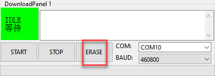


7. Click **START** to download the selected firmware. Wait until the progress bar completes, indicating successful firmware flashing.


### 5.9.3 Device Connection

Click the camera connection icon in the upper-right corner. In the popup dialog, click the **Connect Hotspot** button to establish the connection.

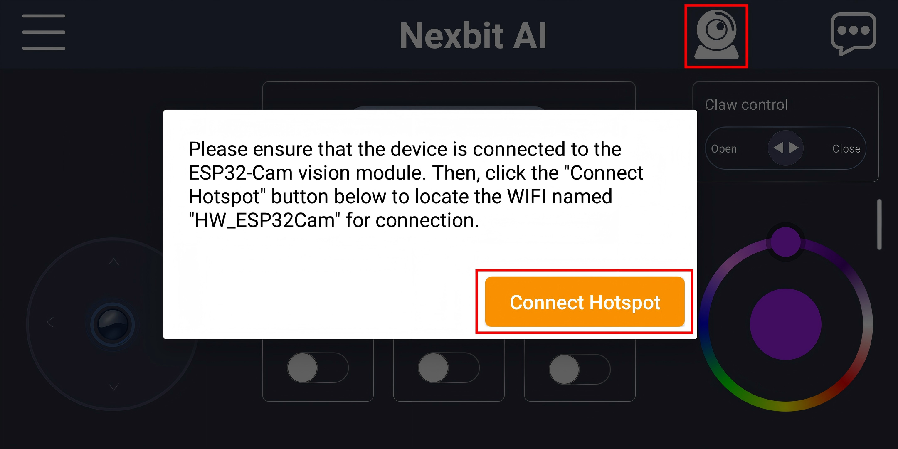

### 5.9.4 Feature Demonstration

<VideoPlayer src="https://hiwonder.oss-cn-shenzhen.aliyuncs.com/videos/K12/Nexbit%20AI/02%E8%B1%AA%E5%8D%8E%E7%89%88/5.%E5%A4%A7%E6%A8%A1%E5%9E%8B%E8%AF%BE%E7%A8%8B/08%E6%89%8B%E6%9C%BAAPP%E6%BC%94%E7%A4%BA.mp4" type="video/mp4" title="App Image Transmission Demonstration" />

### 5.9.5 Q&A

**Question 1: Why is the module Wi-Fi hotspot not found after powering on following firmware flashing?**

Answer: 

1. Verify that the USB power supply is stable. 
2. Verify SPI MODE settings and switch between DIO and DOUT to reflash if necessary. 
3. Check for loose connections on the camera ribbon cable. 
4. Execute ERASE again before re-flashing firmware.

**Question 2: What causes a black screen without video in the app after successfully connecting to the hotspot?**

Answer: 

1. Confirm that the camera ribbon cable is oriented correctly. 
2. Ensure adequate power supply current to the module. 
3. Confirm that the flashed firmware is Image_transmission.bin rather than other project firmware. 
4. Restart the module and app, then reconnect to the hotspot.

**Question 3: How can video stutter and high latency be resolved?**

Answer: Minimize ambient wireless interference and ensure adequate module power supply. Avoid connecting multiple devices to the module hotspot simultaneously. Lower camera resolution parameters within the program to reduce data transmission volume.

### 5.9.6 Technical Support and Product Discussion

Creative project ideas can be shared within the [Hiwonder Forum](https://forum.hiwonder.com/):

<a href="https://forum.hiwonder.com/" target="_blank" rel="noopener noreferrer">

</a>
