# 6. Robotic Gripper Expansion Projects

## 6.1 Preparation

### 6.1.1 Assembling the Robotic Gripper

Install the robotic gripper onto the robot car as shown in the diagram below.

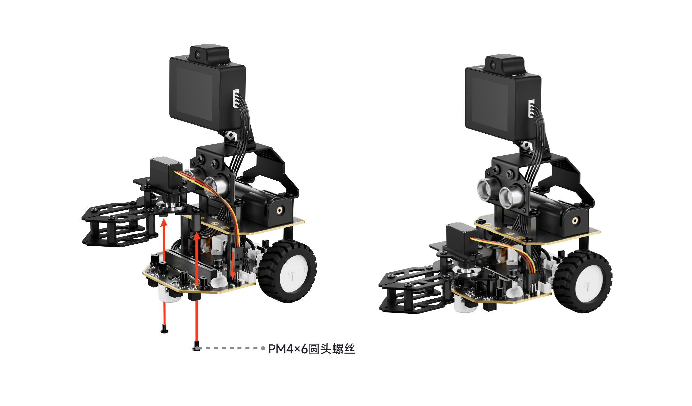

### 6.1.2 Robotic Gripper Wiring

Connect the robotic gripper servo to the **port 1** servo port on the left side of the robot car. Ensure that the **yellow** wire of the servo connects to the **white** pin of the port. Do not reverse the wiring sequence. The schematic diagram is shown below:

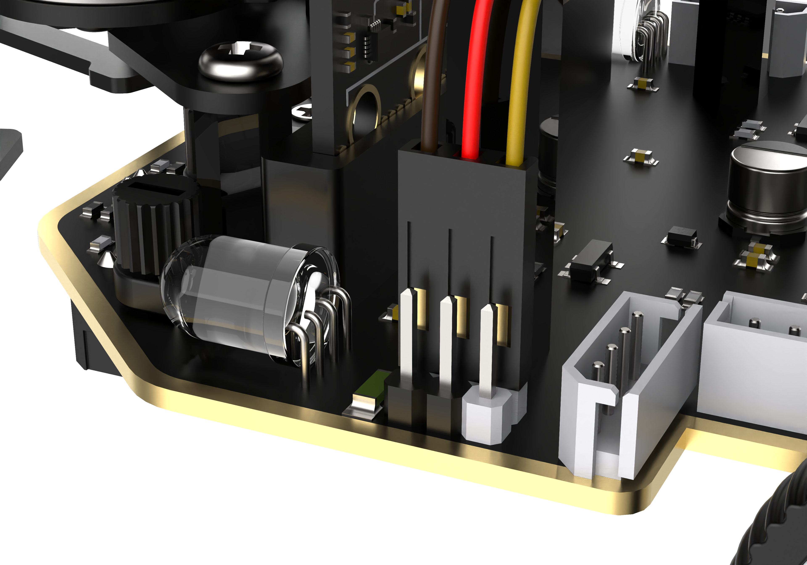

## 6.2 Touch-Controlled Robotic Gripper

### 6.2.1 Lesson Introduction

This lesson introduces controlling the robotic gripper on the Nexbit AI robot using touch buttons. The touch-sensitive logo on the micro:bit board serves as the trigger signal to call servo blocks, controlling the opening and closing of the robotic gripper. Through this project, learners explore the digital signal detection principle of the touch button, master calibration methods for servo safe angle parameters, and understand how button events trigger actuator motions, laying a solid foundation for subsequent multi-mode gripper control projects.

### 6.2.2 Learning Objectives

1. **Knowledge Objectives**: Understand the detection principle of the micro:bit touch-sensitive logo button. Master the safe rotation angle range of the gripper servo, and understand the relationship between servo angles and gripper states.

2. **Skill Objectives**: Complete hardware wiring and power-on checks. Add the Nexbit extension library and program touch button events to trigger servo actions. Calibrate servo angles and motion duration to troubleshoot servo stalling and gripper jamming.

3. **Thinking Objectives**: Build an event-driven programming mindset based on "detecting trigger signal → executing actuator motion". Establish hardware safety boundaries to prevent mechanical overload and component damage.

4. **Application Objectives**: Control the opening and closing of the robotic gripper via the micro:bit touch logo to complete simple pick-and-release experiments.

### 6.2.3 Preparation

#### (1) Hardware Preparation

- Nexbit AI robot with robotic gripper

- micro:bit board

- Micro USB cable

- Battery

- Computer

> [!NOTE]
>
> **When installing the battery, pay attention to the positive and negative terminals. Do not reverse the polarity.**

#### (2) Software Preparation

- Access the MakeCode for micro:bit online programming platform:

  - [MakeCode Platform](https://makecode.microbit.org/)

  - Copy the following link into a browser:

```py
  https://makecode.microbit.org/
```

- Create a new project:


### 6.2.4 Hands-On Project

#### (1) Project Analysis

This project uses event-driven programming. Upon startup, the program initializes the Nexbit hardware and continuously monitors the status of the micro:bit touch logo. When a finger touches the logo, a button event is triggered. The program calls servo blocks to drive the gripper servo, toggling between open and closed states. Releasing the touch causes no action. Touching the logo again switches it back to the original state, achieving one-touch toggling of the gripper.

#### (2) Adding Extensions

1. Click **Extensions**.

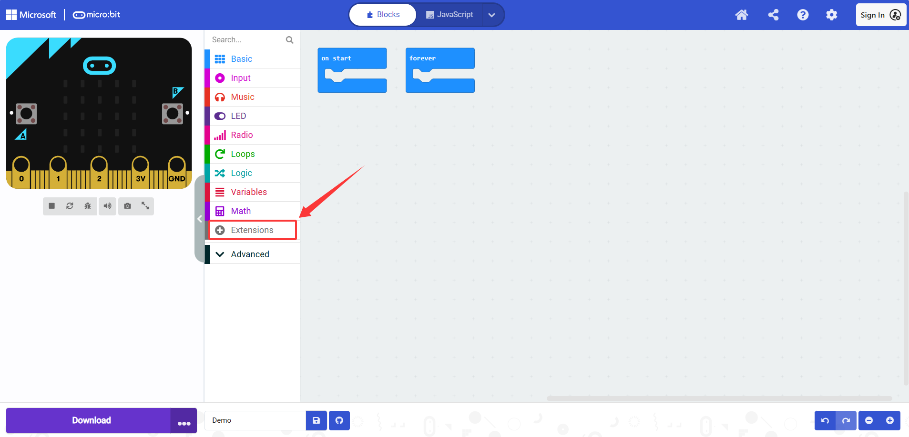

2. Copy the following link into the search box under **Extensions** to add **nexbit**:

```py
https://github.com/Hiwonder/Nexbit
```


> [!NOTE]
>
> **Alternative import method: Drag and drop the sample program file directly into the MakeCode web page without manually adding the nexbit extension.**

#### (3) Core Blocks

| Block | Category | Function Description |
| :---: | :---: | :--- |
|  |  | Executes all code within this block first after startup for hardware initialization. |
| 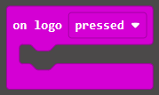 |  | Detects the state of the logo button. Executes the code inside when triggered. |
|  |  | Sets the rotation angle and duration for the specified servo to execute motion. |

#### (4) Program Description and Upload

- Program Schematic

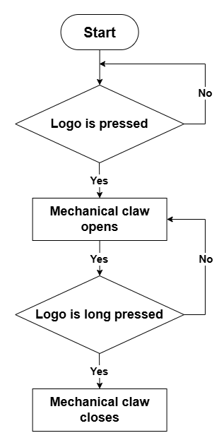

- Complete Program

1. The program starts, initializes the Nexbit hardware, and completes basic controller configuration.

2. The system monitors the onboard logo button events. **Tapping the logo** triggers the command to rotate servo 1 to 20° in 1,000 ms.

3. **Long-pressing the logo** triggers the command to rotate servo 1 to 90° in 1,000 ms, achieving button control over gripper opening and closing.

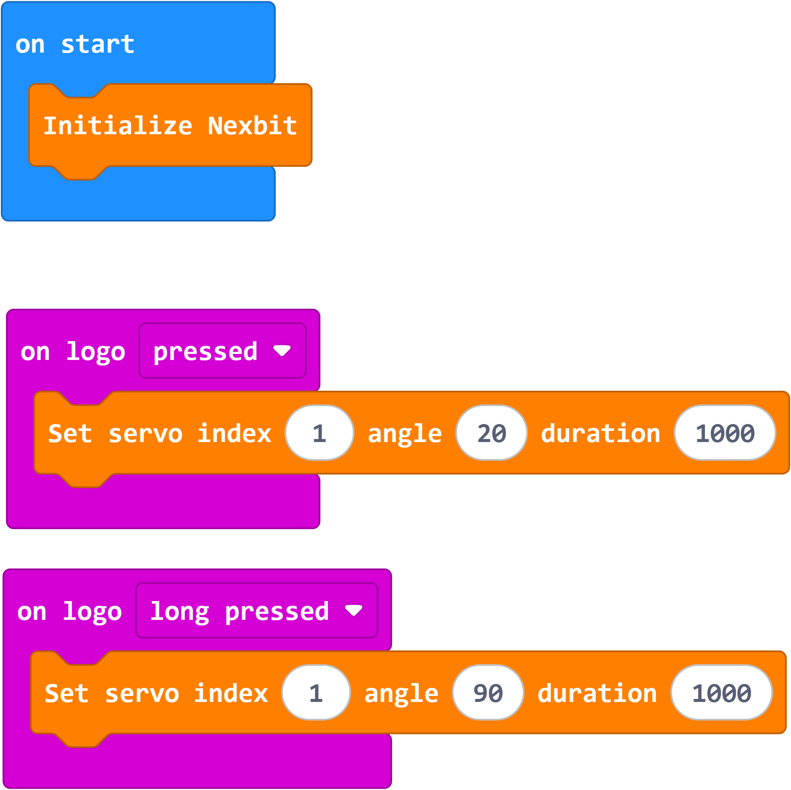

> [!NOTE]
>
> * **Key calibration points: Operating the servo beyond the 0°–95° range causes mechanical stalling. Prolonged stalling will burn out the servo.**
>
> * **Modifying parameters: Click the white box on the block to directly input the servo angle and duration.**
>
> * **Operating tips: Higher duration values make the servo move more smoothly. Excessively short durations cause high mechanical impact and risk gear damage.**

Program Link: [Click to Open](https://makecode.microbit.org/_HVmfkuAWhiLU)

The program is also accessible directly through the following page:

<FeishuForm url="https://makecode.microbit.org/_HVmfkuAWhiLU" />

- Program Upload

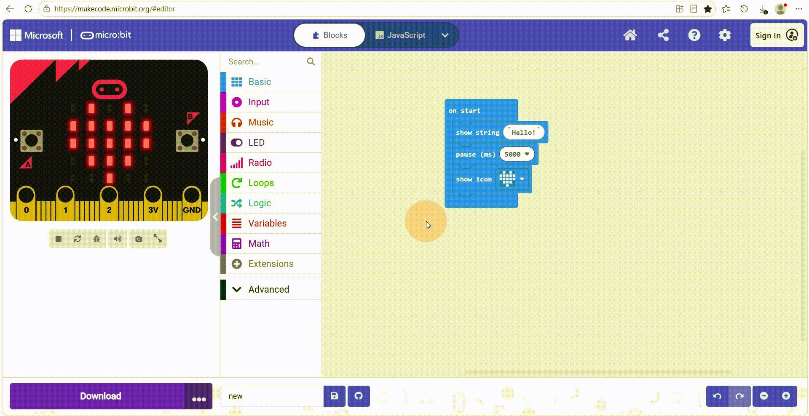

> [!NOTE]
>
> **Power off the robot car before uploading the program to prevent the servo from rotating immediately and causing mechanical collision upon upload completion.**

#### (5) Function Demonstration

Power on the robot car and wait for hardware initialization to finish. Touching the micro:bit logo closes the robotic gripper to clamp objects. Long-pressing the logo opens the gripper to release objects. During testing, observe gripper motion carefully. If jitter occurs, increase the servo action duration appropriately. The demonstration is shown below:

<VideoPlayer src="https://hiwonder.oss-cn-shenzhen.aliyuncs.com/videos/K12/Nexbit%20AI/02%E8%B1%AA%E5%8D%8E%E7%89%88/6.%E6%9C%BA%E6%A2%B0%E7%88%AA%E8%AF%BE%E7%A8%8B/01%E8%A7%A6%E6%91%B8%E6%8E%A7%E5%88%B6%E6%9C%BA%E6%A2%B0%E7%88%AA.mp4" type="video/mp4" title="Touch-Controlled Robotic Gripper Function Demonstration" />

### 6.2.5 Expansion and Challenge

**Project 1: Multi-Stage Gripper Opening Control**

Modify the program so that consecutive button presses switch through multiple angle levels. This implements three distinct states: fully open, half open, and clamped. This project practices multi-state switching logic and precise clamping force control.

**Project 2: Touch-Counted Pick-and-Place Task**

Add a counting variable that increments by 1 each time the logo is touched to complete a pick-and-release cycle. Display the total count in real time on the LED matrix to execute quantitative picking tasks. This project integrates variable read/write operations, screen display, and event-driven programming.

### 6.2.6 Q&A

**Question 1: Why does servo motion require a duration setting? Can it be set to 0?**

Answer: Servo rotation requires physical time to complete mechanical displacement. When the duration is set to 0, the program does not wait for the motion to complete and immediately executes the next line of code. Consecutive triggers cause instruction buildup, leading to erratic motion, gripper jitter, and accelerated gear wear.

**Question 2: What is servo stalling in the robotic gripper, and what consequences does it cause?**

Answer: When the servo emits a humming noise but the gripper does not move, stalling occurs. Prolonged stalling wears out internal gears and can burn out the servo in severe cases. During calibration, the servo angle must be strictly restricted within the safe operating range.

### 6.2.7 Technical Support and Product Discussion

For more creative ideas after experiencing the product, welcome to share on the [Hiwonder Community](https://forum.hiwonder.com/): https://forum.hiwonder.com

<a href="https://forum.hiwonder.com/" target="_blank" rel="noopener noreferrer">

</a>

## 6.3 LLM-Controlled Robotic Gripper

### 6.3.1 Lesson Introduction

This lesson introduces voice control of the robotic gripper on the Nexbit AI robot. The servo drives the robotic gripper, while the WonderLLM module provides voice interaction and the claw MCP tool. Voice commands adjust the gripper angle and motion duration to achieve opening and closing motions. Learners will master servo angle control principles, understand the execution workflow of MCP blocking tools, integrate previous voice interaction concepts, and complete robot grasping tasks, establishing a solid foundation for subsequent transport projects.

### 6.3.2 Learning Objectives

1. **Knowledge Objectives**: Understand the principles of servo angle control and become familiar with the opening and closing angle range of the gripper. Master parameter definitions for the claw MCP tool, and understand the servo motion execution mechanism under blocking mode.

2. **Skill Objectives**: Add the **nexbit** and **wonderllm s3** extensions and configure the robotic gripper MCP tool. Debug gripper control programs to troubleshoot servo jitter and incomplete gripper movement.

3. **Thinking Objectives**: Learn to decompose grasping motions into controllable parameters such as servo angle and motion duration. Distribute parameters through AI voice commands to control physical actuators through human-robot interaction, also known as HRI.

4. **Application Objectives**: Control the opening, closing, and speed of the robotic gripper using voice commands to perform object pick-and-release tasks.

### 6.3.3 Preparation

#### (1) Hardware Preparation

- Nexbit AI robot with robotic gripper

- micro:bit board

- Micro USB cable

- Battery

- Computer

> [!NOTE]
>
> **When installing the battery, pay attention to the positive and negative terminals. Do not reverse the polarity.**

#### (2) Software Preparation

- Access the MakeCode for micro:bit online programming platform:

  - [MakeCode Platform](https://makecode.microbit.org/)

  - Copy the following link into a browser:

```py
https://makecode.microbit.org/
```

- Create a new project:


### 6.3.4 Hands-On Project

#### (1) Project Analysis

This project implements voice control for opening and closing the robotic gripper. Upon power-up, the program initializes the Nexbit hardware, servo, and WonderLLM module, then loads the `self.control.claw` MCP tool. The AI receives voice commands, parses the `claw_angle` parameter and `claw_time` duration parameter, and calls the MCP tool to drive the servo and move the robotic gripper.

#### (2) Adding Extensions

1. Click **Extensions**.


2. Copy the following link into the search box under **Extensions** to add **nexbit**:

```py
https://github.com/Hiwonder/Nexbit
```


3. Copy the following link into the search box under **Extensions** to add **wonderllm s3**:

```
https://github.com/hiwonderk12/WonderLLM_S3
```


> [!NOTE]
>
> **Alternative import method: Drag and drop the sample program file directly into the MakeCode web page without manually adding the nexbit and wonderllm s3 extensions.**

#### (3) Core Blocks

- **Core Block Analysis**

| Block | Category | Function Description |
| :---: | :---: | :--- |
|  |  | Assigns a specified numerical value to a variable. |
|  |  | Increases or decreases the variable value by a set step. |
|  |  | Reads and returns the value stored in the variable. |
|  |  | Performs arithmetic operations including addition, subtraction, multiplication, and division, and returns the calculation result. |
|  |  | Takes two input values and returns the minimum or maximum value. |
|  |  | Initializes the Nexbit expansion board hardware, starting port and display drivers. |
|  |  | Sets the rotation angle and duration for the specified servo to execute motion. |
| 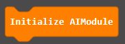 |  | Initializes the WonderLLM AI module upon power-up and establishes the communication link. |
| 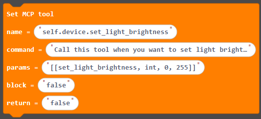 |  | Configures MCP tool information, defining tool name, description, parameter format, and whether to block until execution completes. |
|  |  | Transmits the configured MCP tool settings to the AI module to take effect. |
|  |  | Reads the result data returned after the AI tool call completes execution. |
| 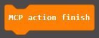 |  | Notifies the AI hardware module that the current MCP tool action is complete, allowing the AI to continue generating responses. This is the closing step of the tool invocation process. |
|  |  | Returns a specified numerical value upon function completion. |
|  |  | Calls the custom function named `doSomething` to execute the internal code. |
|  |  | Defines a custom function named `doSomething` to encapsulate reusable program logic. |
|  |  | Reads the specified array and retrieves the data at the corresponding index. |
|  |  | Retrieves and returns the total number of elements stored in the specified array. |
|  |  | Checks whether the target text contains specified characters and returns a boolean result. |
|  |  | Converts a numerical string in text format into numeric data for calculation. |
|  |  | Concatenates multiple text segments into a single combined string. |
|  |  | Finds the starting index of specified characters within the text. |
|  |  | Extracts a substring of specified length starting from the specified index in the text. |
|  |  | Splits the text in the first field into an array using the characters in the second field as delimiters. |

- **MCP Configuration Analysis**

1. Tool Name: `self.control.claw`

2. Tool Description: `When you want to control the mechanical claw, please use this tool. claw_angle ranges from 20 to 90 degrees: 20 means open and 90 means closed. claw_time is the movement time in milliseconds, ranges from 100 to 5000, and defaults to 1000.`

   Summary: Use this tool to control the robotic gripper. The parameter `claw_angle` ranges from 20° to 90°: 20 represents open and 90 represents closed. The parameter `claw_time` is the motion duration in milliseconds, ranging from 100 ms to 5,000 ms with a default value of 1,000 ms.

3. Return Parameters: `[["claw_angle", "int", "20", "90"], ["claw_time", "int", "100", "5000"]]`

4. Block Until Tool Call Completes: `true`

5. Return Data to AI Module: `false`

6. Function: Receives the angle and duration parameters passed by the AI, and drives the servo to rotate the robotic gripper. Under blocking mode, the system does not respond to new voice inputs while the gripper is in motion. Once the action finishes, the system notifies the AI and resumes voice listening.

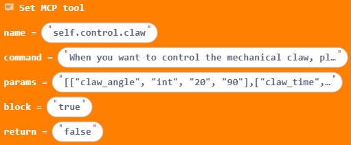

#### (4) Program Description and Upload

- Program Schematic

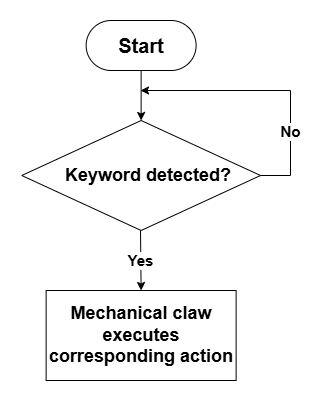

- Complete Program

1. The program starts, initializes the Nexbit hardware, servo, and WonderLLM AI module, and configures and transmits the robotic gripper MCP tool.

2. The system continuously listens for voice commands. The AI identifies gripper control instructions, extracts the angle and duration parameters, and calls the `claw` MCP tool.

3. The micro:bit board drives the servo to complete gripper opening and closing at the specified angle and speed. After the motion finishes, it notifies the AI and waits for the next voice command.

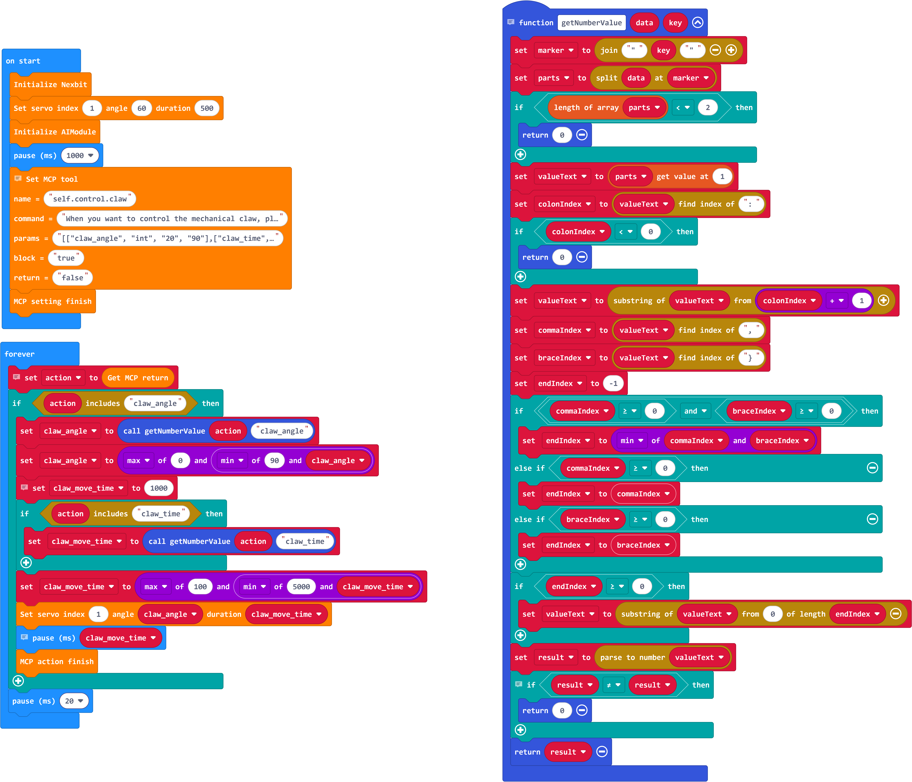

Program Link: [Click to Open](https://makecode.microbit.org/_8zo4W3Eu6c4V)

The program is also accessible directly through the following page:

<FeishuForm url="https://makecode.microbit.org/_8zo4W3Eu6c4V" />

- Program Upload


#### (5) Function Demonstration

Install the battery and power on the robot car. Wait for the AI module to complete initialization, then speak voice commands into the microphone. Saying "Open the gripper" fully opens the gripper. Saying "Close the gripper" causes the gripper to clamp objects. New voice commands are ignored while an action is executing. The demonstration is shown below:

<VideoPlayer src="https://hiwonder.oss-cn-shenzhen.aliyuncs.com/videos/K12/Nexbit%20AI/02%E8%B1%AA%E5%8D%8E%E7%89%88/6.%E6%9C%BA%E6%A2%B0%E7%88%AA%E8%AF%BE%E7%A8%8B/02%E5%A4%A7%E6%A8%A1%E5%9E%8B%E6%8E%A7%E5%88%B6%E6%9C%BA%E6%A2%B0%E7%88%AA.mp4" type="video/mp4" title="LLM-Controlled Robotic Gripper Function Demonstration" />

### 6.3.5 Expansion and Challenge

**Project 1: Voice Grasping Count Broadcast**

Add a variable to record the number of grasps. Increment the grasp count by 1 each time the gripper successfully clamps. After each grasp, the AI broadcasts the total grasp count via voice while the LED matrix synchronously displays the value, creating a comprehensive project combining voice interaction and data logging.

**Project 2: Voice-Triggered Automated Grasping Task Chain**

Program a multi-step task sequence. When given the voice command "Grab the object ahead", the AI sequentially executes: moving forward toward the object, closing the gripper to clamp, reversing the car, and opening the gripper after a delay. This project utilizes the large model to break down natural language tasks into sequential hardware actions, demonstrating multi-device coordination and task sequencing.

### 6.3.6 Q&A

**Question 1: What does setting blocking to `true` in the `claw` MCP tool mean?**

Answer: In blocking mode, the AI pauses receiving new voice inputs after dispatching a command. It only resumes listening after the gripper servo completely finishes its motion. This prevents overlapping commands from causing mechanical movement errors.

**Question 2: Why must parameter range limits be set for MCP tools? What problems occur if limits are removed?**

Answer: MCP parameter ranges validate AI output data. Removing these restrictions allows the AI to output angle values outside the safe servo range, leading to servo stalling and long-term mechanical damage. Parameter limits serve as a critical hardware protection mechanism for AI robotics.

### 6.3.7 Technical Support and Product Discussion

For more creative ideas after experiencing the product, welcome to share on the [Hiwonder Community](https://forum.hiwonder.com/): https://forum.hiwonder.com

<a href="https://forum.hiwonder.com/" target="_blank" rel="noopener noreferrer">

</a>

## 6.4 App-Controlled Robotic Gripper

### 6.4.1 Lesson Introduction

This lesson introduces controlling the robotic gripper on the Nexbit AI robot using the Wonderbit app over Bluetooth. The phone connects to the robot car via Bluetooth and transmits commands through app buttons. The micro:bit board receives and parses the Bluetooth packets, driving the servo to open and close the gripper. Through this project, learners explore Bluetooth wireless communication principles, master command interaction logic between the app and the controller, and become familiar with app-based robot control solutions.

### 6.4.2 Learning Objectives

1. **Knowledge Objectives**: Understand the fundamentals of Bluetooth wireless communication. Master the operation workflow of the Wonderbit app. Understand the principles of Bluetooth packet reception and command parsing.

2. **Skill Objectives**: Download the app and pair the device. Program routines for receiving and parsing Bluetooth commands. Debug Bluetooth communication to resolve connection failures and unresponsive commands.

3. **Thinking Objectives**: Establish a distributed control architecture where the upper computer sends commands and the lower computer executes actions, distinguishing between wired downloading and wireless control.

4. **Application Objectives**: Remotely control the opening and closing of the robotic gripper using buttons in the Wonderbit app to complete pick-and-release tasks.

### 6.4.3 Preparation

#### (1) App Download

- Downloading the App:

  - Click [Wonderbit](https://www.hiwonder.com.cn/download/downloadQrcode?get_app=2) to download.

  - Scan the QR code to download:


#### (2) Hardware Preparation

- Nexbit AI robot with robotic gripper

- micro:bit board

- Micro USB cable

- Battery

- Computer

> [!NOTE]
>
> * **When installing the battery, pay attention to the positive and negative terminals. Do not reverse the polarity.**
>
> * **The Bluetooth module is integrated onto the micro:bit board, requiring no additional wiring. Bluetooth and location permissions must be enabled on the phone.**

#### (3) Software Preparation

- Access the MakeCode for micro:bit online programming platform:

  - [MakeCode Platform](https://makecode.microbit.org/)

  - Copy the following link into a browser:

```py
  https://makecode.microbit.org/
```

- Create a new project:


### 6.4.4 Hands-On Project

#### (1) Project Analysis

This project implements remote app control based on Bluetooth communication. Upon power-up, the robot car controller initializes the hardware and Bluetooth module, continuously listening for Bluetooth data packets. The Wonderbit app connects to the car over Bluetooth, sending command packets when gripper buttons are tapped. Upon receiving packets, the micro:bit identifies command types and calls servo blocks to drive gripper opening and closing.

#### (2) Adding Extensions

1. Click **Extensions**.


2. Copy the following link into the search box under **Extensions** to add **nexbit**:

```py
https://github.com/Hiwonder/Nexbit
```


3. Copy the following text into the search box under **Extensions** to add **bluetooth**:

```py
bluetooth
```

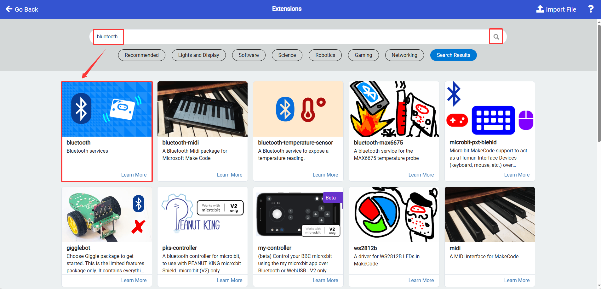

4. In the prompt window, select **Remove extension(s) and add bluetooth**.


5. Under Project Settings, set pairing to **No Pairing Required: Anyone can connect via Bluetooth**.


> [!NOTE]
>
> **Alternative import method: Drag and drop the sample program file directly into the MakeCode web page without manually adding the Nexbit and Bluetooth extensions.**

#### (3) Core Blocks

| Block | Category | Function Description |
| :---: | :---: | :--- |
|  |  | Assigns a specified numerical value to a variable. |
|  |  | Increases or decreases the variable value by a set step. |
|  |  | Reads and returns the value stored in the variable. |
|  |  | Event block: Executes all code within this block immediately when a Bluetooth connection is established. |
|  |  | Event block: Executes internal code immediately when the Bluetooth connection is disconnected. |
|  |  | Transmits numeric data over Bluetooth serial to a phone or host computer. |
|  |  | Transmits text strings over Bluetooth serial for prompts or sensor data. |
| 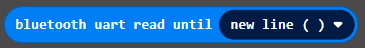 |  | Reads Bluetooth serial data in blocking mode until a newline character is encountered, returning the complete line of received text. |
|  |  | Performs arithmetic operations including addition, subtraction, multiplication, and division, and returns the calculation result. |
|  |  | Rounds input decimals using modes such as round, floor, or ceiling. |
|  |  | Initializes the Nexbit expansion board hardware, starting port and display drivers. |
|  |  | Sets the rotation angle and duration for the specified servo to execute motion. |
|  |  | Sets the running speed for two DC motors simultaneously from -100 to 100: positive for forward, negative for reverse, and 0 to stop. |
|  |  | Selects LED mode and position, setting color via R, G, and B values. Updates immediately. |
|  |  | Reads the distance to obstacles detected by the ultrasonic sensor in millimeters. |
|  |  | Sets the rotation angle and duration for the specified servo to execute motion. |
|  |  | Sets RGB LED output brightness from 0 to 255 to control overall illumination intensity. |
|  |  | Sets RGB color values for the specified LED, buffering the color without lighting up immediately. |
|  |  | Refreshes the configured RGB color settings to illuminate the LEDs with the corresponding color. |
|  |  | Reads the command identifier from the received Bluetooth packet to determine the incoming command type. |
|  |  | Extracts the parameter value at the specified index, starting from 1, from the packet, retrieving speed, angle, or other data. |
|  |  | Dropdown enum block used to match the received Bluetooth command type. |
|  |  | Dropdown enum block containing robot motion commands to match incoming movement instructions. |
|  |  | Converts input values into ultrasonic measurement Bluetooth commands to request distance readings via Bluetooth. |

#### (4) Program Description and Upload

- Program Schematic

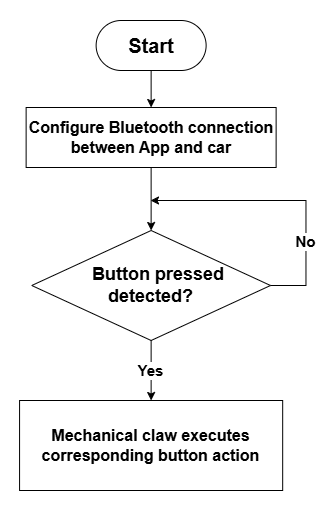

- Complete Program

1. The program starts, initializes the Nexbit hardware, configures Bluetooth communication, motors, and the ultrasonic sensor, and reserves the gripper servo control interface.

2. The system continuously loops to read Bluetooth commands from the app, parsing car movement commands to drive the motors while receiving gripper open and close commands.

3. The controller parses gripper commands to adjust servo angles for clamping and releasing. The ultrasonic sensor detects obstacles in real time, stopping the car automatically upon detecting an obstacle to ensure safe gripper operations.


Program Link: [Click to Open](https://makecode.microbit.org/_Rw9VU97uhbks)

The program is also accessible directly through the following page:

<FeishuForm url="https://makecode.microbit.org/_Rw9VU97uhbks" />

- Program Upload


> [!NOTE]
>
> **Power off the robot car before uploading the program to prevent the servo from rotating immediately and causing mechanical collision upon upload completion.**

#### (5) Function Demonstration

Open the Wonderbit app, switch the device to Nexbit AI, and connect to the robot car via Bluetooth. Once connected, tap the Close button under Gripper Control in the app to clamp the gripper. Tap the Open button to release the object. When Bluetooth disconnects, app commands no longer take effect. The demonstration is shown below:

<VideoPlayer src="https://hiwonder.oss-cn-shenzhen.aliyuncs.com/videos/K12/Nexbit%20AI/02%E8%B1%AA%E5%8D%8E%E7%89%88/6.%E6%9C%BA%E6%A2%B0%E7%88%AA%E8%AF%BE%E7%A8%8B/03%E6%89%8B%E6%9C%BAAPP%E6%BC%94%E7%A4%BA.mp4" type="video/mp4" title="App-Controlled Robotic Gripper Function Demonstration" />

### 6.4.5 Expansion and Challenge

**Project 1: App Grasping Data Telemetry**

Add a variable to track the number of grasps. Each time the app triggers the gripper to close, the count increments by 1. The data is transmitted back to the app over Bluetooth and displayed on the interface in real time, implementing lower-computer telemetry.

**Project 2: Obstacle-Triggered Gripper Protection**

Incorporate ultrasonic sensing into the protection logic. When the gripper is clamping an object and an obstacle is detected ahead, the car halts automatically while maintaining its grip. After the obstacle is cleared, app control resumes. This project exercises multi-sensor coordination and state latching to prevent dropping objects or damaging the gripper during transport.

### 6.4.6 Q&A

**Question 1: Why does command latency occur in Bluetooth communication? What are the primary causes?**

Answer: Bluetooth uses wireless packet transmission. Commands require packet assembly, wireless transmission, reception, and parsing by the lower computer, each introducing slight processing overhead. Environmental wireless interference, packet retransmission, and concurrent microcontroller multitasking further increase latency.

**Question 2: What is the main difference between Bluetooth control and touch button control of the robotic gripper?**

Answer: Touch button control is local and board-level, requiring no wireless signals. App control relies on Bluetooth wireless communication, enabling remote operation from a distance as an upper-computer control solution.

### 6.4.7 Technical Support and Product Discussion

For more creative ideas after experiencing the product, welcome to share on the [Hiwonder Community](https://forum.hiwonder.com/): https://forum.hiwonder.com

<a href="https://forum.hiwonder.com/" target="_blank" rel="noopener noreferrer">

</a>

## 6.5 Handlebit-Controlled Robotic Gripper

### 6.5.1 Lesson Introduction

This lesson introduces wireless remote control of the robotic gripper on the Nexbit AI robot using the Handlebit controller. The micro:bit on the controller captures button signals and transmits digital packets via radio. The micro:bit on the robot car receives these packets, parses the signals, and drives the servo to control the robotic gripper. Through this project, learners explore micro:bit radio frequency communication, master programming for both transmitter and receiver ends, and implement wireless remote grasping operations.

### 6.5.2 Learning Objectives

1. **Knowledge Objectives**: Understand the operating principles of micro:bit radio communication. Comprehend the transmission and reception workflows of wireless radio signals. Master button signal acquisition techniques on the Handlebit controller.

2. **Skill Objectives**: Write distinct programs for the transmitter and receiver. Configure matching radio group numbers on both devices. Debug radio communication to troubleshoot lost signals and motion latency.

3. **Thinking Objectives**: Decompose a wireless communication project into transmitter signal acquisition and receiver parsing execution, understanding the paired transceiver design concept.

4. **Application Objectives**: Operate buttons on the Handlebit controller to remotely control the opening and closing of the robotic gripper, completing pick-and-place missions.

### 6.5.3 Preparation

#### (1) Hardware Preparation

- Nexbit AI robot with robotic gripper

- Handlebit controller equipped with a micro:bit board

- Two micro:bit boards

- Micro USB cable

- Batteries for the car and controller

- Computer

> [!NOTE]
>
> **When installing batteries, pay attention to positive and negative terminals. Do not reverse polarity.**

#### (2) Software Preparation

- Access the MakeCode for micro:bit online programming platform:

  - [MakeCode Platform](https://makecode.microbit.org/)

  - Copy the following link into a browser:

```py
  https://makecode.microbit.org/
```

- Create a new project:


### 6.5.4 Hands-On Project

#### (1) Project Analysis

This project consists of a transmitter and a receiver. Upon startup, the controller initializes the Handlebit library and monitors button inputs. When a button is pressed, the controller sends a preset numeric signal via the radio module. The robot car initializes the Nexbit hardware and radio module, continuously listening for incoming radio data. Upon receiving matching signals, it calls servo blocks to control gripper opening and closing. Both devices must share the same radio group number to ensure paired communication.

#### (2) Adding Extensions

1. Click **Extensions**.


2. Copy the following link into the search box under **Extensions** to add **nexbit**:

```py
https://github.com/Hiwonder/Nexbit
```


3. Copy the following link into the search box under **Extensions** to add **Handlebit**:

```py
https://github.com/HiwonderK12/Handlebit
```


> [!NOTE]
>
> **Alternative import method: Drag and drop the sample program file directly into the MakeCode web page without manually adding the Handlebit and Nexbit extensions.**

#### (3) Core Blocks

| Block | Category | Function Description |
| :---: | :---: | :--- |
|  |  | Transmits a specified number via the radio module. |
| 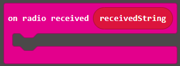 |  | Executes the code inside when data is received over radio. |
|  |  | Assigns a specified numerical value to a variable. |
|  |  | Increases or decreases the variable value by a set step. |
|  |  | Reads and returns the value stored in the variable. |
|  |  | Initializes the Nexbit expansion board hardware, starting port and display drivers. |
|  |  | Sets the rotation angle and duration for the specified servo to execute motion. |
|  |  | Sets the running speed for two DC motors simultaneously from -100 to 100: positive for forward, negative for reverse, and 0 to stop. |
|  |  | Completes the initial configuration of the Handlebit controller module. |
|  |  | Reads the sensor value corresponding to the joystick direction. |

#### (4) Program Description and Upload

- Program Schematic

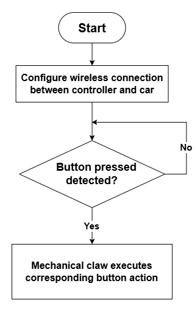

- Complete Transmitter Program

1. The program starts, initializing the Handlebit hardware and the radio communication group.

2. The system continuously loops to read sensor values from the X and Y axes of the left and right joysticks, applying conditional checks to determine deflection ranges.

3. Based on joystick deflection directions, the controller broadcasts corresponding numeric commands over radio, converting joystick physical inputs into wireless control signals for the robot car.

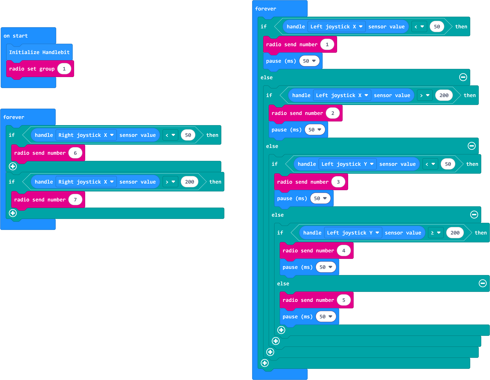

> [!NOTE]
> 
> **The controller and robot car must share the same radio group number. Otherwise, control signals will not be received. Physical obstacles will degrade wireless communication stability.**

Program Link: [Click to Open](https://makecode.microbit.org/_6Lo7tdRKuhFT)

The program is also accessible directly through the following page:

<FeishuForm url="https://makecode.microbit.org/_6Lo7tdRKuhFT" />

- Complete Receiver Program

1. The program starts, initializing the Nexbit hardware, radio communication group, servo angle variable, and gripper state flag, while setting servo 1 to its initial angle.

2. The system continuously listens for incoming radio data, identifying command numbers 1 through 7 corresponding to forward, reverse, steering, stopping, gripper closing, and gripper opening motions.

3. The forever loop checks the gripper state flag in real time. When triggered, it gradually adjusts the servo angle in increments, smoothly driving the servo to open or close the robotic gripper steadily.

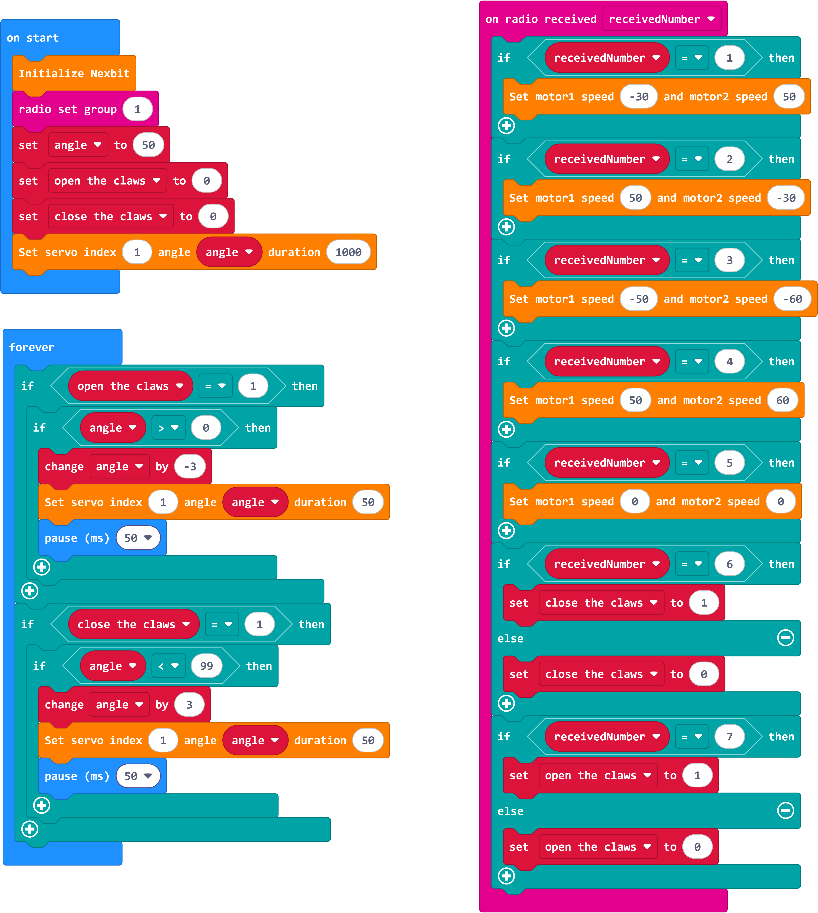

> [!NOTE]
> 
> **Motor speed and duration must be adjusted based on actual conditions. If the robot car veers to the left, slightly increase the value for motor 1 or decrease the value for motor 2. Reverse the adjustment if it veers to the right.**

Program Link: [Click to Open](https://makecode.microbit.org/_9TRKXXXeYJqw)

The program is also accessible directly through the following page:

<FeishuForm url="https://makecode.microbit.org/_9TRKXXXeYJqw" />

- Program Upload


#### (5) Function Demonstration

Power on the controller and robot car separately, ensuring both share the same radio group number. Press the designated button on the Handlebit controller to close the robotic gripper. Press the button again to open the gripper and release the object. During testing, avoid obstructing the radio antennas on either micro:bit board to prevent packet loss.

### 6.5.5 Expansion and Challenge

**Project 1: Remote Grasping Timer**

Start a timer when the robot car receives a clamping command from the controller, and stop timing upon receiving a release command. Display the holding duration on the LED matrix in real time to monitor grip time and protect fragile items from prolonged pressure.

**Project 2: Multi-Button Combo Control**

Use combo button presses to trigger special actions. For example, pressing buttons **A** and **B** simultaneously causes the robotic gripper to execute a sequence: clamping, holding for a 2-second delay, and automatically releasing. This project explores multi-button event recognition and multi-step action sequencing.

### 6.5.6 Q&A

**Question 1: What is the purpose of the micro:bit radio group number? What happens if group numbers do not match?**

Answer: The radio group acts as a communication channel. Devices can only exchange packets when assigned to the exact same channel. If group numbers differ, devices cannot recognize each other's signals, and controller button inputs will produce no response on the robot car.

**Question 2: What are the distinct characteristics of radio communication compared to Bluetooth app control?**

Answer: The micro:bit radio module requires no pairing process and communicates immediately once a matching group is set. It offers low latency, though transmission distance is relatively short and signals are more susceptible to shielding by metallic obstacles.

### 6.5.7 Technical Support and Product Discussion

For more creative ideas after experiencing the product, welcome to share on the [Hiwonder Community](https://forum.hiwonder.com/): https://forum.hiwonder.com

<a href="https://forum.hiwonder.com/" target="_blank" rel="noopener noreferrer">

</a>
