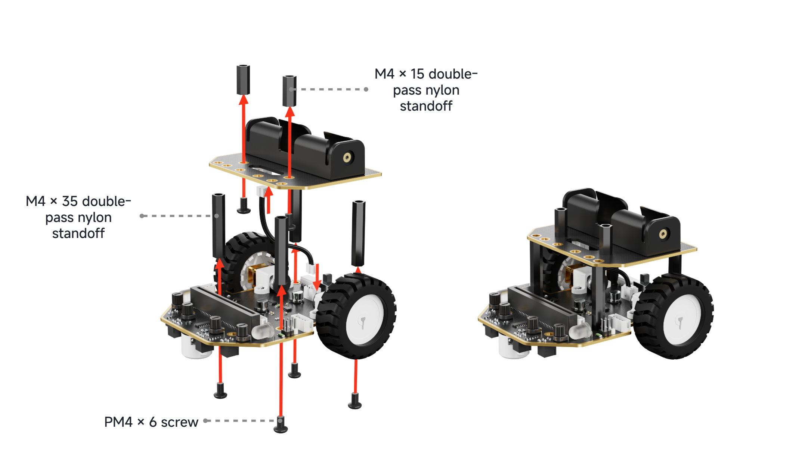
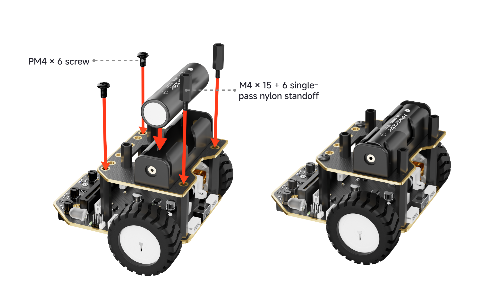
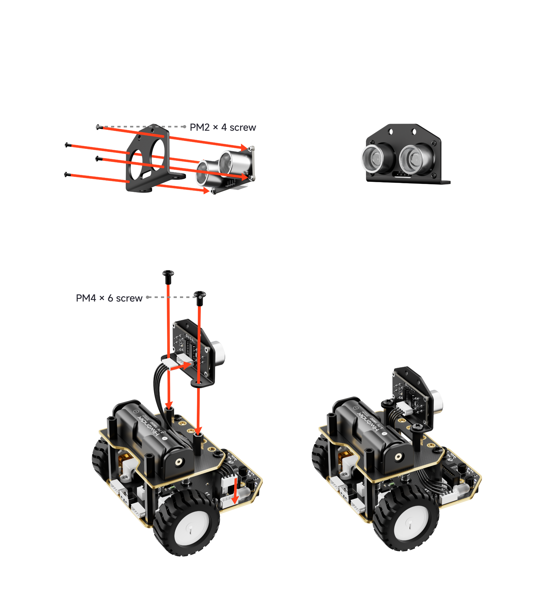
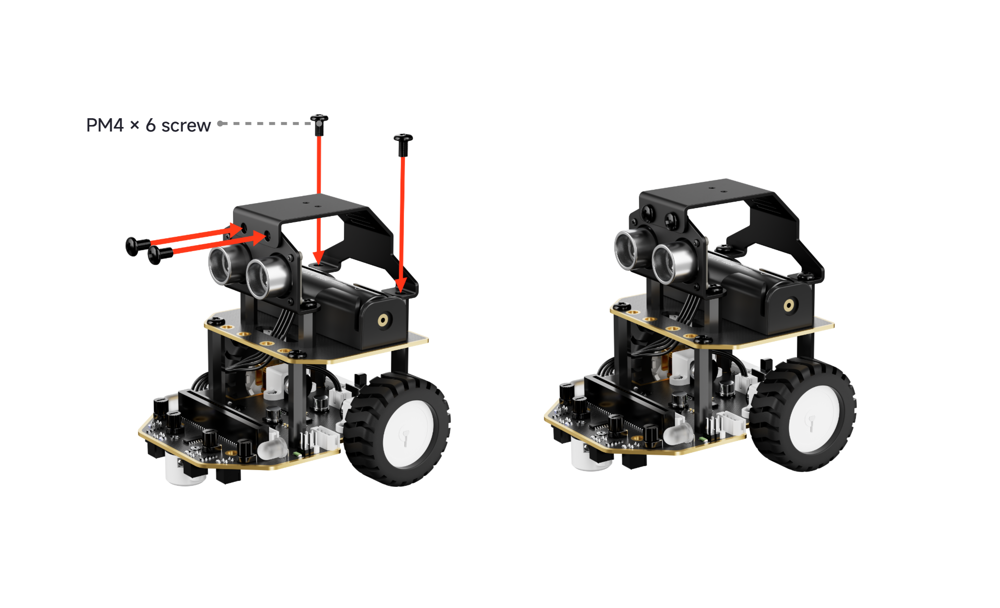
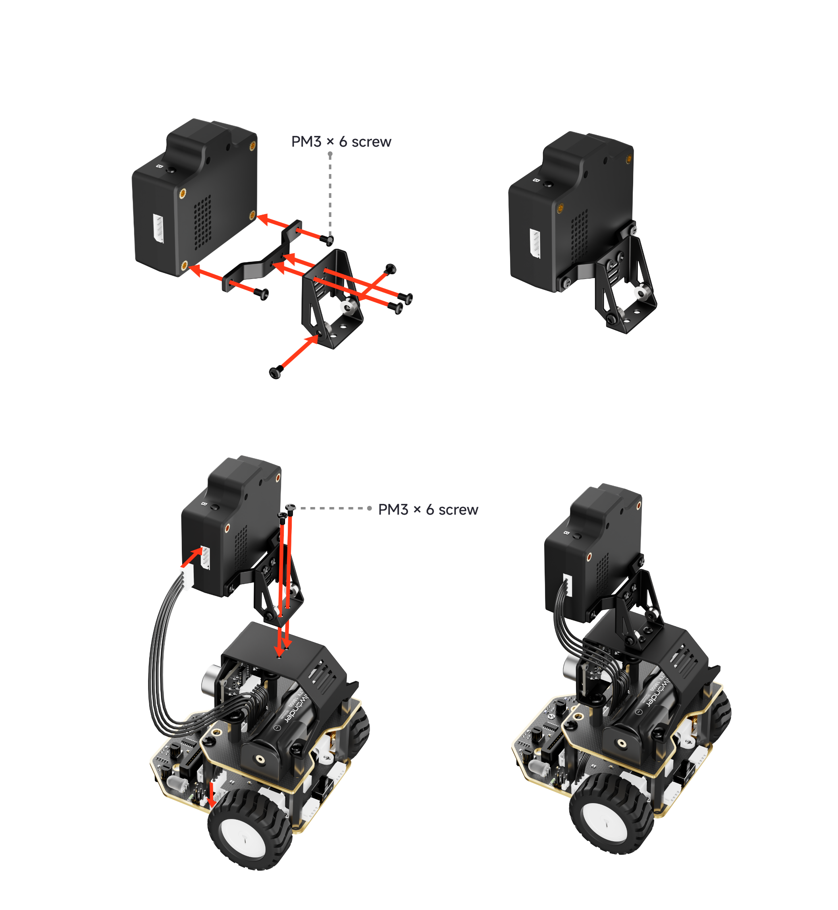
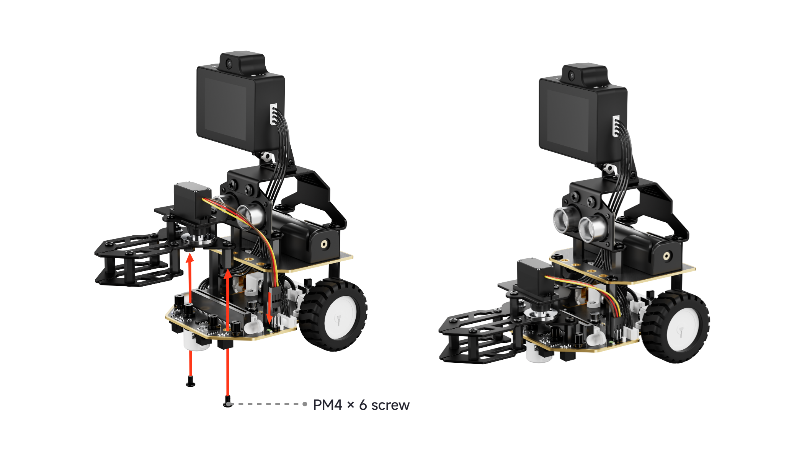

# 2. Nexbit Assembly and Charging Instructions

## 2.1 Assembly and Wiring

1. Secure the **M4 × 35 double-pass nylon standoffs** to the lower plate and the **M4 × 15 double-pass nylon standoffs** to the upper plate using **PM4 × 6 screws**. Then connect the upper plate and lower plate using a **2-pin cable**.

2. Fasten the upper plate and lower plate together using **PM4 × 6 screws**, supported by **M4 × 15 + 6 single-pass nylon standoffs** at the rear. Then insert the lithium battery into the battery compartment.

> [!NOTE]
>
> * **Set the power switch on the lower plate to the OFF position first. Observe the positive and negative polarities carefully when inserting the battery to avoid reverse installation.**
>

3. Secure the glowy ultrasonic sensor and the ultrasonic sensor bracket to the upper plate using **PM2 × 4** and **PM4 × 6 screws**. Once secured, connect the glowy ultrasonic sensor to the expansion port on the right side of the lower plate using a 4-pin cable.

4. Mount the AI module bracket onto the robot car using **PM4 × 6 screws**.

5. Attach the adjustable angle bracket to the WonderLLM AI module using **PM3 × 6 screws**. Then secure the assembled AI module to the bracket on the robot car using **PM3 × 6 screws**. Connect the module cable to the expansion port on the left side of the lower plate using a 4-pin cable.

## 2.2 Battery Charging

#### (1) Charging Instructions

Use a 5 V, 2 A charger to connect to the charging port on the battery board via the provided Micro USB cable.

#### (2) Precautions

- When charging, the indicator light on the battery board flashes red. Once fully charged, the indicator remains steady red. Disconnect the charger promptly after charging completes to prevent overcharging and battery damage. Charging must be supervised at all times.

- The power switch must be turned off during charging. Otherwise, the battery cannot be fully charged.
