# 4. Nexbit AI Hands-on Projects

## 4.1 Straight-Line Driving

### 4.1.1 Lesson Introduction

This lesson introduces straight-line driving with the Nexbit AI robot car. The focus is on using motor control blocks to configure the speeds of the left and right motors, enabling the robot car to move forward, pause, and reverse. Mastering motor speed parameter calibration establishes the programming foundation for subsequent motion features, such as turning and line following.

### 4.1.2 Learning Objectives

1. **Knowledge Objectives**: Identify the hardware components of a two-wheeled robot car. Understand the relationship between motor speed values and robot motion. Master the motor speed parameter range.

2. **Skill Objectives**: Complete power-on preparation for the hardware. Master adding extension packages and importing programs in MakeCode. Modify motor speed and pause duration parameters, and complete program upload and debugging.

3. **Thinking Objectives**: Understand how rotational speed differences between motors affect travel trajectories. Develop engineering thinking in parameter calibration and troubleshooting.

4. **Application Objectives**: Understand motion control principles in wheeled robotics. Recognize basic motion implementation methods for educational smart robot cars.

### 4.1.3 Preparation

#### (1) Hardware Preparation

- Nexbit AI robot car
- micro:bit board
- Micro USB cable
- Battery
- Computer

> [!NOTE]
>
> **Hardware Installation Note: Verify positive and negative polarity when installing the battery. Reverse connection is strictly prohibited.**

#### (2) Software Preparation

- Access the MakeCode for micro:bit online programming platform:
  - [MakeCode Platform](https://makecode.microbit.org/)
  - Alternatively, copy and open the following link in a browser:

```py
https://makecode.microbit.org/
```

- Create a new project:


### 4.1.4 Hands-on Project

#### (1) Project Analysis

The core project in this lesson guides the Nexbit AI robot car through a complete sequence: forward motion, pause, and reverse motion. The robot car is equipped with two drive motors. Setting the speeds of motor 1 and motor 2 within a range of `-100` to `100` controls robot car movement. Equal positive values drive the robot forward, while equal negative values drive the robot in reverse. Unequal speeds cause the robot to turn. The program uses `pause` blocks to control the duration of each action. Speed and delay parameters require adjustment based on actual ground friction to ensure a straight trajectory.

#### (2) Adding Extensions

1. Click **Extensions**.


2. Copy the following link into the **Extensions** search bar to add **nexbit**.

```py
https://github.com/Hiwonder/Nexbit
```


> [!NOTE]
>
> **Alternative Program Import Method: The sample program file for this lesson can be dragged directly into the MakeCode web interface without manually adding the nexbit extension.**

#### (3) Core Blocks

| Block | Category | Function Description |
| :---: | :---: | :--- |
| 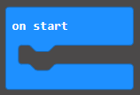 |  | `on start` event block. Executes nested code once upon device power-on or program upload. |
| 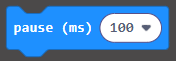 |  | `pause (ms)` block. Pauses program execution for a specified duration in milliseconds before continuing. |
|  |  | `Initialize Nexbit` block. Initializes Nexbit expansion board hardware, starting communication ports and the display driver. |
|  |  | Sets the operating speed of both DC motors simultaneously within a range of `-100` to `100`. Positive values indicate forward rotation, negative values indicate reverse rotation, and `0` indicates stop. |

#### (4) Program Description and Upload

- Program Schematic

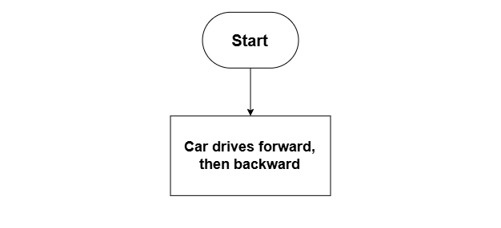

- Complete Program and Analysis

1. When the robot powers on, the program initializes the Nexbit library files. Next, motor 1 is set to rotate forward at `55`, and motor 2 is set to rotate forward at `50`. In combination, these settings cause the robot car to drive forward for 1 second.

2. After moving forward for 1 second, both motor speeds are set to `0`, stopping the robot car for 1 second. Finally, both motors rotate in reverse, driving the robot backward for 1 second.

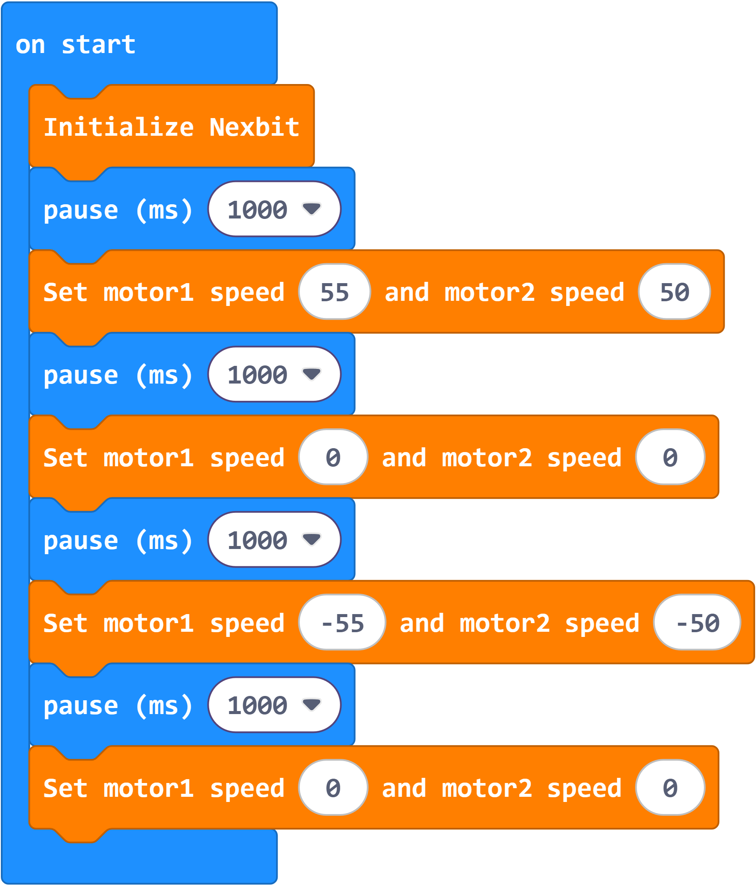

> [!NOTE]
>
> * **Parameter Adjustment: Click the number in the white box of the block to enter a value directly, or drag the slider to adjust the speed.**
>
> * **Ground friction affects straight-line driving. Higher friction may require an appropriate increase in motor speed. Longer pause durations result in greater travel distances at equivalent speeds. Configure motor speed and duration based on actual conditions. If the robot veers left, increase the value of motor 1 slightly or decrease motor 2. If the robot veers right, apply the reverse adjustment.**

Program link: [MakeCode Project](https://makecode.microbit.org/_6ze2HdPXVRcx)</br>

The program is also available for direct download via the following interface:

<FeishuForm url="https://makecode.microbit.org/_6ze2HdPXVRcx"/>

- Program Upload


> [!NOTE]
>
> **Power off the robot car before uploading the program to prevent it from running immediately and falling off raised surfaces.**

### 4.1.5 Expansion and Challenge

**Project 1: Adjusting Driving Speed**

Modify motor speed parameters to achieve acceleration and deceleration:
1. **Acceleration**: Increase the motor speed value, such as changing the speed to `75`, and observe the change in travel speed.
2. **Deceleration**: Decrease the motor speed value, such as changing the speed to `30`, and observe the change in travel speed.

**Project 2: Changing Travel Distance**

Keep motor speeds constant and modify the pause duration in milliseconds. Longer pause durations result in greater travel distances. Modify the delay so the robot drives forward for 2 seconds and reverses for 1 second, then observe the motion.

### 4.1.6 Q&A

**Question 1: What causes the robot car to veer to one side instead of driving straight, and how is this resolved?**

Answer: Discrepancies exist in the actual rotational output between two physical motors, and uneven ground friction also affects straight-line driving. If the robot car veers to the left, slightly increase the speed of motor 1 or decrease motor 2. If the robot car veers to the right, increase motor 2 or decrease motor 1. Fine-tune parameters through multiple trials until the robot travels straight.

**Question 2: Why must the robot car be powered off before uploading the program?**

Answer: The controller executes code immediately upon upload completion. If the robot remains powered on, the motors rotate instantly and it runs forward, creating a risk of falling off the work surface and sustaining hardware damage.

**Question 3: What motion occurs when the motor speed is set to -60?**

Answer: Negative values indicate reverse rotation. When motor 1 and motor 2 are both set to `-60`, both motors rotate in reverse, causing the robot car to drive backward.

### 4.1.7 Technical Support and Product Discussion

To share creative ideas after experiencing the product, visit the [Hiwonder Forum](https://forum.hiwonder.com/):

<a href="https://forum.hiwonder.com/" target="_blank" rel="noopener noreferrer">


</a>

---

## 4.2 Speed Control

### 4.2.1 Lesson Introduction

This lesson introduces speed control with the Nexbit AI robot car. The focus is on using motor control blocks and modifying speed parameters to achieve low-speed and high-speed forward and reverse movement. Mastering speed parameter calibration clarifies the relationship between speed values and motion states, providing a programming foundation for complex maneuvers.

### 4.2.2 Learning Objectives

1. **Knowledge Objectives**: Understand dual-motor drive principles in wheeled robots. Understand the correlation between motor speed values and robot speed. Master the motor speed parameter range of -100 to 100.

2. **Skill Objectives**: Complete hardware power-on preparation. Master adding extension packages and importing programs in MakeCode. Modify motor speed and pause duration parameters, and complete program upload and debugging.

3. **Thinking Objectives**: Understand how speed differences between dual motors affect straight-line driving. Cultivate engineering thinking in parameter calibration and troubleshooting.

4. **Application Objectives**: Understand speed regulation principles in wheeled robotics. Learn to adjust robot speeds according to practical scenarios.

### 4.2.3 Preparation

#### (1) Hardware Preparation

- Nexbit AI robot car
- micro:bit board
- Micro USB cable
- Battery
- Computer

> [!NOTE]
>
> **Hardware Installation Note: Verify positive and negative polarity when installing the battery. Reverse connection is strictly prohibited.**

#### (2) Software Preparation

- Access the MakeCode for micro:bit online programming platform:
  - [MakeCode Platform](https://makecode.microbit.org/)
  - Alternatively, copy and open the following link in a browser:

```py
https://makecode.microbit.org/
```

- Create a new project:


### 4.2.4 Hands-on Project

#### (1) Project Analysis

The core project in this lesson guides the Nexbit AI robot car through low-speed forward motion, pause, low-speed reverse motion, high-speed forward motion, pause, and high-speed reverse motion. The robot car is driven by two motors. Setting different speed values for motor 1 and motor 2 controls travel speed. Positive values indicate forward motion, negative values indicate reverse motion, and `0` indicates stop. The program pairs speed settings with `pause` blocks to govern duration. Speed and delay parameters must be calibrated based on ground friction to maintain straight-line travel.

#### (2) Adding Extensions

1. Click **Extensions**.


2. Copy the following link into the **Extensions** search bar to add **nexbit**.

```py
https://github.com/Hiwonder/Nexbit
```


> [!NOTE]
>
> **Alternative Program Import Method: The sample program file for this lesson can be dragged directly into the MakeCode web interface without manually adding the nexbit extension.**

#### (3) Core Blocks

| Block | Category | Function Description |
| :---: | :---: | :--- |
|  |  | `on start` event block. Executes nested code once upon device power-on or program upload. |
|  |  | `pause (ms)` block. Pauses program execution for a specified duration in milliseconds before continuing. |
|  |  | `Initialize Nexbit` block. Initializes Nexbit expansion board hardware, starting communication ports and the display driver. |
|  |  | Sets the operating speed of both DC motors simultaneously within a range of `-100` to `100`. Positive values indicate forward rotation, negative values indicate reverse rotation, and `0` indicates stop. |

#### (4) Program Description and Upload

- Program Schematic

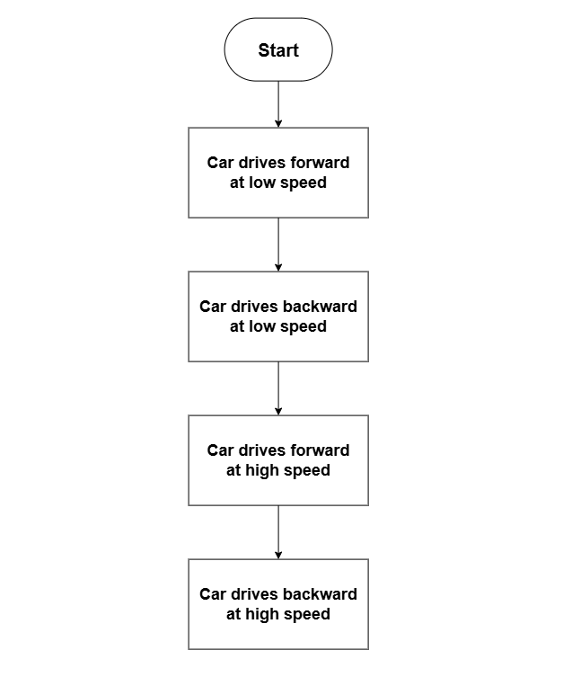

- Complete Program and Analysis

1. Upon power-on, the robot runs an initialization routine to set the initial speed to `0`, ensuring proper execution of subsequent instructions.

2. Motor 1 rotates forward at `26`, and motor 2 rotates forward at `30`, driving the robot forward at low speed for 1 second. The robot pauses in place for 0.5 seconds. Motor 1 then rotates in reverse at `-26`, and motor 2 rotates in reverse at `-30`, driving the robot backward at low speed for 1 second.

3. Next, motor 1 rotates forward at `60`, and motor 2 rotates forward at `70`, driving the robot forward at high speed for 1 second. The robot pauses in place for 0.5 seconds. Motor 1 then rotates in reverse at `-60`, and motor 2 rotates in reverse at `-70`, driving the robot backward at high speed for 1 second before stopping completely.

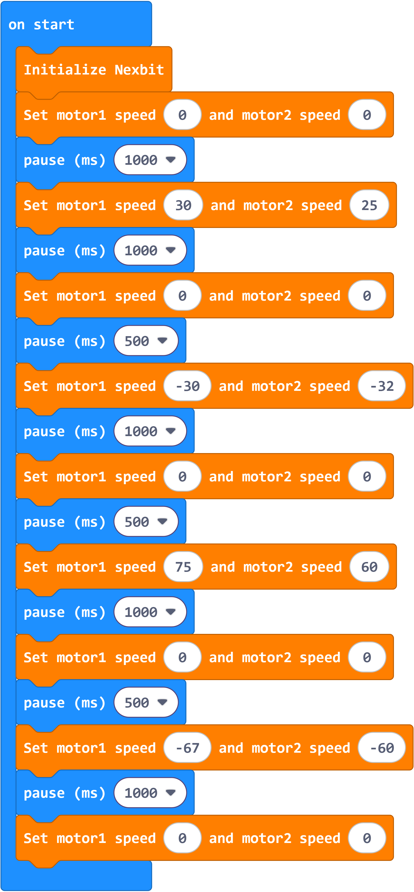

> [!NOTE]
>
> * **Parameter Adjustment: Click the number in the white box of the block to enter a value directly, or drag the slider to adjust the speed.**
>
> * **Ground friction affects straight-line driving. Higher friction may require an appropriate increase in motor speed. Longer pause durations result in greater travel distances at equivalent speeds. Configure motor speed and duration based on actual conditions. If the robot veers left, increase the value of motor 1 slightly or decrease motor 2. If the robot veers right, apply the reverse adjustment.**

Program link: [MakeCode Project](https://makecode.microbit.org/_HLc5tj8dCaRC)</br>

The program is also available for direct download via the following interface:

<FeishuForm url="https://makecode.microbit.org/_HLc5tj8dCaRC"/>

- Program Upload


> [!NOTE]
>
> **Power off the robot car before uploading the program to prevent it from running immediately and falling off raised surfaces.**

### 4.2.5 Expansion and Challenge

**Project 1: Modifying Motion Duration**

Modify delay parameters to change the duration of forward and reverse movement:
1. **Extending Motion Duration**: Increase the pause duration in milliseconds, such as changing `1,000 ms` to `2,000 ms`. The travel time lengthens, resulting in a greater travel distance.
2. **Shortening Motion Duration**: Decrease the pause duration in milliseconds. Travel time decreases, resulting in a shorter travel distance.

**Project 2: Steering via Differential Speed**

Adjust the speed difference between the two motors to observe turning effects:
1. **Turning Right**: Keep the speed of motor 2 constant and increase motor 1. For example, set motor 1 to `50` and motor 2 to `30` to steer right.
2. **Turning Left**: Keep the speed of motor 1 constant and increase motor 2. For example, set motor 1 to `30` and motor 2 to `50` to steer left.

> [!NOTE]
>
> **A larger speed differential between the two motors results in a smaller turning radius. When the differential is `0`, the robot drives straight. Rotating one motor forward and the other in reverse produces a pivot turn in place.**

### 4.2.6 Q&A

**Question 1: Why is motor 1 set to 26 and motor 2 to 30 at low speed, while motor 1 is set to 60 and motor 2 to 70 at high speed?**

Answer: Output rotational speeds differ between physical motors. Differential speed compensation is required to ensure straight travel. Motor 2 is assigned a slightly higher value to offset mechanical speed differences. Specific values require fine-tuning according to the actual drift of the robot.

**Question 2: How is the duration of forward or reverse driving modified?**

Answer: Modify the value in the `pause` block below the corresponding motor block. Larger values extend the duration. For example, changing from `1,000 ms` to `2,000 ms` increases the forward driving time from 1 second to 2 seconds. Smaller values shorten the duration.

**Question 3: What motion occurs when motor speed is set to a negative value?**

Answer: Negative values indicate reverse motor rotation. When motor 1 and motor 2 are both set to negative values, both motors rotate in reverse, driving the robot backward. Larger absolute values produce faster reverse speeds.

### 4.2.7 Technical Support and Product Discussion

To share creative ideas after experiencing the product, visit the [Hiwonder Forum](https://forum.hiwonder.com/):

<a href="https://forum.hiwonder.com/" target="_blank" rel="noopener noreferrer">


</a>

---

## 4.3 Button-Controlled Turning

### 4.3.1 Lesson Introduction

This lesson introduces button-controlled turning with the Nexbit AI robot car. The focus is on combining button event blocks with motor control blocks, using button A and button B on the micro:bit board to trigger left and right turns. Mastering button event programming clarifies the relationship between differential motor speeds and robot steering, establishing a foundation for remote control and obstacle avoidance interactions.

### 4.3.2 Learning Objectives

1. **Knowledge Objectives**: Understand the role of buttons A and B on the micro:bit board. Understand the correlation between differential motor speeds and robot turning. Master the principles of button event-driven execution.

2. **Skill Objectives**: Complete hardware power-on preparation. Master adding extension packages and importing programs in MakeCode. Use button event blocks, modify motor speeds and pause durations, and complete program upload and debugging.

3. **Thinking Objectives**: Understand the correspondence between input from button presses and output from motor movement. Cultivate event-driven programming thinking and parameter calibration capability.

4. **Application Objectives**: Understand human-robot interaction control principles in wheeled robotics. Learn to implement directional control through pushbuttons.

### 4.3.3 Preparation

#### (1) Hardware Preparation

- Nexbit AI robot car
- micro:bit board
- Micro USB cable
- Battery
- Computer

> [!NOTE]
>
> **Hardware Installation Note: Verify positive and negative polarity when installing the battery. Reverse connection is strictly prohibited.**

#### (2) Software Preparation

- Access the MakeCode for micro:bit online programming platform:
  - [MakeCode Platform](https://makecode.microbit.org/)
  - Alternatively, copy and open the following link in a browser:

```py
https://makecode.microbit.org/
```

- Create a new project:


### 4.3.4 Hands-on Project

#### (1) Project Analysis

The core project in this lesson uses buttons A and B on the micro:bit board to control left and right turns of the robot car. The robot is driven by two motors. A speed differential between the motors causes the robot car to turn. Setting motor 1 higher turns the robot right, while setting motor 2 higher turns the robot left. The program uses the `on button A pressed` and `on button B pressed` event blocks to trigger right and left turns, paired with `pause` blocks to govern turning duration.

#### (2) Adding Extensions

1. Click **Extensions**.


2. Copy the following link into the **Extensions** search bar to add **nexbit**.

```py
https://github.com/Hiwonder/Nexbit
```


> [!NOTE]
>
> **Alternative Program Import Method: The sample program file for this lesson can be dragged directly into the MakeCode web interface without manually adding the nexbit extension.**

#### (3) Core Blocks

| Block | Category | Function Description |
| :---: | :---: | :--- |
|  |  | `on start` event block. Executes nested code once upon device power-on or program upload. |
|  |  | `pause (ms)` block. Pauses program execution for a specified duration in milliseconds before continuing. |
|  |  | `Initialize Nexbit` block. Initializes Nexbit expansion board hardware, starting communication ports and the display driver. |
|  |  | Sets the operating speed of both DC motors simultaneously within a range of `-100` to `100`. Positive values indicate forward rotation, negative values indicate reverse rotation, and `0` indicates stop. |
|  |  | `on button A pressed` event block. Executes the nested program when button A on the controller is pressed. A drop-down menu allows switching between button `A`, `B`, or `A+B`. |

#### (4) Program Description and Upload

- Program Schematic

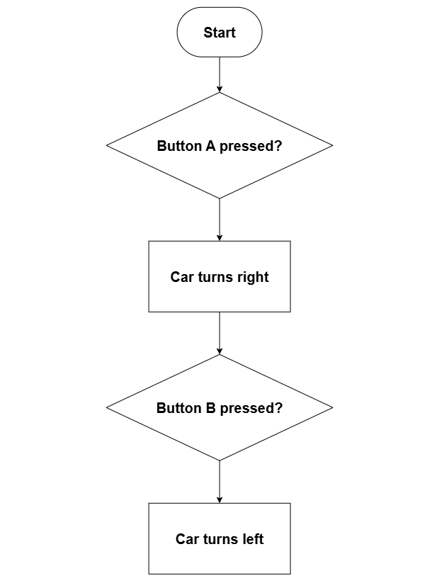

- Complete Program and Analysis

1. Upon startup, the initialization block executes to configure the robot hardware.

2. When button A is pressed, motor 1 rotates forward at `30` and motor 2 rotates in reverse at `-20` with a pause of `1,000 ms`. The robot turns right for 1 second, and the motors stop.

3. When button B is pressed, motor 1 rotates in reverse at `-20` and motor 2 rotates forward at `30` with a pause of `1,000 ms`. The robot turns left for 1 second, and the motors stop.

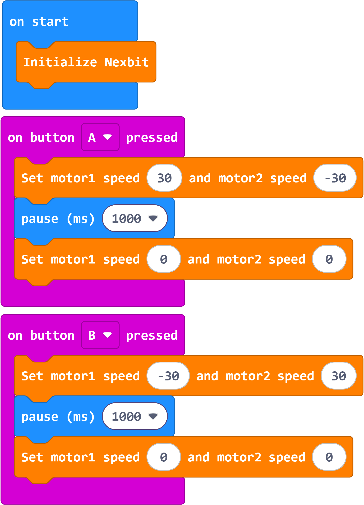

> [!NOTE]
>
> * **Tuning Drift: If the robot veers left, slightly increase motor 1 or decrease motor 2. If the robot veers right, apply the reverse adjustment. Configure motor speeds and durations based on actual conditions.**
>
> * **Parameter Adjustment: Click the number in the white box of the block to enter a value directly, or drag the slider to adjust the speed.**
>
> * **A larger speed differential between the two motors produces a smaller turning radius. Setting one motor forward and the other in reverse allows the robot to pivot in place.**

Program link: [MakeCode Project](https://makecode.microbit.org/_3PzRfwbzu0qL)</br>

The program is also available for direct download via the following interface:

<FeishuForm url="https://makecode.microbit.org/_3PzRfwbzu0qL"/>

- Program Upload


> [!NOTE]
>
> **Power off the robot car before uploading the program to prevent it from running immediately and falling off raised surfaces.**

### 4.3.5 Expansion and Challenge

**Project 1: Adjusting Turning Speed**

Modify motor speed parameters to achieve faster or smoother turns:
1. **Faster Turning**: Increase forward and reverse rotation speed values to `50`. The robot turns significantly faster.
2. **Smoother Turning**: Decrease forward and reverse rotation speed values to `15`. The robot turns gently, facilitating precise directional control.

**Project 2: Pressing Buttons A+B Simultaneously for Straight-Line Driving**

Add an `on button A+B pressed` event block and set equal forward speeds for both motors to drive straight forward when both buttons are pressed:
1. Select the `A+B` option from the drop-down menu in the event block.
2. Set motor 1 and motor 2 to rotate forward at `40`, pausing for `1,000 ms` before stopping.

> [!NOTE]
>
> **Motor speeds for straight driving with A+B require slight calibration to offset speed differences, ensuring the robot travels in a straight line.**

### 4.3.6 Q&A

**Question 1: Why does pressing button A cause motor 1 to rotate forward at `30` and motor 2 in reverse at `-20`, rather than having both rotate forward?**

Answer: Turning right requires the right wheel to rotate slower than the left wheel, or in reverse. Motor 1 drives one side forward while motor 2 drives the other side in reverse. This directional speed difference allows the robot car to turn right with a tight turning radius.

**Question 2: What is the difference between button event blocks and the `on start` block?**

Answer: The `on start` block executes automatically once when the robot powers on, serving as a hardware initialization step. In contrast, the `on button pressed` blocks are event-driven, executing embedded code only when the corresponding button is pressed, and can be triggered repeatedly.

**Question 3: How can the turning angle of the robot car be increased?**

Answer: Two methods achieve larger turning angles: first, increase the speed differential between the two motors, as greater differentials reduce the turning radius. Second, extend the pause duration of the turning action, as longer turning times produce greater angular rotation.

### 4.3.7 Technical Support and Product Discussion

To share creative ideas after experiencing the product, visit the [Hiwonder Forum](https://forum.hiwonder.com/):

<a href="https://forum.hiwonder.com/" target="_blank" rel="noopener noreferrer">


</a>

---

## 4.4 Drawing a Square

### 4.4.1 Lesson Introduction

This lesson introduces drawing a square with the Nexbit AI robot car. The focus is on combining loop blocks with motor control blocks to repeatedly execute a sequence of straight driving and turning actions, guiding the robot along a square trajectory. Mastering loop programming clarifies action sequence repetition logic, establishing a foundation for complex robot path planning.

### 4.4.2 Learning Objectives

1. **Knowledge Objectives**: Understand the purpose of loop blocks. Understand the relationship between the straight driving plus turning action sequence and a square trajectory. Master the correlation between loop counts and geometric polygon sides.

2. **Skill Objectives**: Complete hardware power-on preparation. Master adding extension packages and importing programs in MakeCode. Use loop blocks, modify motor speeds and pause durations, and complete program upload and debugging.

3. **Thinking Objectives**: Understand action decomposition and code reusability in programming. Develop engineering thinking in trajectory planning and parameter calibration.

4. **Application Objectives**: Understand trajectory control principles in wheeled robotics. Learn to use loop structures to execute repetitive motion paths.

### 4.4.3 Preparation

#### (1) Hardware Preparation

- Nexbit AI robot car
- micro:bit board
- Micro USB cable
- Battery
- Computer

> [!NOTE]
>
> **Hardware Installation Note: Verify positive and negative polarity when installing the battery. Reverse connection is strictly prohibited.**

#### (2) Software Preparation

- Access the MakeCode for micro:bit online programming platform:
  - [MakeCode Platform](https://makecode.microbit.org/)
  - Alternatively, copy and open the following link in a browser:

```py
https://makecode.microbit.org/
```

- Create a new project:


### 4.4.4 Hands-on Project

#### (1) Project Analysis

The core project in this lesson guides the Nexbit AI robot car along a square trajectory. The robot uses two drive motors to achieve straight driving and turning. Combining forward motion for 1 second with a right turn for 0.6 seconds forms an action pair. Executing this sequence 4 times using a loop block completes the four edges and four turns of a square. The loop count corresponds to the number of polygon sides, straight driving time determines side length, and turning duration determines the angle.

#### (2) Adding Extensions

1. Click **Extensions**.


2. Copy the following link into the **Extensions** search bar to add **nexbit**.

```py
https://github.com/Hiwonder/Nexbit
```


> [!NOTE]
>
> **Alternative Program Import Method: The sample program file for this lesson can be dragged directly into the MakeCode web interface without manually adding the nexbit extension.**

#### (3) Core Blocks

| Block | Category | Function Description |
| :---: | :---: | :--- |
|  |  | `on start` event block. Executes nested code once upon device power-on or program upload. |
|  |  | `pause (ms)` block. Pauses program execution for a specified duration in milliseconds before continuing. |
|  |  | `Initialize Nexbit` block. Initializes Nexbit expansion board hardware, starting communication ports and the display driver. |
|  |  | Sets the operating speed of both DC motors simultaneously within a range of `-100` to `100`. Positive values indicate forward rotation, negative values indicate reverse rotation, and `0` indicates stop. |
| 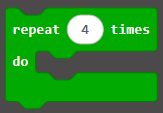 |  | `repeat` loop block. Executes embedded program code repeatedly for a specified number of times. Execution exits the loop upon completion and proceeds with subsequent instructions. |

#### (4) Program Description and Upload

- Program Schematic


- Complete Program and Analysis

1. Upon startup, the initialization block executes to configure the hardware.

2. The program enters a `repeat` loop configured for `4` iterations:
   - Motor 1 rotates forward at `51` and motor 2 rotates forward at `60` with a pause of `1,000 ms`, driving the robot straight for 1 second.
   - Motor 1 rotates forward at `40` and motor 2 rotates in reverse at `-40` with a pause of `600 ms`, turning the robot right for 0.6 seconds.

3. After completing `4` iterations, the robot traverses four edges to form a closed square path.

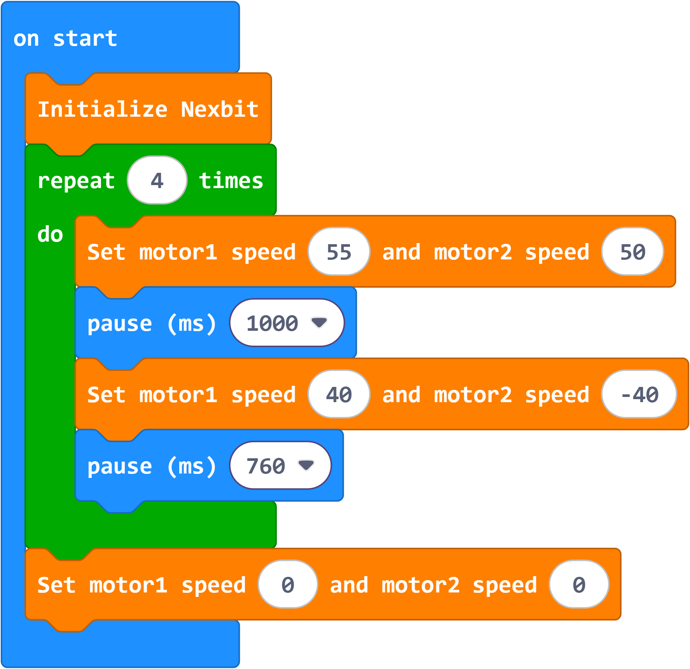

> [!NOTE]
>
> * **Tuning Drift: Motor speeds and duration values require adjustment based on the operational environment. Higher friction may require increased speed or delay. Straight travel requires fine-tuning the speeds of motor 1 and motor 2 to offset mechanical drift.**
>
> * **Parameter Adjustment: Click the number in the white box of the block to enter a value directly, or drag the slider to adjust the speed.**
>
> * **The loop count dictates the number of polygon sides. Four iterations trace a quadrilateral. Modifying the loop count allows drawing shapes with different numbers of sides.**

Program link: [MakeCode Project](https://makecode.microbit.org/_Wab60TbFyfpP)</br>

The program is also available for direct download via the following interface:

<FeishuForm url="https://makecode.microbit.org/_Wab60TbFyfpP"/>

- Program Upload


> [!NOTE]
>
> **Power off the robot car before uploading the program to prevent it from running immediately and falling off raised surfaces.**

### 4.4.5 Expansion and Challenge

**Project 1: Modifying Loop Counts to Draw Multiple Squares**

Modify the count in the `repeat` block to govern how many squares the robot traces:
1. Four loops complete one square by default. To draw two consecutive squares, set the loop count to `8`.
2. Total iterations = number of squares × `4`. Set any desired count based on requirements.

**Project 2: Adjusting Square Size**

Modify straight driving and turning durations to change the side length and angle of the square:
1. **Enlarging the Square**: Increase the straight driving delay from `1,000 ms` to `1,500 ms`. The side length increases, expanding the overall shape.
2. **Reducing the Square**: Decrease the straight driving delay from `1,000 ms` to `600 ms`. The side length decreases, shrinking the overall shape.

> [!NOTE]
>
> **Turning duration determines the angle. In this lesson, approximately 0.76 seconds produces a 90-degree right angle. Adjust turning duration to trace rhombuses or trapezoids.**

### 4.4.6 Q&A

**Question 1: Why does drawing a square require 4 loops instead of 1?**

Answer: A square consists of four edges and four corners. Each iteration completes one straight edge and one turn. Executing 4 iterations completes all four edges and corners, forming a closed square. Loops eliminate the need to write identical code four times, keeping the program concise.

**Question 2: What causes the robot car to trace a trapezoid rather than a square?**

Answer: Variations in straight travel distance between sides or inaccurate turning angles cause this distortion. Check whether motor speeds remain consistent, straight delays are identical, and turning delays are properly calibrated. Uneven floor friction also causes travel variations, requiring fine parameter adjustments.

**Question 3: Can the count in a `repeat` block be set to 0 or negative numbers?**

Answer: Setting the loop count to `0` prevents the code within the loop from executing, and the robot remains stationary. Negative values are typically treated as `0` and do not execute. Tracing a square requires at least `4` iterations to complete the full polygon.

### 4.4.7 Technical Support and Product Discussion

To share creative ideas after experiencing the product, visit the [Hiwonder Forum](https://forum.hiwonder.com/):

<a href="https://forum.hiwonder.com/" target="_blank" rel="noopener noreferrer">


</a>

---

## 4.5 Smart Line Following

### 4.5.1 Lesson Introduction

This lesson introduces the line-following sensor on the Nexbit AI robot car, divided into two subprojects: 2-channel line following and 4-channel line following. By detecting a black line track on the ground, the robot car automatically navigates along the line. This lesson covers line detection logic, sensor calibration procedures, and line-following debugging techniques, establishing a foundation for track competition challenges.

### 4.5.2 Learning Objectives

1. **Knowledge Objectives**: Identify the hardware layout of the line-following sensor. Understand how surface color and contrast affect sensor detection states. Master the decision-making logic for 2-channel and 4-channel line following. Explore the principles behind sensor calibration.

2. **Skill Objectives**: Power on and prepare the hardware. Add extension packages and import project files in MakeCode. Calibrate each line-following sensor probe accurately. Adjust motor speed parameters to upload programs and debug line-following performance.

3. **Thinking Objectives**: Understand the line-following control logic of reading sensor states, evaluating conditions, and adjusting motor differential speeds. Develop engineering thinking and troubleshooting skills through iterative parameter tuning on practical tracks.

4. **Application Objectives**: Master design and implementation concepts for line-following robots. Recognize practical applications of line-following technology in robotics competitions and automated guided vehicles, also known as AGVs.

### 4.5.3 Preparation

#### (1) Hardware Preparation

- Nexbit AI robot car equipped with a 4-channel line follower sensor
- micro:bit board
- Micro USB cable
- Battery
- Computer

> [!NOTE]
>
> **Hardware Installation Note: Observe polarity when installing the battery. Reverse connection is strictly prohibited. The line follower sensor is integrated on the underside of the chassis, requiring no additional wiring. Sensor sensitivity calibration must be completed before use. Otherwise, line following may fail.**

#### (2) Software Preparation

- Access the MakeCode for micro:bit online programming platform:
  - [MakeCode Platform](https://makecode.microbit.org/)
  - Alternatively, copy and open the following link in a browser:

```py
https://makecode.microbit.org/
```

- Create a new project:


#### (3) Sensor Calibration Procedure

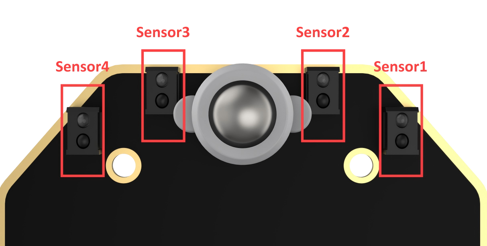

1. Position the sensor probe requiring calibration directly above the black track line.

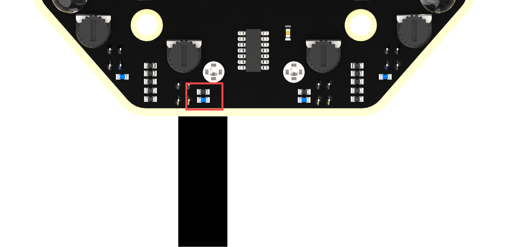

2. Rotate the sensor potentiometer knob until the onboard LED indicator turns off.

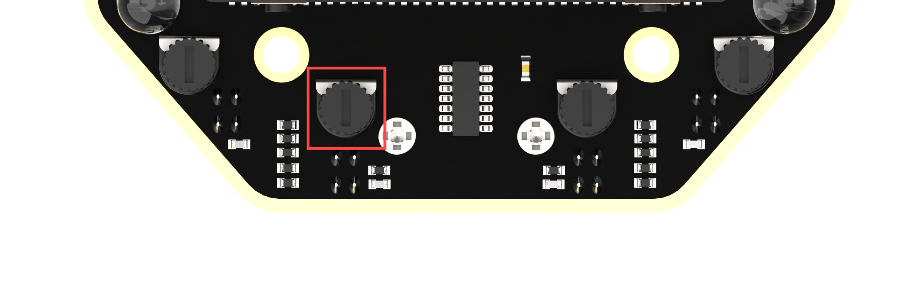

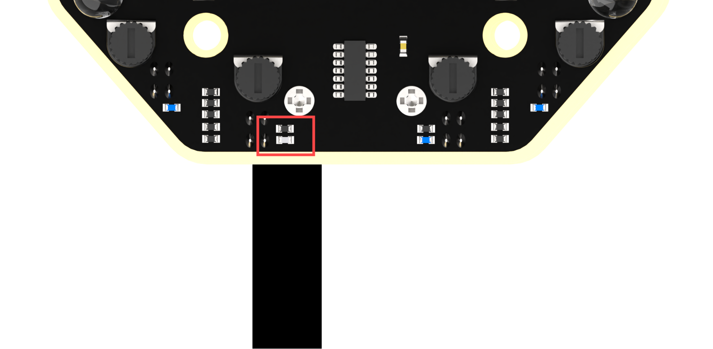

3. Move the probe over a light-colored surface. The LED indicator illuminates, confirming calibration for this sensor probe is complete.

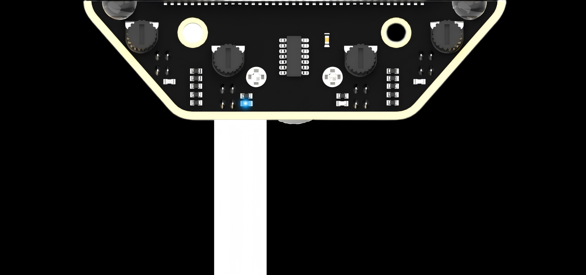

> [!NOTE]
>
> **Experimental Environment: Prepare a flat, light-colored surface with a black line laid out as the track. Ensure the sensor probes point directly at the ground with no obstructions.**

### 4.5.4 Hands-on Project

#### Project 1: 2-Channel Line Following

##### (1) Project Analysis

The core project in this section controls the Nexbit AI robot car to perform 2-channel line following. The robot is powered by two drive motors. Setting the speeds of motor 1 and motor 2 within a range of -100 to 100 regulates the robot car's motion. Probe 2 and probe 3 on the underside detect the black track. When deviation is detected, the robot adjusts motor speeds on both sides to correct heading. When both probes detect the black line simultaneously, the robot car maintains straight forward motion. Motor speeds must be fine-tuned based on track conditions to optimize line-following performance.

##### (2) Adding Extensions

1. Click **Extensions**.


2. Copy the following link into the **Extensions** search bar to add **nexbit**.

```py
https://github.com/Hiwonder/Nexbit
```


> [!NOTE]
>
> **Alternative Program Import Method: The sample program file for this lesson can be dragged directly into the MakeCode web interface without manually adding the nexbit extension.**

##### (3) Core Blocks

| Block | Category | Function Description |
| :---: | :---: | :--- |
|  |  | `on start` event block. Executes nested code once upon device power-on or program upload. |
| 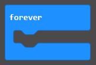 |  | `forever` loop block. Continuously repeats execution of nested code after power-on. |
|  |  | `pause (ms)` block. Pauses program execution for a specified duration in milliseconds before continuing. |
|  |  | `Initialize Nexbit` block. Initializes Nexbit expansion board hardware, starting communication ports and the display driver. |
|  |  | Sets the operating speed of both DC motors simultaneously within a range of `-100` to `100`. Positive values indicate forward rotation, negative values indicate reverse rotation, and `0` indicates stop. |
|  |  | Detects whether the specified line follower probe identifies a black line. Returns `true` when the condition is met, and `false` otherwise. |

> [!NOTE]
>
> * **Adjusting motor speeds alters the baseline speed for line following. Excessive speed may cause the robot car to derail from the black line.**
>
> * **Modifying conditional logic alters the correction intensity during turns.**

##### (4) Program Description and Upload

- Program Schematic

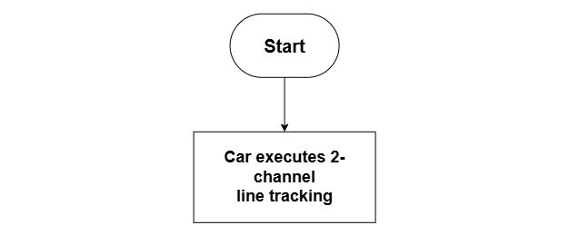

- Complete Program and Analysis

1. Upon power-on, the `Initialize Nexbit` block executes to configure the hardware, followed by a brief pause to allow sensor stabilization.

2. The program enters a continuous `forever` loop, repeatedly reading detection states from probe 2 and probe 3.

3. Conditional branching logic:
   - Probe 2 detects a white surface while probe 3 detects the black line: the black line is offset to the right, and the robot car veers right to recenter.
   - Probe 2 detects the black line while probe 3 detects a white surface: the black line is offset to the left, and the robot car veers left to recenter.
   - In all other cases where both sensors share identical states, both motors drive forward at configured speeds, keeping the robot straight.

4. The loop continuously samples sensor data to dynamically correct the trajectory.

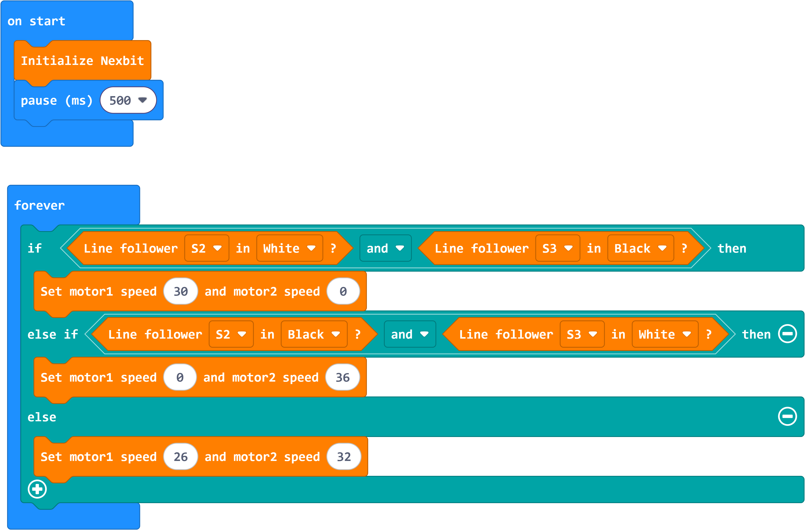

> [!NOTE]
>
> * **Troubleshooting Poor Line Following: Verify sensor calibration, check for ambient light interference, and inspect whether the black track is worn or faded.**
>
> * **Sensor Calibration Note: Strong ambient lighting interferes with infrared detection. Avoid direct sunlight or strong spotlights on the track surface.**
>
> * **Parameter Calibration: Ground friction impacts straight driving. Higher friction may require higher motor speeds. Longer pause durations result in greater travel distances at equivalent speeds. Configure motor speed and duration based on actual conditions. If the robot veers left, increase the value of motor 1 slightly or decrease motor 2. If the robot veers right, apply the reverse adjustment.**

Program link: [MakeCode Project](https://makecode.microbit.org/_FgRXEHEw5EY9)</br>

The program is also available for direct download via the following interface:

<FeishuForm url="https://makecode.microbit.org/_FgRXEHEw5EY9"/>

- Program Upload


> [!NOTE]
>
> **Power off the robot car before uploading the program to prevent it from running immediately and falling off raised surfaces.**

#### Project 2: 4-Channel Line Following

##### (1) Project Analysis

The core project in this section guides the Nexbit AI robot car through 4-channel line following. The robot is driven by two motors with configurable speed values ranging from -100 to 100. All four underside probes, numbered 1, 2, 3, and 4, are enabled simultaneously. Compared to 2-channel line following, 4-channel detection identifies larger deviations and accommodates sharp turns. By evaluating the states of all four probes, the program differentiates between minor and severe deviations to apply proportional directional corrections. When center probes 2 and 3 detect the black line, the robot drives straight forward. Motor speeds must be fine-tuned based on track conditions to optimize performance.

##### (2) Adding Extensions

1. Click **Extensions**.


2. Copy the following link into the **Extensions** search bar to add **nexbit**.

```py
https://github.com/Hiwonder/Nexbit
```


> [!NOTE]
>
> **Alternative Program Import Method: The sample program file for this lesson can be dragged directly into the MakeCode web interface without manually adding the nexbit extension.**

##### (3) Core Blocks

| Block | Category | Function Description |
| :---: | :---: | :--- |
|  |  | `on start` event block. Executes nested code once upon device power-on or program upload. |
|  |  | `forever` loop block. Continuously repeats execution of nested code after power-on. |
|  |  | `pause (ms)` block. Pauses program execution for a specified duration in milliseconds before continuing. |
|  |  | `Initialize Nexbit` block. Initializes Nexbit expansion board hardware, starting communication ports and the display driver. |
|  |  | Sets the operating speed of both DC motors simultaneously within a range of `-100` to `100`. Positive values indicate forward rotation, negative values indicate reverse rotation, and `0` indicates stop. |
|  |  | Detects whether the specified line follower probe identifies a black line. Returns `true` when the condition is met, and `false` otherwise. |

##### (4) Program Description and Upload

- Program Schematic

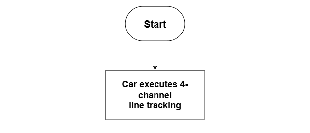

- Complete Program and Analysis

1. Upon power-on, the `Initialize Nexbit` block executes, followed by a pause to allow sensor stabilization.

2. The program enters a continuous `forever` loop, reading the states of all four line follower probes to execute branching decisions based on detected black line positions:
   - Probe 2 detects a white surface and probe 3 detects the black line: the line is slightly offset to the right, and the robot steers slightly right to recenter.
   - Probe 2 detects the black line and probe 3 detects a white surface: the line is slightly offset to the left, and the robot steers left slightly to recenter.
   - Probe 1 detects a white surface and probe 4 detects the black line: the line has significantly deviated to the right, and the robot turns right sharply to recenter.
   - Probe 1 detects the black line and probe 4 detects a white surface: the line has significantly deviated to the left, and the robot turns left sharply to recenter.
   - In all other cases, both motors rotate forward at set speeds to drive straight.

3. The loop continuously samples sensors and dynamically corrects steering.

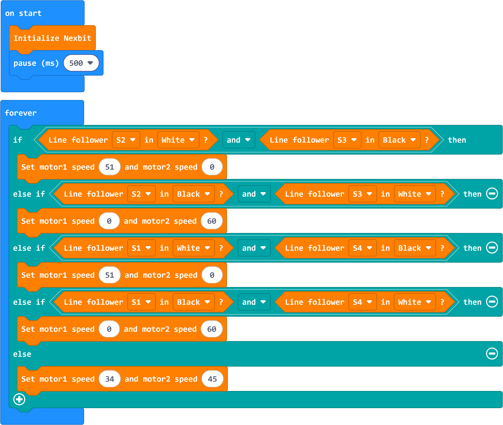

> [!NOTE]
>
> * **Differentiate between minor and major deviations by setting two distinct motor speed differentials. Larger differentials provide sharper steering for tight turns.**
>
> * **Keep overall baseline speed moderate, as excessive velocity causes the robot car to overshoot sharp curves.**
>
> * **All four sensors must be calibrated individually. If any probe remains uncalibrated, line following will malfunction.**
>
> * **Ground friction affects straight travel. Adjust motor speeds and delay parameters based on practical floor conditions. If the robot drifts left, slightly increase motor 1 or decrease motor 2. If it drifts right, apply the reverse adjustment.**

Program link: [MakeCode Project](https://makecode.microbit.org/_AexhMo7Kc40d)</br>

The program is also available for direct download via the following interface:

<FeishuForm url="https://makecode.microbit.org/_AexhMo7Kc40d"/>

- Program Upload


> [!NOTE]
>
> **Power off the robot car before uploading the program to prevent it from running immediately and falling off raised surfaces.**

### 4.5.5 Expansion and Challenge

**Project 1: Line Following Speed Optimization**

Modify motor parameters:
1. Increase motor speed during straight-line travel to accelerate line-following progress.
2. Reduce motor speed during corrective turns to enhance cornering stability, preventing the robot from overshooting the black line.

**Project 2: Stop at Finish Line**

Place a wide black crossline at the track termination. When all four sensor probes detect the black line simultaneously, trigger a stop command for both motors to achieve automatic stopping at the finish line.

### 4.5.6 Q&A

**Question 1: If the robot car frequently derails from the black line during line following, what should be inspected first?**

Answer: First, verify that all line follower sensor probes are properly calibrated. Second, reduce the driving speed of the robot car. Third, inspect the track to ensure the black line is not faded or abraded. Finally, avoid direct sunlight or bright spotlight reflections on the floor.

**Question 2: What is the difference between 2-channel line following and 4-channel line following?**

Answer: 2-channel line following utilizes only the two inner sensors, making it suitable for gentle curves. 4-channel line following uses all four sensors to detect larger deviations and handle sharp turns with wider corrective actions.

**Question 3: What indicates successful sensor calibration?**

Answer: When the sensor probe is placed directly above the black line, the onboard LED turns off. When moved over a light-colored surface, the onboard LED turns on.

### 4.5.7 Technical Support and Product Discussion

To share creative ideas after experiencing the product, visit the [Hiwonder Forum](https://forum.hiwonder.com/):

<a href="https://forum.hiwonder.com/" target="_blank" rel="noopener noreferrer">


</a>

## 4.6 Cliff Avoidance

### 4.6.1 Lesson Introduction

This lesson introduces the cliff avoidance feature of the Nexbit AI robot car. The focus is on using and calibrating the sensitivity of the 4-channel line follower sensor, reading sensor detection states through programming, and simulating cliff detection scenarios. Upon detecting a black line that represents a cliff edge, the robot car executes reverse and turning actions to avoid danger, establishing a foundation for subsequent line following and obstacle avoidance projects.

### 4.6.2 Learning Objectives

1. **Knowledge Objectives**: Understand the hardware structure and detection logic of the 4-channel line follower sensor. Understand detection differences across black and white surface colors. Master the significance of sensor sensitivity calibration.

2. **Skill Objectives**: Complete hardware power-on preparation and sensitivity adjustment for the line follower sensor. Master adding extension packages and importing programs in MakeCode. Modify motor, delay, and sensor parameters, and complete program upload and debugging.

3. **Thinking Objectives**: Understand the logical relationship between sensor detection states and robot motion. Learn to implement conditional branching based on sensor feedback. Cultivate engineering thinking in parameter calibration and troubleshooting.

4. **Application Objectives**: Master robot edge detection and hazard avoidance principles. Understand practical applications of ground detection sensors in smart robot cars.

### 4.6.3 Preparation

#### (1) Hardware Preparation

- Nexbit AI robot car
- micro:bit board
- Micro USB cable
- Battery
- Computer

> [!NOTE]
>
> **Hardware Installation Note: Verify positive and negative polarity when installing the battery. Reverse connection is strictly prohibited. The line follower sensor is mounted directly on the underside of the robot chassis, requiring no additional wiring. Calibrate sensor sensitivity before operation. Otherwise, line following can easily fail.**

#### (2) Software Preparation

- Access the MakeCode for micro:bit online programming platform:
  - [MakeCode Platform](https://makecode.microbit.org/)
  - Alternatively, copy and open the following link in a browser:

```py
https://makecode.microbit.org/
```

- Create a new project:


#### (3) Sensor Calibration Procedure


1. Position the sensor probe requiring calibration directly above the black track line.


2. Rotate the sensor potentiometer knob until the onboard LED indicator turns off.


3. Move the probe over a light-colored surface. The LED indicator illuminates, confirming calibration for this sensor probe is complete.


> [!NOTE]
>
> **Experimental Environment: Prepare a flat, light-colored surface with a closed black line simulating a cliff boundary. Complete sensitivity calibration for all four sensor probes individually before operation.**

### 4.6.4 Hands-on Project

#### (1) Project Analysis

The core project in this lesson involves the robot car driving forward continuously while using the underside 4-channel line follower sensor to detect black lines that simulate cliffs. Detecting a black line signals a cliff edge, prompting the robot car to reverse, turn to avoid the hazard, and then resume driving forward.

Line follower sensor operating principle: The infrared emitter projects infrared light. Light-colored surfaces reflect infrared light, whereas black surfaces absorb infrared light. The module distinguishes between white and black lines based on whether reflected infrared light is detected.

#### (2) Adding Extensions

1. Click **Extensions**.


2. Copy the following link into the **Extensions** search bar to add **nexbit**.

```py
https://github.com/Hiwonder/Nexbit
```


> [!NOTE]
>
> **Alternative Program Import Method: The sample program file for this lesson can be dragged directly into the MakeCode web interface without manually adding the nexbit extension.**

#### (3) Core Blocks

|                            Block                             |                           Category                           | Function Description                                         |
| :----------------------------------------------------------: | :----------------------------------------------------------: | :----------------------------------------------------------- |
|  |  | On start event block. Executes nested code once upon device power-on or program upload. |
|  |  | Forever loop block. Continuously repeats nested code after power-on. |
|  |  | Pauses program execution for a specified duration in milliseconds before continuing. |
|  |  | Initializes Nexbit expansion board hardware, starting communication ports and the display driver. |
|  |  | Sets the operating speed of both DC motors simultaneously within a range of -100 to 100. Positive values indicate forward rotation, negative values indicate reverse rotation, and 0 indicates stop. |
|  |  | Detects whether the designated line follower sensor detects a black line. Returns true if the condition is met. Otherwise, returns false. |

#### (4) Program Description and Upload

- Program Schematic

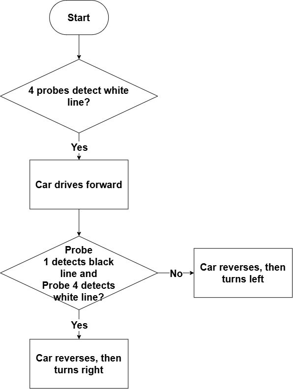

- Complete Program and Analysis

1. Upon startup, the initialization block executes to configure the robot hardware and sensors.

2. The program enters a forever loop to continuously read the detection status of the 4-channel line follower sensor. When all sensors detect a white surface, no cliff is present, and the robot car continues driving forward. When sensor 1 detects a black line, indicating a cliff ahead on the left, motor speeds are set to negative values to reverse for 500 ms, followed by a right turn to steer clear of the cliff. When sensor 4 detects a black line, indicating a cliff ahead on the right, motor speeds are set to negative values to reverse for 500 ms, followed by a left turn to avoid the cliff.

3. This sequence repeats continuously to monitor ground conditions.

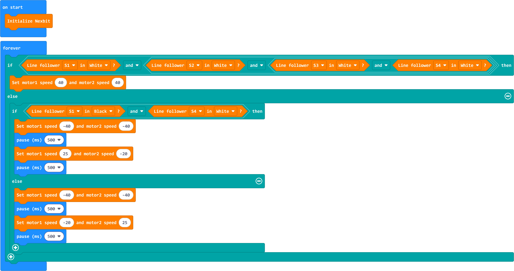

> [!NOTE]
>
> * **Parameter Adjustment: Click the number in the white box of the block to enter a value directly, or drag the slider to adjust speed and delay values.**
>
> * **Ground friction affects straight-line driving. Higher friction may require an appropriate increase in motor speed. Longer pause durations result in longer driving distances at equivalent speeds. Motor speed and timing must be configured based on actual conditions. If the robot car veers left, slightly increase motor 1 or decrease motor 2. If the robot car veers right, apply the reverse adjustment.**
>
> * **Sensor Calibration Note: If detection is inaccurate, recalibrate the sensitivity of all four line follower sensor probes. Ground color directly affects detection, so a light-colored surface with black lines is recommended.**

Program link: [MakeCode Project](https://makecode.microbit.org/_RfyT1XR2C25w)</br>

The program is also available for direct download via the following interface:

<FeishuForm url="https://makecode.microbit.org/_RfyT1XR2C25w"/>

- Program Upload


> [!NOTE]
>
> **Power off the robot car before uploading the program to prevent the robot car from running immediately and falling.**

### 4.6.5 Expansion and Challenge

**Project 1: Adjusting Hazard Avoidance Speed**

Modify motor speed parameters to adjust the speed of reversing and turning actions:

1. **Accelerated Avoidance**: Set reverse and turning motor speeds to 75. Observe the reaction speed of the avoidance action.
2. **Decelerated Avoidance**: Set reverse and turning motor speeds to 30. Observe the reaction speed of the avoidance action.

> [!NOTE]
>
> **Excessive speeds can cause the robot car to overshoot the boundary, whereas insufficient speeds can delay avoidance actions. Tune values based on the specific testing environment.**

**Project 2: Adjusting Hazard Avoidance Duration**

Modify the pause parameters corresponding to reverse and turning actions:

1. Increase the pause duration. The robot car reverses farther and executes a larger turning angle.
2. Decrease the pause duration. The robot car reverses a shorter distance and executes a smaller turning angle.
   Identify the optimal delay values to ensure the robot car avoids overshooting the boundary while returning quickly to the safe area.

### 4.6.6 Q&A

**Question 1: What should be checked first if the robot car exhibits poor cliff detection, triggering false alarms or failing to detect black lines?**

Answer: First, verify whether all four line follower sensor probes have completed sensitivity calibration. Second, confirm that the surface is light-colored and avoid dark-colored surfaces. Finally, check that no debris or obstacles obstruct the sensor probes.

**Question 2: What is the operating principle behind detecting black and white lines using the line follower sensor?**

Answer: The infrared emitter of the sensor emits infrared light. A white surface reflects this infrared light, allowing the receiver to detect the signal and determine a white surface. A black surface absorbs the infrared light, so the receiver does not detect reflected light, identifying a black line.

**Question 3: Why must the program execute inside a forever loop?**

Answer: The robot car must continuously monitor ground states during motion. The forever loop repeatedly executes detection and conditional logic, ensuring ongoing cliff avoidance.

### 4.6.7 Technical Support and Product Discussion

To share creative ideas after experiencing the product, visit the [Hiwonder Forum](https://forum.hiwonder.com/):

<a href="https://forum.hiwonder.com/" target="_blank" rel="noopener noreferrer">


</a>

---

## 4.7 Ultrasonic Distance Measurement & Display

### 4.7.1 Lesson Introduction

This lesson introduces ultrasonic distance measurement with the Nexbit AI robot car. The focus is on connecting the ultrasonic sensor, reading distance data, displaying obstacle distance on the micro:bit LED matrix, and controlling the onboard RGB lights of the ultrasonic module. This experiment illustrates the data acquisition workflow of distance sensors, establishing a programming foundation for subsequent obstacle avoidance projects. The demonstration is based on the top-down assembly configuration and applies equally to other robot configurations.

### 4.7.2 Learning Objectives

1. **Knowledge Objectives**: Understand the hardware interface and functions of the glowy ultrasonic sensor. Understand the fundamental logic of distance measurement. Learn RGB brightness adjustment rules and become familiar with the micro:bit LED matrix display.

2. **Skill Objectives**: Complete I2C wiring for the ultrasonic sensor and install the battery properly. Master adding extension packages and importing programs in MakeCode. Modify lighting, math calculation, and delay parameters, and complete program upload and debugging.

3. **Thinking Objectives**: Understand the complete logic of raw data acquisition, unit conversion, and screen output. Learn to round sensor values and develop engineering thinking in parameter calibration and troubleshooting.

4. **Application Objectives**: Master distance detection principles in robotics. Understand practical applications of ranging sensors and RGB lights in smart robot car obstacle avoidance scenarios.

### 4.7.3 Preparation

#### (1) Hardware Preparation

- Nexbit AI robot car
- micro:bit board
- Glowy ultrasonic sensor
- Micro USB cable
- Battery
- Computer

> [!NOTE]
>
> **Hardware Installation Note: The ultrasonic sensor connects to any I2C port on the robot car. This tutorial uses the port on the right side of the lower board as an example, as detailed in [2.1 Assembly and Wiring](./2.%20Nexbit%20Assembly%20and%20Charging%20Instructions.md#section-2-1-2). Verify positive and negative polarity when installing the battery. Reverse connection is strictly prohibited. Ensure the micro:bit LED matrix remains unobstructed.**

#### (2) Software Preparation

- Access the MakeCode for micro:bit online programming platform:
  - [MakeCode Platform](https://makecode.microbit.org/)
  - Alternatively, copy and open the following link in a browser:

```py
https://makecode.microbit.org/
```

- Create a new project:


### 4.7.4 Hands-on Project

#### (1) Project Analysis

The core project in this section controls the Nexbit AI robot car to measure ultrasonic distance and display readings on the LED matrix. After completing initialization upon power-on, the robot car illuminates the RGB lights on the ultrasonic module. Inside a forever loop, the program reads the distance to obstacles ahead. Raw measurements in millimeters are divided and rounded to centimeters, and the resulting distance values are output to the micro:bit LED matrix. The ultrasonic module calculates distance based on the round-trip time of ultrasonic signals. The onboard RGB lights can be configured for custom lighting effects. In conjunction with pause blocks, the sampling refresh interval is regulated to provide readable data, allowing adjustments to lighting effects and refresh intervals according to practical needs.

#### (2) Adding Extensions

1. Click **Extensions**.


2. Copy the following link into the **Extensions** search bar to add **nexbit**.

```py
https://github.com/Hiwonder/Nexbit
```


> [!NOTE]
>
> **Alternative Program Import Method: The sample program file for this lesson can be dragged directly into the MakeCode web interface without manually adding the nexbit extension.**

#### (3) Core Blocks

|                            Block                             |                           Category                           | Function Description                                         |
| :----------------------------------------------------------: | :----------------------------------------------------------: | :----------------------------------------------------------- |
|  |  | On start event block. Executes nested code once upon device power-on or program upload. |
|  |  | Forever loop block. Continuously repeats nested code after power-on. |
|  |  | Pauses program execution for a specified duration in milliseconds before continuing. |
| 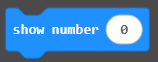 |  | Displays a designated number on the LED matrix screen.       |
|  |  | Initializes Nexbit expansion board hardware, starting communication ports and the display driver. |
|  |  | Configures the lighting mode, LED selection, and RGB values for the ultrasonic sensor, updating colors immediately upon execution. |
|  |  | Reads the obstacle distance detected by the ultrasonic sensor in millimeters. |
| 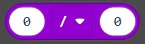 |  | Performs division operations and outputs the quotient.       |
|  |  | Rounds decimal inputs to integers, supporting standard rounding, ceiling, and floor modes. |

#### (4) Program Description and Upload

- Program Schematic

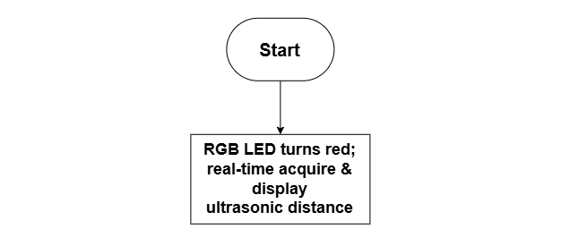

- Complete Program and Analysis

1. Upon startup, the initialization block executes to configure the robot hardware and the ultrasonic sensor. The ultrasonic RGB lights are set to red to indicate successful startup.

2. The program enters a forever loop: Reads raw distance data from the ultrasonic sensor in millimeters. Divides the millimeter value by 10 and rounds the quotient to obtain distance in centimeters. Outputs the converted distance value to the micro:bit LED matrix. Pauses for 100 ms before repeating the measurement loop to refresh readings continuously.

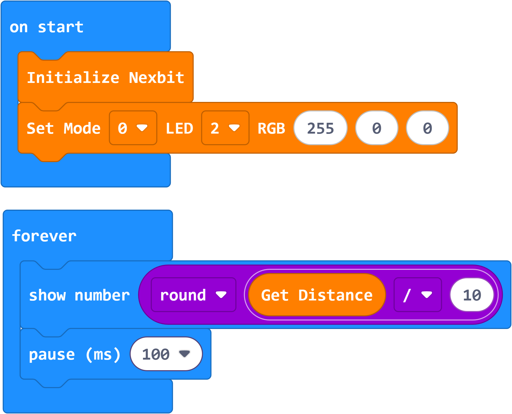

> [!NOTE]
>
> * **Parameter Adjustment: Click the number in the white box of the block to enter a value directly, or drag the slider. The RGB parameters range from 0 to 255, where larger values produce higher brightness.**
>
> * **The pause duration determines how quickly distance values refresh. Shorter durations produce faster screen updates, but excessively short delays can cause unstable sensor readings.**
>
> * **Sensor Notes: Keep obstacles from pressing directly against the ultrasonic probes, as extreme proximity causes inaccurate readings. Select flat objects as obstacles to ensure stable measurement.**

Program link: [MakeCode Project](https://makecode.microbit.org/_5PEEMU0Wdf97)</br>

The program is also available for direct download via the following interface:

<FeishuForm url="https://makecode.microbit.org/_5PEEMU0Wdf97"/>

- Program Upload


> [!NOTE]
>
> **Power off the robot car before uploading the program to prevent the robot car from running immediately and falling.**

### 4.7.5 Expansion and Challenge

**Project 1: Changing Ultrasonic RGB Colors**

Modify RGB parameters in the set LED block to alter the ultrasonic module lighting:

1. Set RGB values to `(0, 255, 0)` and observe the lights change to green.
2. Experiment with modifying the three values to create different colors, such as blue, yellow, and purple.

> [!NOTE]
>
> **Parameters for R, G, and B range from 0 to 255. Each value indicates brightness for that channel, with larger numbers producing higher brightness.**

**Project 2: Adjusting Sensor Sampling Rate**

Modify the pause duration inside the forever loop:

1. Adjust the delay to 50 ms and observe how the distance display refreshes on the LED matrix.
2. Adjust the delay to 300 ms and compare the refresh rate. Identify an optimal delay value that balances smoothness and stability.

### 4.7.6 Q&A

**Question 1: What is the unit of the raw distance data read by the ultrasonic sensor, and how is it converted to centimeters?**

Answer: The raw data read by the sensor is in millimeters. Dividing the measurement by 10 and rounding the result yields the distance in centimeters.

**Question 2: What do the three numbers R, G, and B represent when configuring ultrasonic RGB lights?**

Answer: The three numbers represent the brightness levels of red, green, and blue, ranging from 0 to 255. Higher numbers indicate greater brightness. Combining different values produces a wide spectrum of colors.

**Question 3: Why must the distance measurement code execute inside a forever loop?**

Answer: The robot car must monitor changes in obstacles ahead continuously. The forever loop calls the ultrasonic sensor repeatedly, refreshing obstacle distances so that the LED matrix updates readings dynamically.

### 4.7.7 Technical Support and Product Discussion

To share creative ideas after experiencing the product, visit the [Hiwonder Forum](https://forum.hiwonder.com/):

<a href="https://forum.hiwonder.com/" target="_blank" rel="noopener noreferrer">


</a>

---

## 4.8 Ultrasonic Obstacle Avoidance

### 4.8.1 Lesson Introduction

This lesson introduces ultrasonic obstacle avoidance with the Nexbit AI robot car. By combining the ultrasonic sensor, variables, conditional statements, and motor control, the robot car autonomously detects obstacles ahead and executes avoidance actions. The lesson also continues practicing control of the ultrasonic module RGB lights, switching colors based on operating states. The demonstration is based on the top-down assembly configuration and applies equally to other robot configurations.

### 4.8.2 Learning Objectives

1. **Knowledge Objectives**: Understand the operating logic of ultrasonic obstacle avoidance. Understand the purpose, creation, and usage of variables. Understand the role of conditional statements in robot decision-making. Learn RGB color brightness adjustment rules.

2. **Skill Objectives**: Complete I2C wiring for the ultrasonic sensor and install the battery properly. Master adding extension packages and importing programs in MakeCode. Create variables, modify threshold values, motor speeds, and lighting parameters, and complete program upload and debugging.

3. **Thinking Objectives**: Understand the complete intelligent avoidance workflow of distance sampling, variable storage, conditional branching, and action execution. Learn to configure detection thresholds based on sensor readings, developing engineering thinking in parameter calibration and troubleshooting.

4. **Application Objectives**: Master autonomous obstacle avoidance principles in robotics. Understand the coordination among sensors, logic processing, and actuator motors, and learn practical applications of obstacle avoidance in mobile robots.

### 4.8.3 Preparation

#### (1) Hardware Preparation

- Nexbit AI robot car
- micro:bit board
- Glowy ultrasonic sensor
- Micro USB cable
- Battery
- Computer

> [!NOTE]
>
> **Hardware Installation Note: The ultrasonic sensor connects to any I2C port on the robot car. This tutorial uses the port on the right side of the lower board as an example, as detailed in [2.1 Assembly and Wiring](./2.%20Nexbit%20Assembly%20and%20Charging%20Instructions.md#section-2-1-2). Verify positive and negative polarity when installing the battery. Reverse connection is strictly prohibited. Ensure the micro:bit LED matrix remains unobstructed.**

#### (2) Software Preparation

- Access the MakeCode for micro:bit online programming platform:
  - [MakeCode Platform](https://makecode.microbit.org/)
  - Alternatively, copy and open the following link in a browser:

```py
https://makecode.microbit.org/
```

- Create a new project:


### 4.8.4 Hands-on Project

#### (1) Project Analysis

The core project in this section controls the Nexbit AI robot car to perform intelligent ultrasonic obstacle avoidance. Inside a forever loop, the robot car continuously measures obstacle distance and stores it in the `distance` variable. Conditional logic evaluates this variable to trigger appropriate behaviors. When the distance exceeds 200 mm, the path ahead is clear. The ultrasonic module turns blue, and the robot car drives forward. When the distance is between 0 and 200 mm, an obstacle is detected. The module turns red, the robot car stops, and it turns right in place by a set angle. The micro:bit LED matrix displays the distance value simultaneously. Sensor readings stored in variables enable branching logic, while pause blocks govern stop and turning durations. Threshold values and turning durations can be adjusted as needed during testing.

#### (2) Adding Extensions

1. Click **Extensions**.


2. Copy the following link into the **Extensions** search bar to add **nexbit**.

```py
https://github.com/Hiwonder/Nexbit
```


> [!NOTE]
>
> **Alternative Program Import Method: The sample program file for this lesson can be dragged directly into the MakeCode web interface without manually adding the nexbit extension.**

#### (3) Core Blocks

|                            Block                             |                           Category                           | Function Description                                         |
| :----------------------------------------------------------: | :----------------------------------------------------------: | :----------------------------------------------------------- |
|  |  | On start event block. Executes nested code once upon device power-on or program upload. |
|  |  | Forever loop block. Continuously repeats nested code after power-on. |
|  |  | Pauses program execution for a specified duration in milliseconds before continuing. |
|  |  | Displays a designated number on the LED matrix screen.       |
|  |  | Reads and returns the value stored in a variable.            |
|  |  | Assigns a specified value to a designated variable.          |
|  |  | Initializes Nexbit expansion board hardware, starting communication ports and the display driver. |
|  |  | Configures the lighting mode, LED selection, and RGB values for the ultrasonic sensor, updating colors immediately upon execution. |
|  |  | Sets the operating speed of both DC motors simultaneously within a range of -100 to 100. Positive values indicate forward rotation, negative values indicate reverse rotation, and 0 indicates stop. |

#### (4) Program Description and Upload

- Program Schematic

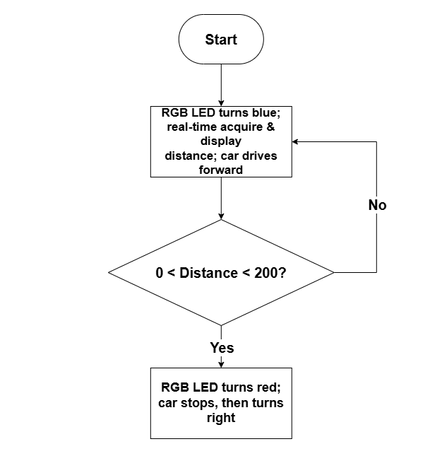

- Complete Program and Analysis

1. Upon startup, the initialization block executes to configure the robot hardware and the ultrasonic sensor.

2. Inside a forever loop, the distance read by the ultrasonic sensor is assigned to the `distance` variable. The LED matrix displays the value of the `distance` variable simultaneously.

3. Conditional logic evaluates the state: If the `distance` is greater than 0 and less than 200 mm, an obstacle is detected ahead. The ultrasonic RGB lights turn red, the robot car stops, and after a brief pause, the robot car executes a right turn. Otherwise, no obstacle is present ahead. The ultrasonic RGB lights turn blue, and the robot car continues driving forward.

4. This sequence repeats continuously to detect obstacles ahead and maintain autonomous obstacle avoidance.

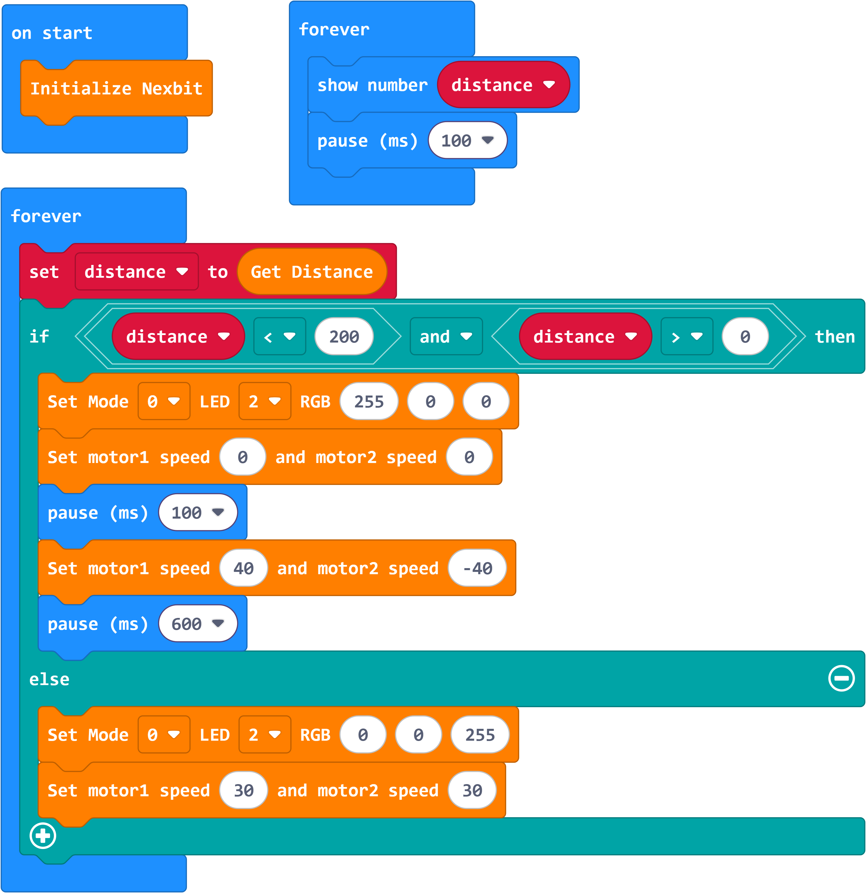

> [!NOTE]
>
> * **Parameter Adjustment: Click the number in the white box of the block to enter a value directly, or drag the slider. The RGB parameters range from 0 to 255, where larger values produce higher brightness. Modifying pause durations adjusts the length of stop and turning actions.**
>
> * **Ground friction affects straight-line driving. Higher friction may require an appropriate increase in motor speed. Longer pause durations result in longer driving distances at equivalent speeds. Motor speed and timing must be configured based on actual conditions. If the robot car veers left, slightly increase motor 1 or decrease motor 2. If the robot car veers right, apply the reverse adjustment.**
>
> * **Sensor Notes: Keep obstacles from pressing directly against the ultrasonic probes, as extreme proximity causes inaccurate readings. The 200 mm threshold can be adjusted according to the testing area. Larger threshold values cause the robot car to initiate obstacle avoidance earlier.**

Program link: [MakeCode Project](https://makecode.microbit.org/_DmT0Kchh0gYk)</br>

The program is also available for direct download via the following interface:

<FeishuForm url="https://makecode.microbit.org/_DmT0Kchh0gYk"/>

- Program Upload


> [!NOTE]
>
> **Power off the robot car before uploading the program to prevent the robot car from running immediately and falling.**

### 4.8.5 Expansion and Challenge

**Project 1: Adjusting Avoidance Trigger Distance**

Modify the distance threshold in the conditional statement:

1. Increase the threshold from 200 mm to 300 mm. Observe that the robot car triggers avoidance at a greater distance.
2. Decrease the threshold to 150 mm. Observe that the robot car approaches obstacles closer before executing avoidance. Compare avoidance performance across different thresholds.

> [!NOTE]
>
> **Setting the threshold too large causes frequent avoidance actions, whereas setting it too small risks collisions. Calibrate values based on actual testing scenarios.**

**Project 2: Modifying Avoidance Turning Behavior**

Modify motor parameters and pause durations to change the avoidance strategy:

1. Modify motor speed parameters to turn left rather than right during avoidance.
2. Modify turning pause durations to adjust the turning angle, finding the optimal angle for navigation.

### 4.8.6 Q&A

**Question 1: What role does the `distance` variable play in the program?**

Answer: The `distance` variable stores the obstacle distance measured by the ultrasonic sensor. Storing the distance in a variable allows conditional statements to read the value directly without querying the sensor repeatedly, simplifying program structure.

**Question 2: To detect obstacles earlier and initiate avoidance sooner, should the distance threshold be increased or decreased?**

Answer: The distance threshold should be increased. Larger threshold values trigger obstacle avoidance logic when the robot car is farther from obstacles.

**Question 3: How does the robot car change light colors to distinguish different operating states during avoidance?**

Answer: In different branches of the conditional statement, separate set LED blocks configure distinct RGB color values. Red lights activate when an obstacle is encountered, while blue lights activate during clear driving, distinguishing the robot car's operating states.

### 4.8.7 Technical Support and Product Discussion

To share creative ideas after experiencing the product, visit the [Hiwonder Forum](https://forum.hiwonder.com/):

<a href="https://forum.hiwonder.com/" target="_blank" rel="noopener noreferrer">


</a>

---

## 4.9 Night Neon Lights

### 4.9.1 Lesson Introduction

This lesson introduces RGB light control with the Nexbit AI robot car. The focus is on RGB color adjustment and variable counting to achieve neon lighting effects with cycling color transitions. The demonstration is based on the top-down assembly configuration and applies equally to other robot configurations.

### 4.9.2 Learning Objectives

1. **Knowledge Objectives**: Understand the principles of RGB color mixing. Understand variable assignment and increment operations. Understand the logic of forever loops in creating dynamic lighting patterns.

2. **Skill Objectives**: Complete proper battery installation. Master adding extension packages and importing programs in MakeCode. Configure RGB light colors, create variables, modify variable values, and complete program upload and debugging.

3. **Thinking Objectives**: Understand the complete workflow of variable counting, conditional evaluation, and color switching. Learn to use variables for cyclic patterns and develop engineering thinking in parameter calibration and troubleshooting.

4. **Application Objectives**: Master robot lighting control principles. Understand practical applications of RGB lights in status indication and decorative illumination on mobile robots.

### 4.9.3 Preparation

#### (1) Hardware Preparation

- Nexbit AI robot car
- micro:bit board
- Micro USB cable
- Battery
- Computer

> [!NOTE]
>
> **Hardware Installation Note: Verify positive and negative polarity when installing the battery. Reverse connection is strictly prohibited. This lesson uses the onboard RGB LEDs and requires no external sensors.**

#### (2) Software Preparation

- Access the MakeCode for micro:bit online programming platform:
  - [MakeCode Platform](https://makecode.microbit.org/)
  - Alternatively, copy and open the following link in a browser:

```py
https://makecode.microbit.org/
```

- Create a new project:


> [!NOTE]
>
> **Alternative Program Import Method: The sample program file for this lesson can be dragged directly into the MakeCode web interface without manually adding the nexbit extension.**

### 4.9.4 Hands-on Project

#### (1) Project Analysis

The core project in this section controls the Nexbit AI robot car to produce a cycling RGB neon light effect. Upon startup, the robot car completes hardware initialization and creates a color variable. Inside a forever loop, the program continuously increments the variable value and switches RGB light colors accordingly, using pause blocks to govern transition intervals. RGB lights mix red, green, and blue primary colors to generate various hues. Incrementing the variable steps through preset color indices, and a conditional statement resets the variable when it reaches the upper limit to sustain the loop. The forever loop refreshes lighting, the variable stores color index numbers, and pause blocks control the speed of color transitions.

#### (2) Adding Extensions

1. Click **Extensions**.


2. Copy the following link into the **Extensions** search bar to add **nexbit**.

```py
https://github.com/Hiwonder/Nexbit
```


> [!NOTE]
>
> **Alternative Program Import Method: The sample program file for this lesson can be dragged directly into the MakeCode web interface without manually adding the nexbit extension.**

#### (3) Core Blocks

|                            Block                             |                           Category                           | Function Description                                         |
| :----------------------------------------------------------: | :----------------------------------------------------------: | :----------------------------------------------------------- |
|  |  | On start event block. Executes nested code once upon device power-on or program upload. |
|  |  | Forever loop block. Continuously repeats nested code after power-on. |
|  |  | Pauses program execution for a specified duration in milliseconds before continuing. |
|  |  | Displays a designated number on the LED matrix screen.       |
|  |  | Reads and returns the value stored in a variable.            |
|  |  | Assigns a specified value to a designated variable.          |
|  |  | Changes the variable value by a specified increment.         |
| 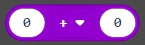 |  | Performs addition operations and outputs the calculation result. |
|  |  | Initializes Nexbit expansion board hardware, starting communication ports and the display driver. |
|  |  | Configures the lighting mode, LED selection, and RGB values for the ultrasonic sensor, updating colors immediately upon execution. |
|  |  | Sets the operating speed of both DC motors simultaneously within a range of -100 to 100. Positive values indicate forward rotation, negative values indicate reverse rotation, and 0 indicates stop. |
| 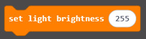 |  | Sets RGB LED brightness within a range of 0 to 255 to control overall illumination intensity. |
|  |  | Assigns preset RGB color values to designated LEDs, storing settings in the color buffer without lighting them up immediately. |
| 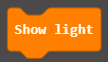 |  | Refreshes and outputs configured LED colors, illuminating LEDs with the designated colors. |

#### (4) Program Description and Upload

- Program Schematic

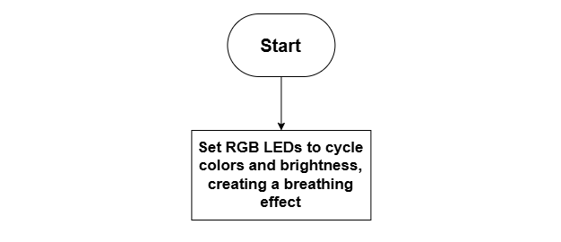

- Complete Program and Analysis

1. Upon startup, the initialization block executes to configure the robot hardware. A `color` variable is created with an initial value of 1.

2. Inside a forever loop, the `color` variable sets the LED color. The `color` variable increments by 1. A conditional statement checks whether `color` exceeds the maximum color index, resetting `color` to 1 if exceeded. A pause block introduces a delay before repeating the cycle, achieving an automatic neon color cycling effect.

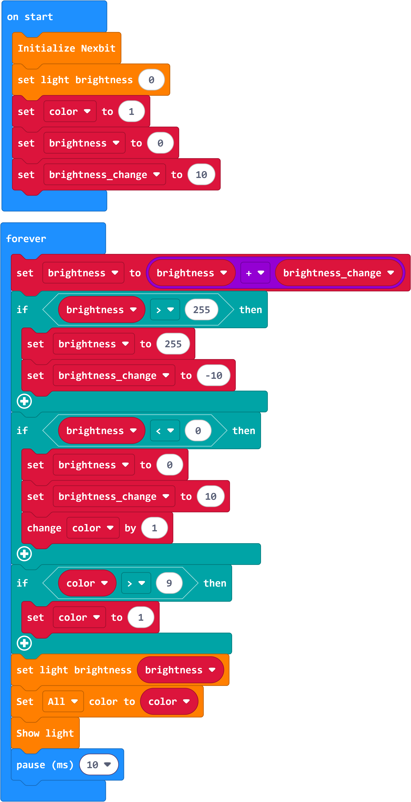

> [!NOTE]
>
> * **Parameter Adjustment: Modifying pause durations adjusts the color transition speed. Modifying the variable increment step changes the rhythm of color transitions.**
>
> * **Troubleshooting: If the lights fail to illuminate, check whether the initialization block is included, and verify that the LEDs are not obstructed.**

Program link: [MakeCode Project](https://makecode.microbit.org/_9qoitDWAhfEi)</br>

The program is also available for direct download via the following interface:

<FeishuForm url="https://makecode.microbit.org/_9qoitDWAhfEi"/>

- Program Upload


> [!NOTE]
>
> **Power off the robot car before uploading the program to prevent the robot car from running immediately and falling.**

### 4.9.5 Expansion and Challenge

**Project 1: Modifying Neon Transition Speed**

Modify the pause duration inside the loop:

1. Set the delay to 100 ms to achieve rapid color transitions.
2. Set the delay to 800 ms for slow, smooth transitions, and compare the visual effects.

> [!NOTE]
>
> **Smaller delay values produce higher color switching frequencies.**

**Project 2: Zoned Lighting Control**

Modify LED control blocks to control the left and right LEDs independently, creating alternating color effects between the two sides.

### 4.9.6 Q&A

**Question 1: What is the purpose of the `color` variable in this program?**

Answer: The `color` variable stores the color index number for the RGB LEDs. Incrementing the variable during each loop cycle changes the display color of the LEDs.

**Question 2: Why is a conditional statement needed to reset `color` back to 1?**

Answer: The preset LED colors have a finite index range. If the variable increments indefinitely beyond the valid range, lighting fails. Resetting the variable to 1 upon reaching the maximum value creates an endless cycling animation.

**Question 3: What should be inspected first if the RGB LEDs do not illuminate at all?**

Answer: Verify that the Nexbit initialization block is included in the program. Confirm that the battery has sufficient charge. Check that no physical objects obstruct the LEDs.

### 4.9.7 Technical Support and Product Discussion

To share creative ideas after experiencing the product, visit the [Hiwonder Forum](https://forum.hiwonder.com/):

<a href="https://forum.hiwonder.com/" target="_blank" rel="noopener noreferrer">


</a>

---

## 4.10 Glowing Line Following

### 4.10.1 Lesson Introduction

This lesson introduces glowing line following with the Nexbit AI robot car. Combining the 4-channel line follower sensor, motor control, variables, and RGB lights, the robot car follows a black track while the LEDs cycle through various colors, delivering simultaneous line following and dynamic lighting effects. The demonstration is based on the top-down assembly configuration and applies equally to other robot configurations.

### 4.10.2 Learning Objectives

1. **Knowledge Objectives**: Understand ground detection logic with the 4-channel line follower sensor. Understand steering decision logic during line following. Master variable counting to cycle RGB LED colors.

2. **Skill Objectives**: Complete line follower sensor calibration and battery installation. Master adding extension packages and importing programs in MakeCode. Modify motor speeds, conditional logic, and lighting variable parameters, and complete program upload and debugging.

3. **Thinking Objectives**: Understand multitasking logic that coordinates sensor acquisition, conditional robot steering, and variable-controlled lighting. Learn to process motion and visual effects concurrently, cultivating engineering thinking in parameter calibration and troubleshooting.

4. **Application Objectives**: Master combining robotic navigation with visual indicator lighting. Understand programming architectures that execute multiple simultaneous robot behaviors.

### 4.10.3 Preparation

#### (1) Hardware Preparation

- Nexbit AI robot car
- micro:bit board
- Micro USB cable
- Battery
- Computer

> [!NOTE]
>
> **Hardware Installation Note: Verify positive and negative polarity when installing the battery. Reverse connection is strictly prohibited. Prepare a flat, light-colored surface with a black track line. Calibrate sensitivity for all four line follower sensor probes individually before operation.**

#### (2) Software Preparation

- Access the MakeCode for micro:bit online programming platform:
  - [MakeCode Platform](https://makecode.microbit.org/)
  - Alternatively, copy and open the following link in a browser:

```py
https://makecode.microbit.org/
```

- Create a new project:


#### (3) Sensor Calibration Procedure


1. Position the sensor probe requiring calibration directly above the black track line.


2. Rotate the sensor potentiometer knob until the onboard LED indicator turns off.


3. Move the probe over a light-colored surface. The LED indicator illuminates, confirming calibration for this sensor probe is complete.


> [!NOTE]
>
> **Line following performance depends on sensor calibration. If detection is inaccurate, recalibrate the knobs on all four sensors.**

### 4.10.4 Hands-on Project

#### (1) Project Analysis

The core project in this section controls the Nexbit AI robot car to perform line following while dynamically shifting RGB light colors. The robot car drives along a black track on a light-colored surface while the RGB LEDs cycle through multiple colors. The 4-channel line follower sensor detects track positioning. When the black line deviates left, the robot car turns left to correct heading. When the black line deviates right, the robot car turns right to correct heading. When all sensors detect a light-colored surface, the robot car drives straight forward. A `color` variable governs LED colors, incrementing cyclically and resetting via conditional evaluation to create glowing effects. Both line following and lighting logic execute synchronously within the same forever loop. Motor speeds and pause durations must be calibrated to match ground friction, ensuring smooth line following along the black line.

#### (2) Adding Extensions

1. Click **Extensions**.


2. Copy the following link into the **Extensions** search bar to add **nexbit**.

```py
https://github.com/Hiwonder/Nexbit
```


> [!NOTE]
>
> **Alternative Program Import Method: The sample program file for this lesson can be dragged directly into the MakeCode web interface without manually adding the nexbit extension.**

#### (3) Core Blocks

|                            Block                             |                           Category                           | Function Description                                         |
| :----------------------------------------------------------: | :----------------------------------------------------------: | :----------------------------------------------------------- |
|  |  | On start event block. Executes nested code once upon device power-on or program upload. |
|  |  | Forever loop block. Continuously repeats nested code after power-on. |
|  |  | Pauses program execution for a specified duration in milliseconds before continuing. |
|  |  | Displays a designated number on the LED matrix screen.       |
|  |  | Reads and returns the value stored in a variable.            |
|  |  | Assigns a specified value to a designated variable.          |
|  |  | Changes the variable value by a specified increment.         |
|  |  | Performs addition operations and outputs the calculation result. |
|  |  | Initializes Nexbit expansion board hardware, starting communication ports and the display driver. |
|  |  | Sets the operating speed of both DC motors simultaneously within a range of -100 to 100. Positive values indicate forward rotation, negative values indicate reverse rotation, and 0 indicates stop. |
|  |  | Detects whether the designated line follower sensor detects a black line. Returns true if the condition is met. Otherwise, returns false. |
|  |  | Assigns preset RGB color values to designated LEDs, storing settings in the color buffer without lighting them up immediately. |
|  |  | Refreshes and outputs configured LED colors, illuminating LEDs with the designated colors. |

> [!NOTE]
>
> * **The drop-down menu of the 4-channel line follower sensor block allows switching sensor probe numbers and toggling detection between black and white lines.**
> * **Click the numerical box in the motor block to adjust rotation speed. Surfaces with higher friction may require increasing motor speed.**
> * **Configure color indices in the LED blocks. Adjust the variable increment step to alter color transition rhythms.**

#### (4) Program Description and Upload

- Program Schematic

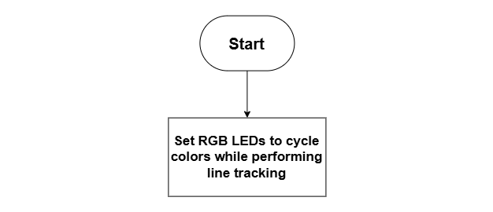

- Complete Program and Analysis

1. Upon startup, the initialization block executes to configure the robot hardware, and the `color` variable is set to an initial value of 1.

2. Inside a forever loop, the LED configuration executes first, the `color` variable increments, and a conditional statement resets the `color` variable. Multiple conditional branches read the detection states of the 4-channel line follower sensor. When sensor probe 2 or probe 3 detects deviations, right and left steering adjustments are executed accordingly. When all probes detect a white surface, the robot car drives straight forward. This sequence repeats continuously, enabling line following alongside cycling LED color effects.

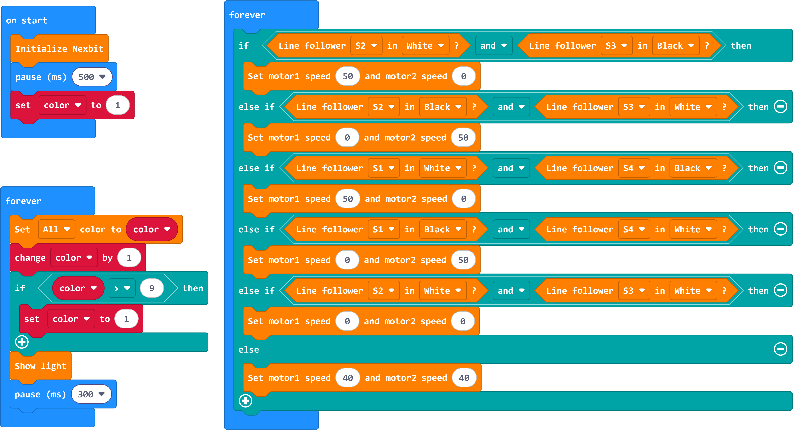

> [!NOTE]
>
> * **Parameter Adjustment: Ground friction affects straight-line driving. Higher friction may require an appropriate increase in motor speed. Longer pause durations result in longer driving distances at equivalent speeds. Motor speed and timing must be configured based on actual conditions. If the robot car veers left, slightly increase motor 1 or decrease motor 2. If the robot car veers right, apply the reverse adjustment. Modify pause durations to alter LED transition speeds.**
>
> * **Sensor Notes: Do not drive the line-following robot car at excessive speeds. Running too fast can cause the robot car to overshoot the black line track. Ensure the ground surface is light-colored and the black track line has an appropriate thickness.**

Program link: [MakeCode Project](https://makecode.microbit.org/_Vf0fvaa95fo9)</br>

The program is also available for direct download via the following interface:

<FeishuForm url="https://makecode.microbit.org/_Vf0fvaa95fo9"/>

- Program Upload


> [!NOTE]
>
> **Power off the robot car before uploading the program to prevent the robot car from running immediately and falling. Use the web pairing feature during upload to connect the micro:bit device.**

### 4.10.5 Expansion and Challenge

**Project 1: Adjusting Line Following Speed**

Modify motor speed parameters:

1. Increase motor speed. Observe the robot car follow the line faster, and check whether it tends to veer off the track.
2. Decrease motor speed. The robot car follows the line more slowly and drives more steadily.

> [!NOTE]
>
> **Excessive speed prevents the robot car from correcting direction in time, causing it to lose the black line track. Calibrate speeds according to the testing area.**

**Project 2: Modifying Glowing Lighting Effects**

Adjust the `color` variable increment step and pause duration to change the LED rhythm, achieving rapid flashing or gradual fade transitions.

### 4.10.6 Q&A

**Question 1: What two main categories of logic are contained inside the forever loop in the glowing line following program?**

Answer: One category handles line follower sensor evaluation and motor motion control, guiding the robot car along the black line. The other category manages variables and LED blocks to produce continuous cycling glowing effects.

**Question 2: What should be inspected first if the robot car frequently loses the black line?**

Answer: First, verify that all four line follower sensor probes are fully calibrated. Second, avoid setting motor speeds too high. Third, confirm that the ground surface is light-colored and the black track line is continuous and intact.

**Question 3: What role does the `color` variable play in this lesson?**

Answer: The `color` variable stores the color index number for the RGB LEDs. Modifying the variable during each loop cycle allows the LEDs to cycle through colors continuously while the robot car executes line following.

### 4.10.7 Technical Support and Product Discussion

To share creative ideas after experiencing the product, visit the [Hiwonder Forum](https://forum.hiwonder.com/):

<a href="https://forum.hiwonder.com/" target="_blank" rel="noopener noreferrer">


</a>

## 4.11 Smart Sound Control

### 4.11.1 Lesson Introduction

This lesson introduces smart sound control for the Nexbit AI robot car. The onboard sound sensor of the micro:bit board detects ambient sound levels. When a sound exceeding the preset threshold is detected, the buzzer emits an audio prompt, and the robot car drives forward a short distance before stopping, implementing sound-triggered motion control. The demonstration uses the top-down assembly configuration as an example, and the principles apply equally to other assembly configurations.

### 4.11.2 Learning Objectives

1. **Knowledge Objectives**: Understand the operating principle of the sound sensor in detecting volume levels. Understand the significance of the sound volume threshold. Master the combined application of the buzzer, motors, and conditional logic.

2. **Skill Objectives**: Complete battery installation for the robot car. Master both adding extension packages and importing project files in MakeCode. Modify sound thresholds, motor speeds, and pause durations, and complete program pairing, upload, and debugging.

3. **Thinking Objectives**: Understand the complete sound control logic sequence: volume acquisition, conditional evaluation, audio prompt, and motor execution. Configure appropriate trigger thresholds, cultivating engineering thinking in parameter calibration and troubleshooting.

4. **Application Objectives**: Master the implementation principles of sound-triggered robotic movement. Understand practical applications of sound interaction in robotics projects.

### 4.11.3 Preparation

#### (1) Hardware Preparation

- Nexbit AI robot car
- micro:bit board
- Micro USB cable
- Battery
- Computer

> [!NOTE]
>
> **Hardware Installation Note: Verify positive and negative polarity when installing the battery. Reverse connection is strictly prohibited. The sound sensor is integrated directly on the micro:bit board, requiring no additional wiring. Maintain a quiet experimental environment to minimize ambient noise interference.**

#### (2) Software Preparation

- Access the MakeCode for micro:bit online programming platform:
  - [MakeCode Platform](https://makecode.microbit.org/)
  - Alternatively, copy and open the following link in a browser:

```py
https://makecode.microbit.org/
```

- Create a new project:


### 4.11.4 Hands-on Project

#### (1) Project Analysis

The core project in this lesson involves controlling the Nexbit AI robot car to achieve sound-triggered motion. After power-on, the robot car completes hardware initialization. Inside the forever loop, the controller continuously reads ambient sound levels. When the volume exceeds the preset threshold, a secondary check is performed to eliminate false triggers. Once triggered, the buzzer plays an audio prompt, and the robot car drives forward for a set duration. The motors then stop, waiting for the next sound trigger. The sound sensor outputs volume values from 0 to 255, where larger numbers indicate higher volume. Setting a threshold determines whether the robot car's actions are triggered. A secondary volume check filters out brief ambient noise, pause blocks control forward driving duration, and pin control commands silence residual buzzer noise.

#### (2) Adding Extensions

1. Click **Extensions**.


2. Copy the following link into the **Extensions** search bar to add **nexbit**.

```py
https://github.com/Hiwonder/Nexbit
```


> [!NOTE]
>
> **Alternative Program Import Method: The sample program file for this lesson can be dragged directly into the MakeCode web interface without manually adding the nexbit extension.**

#### (3) Core Blocks

|                            Block                             |                           Category                           | Function Description                                         |
| :----------------------------------------------------------: | :----------------------------------------------------------: | :----------------------------------------------------------- |
|  |  | On start event block. Executes nested code once upon device power-on or program upload. |
|  |  | Forever loop block. Continuously repeats nested code after power-on. |
|  |  | Pauses program execution for a specified duration in milliseconds before continuing. |
|  |  | Displays the specified number on the LED matrix screen.      |
|  |  | Reads the sound level captured by the microphone, returning a value from 0 to 255. |
|  |  | Plays a tone at a preset pitch and duration.                 |
|  |  | Initializes Nexbit expansion board hardware, starting communication ports and the display driver. |
|  |  | Configures the rotational speed of two DC motors simultaneously, with a value range from -100 to 100, where positive values indicate forward rotation, negative values indicate reverse rotation, and 0 indicates stop. |

#### (4) Program Description and Upload

- Program Schematic

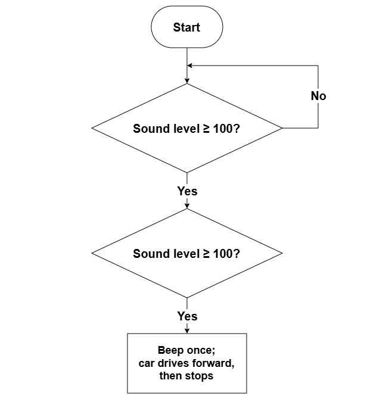

- Complete Program and Analysis

1. Upon power-on, execute `Initialize Nexbit` to complete hardware initialization.

2. Enter the forever loop, read the sound level, and evaluate whether the volume exceeds the preset threshold. A short pause debounces the signal before reading the sound level again for secondary confirmation, preventing false triggers caused by transient noise.

3. Confirm sound triggering: The buzzer plays an audio prompt, and the motors are set to rotate forward to drive the robot car forward. After pausing for a set duration, the motors stop. A pin block silences residual buzzer noise, and the loop continues, waiting for the next sound event.

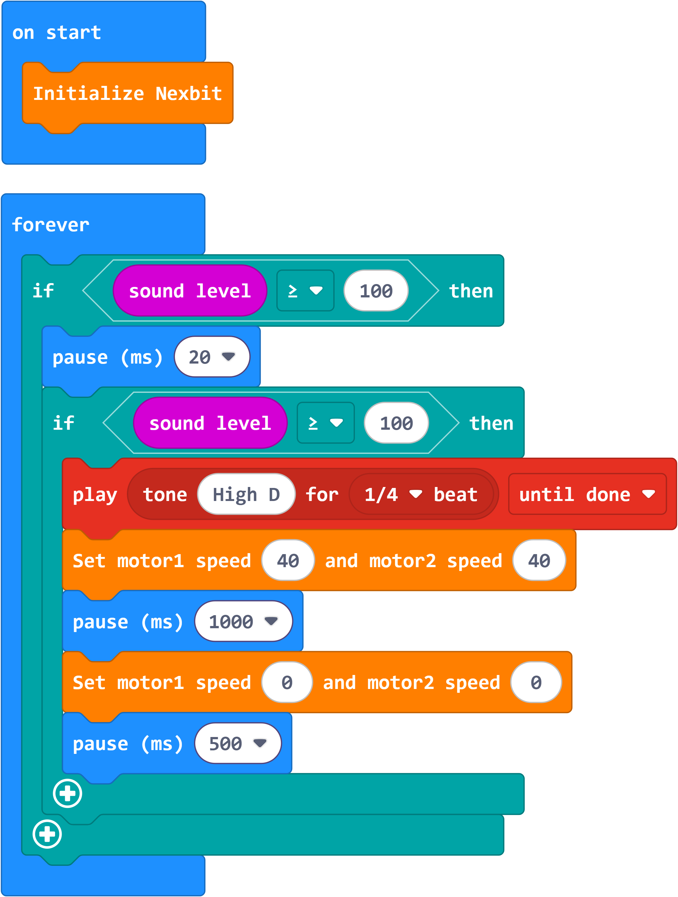

> [!NOTE]
>
> * **Parameter Adjustment: Modifying the threshold changes trigger sensitivity. Ground friction affects straight-line driving, and higher friction requires slightly increasing motor speeds. Larger pause durations result in longer driving distances at equal speeds. Adjust motor speed and duration based on actual conditions. If the robot car veers to the left, slightly increase the value of motor 1 or decrease the value of motor 2. Apply the reverse adjustment if the robot car veers to the right.**
>
> * **Sensor Calibration: In noisy environments, increase the volume threshold to prevent unintended triggering.**

Program link: [MakeCode Project](https://makecode.microbit.org/_ek69qXWfbXxd)</br>

The program is also available for direct download via the following interface:

<FeishuForm url="https://makecode.microbit.org/_ek69qXWfbXxd"/>

- Program Upload


> [!NOTE]
>
> **Power off the robot car before uploading the program to prevent the robot car from running immediately and falling off the table.**

### 4.11.5 Expansion and Challenge

**Project 1: Modifying Sound Trigger Sensitivity**

Modify the volume threshold inside the conditional statement:

1. Adjust the threshold to 70. A soft handclap can now trigger the robot car.
2. Adjust the threshold to 150. A louder sound is required to trigger the robot car. Compare the triggering responses between the two settings.

> [!NOTE]
>
> * **Lower thresholds increase sensitivity, but make the robot car more susceptible to false triggers from ambient noise.**
>
> * **The volume reading ranges from 0 to 255. Noisy environments cause false triggers, so select a quiet environment for testing.**

**Project 2: Modifying Sound-Controlled Motion Responses**

Modify motor speeds and pause durations to make the robot car reverse or execute turning maneuvers upon detecting sound triggers.

### 4.11.6 Q&A

**Question 1: What is the output numerical range of the sound sensor?**

Answer: The sound sensor returns values ranging from 0 to 255, where larger numbers indicate louder detected sound levels.

**Question 2: Why does the program include a secondary volume evaluation?**

Answer: The secondary evaluation filters out transient ambient noise, preventing false triggers caused by environmental disturbances and improving program stability.

**Question 3: How can residual faint buzzing be eliminated after tone playback completes?**

Answer: Execute an analog write command of 0 to pin P0, pulling the pin voltage level to zero and silencing residual buzzer noise.

### 4.11.7 Technical Support and Product Discussion

To share creative ideas after experiencing the product, visit the [Hiwonder Forum](https://forum.hiwonder.com/):

<a href="https://forum.hiwonder.com/" target="_blank" rel="noopener noreferrer">


</a>

## 4.12 Buzzer Control

### 4.12.1 Lesson Introduction

This lesson introduces the buzzer on the Nexbit AI robot car. The focus is on mastering tone playback and melody blocks, and creating programs that allow the robot car to play audio prompts and simple musical melodies. The demonstration uses the top-down assembly configuration as an example, and the principles apply equally to other assembly configurations.

### 4.12.2 Learning Objectives

1. **Knowledge Objectives**: Understand the sound-generation principle of the buzzer. Understand the relationship between musical tones and pause intervals. Comprehend how melodies are constructed from combinations of different pitches and durations.

2. **Skill Objectives**: Complete the battery installation for the robot car. Master both adding extension packages and importing project files in MakeCode. Select musical tones, modify beat duration parameters, and complete program pairing, uploading, and debugging.

3. **Thinking Objectives**: Understand the sound generation logic combining pitch, note duration, and delay intervals. Learn to calibrate parameters to produce desired audio effects, developing engineering thinking in troubleshooting and parameter calibration.

4. **Application Objectives**: Master the implementation of robotic audio feedback. Understand practical applications of buzzers in alarms, status indicators, and sound-effect prompts.

### 4.12.3 Preparation

#### (1) Hardware Preparation

- Nexbit AI robot car
- micro:bit board
- Micro USB cable
- Battery
- Computer

> [!NOTE]
>
> **Hardware Installation Note: Verify positive and negative polarity when installing the battery. Reverse connection is strictly prohibited. The buzzer is onboard the robot car hardware, requiring no additional wiring.**

#### (2) Software Preparation

- Access the MakeCode for micro:bit online programming platform:
  - [MakeCode Platform](https://makecode.microbit.org/)
  - Alternatively, copy and open the following link in a browser:

```py
https://makecode.microbit.org/
```

- Create a new project:


### 4.12.4 Hands-on Project

#### (1) Project Analysis

The core project in this lesson involves completing hardware initialization after power-on and invoking buzzer blocks to sequentially play various musical tones. The buzzer generates tones of varying frequencies. Higher pitch values produce sharper sounds, while lower values yield deeper sounds. Combining pitch values with note duration parameters controls sound duration, and integrating pause delays enables playback of audio prompts and short musical melodies. The code can be placed inside the `on start` block for sequential single playback or inside the `forever` loop to repeat the melody continuously.

#### (2) Adding Extensions

1. Click **Extensions**.


2. Copy the following link into the **Extensions** search bar to add **nexbit**.

```py
https://github.com/Hiwonder/Nexbit
```


> [!NOTE]
>
> **Alternative Program Import Method: The sample program file for this lesson can be dragged directly into the MakeCode web interface without manually adding the nexbit extension.**

#### (3) Core Blocks

|                            Block                             |                           Category                           | Function Description                                         |
| :----------------------------------------------------------: | :----------------------------------------------------------: | :----------------------------------------------------------- |
|  |  | On start event block. Executes nested code once upon device power-on or program upload. |
|  |  | Forever loop block. Continuously repeats nested code after power-on. |
|  |  | Pauses program execution for a specified duration in milliseconds before continuing. |
|  |  | Displays the specified number on the LED matrix screen.      |
|  |  | Executes nested code when button A on the controller board is pressed. Dropdown menu toggles between button A, button B, or buttons A+B. |
|  |  | Plays a tone at a preset pitch and duration.                 |
|  |  | Reads and retrieves the value stored in the specified variable. |
|  |  | Assigns a specified numeric value to the selected variable.  |
|  |  | Changes the value of the variable by a specified increment or decrement. |
|  |  | Defines a custom function named doSomething, encapsulating a reusable block of program logic. |
| 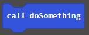 |  | Calls the custom function named doSomething, executing the code defined within the function. |
|  |  | Returns a specified numerical result upon completing function execution. |

**Block Modification Instructions**

1. Select different musical notes from the dropdown menu of the play tone block to alter pitch.

2. Modify the note duration parameter to regulate how long each note sounds.

3. Insert pause intervals between notes to create rhythmic phrasing.

> [!NOTE]
>
> **If the buzzer emits no sound, first verify that the Initialize Nexbit block has been executed, and check the battery level of the robot car.**

#### (4) Program Description and Upload

- Program Schematic

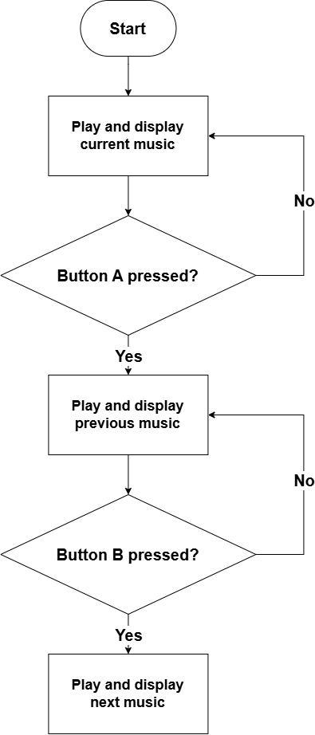

- Complete Program and Analysis

1. Upon power-on, execute `Initialize Nexbit` to complete hardware initialization.

2. Sequentially call tone playback blocks to play multiple notes, adding delay pauses between notes. Upon completion, execute the stop buzzer block to eliminate residual noise. If placed inside the forever loop, the melody repeats continuously.

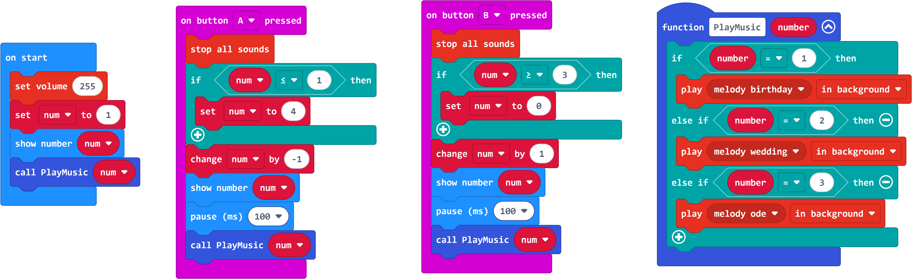

> [!NOTE]
>
> * **Parameter Adjustment: Modifying note selections alters tone pitch. Adjusting note duration and pause delays changes musical tempo.**
>
> * **Sensor Calibration: Inappropriate pitch selections can sound harsh or become nearly inaudible. Replace notes during testing.**

Program link: [MakeCode Project](https://makecode.microbit.org/_eP2PqW4xwVgs)</br>

The program is also available for direct download via the following interface:

<FeishuForm url="https://makecode.microbit.org/_eP2PqW4xwVgs"/>

- Program Upload


> [!NOTE]
>
> **Power off the robot car before uploading the program to prevent the robot car from running immediately and falling off the table.**

### 4.12.5 Expansion and Challenge

**Project 1: Modifying Melody Playback Tempo**

Modify note durations and intermediate pause intervals:

1. Reduce note durations. Notes play briefly, creating an upbeat, rapid tempo.
2. Increase note durations. Notes sustain longer, slowing down the melody tempo.

> [!NOTE]
>
> **Note durations and delay intervals together determine the overall playback speed.**

**Project 2: Creating Status Prompt Tones**

Combine conditional logic with buzzer tones so that triggering different robot states plays distinct acoustic prompt sounds.

### 4.12.6 Q&A

**Question 1: What should be inspected first if the buzzer does not emit sound?**

Answer: Confirm that the program includes the `Initialize Nexbit` block, verify that the battery of the robot car is sufficiently charged, and ensure that a stop buzzer command was not inadvertently executed.

**Question 2: How can pauses be created between individual musical notes?**

Answer: Insert pause blocks between two tone playback blocks, setting the duration in milliseconds to produce musical rests.

**Question 3: How can buzzing or static noise be eliminated after music finishes playing?**

Answer: Execute a stop buzzer block after playback ends to terminate the output and clear residual noise.

### 4.12.7 Technical Support and Product Discussion

To share creative ideas after experiencing the product, visit the [Hiwonder Forum](https://forum.hiwonder.com/):

<a href="https://forum.hiwonder.com/" target="_blank" rel="noopener noreferrer">


</a>

## 4.13 Gravity Control

### 4.13.1 Lesson Introduction

This lesson introduces the onboard accelerometer of the micro:bit board, also known as the gravity sensor. By reading tilt orientation values, tilting the micro:bit board directs the robot car forward, backward, and through turns, achieving tilt-based control. The demonstration uses the top-down assembly configuration as an example, and the principles apply equally to other assembly configurations.

### 4.13.2 Learning Objectives

1. **Knowledge Objectives**: Understand the operating principle of the gravitational acceleration sensor. Understand the tilt orientations represented by the X and Y axes. Comprehend the correspondence between tilt orientation values and movements of the robot car.

2. **Skill Objectives**: Complete battery installation for the robot car. Master both adding extension packages and importing project files in MakeCode. Read tilt values, configure evaluation thresholds, and complete program pairing, upload, and debugging.

3. **Thinking Objectives**: Understand the somatosensory control logic: reading tilt orientation values, applying conditional branching, and executing motor actions. Configure appropriate deadband thresholds to prevent jitter, developing engineering thinking in parameter calibration and troubleshooting.

4. **Application Objectives**: Master the implementation principles of tilt-controlled robotics. Understand practical applications of accelerometers in gesture and motion-sensing projects.

### 4.13.3 Preparation

#### (1) Hardware Preparation

- Nexbit AI robot car
- micro:bit board
- Micro USB cable
- Battery
- Computer

> [!NOTE]
>
> **Hardware Installation Note: Verify positive and negative polarity when installing the battery. Reverse connection is strictly prohibited. The accelerometer is integrated directly on the micro:bit board, requiring no additional wiring.**

#### (2) Software Preparation

- Access the MakeCode for micro:bit online programming platform:
  - [MakeCode Platform](https://makecode.microbit.org/)
  - Alternatively, copy and open the following link in a browser:

```py
https://makecode.microbit.org/
```

- Create a new project:


### 4.13.4 Hands-on Project

#### (1) Project Analysis

The core project in this lesson focuses on controlling the Nexbit AI robot car using the tilt orientation of the micro:bit board. After power-on, the robot car completes initialization. Inside the forever loop, the controller continuously reads X-axis and Y-axis gravitational acceleration values. Tilting the board forward moves the robot car forward, tilting backward moves the robot car backward, tilting left steers the robot car left, tilting right steers the robot car right, and holding the board level stops the robot car. The accelerometer outputs acceleration values along the X and Y axes, where different tilt angles correspond to specific values. Setting thresholds differentiates between level, forward tilt, backward tilt, left tilt, and right tilt states. The program incorporates threshold buffer zones to prevent natural hand tremors from causing erratic movements of the robot car.

#### (2) Adding Extensions

1. Click **Extensions**.


2. Copy the following link into the **Extensions** search bar to add **nexbit**.

```py
https://github.com/Hiwonder/Nexbit
```


> [!NOTE]
>
> **Alternative Program Import Method: The sample program file for this lesson can be dragged directly into the MakeCode web interface without manually adding the nexbit extension.**

#### (3) Core Blocks

|                            Block                             |                           Category                           | Function Description                                         |
| :----------------------------------------------------------: | :----------------------------------------------------------: | :----------------------------------------------------------- |
|  |  | On start event block. Executes nested code once upon device power-on or program upload. |
|  |  | Forever loop block. Continuously repeats nested code after power-on. |
|  |  | Pauses program execution for a specified duration in milliseconds before continuing. |
| 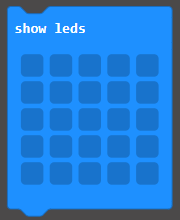 |  | Displays custom patterns drawn on the LED matrix screen.     |
|  |  | Reads the onboard accelerometer to acquire acceleration values along the X, Y, or Z axis in mg. |
|  |  | Initializes Nexbit expansion board hardware, starting communication ports and the display driver. |
|  |  | Configures the rotational speed of two DC motors simultaneously, with a value range from -100 to 100, where positive values indicate forward rotation, negative values indicate reverse rotation, and 0 indicates stop. |

#### (4) Program Description and Upload

- Program Schematic

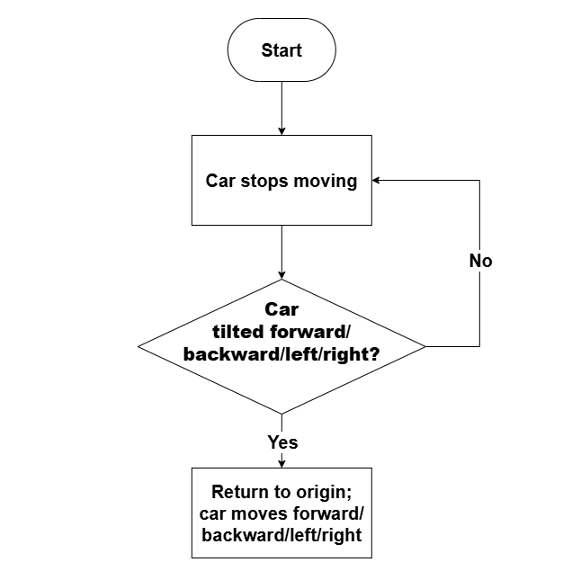

- Complete Program and Analysis

1. Upon power-on, execute `Initialize Nexbit` to complete hardware initialization.

2. Enter the forever loop, and read gravitational acceleration values along the X and Y axes. Multiple conditional branches evaluate the value intervals to classify the board as level, tilted forward, tilted backward, tilted left, or tilted right. The corresponding motor action executes for each tilt state, and the motors stop when the board is level. A brief pause repeats the posture-reading cycle.


> [!NOTE]
>
> * **Parameter Adjustment: Increasing thresholds reduces sensitivity, whereas decreasing thresholds increases sensitivity. Ground friction affects straight-line driving, and higher friction requires slightly increasing motor speeds. Larger pause durations result in longer driving distances at equal speeds. Adjust motor speed and duration based on actual conditions. If the robot car veers to the left, slightly increase the value of motor 1 or decrease the value of motor 2. Apply the reverse adjustment if the robot car veers to the right.**
>
> * **Sensor Calibration: Hand tremors while holding the micro:bit cause reading fluctuations. Set reasonable deadband thresholds to filter out jitter.**

Program link: [MakeCode Project](https://makecode.microbit.org/_78xhsVEKELfT)</br>

The program is also available for direct download via the following interface:

<FeishuForm url="https://makecode.microbit.org/_78xhsVEKELfT"/>

- Program Upload


> [!NOTE]
>
> **Power off the robot car before uploading the program to prevent the robot car from running immediately and falling off the table.**

### 4.13.5 Expansion and Challenge

**Project 1: Adjusting Tilt Control Sensitivity**

Modify the gravity threshold in the conditional logic:

1. Lower the threshold. Slight tilting now controls the robot car. Sensitivity is high, but the robot car is prone to jitter.
2. Increase the threshold. More pronounced tilting is required to respond, making movements steadier.

> [!NOTE]
>
> **Calibrate through experimentation to identify a threshold that balances responsiveness with stability.**

**Project 2: Adding Lighting Feedback**

Configure the RGB LEDs to illuminate in different colors corresponding to each tilt state, synchronizing lighting effects with motion changes.

### 4.13.6 Q&A

**Question 1: Is the gravity sensor an external module?**

Answer: The gravitational accelerometer is built directly into the micro:bit board, requiring no external wiring.

**Question 2: How can unintentional shaking or erratic motion during gravity control be resolved?**

Answer: Increase the conditional thresholds and extend the loop pause duration to filter out fluctuations caused by hand tremors.

**Question 3: What tilt motions do the X-axis and Y-axis detect respectively?**

Answer: The Y-axis detects forward and backward tilting, while the X-axis detects leftward and rightward tilting.

### 4.13.7 Technical Support and Product Discussion

To share creative ideas after experiencing the product, visit the [Hiwonder Forum](https://forum.hiwonder.com/):

<a href="https://forum.hiwonder.com/" target="_blank" rel="noopener noreferrer">


</a>

## 4.14 Touch Control

### 4.14.1 Lesson Introduction

This lesson introduces the capacitive touch sensor in the micro:bit logo. Touching the logo on the board triggers an event, producing an interactive response where the robot car reverses upon contact. The demonstration uses the top-down assembly configuration as an example, and the principles apply equally to other assembly configurations.

### 4.14.2 Learning Objectives

1. **Knowledge Objectives**: Identify the onboard capacitive touch logo on the micro:bit board. Understand the triggering mechanism of the `on logo touched` event. Master combining event blocks with motor movement.

2. **Skill Objectives**: Complete battery installation for the robot car. Master both adding extension packages and importing project files in MakeCode. Modify motor speed and delay parameters, and complete program pairing, upload, and debugging.

3. **Thinking Objectives**: Understand event-driven programming: awaiting a touch signal before executing corresponding actions. Learn to calibrate motor parameters based on real-world scenarios, developing engineering thinking in troubleshooting and parameter calibration.

4. **Application Objectives**: Master the principles of touch-interactive robot control. Understand practical applications of touch triggers in interactive robotics projects.

### 4.14.3 Preparation

#### (1) Hardware Preparation

- Nexbit AI robot car
- micro:bit board
- Micro USB cable
- Battery
- Computer

> [!NOTE]
>
> **Hardware Installation Note: Verify positive and negative polarity when installing the battery. Reverse connection is strictly prohibited. The touch sensor is integrated directly into the micro:bit front logo, requiring no external hardware.**

#### (2) Software Preparation

- Access the MakeCode for micro:bit online programming platform:
  - [MakeCode Platform](https://makecode.microbit.org/)
  - Alternatively, copy and open the following link in a browser:

```py
https://makecode.microbit.org/
```

- Create a new project:


### 4.14.4 Hands-on Project

#### (1) Project Analysis

The core project in this lesson involves controlling the Nexbit AI robot car to reverse upon touching the micro:bit logo. After power-on, the robot car initializes and waits for touch events. When a finger touches the micro:bit logo, the event triggers, the drive motors reverse, and the robot car moves backward for a set distance. Following a pause duration, the motors stop, waiting for the next touch event. The `on logo touched` block is an event block that remains idle under normal conditions, executing all nested code only when a touch action occurs. Motor speed and reverse duration require calibration based on ground friction. Observe the surrounding area after touch triggering to prevent the robot car from falling.

#### (2) Adding Extensions

1. Click **Extensions**.


2. Copy the following link into the **Extensions** search bar to add **nexbit**.

```py
https://github.com/Hiwonder/Nexbit
```


> [!NOTE]
>
> **Alternative Program Import Method: The sample program file for this lesson can be dragged directly into the MakeCode web interface without manually adding the nexbit extension.**

#### (3) Core Blocks

|                            Block                             |                           Category                           | Function Description                                         |
| :----------------------------------------------------------: | :----------------------------------------------------------: | :----------------------------------------------------------- |
|  |  | On start event block. Executes nested code once upon device power-on or program upload. |
|  |  | Pauses program execution for a specified duration in milliseconds before continuing. |
|  |  | Executes nested code when the logo button on the controller board is touched. Dropdown options toggle trigger conditions such as pressed or released. |
|  |  | Initializes Nexbit expansion board hardware, starting communication ports and the display driver. |
| 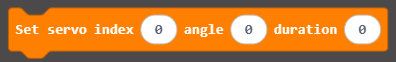 |  | Configures the rotational speed of two DC motors simultaneously, with a value range from -100 to 100, where positive values indicate forward rotation, negative values indicate reverse rotation, and 0 indicates stop. |

#### (4) Program Description and Upload

- Program Schematic

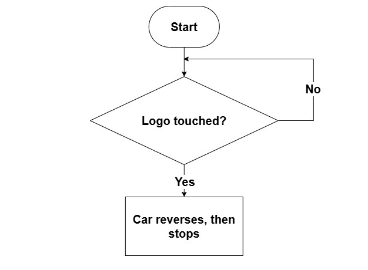

- Complete Program and Analysis

1. Upon power-on, execute `Initialize Nexbit` to complete hardware initialization.

2. The program waits for touch event triggering. When the logo is touched, the motors are configured with negative speed values, causing the robot car to reverse. A pause of 500 ms maintains backward motion. Motor speed is then set to 0, stopping the robot car and waiting for the next touch.

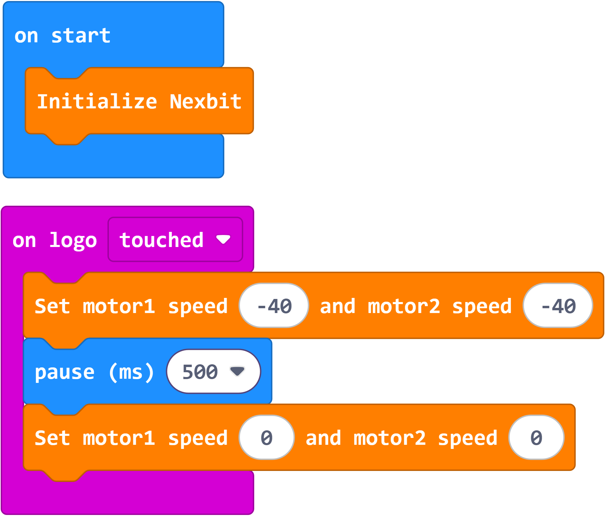

> [!NOTE]
>
> * **Parameter Adjustment: Modifying motor speed alters reverse driving speed. Ground friction affects straight-line driving, and higher friction requires slightly increasing motor speeds. Larger pause durations result in longer driving distances at equal speeds. Adjust motor speed and duration based on actual conditions. If the robot car veers to the left, slightly increase the value of motor 1 or decrease the value of motor 2. Apply the reverse adjustment if the robot car veers to the right. Adjusting the pause duration alters the reverse driving distance.**
>
> * **Sensor Calibration: Touching triggers reverse motion. Verify that no obstacles lie behind the robot car, and keep the robot car away from table edges to prevent falls and damage.**

Program link: [MakeCode Project](https://makecode.microbit.org/_YiyM4KTMCe2r)</br>

The program is also available for direct download via the following interface:

<FeishuForm url="https://makecode.microbit.org/_YiyM4KTMCe2r"/>

- Program Upload


> [!NOTE]
>
> **Power off the robot car before uploading the program to prevent the robot car from running immediately and falling off the table.**

### 4.14.5 Expansion and Challenge

**Project 1: Adjusting Touch-Triggered Reverse Speed**

Modify the motor speed within the touch event:

1. Adjust the motor value to -60. The robot car reverses faster.
2. Adjust the motor value to -20. The robot car reverses slower.

> [!NOTE]
>
> **Determine the optimal reverse speed based on actual surface friction.**

**Project 2: Modifying Touch-Triggered Actions**

Modify the code inside the event block so that touching causes the robot car to advance or turn, accompanied by RGB LED lighting or buzzer prompt tones.

### 4.14.6 Q&A

**Question 1: Where is the touch sensor hardware located on the micro:bit?**

Answer: The touch sensor is the metallic logo area on the front center of the board, requiring no additional wiring.

**Question 2: What is an event block?**

Answer: An event block does not execute its nested code continuously under normal conditions. It executes the nested program only when its triggering condition is satisfied, such as touching the logo in this lesson.

**Question 3: What should be inspected if the robot car does not respond after touching?**

Answer: Confirm that `Initialize Nexbit` has been added, verify sufficient battery power, and ensure full finger contact with the metallic logo area.

### 4.14.7 Technical Support and Product Discussion

To share creative ideas after experiencing the product, visit the [Hiwonder Forum](https://forum.hiwonder.com/):

<a href="https://forum.hiwonder.com/" target="_blank" rel="noopener noreferrer">


</a>

<a id="section-4-15"></a>

## 4.15 App Control

### 4.15.1 Lesson Introduction

This lesson introduces Bluetooth communication for the Nexbit AI robot car. The Wonderbit app connects to the micro:bit board via Bluetooth, enabling wireless remote control of the robot car, reading onboard sensor telemetry, and controlling RGB LEDs. The demonstration uses the top-down assembly configuration as an example, and the principles apply equally to other assembly configurations.

### 4.15.2 Learning Objectives

1. **Knowledge Objectives**: Understand the functionality of the micro:bit Bluetooth antenna. Understand the communication logic for transmitting and receiving Bluetooth commands. Recognize the workflow where the app sends commands, and the robot car parses and executes actions.

2. **Skill Objectives**: Complete battery installation for the robot car. Master both adding extension packages and importing project files in MakeCode. Install the Wonderbit app and complete Bluetooth pairing and connection. Modify motor and RGB LED parameters, and complete program pairing, upload, and debugging.

3. **Thinking Objectives**: Understand the complete wireless control logic: the app transmits Bluetooth commands, the robot car parses commands, executes movements, and returns sensor data. Cultivate engineering thinking in parameter calibration and troubleshooting.

4. **Application Objectives**: Master the implementation principles of Bluetooth wireless remote control in robotics. Understand practical applications of wireless communication in smart robotics projects.

### 4.15.3 Preparation

#### (1) App Software

- Download the App:
  - Click [Wonderbit](https://www.hiwonder.com.cn/download/foreignSofts?get_app=2) to download.
  - Scan the QR code to download:


- Wonderbit Introduction:

Wonderbit is a control application developed specifically for micro:bit series robots.


On the main interface, tap the menu icon with three horizontal lines, scroll down to switch the device to **Nexbit AI**, and enter the control interface.


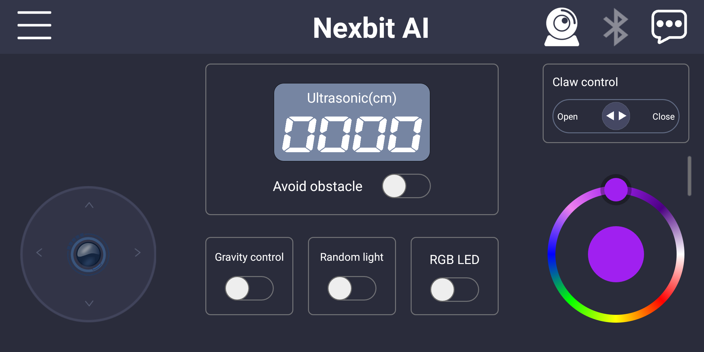

The main interface functions are structured as follows:

|                             Icon                             | Function                                                     |                             Icon                             | Function                                                     |
| :----------------------------------------------------------: | :----------------------------------------------------------- | :----------------------------------------------------------: | :----------------------------------------------------------- |
|  | Product selection button                                     |  | Displays product name                                        |
|  | Toggles image transmission mode. For details, refer to [5.9 App Image Transmission](./5.%20Multimodal%20AI%20Projects.md#_5-9-app-image-transmission). |  | Bluetooth connection button for pairing devices              |
|  | Software introduction portal                                 | 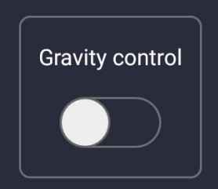 | Enables tilt-based somatosensory steering of the robot car   |
|  | Automatically cycles onboard RGB LEDs through random colors  |  | Toggles onboard RGB LEDs on and off                          |
|  | Controls opening and closing of the robotic gripper. For details, refer to [Advanced Kit Robotic Gripper Expansion Projects](https://wiki.hiwonder.com/projects/NexbitAl/en/latest/docs/6.%20Robotic%20Gripper%20Expansion%20Projects.html). | 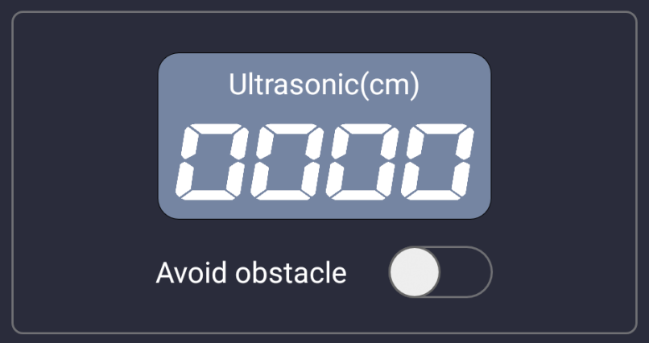 | Displays ultrasonic distance and toggles obstacle avoidance mode |
|  | Controls forward, backward, and steering motion of the robot car | 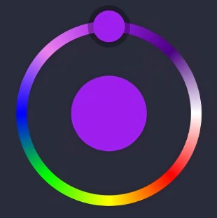 | Customizes onboard RGB LED colors                            |

#### (2) Hardware Preparation

- Nexbit AI robot car
- micro:bit board with onboard Bluetooth antenna
- Micro USB cable
- Battery
- Computer
- Smartphone (Android or iOS)

> [!NOTE]
>
> **Hardware Installation Note: Verify positive and negative polarity when installing the battery. Reverse connection is strictly prohibited. The Bluetooth module is integrated directly on the micro:bit board, requiring no additional wiring. Enable Bluetooth and location permissions on the smartphone.**

#### (3) Software Preparation

- Access the MakeCode for micro:bit online programming platform:
  - [MakeCode Platform](https://makecode.microbit.org/)
  - Alternatively, copy and open the following link in a browser:

```py
https://makecode.microbit.org/
```

- Create a new project:


### 4.15.4 Hands-on Project

#### (1) Project Analysis

The core project in this lesson focuses on controlling the Nexbit AI robot car via the app over Bluetooth. After power-on, the robot car completes hardware initialization, displays connection status on the LED dot matrix, and awaits Bluetooth pairing with the app. The Wonderbit app transmits control commands for forward, backward, turning, and RGB lighting. The robot car receives and parses these commands, executing motor motions and lighting changes while transmitting ultrasonic, light, and temperature sensor data back to the app interface. Bluetooth operates through wireless communication: the phone transmits command strings, the controller identifies the command type, matches the corresponding branch to execute movements, and concurrently returns telemetry data. Motor speed and LED brightness parameters can be calibrated to suit actual scenarios.

#### (2) Adding Extensions

1. Click **Extensions**.


2. Copy the following link into the **Extensions** search bar to add **nexbit** and **Handlebit**.

```py
https://github.com/Hiwonder/Nexbit
```


3. Search for **bluetooth** in **Extensions** to add the extension.

```py
bluetooth
```


4. In the pop-up warning dialog, select **Delete extension(s) and add bluetooth**.


5. In project settings, select **No Pairing Required: Anyone can connect via Bluetooth**.


> [!NOTE]
>
> **Alternative Program Import Method: The sample program file for this lesson can be dragged directly into the MakeCode web interface without manually adding the nexbit and bluetooth extensions.**

#### (3) Core Blocks

|                            Block                             |                           Category                           | Function Description                                         |
| :----------------------------------------------------------: | :----------------------------------------------------------: | :----------------------------------------------------------- |
| 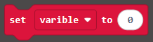 |  | Assigns a specified numeric value to the selected variable.  |
|  |  | Changes the value of the variable by a specified increment or decrement. |
|  |  | Reads and retrieves the value stored in the specified variable. |
|  |  | Event block executed immediately when Bluetooth successfully establishes a connection. |
| 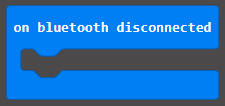 |  | Event block executed immediately when the Bluetooth connection is disconnected. |
|  |  | Transmits numeric data via Bluetooth UART, sending entered values to a smartphone or host computer. |
| 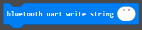 |  | Transmits text strings via Bluetooth UART to send prompt messages or sensor telemetry. |
|  |  | Reads incoming Bluetooth UART data, buffering characters until a newline character is encountered, and returning the full line as a string. |
| 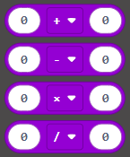 |  | Executes addition, subtraction, multiplication, or division operations, outputting the result. |
|  |  | Rounds input decimals using selectable modes including round, ceiling, and floor. |
|  |  | Initializes Nexbit expansion board hardware, starting communication ports and the display driver. |
|  |  | Sets the target angle and duration for a specified servo, driving the servo through precision angular movement. |
| 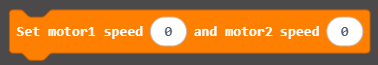 |  | Configures the rotational speed of two DC motors simultaneously, with a value range from -100 to 100, where positive values indicate forward rotation, negative values indicate reverse rotation, and 0 indicates stop. |
|  |  | Selects lighting modes and LED positions, configuring light colors using R, G, and B values to update immediately upon execution. |
|  |  | Reads the obstacle distance detected by the ultrasonic sensor in millimeters. |
|  |  | Sets RGB LED output brightness across a range of 0 to 255 to adjust overall illumination levels. |
|  |  | Assigns RGB values to specified LEDs, buffering the color configuration without immediate illumination. |
|  |  | Refreshes and outputs buffered LED color configurations to illuminate the LEDs with the specified colors. |
|  |  | Reads command identifiers from received Bluetooth packets, returning the instruction type to determine which command was issued. |
|  |  | Extracts parameter values at a specified index starting from 1 in the Bluetooth packet, reading data such as speed or angle. |
|  |  | Dropdown enumeration block used to match received Bluetooth command types. |
|  |  | Dropdown enumeration block containing motion commands for the robot car to match incoming movement instructions. |
|  |  | Converts input numbers into ultrasonic distance Bluetooth commands, enabling ultrasonic reading commands to be transmitted over Bluetooth. |

#### (4) Program Description and Upload

- Program Schematic

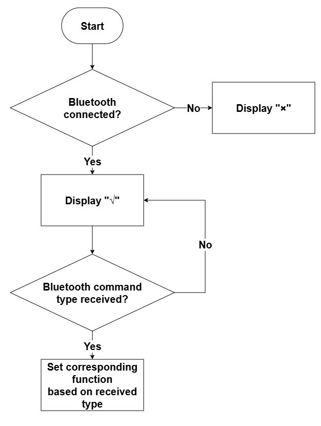

- Complete Program and Analysis

1. Upon power-on, execute `Initialize Nexbit` to complete hardware initialization, displaying a standby icon on the LED dot matrix.

2. When Bluetooth connects successfully, the LED matrix displays a connected icon. Upon disconnection, it switches to a disconnected indicator.

3. Inside the loop, read strings received over Bluetooth UART and parse the command types. Multiple conditional branches match commands for moving forward, reversing, turning left, turning right, controlling RGB LEDs, and querying sensors. Matching motion commands executes motor actions. Matching lighting commands modifies the RGB LEDs. Query commands transmit sensor data over Bluetooth back to the app for display.


> [!NOTE]
>
> **Parameter Adjustment: Modifying motor speeds adjusts the remote control driving speed of the robot car. Modifying RGB LED brightness parameters adjusts lighting effects.**

Program link: [MakeCode Project](https://makecode.microbit.org/_HbC9jhRfCbmE)</br>

The program is also available for direct download via the following interface:

<FeishuForm url="https://makecode.microbit.org/_HbC9jhRfCbmE"/>

- Program Upload


> [!NOTE]
>
> * **Power off the robot car before uploading the program to prevent the robot car from running immediately and falling off the table.**
>
> * **Power on the robot car after program upload completes, and then connect via Bluetooth in the app.**

#### (5) Bluetooth Connection

1. Open the **Wonderbit** app and enter the **Nexbit AI** control interface.


2. Tap  to search for devices.

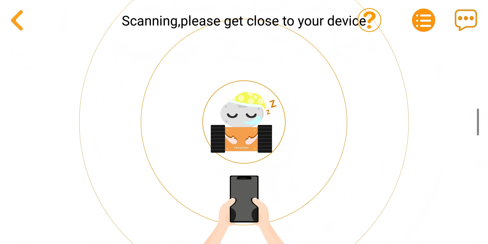

3. Tap **BBC micro:bit** to connect. Returning to the main interface confirms a successful connection, and the robot car can now be operated for testing.


### 4.15.5 Expansion and Challenge

**Project 1: Adjusting Remote Control Driving Speed**

Modify the motor speed parameters within each branch:

1. Adjust forward and reverse motor values to 75. The robot car drives faster during remote control.
2. Adjust forward and reverse motor values to 30. The robot car drives slower, allowing more deliberate control.

> [!NOTE]
>
> **Excessive speeds can make it difficult to react in time, causing the robot car to veer outside the operating area. Adjust parameters according to the testing space.**

**Project 2: Expanding Custom Bluetooth Commands**

Add a new conditional branch with a custom Bluetooth command string to trigger buzzer audio effects upon receiving the command.

### 4.15.6 Q&A

**Question 1: Should the smartphone connect to the robot car via system Bluetooth settings?**

Answer: No. Open the Wonderbit app and tap the Bluetooth icon inside the app to search for and connect to the BBC micro:bit device. Avoid pairing directly within the phone system settings.

**Question 2: How does the robot car behave when Bluetooth disconnects?**

Answer: In the sample program, the LED dot matrix displays a disconnected icon. Without receiving app commands, the drive motors remain stopped while waiting for the Bluetooth connection to re-establish.

**Question 3: What roles do the robot car and smartphone play in Bluetooth communication?**

Answer: The app issues control commands, while the robot car receives and parses instructions to actuate the motors and RGB LEDs. Simultaneously, the robot car reads sensor data and transmits telemetry back to the app for graphical display.

### 4.15.7 Technical Support and Product Discussion

To share creative ideas after experiencing the product, visit the [Hiwonder Forum](https://forum.hiwonder.com/):

<a href="https://forum.hiwonder.com/" target="_blank" rel="noopener noreferrer">


</a>

## 4.16 Handlebit Controller Control

### 4.16.1 Lesson Introduction

This lesson introduces wireless communication between the Handlebit controller and the Nexbit AI robot car. The joystick on the Handlebit controller directs the robot car forward, backward, left, and right.

### 4.16.2 Learning Objectives

1. **Knowledge Objectives**: Understand the operating principles of controller wireless communication. Understand joystick signal reception and parsing logic. Master the correspondence between joystick commands and motor movements.

2. **Skill Objectives**: Master both adding extension packages and importing project files in MakeCode. Modify motor speeds and joystick deadband thresholds, and complete program pairing, upload, and debugging.

3. **Thinking Objectives**: Understand the control flow: the controller transmits signals, the robot car receives and parses commands, and the motors execute movement. Cultivate engineering thinking in wireless remote control logic and troubleshooting.

4. **Application Objectives**: Master implementation methods for wireless controller robotics. Understand practical applications of joystick remote control in competitions and hands-on maker projects.

### 4.16.3 Preparation

#### (1) Hardware Preparation

- Nexbit AI robot car
- micro:bit board
- Handlebit wireless controller
- Micro USB cable
- Battery
- Computer

> [!NOTE]
>
> **Hardware Installation Note: Verify positive and negative polarity when installing batteries in both the robot car and the controller. Reverse connection is strictly prohibited. The controller and robot car must complete wireless channel pairing before remote control functions normally. Verify that both devices have sufficient battery charge before operation.**

#### (2) Software Preparation

- Access the MakeCode for micro:bit online programming platform:
  - [MakeCode Platform](https://makecode.microbit.org/)
  - Alternatively, copy and open the following link in a browser:

```py
https://makecode.microbit.org/
```

- Create a new project:


### 4.16.4 Hands-on Project

#### (1) Project Analysis

The core project in this lesson involves controlling the Nexbit AI robot car using the Handlebit wireless controller. After power-on, the robot car completes hardware initialization and awaits a wireless connection with the Handlebit controller. Deflecting the controller joystick transmits control signals. The robot car continuously receives these signals, parses the joystick offset states, and executes forward, backward, left turn, right turn, or stop commands. The joystick outputs analog offset values, where different offsets correspond to distinct motion directions, and returning the joystick to the center position stops the robot car.

#### (2) Adding Extensions

1. Click **Extensions**.


2. Copy the following link into the **Extensions** search bar to add **nexbit**.

```py
https://github.com/Hiwonder/Nexbit
```


3. Copy the following link into the **Extensions** search bar to add **Handlebit**.

```py
https://github.com/HiwonderK12/Handlebit
```

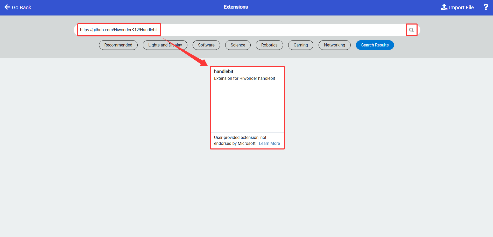

> [!NOTE]
>
> **Alternative Program Import Method: The sample program file for this lesson can be dragged directly into the MakeCode web interface without manually adding the Handlebit and nexbit extensions.**

#### (3) Core Blocks

|                            Block                             |                           Category                           | Function Description                                         |
| :----------------------------------------------------------: | :----------------------------------------------------------: | :----------------------------------------------------------- |
|  |  | Executes nested code first upon power-on, initializing hardware settings. |
|  |  | Forever loop block. Continuously repeats nested code to read ultrasonic distance data. |
|  |  | Pauses program execution for a specified duration in milliseconds, controlling action duration and sensor sampling intervals. |
|  |  | Displays the specified number on the LED matrix screen.      |
|  |  | Transmits a specified number wirelessly via the radio module. |
| 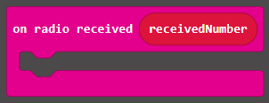 |  | Executes nested code upon receiving data wirelessly over the radio module. |
|  |  | Reads and retrieves the value stored in the specified variable. |
|  |  | Assigns a specified numeric value to the selected variable.  |
|  |  | Changes the value of the variable by a specified increment or decrement. |
|  |  | Completes initialization configuration of Nexbit hardware modules. |
|  |  | Sets rotational speeds for two DC motors from -100 to 100, where 0 indicates stop. Equal positive values drive the robot car forward, while equal negative values drive it backward. Unequal values turn the robot car. A higher value on motor 1 turns the robot car right, while a higher value on motor 2 turns the robot car left. |
| 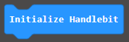 |  | Completes the initialization configuration of the Handlebit controller module. |
|  |  | Reads sensor values along the specified direction from the controller joystick. |

#### (4) Program Description and Upload

- Transmitter Program Schematic

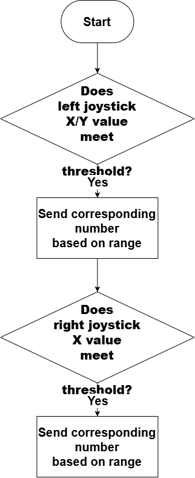

- Receiver Program Schematic

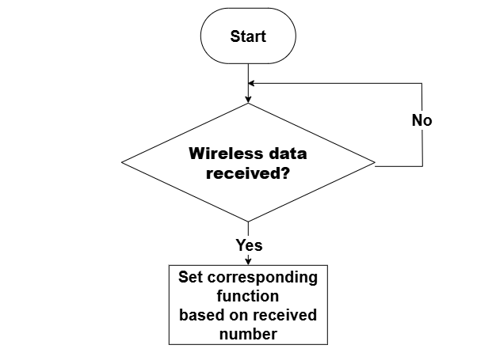

- Transmitter Complete Program and Analysis

1. **Power-On Initialization**: Upon power-on, execute `Initialize Handlebit` to initialize the controller module. Execute `radio set group` to configure the radio channel group, ensuring transmitter and receiver operate on the same communication group.

2. **Forever Loop for Continuous Joystick Detection**:
   - **Left Joystick X-axis**: When the joystick X value is less than 50, transmit number 1. When the joystick X value is greater than 200, transmit number 2. In other cases, no command is transmitted.
   - **Left Joystick Y-axis**: When the joystick Y value is less than 50, transmit number 3. When the joystick Y value is greater than 200, transmit number 4. In other cases, transmit number 5.

3. **Debounce Delay**: After each numerical transmission, add a 50 ms pause to prevent joystick jitter from sending duplicate commands excessively.


Program link: [MakeCode Project](https://makecode.microbit.org/_UqEFdK1595hz)</br>

The program is also available for direct download via the following interface:

<FeishuForm url="https://makecode.microbit.org/_UqEFdK1595hz"/>

- Receiver Complete Program and Analysis

1. **Power-On Initialization**: Execute `Initialize Nexbit` to complete hardware initialization. Configure `radio set group` to match the transmitter group.

2. **Radio Receive Event**: Runs when data is received over the radio, reading `receivedNumber` and applying conditional branching:
   - `receivedNumber = 1`: Sets motor speeds, turning the robot car left.
   - `receivedNumber = 2`: Sets motor speeds, turning the robot car right.
   - `receivedNumber = 3`: Sets motor speeds, driving the robot car backward.
   - `receivedNumber = 4`: Sets motor speeds, driving the robot car forward.
   - `receivedNumber = 5`: Resets both motor speeds to 0, stopping the robot car.


> [!NOTE]
>
> **Sensor Calibration: If the controller does not respond, first verify that wireless pairing between the controller and the robot car is complete, check battery levels on both devices, and calibrate joystick deadband thresholds.**

Program link: [MakeCode Project](https://makecode.microbit.org/_bmjWHR3hAYx0)</br>

The program is also available for direct download via the following interface:

<FeishuForm url="https://makecode.microbit.org/_bmjWHR3hAYx0"/>

- Program Upload


> [!NOTE]
>
> * **Power off the robot car before uploading the program to prevent the robot car from running immediately and falling off the table. Use the web pairing feature during upload to connect the micro:bit device.**
>
> * **After uploading programs to both devices, power on the robot car and controller respectively, and perform the controller pairing procedure.**

### 4.16.5 Expansion and Challenge

**Project 1: Adjusting Controller Speed and Joystick Deadband**

Modify joystick thresholds and motor parameters within conditional logic:

1. Increase motor speeds. The robot car drives faster during joystick control.
2. Enlarge joystick evaluation thresholds. This filters out joystick drift and maintains a more stable stationary state.

> [!NOTE]
>
> **If the threshold is too small, minor joystick drift will trigger unintended movements of the robot car. If the threshold is too large, the joystick must be deflected significantly before the robot car responds.**

**Project 2: Expanding Controller Button Functions**

Modify the program to utilize unused buttons on the controller, triggering audio prompts from the buzzer when buttons are pressed.

### 4.16.6 Q&A

**Question 1: What causes uncontrolled drift of the robot car during joystick operation?**

Answer: Uncontrolled drift occurs when the joystick outputs slight drift values without adequate deadband thresholds configured in software. Low controller battery levels can also cause signal instability.

**Question 2: What should be inspected first if the Handlebit controller cannot control the robot car at all?**

Answer: Verify that both the robot car and controller have sufficient battery power, confirm that wireless channel pairing is complete, and verify that the program executes hardware initialization blocks.

### 4.16.7 Technical Support and Product Discussion

To share creative ideas after experiencing the product, visit the [Hiwonder Forum](https://forum.hiwonder.com/):

<a href="https://forum.hiwonder.com/" target="_blank" rel="noopener noreferrer">


</a>
