# 6. Software and Hardware Guide

## 6.1 micro:bit Board Overview

### 6.1.1 Overview

Led by the BBC in the UK and co-developed with Microsoft, Samsung, and ARM, the micro:bit is a pocket-sized microcomputer designed for youth programming education, measuring only half the size of a standard credit card. Despite its compact footprint, it integrates Bluetooth, an accelerometer, a compass, three pushbuttons, a 5×5 LED matrix display, and a microphone.

The micro:bit features extensive open-source libraries and engaging project solutions. Access the platform directly by clicking [Microsoft MakeCode for micro:bit](https://makecode.microbit.org/), or copy the URL below into any web browser to explore the website:

```
https://makecode.microbit.org/
```

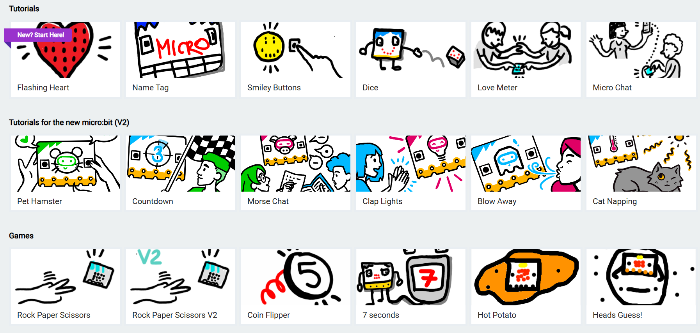

### 6.1.2 micro:bit Board Pinout

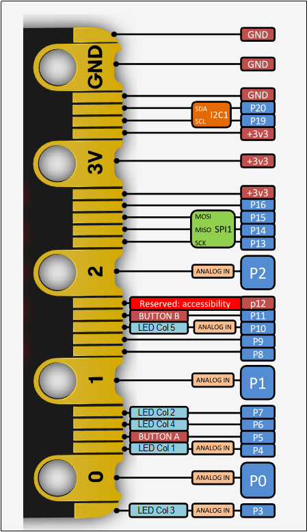

### 6.1.3 micro:bit Board Specifications

| Parameter | Specification |
| :---: | :--- |
| Processor | Nordic nRF52833 |
| ARM | Cortex-M6.32bit+FPU 64MHz |
| RAM / Flash | 128 KB RAM / 512 KB Flash |
| Wireless | 2.4 GHz micro:bit Radio / BLE Bluetooth 5.0 |
| Power Supply | 5 V via micro USB port, 3 V via edge connector or battery pack |
| Operating Current | 300 mA |
| Dimensions | 52 × 43.2 mm |

### 6.1.4 micro:bit Board Hardware Layout

As shown in the following figure, the board primarily consists of onboard modules including an accelerometer, programmable buttons, edge connector pins, an LED matrix, a USB port, Bluetooth, radio, and an electronic compass.

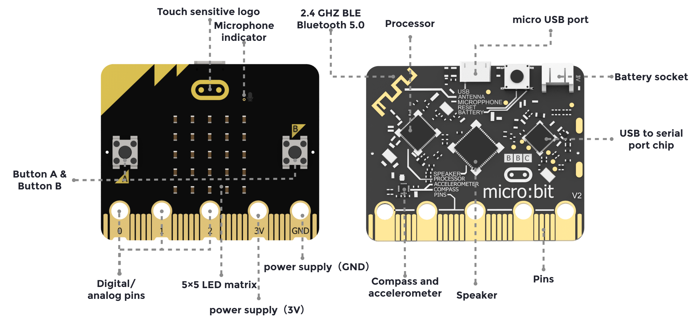

### 6.1.5 micro:bit Practical Demos

#### Case 1: Logo Touch Control

The location of the touch logo on the micro:bit board is shown below:

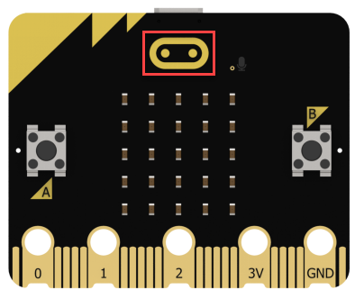

**(1) Learning Objectives**

Learn how to toggle display patterns using the touch logo on the micro:bit board.

**(2) Program Design**

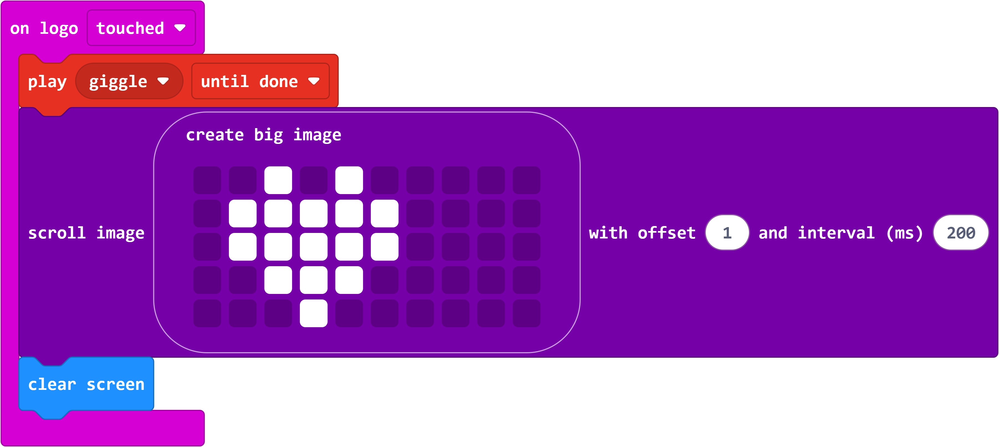

Program link: [MakeCode Project](https://makecode.microbit.org/_e9XM3ua8vYii)</br>

The program is also available for direct download via the following interface:

<FeishuForm url="https://makecode.microbit.org/_e9XM3ua8vYii"/>

**(3) Program Upload**


**(4) Demonstration and Operation**

When the logo is touched, the micro:bit board plays a preset sound while the LED matrix scrolls a heart icon.

#### Case 2: Smart Thermometer

The location of the main processor chip on the micro:bit board is shown below:

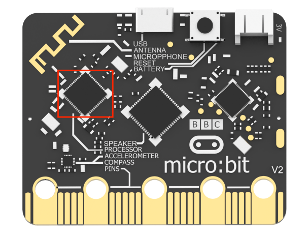

**(1) Learning Objectives**

Implement ambient temperature detection using the main processor on the micro:bit board.

**(2) Program Design**

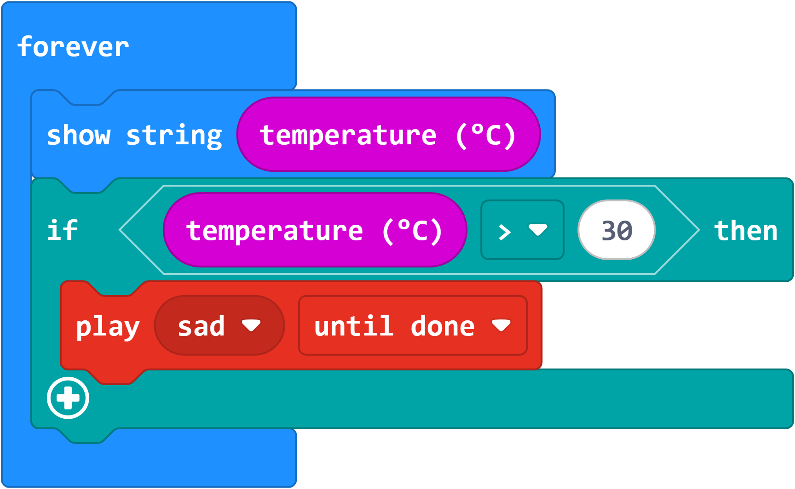

Program link: [MakeCode Project](https://makecode.microbit.org/_A5U9uf0A3b7h)</br>

The program is also available for direct download via the following interface:

<FeishuForm url="https://makecode.microbit.org/_A5U9uf0A3b7h"/>

**(3) Program Upload**


**(4) Demonstration and Operation**

Press a finger gently against the micro:bit processor chip. When the detected temperature exceeds 30 °C, the speaker emits an alert tone.

#### Case 3: Timer

The location of the buttons on the micro:bit board is shown below:

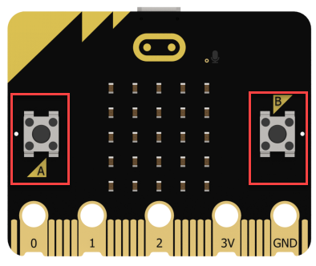

**(1) Learning Objectives**

Program the micro:bit buttons to implement a countdown timer.

**(2) Program Design**

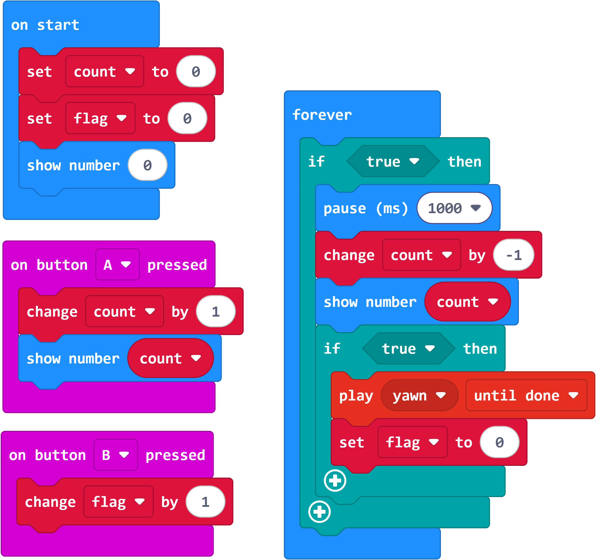

Program link: [MakeCode Project](https://makecode.microbit.org/_19a9wW2XyUH2)</br>

The program is also available for direct download via the following interface:

<FeishuForm url="https://makecode.microbit.org/_19a9wW2XyUH2"/>

**(3) Program Upload**


**(4) Demonstration and Operation**

Upon powering on, the LED matrix displays the number 0. Pressing Button A increments the number. Pressing Button B starts a countdown, decrementing every second. Once the number reaches zero, the board plays a yawn sound effect and terminates the countdown.

#### Case 4: Music Player

The location of the buzzer on the micro:bit board is shown below:

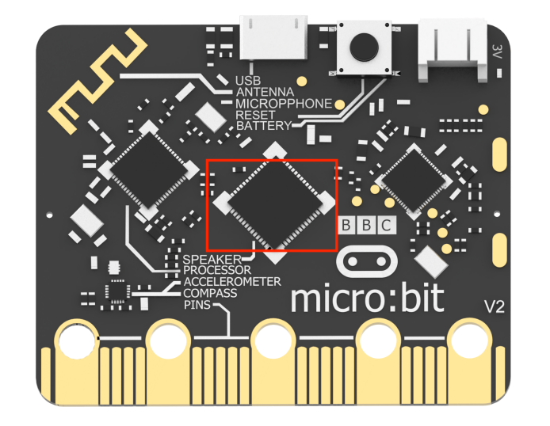

The location of the buttons on the micro:bit board is shown below:


**(1) Learning Objectives**

Program the micro:bit buttons to implement music playback.

**(2) Program Design**

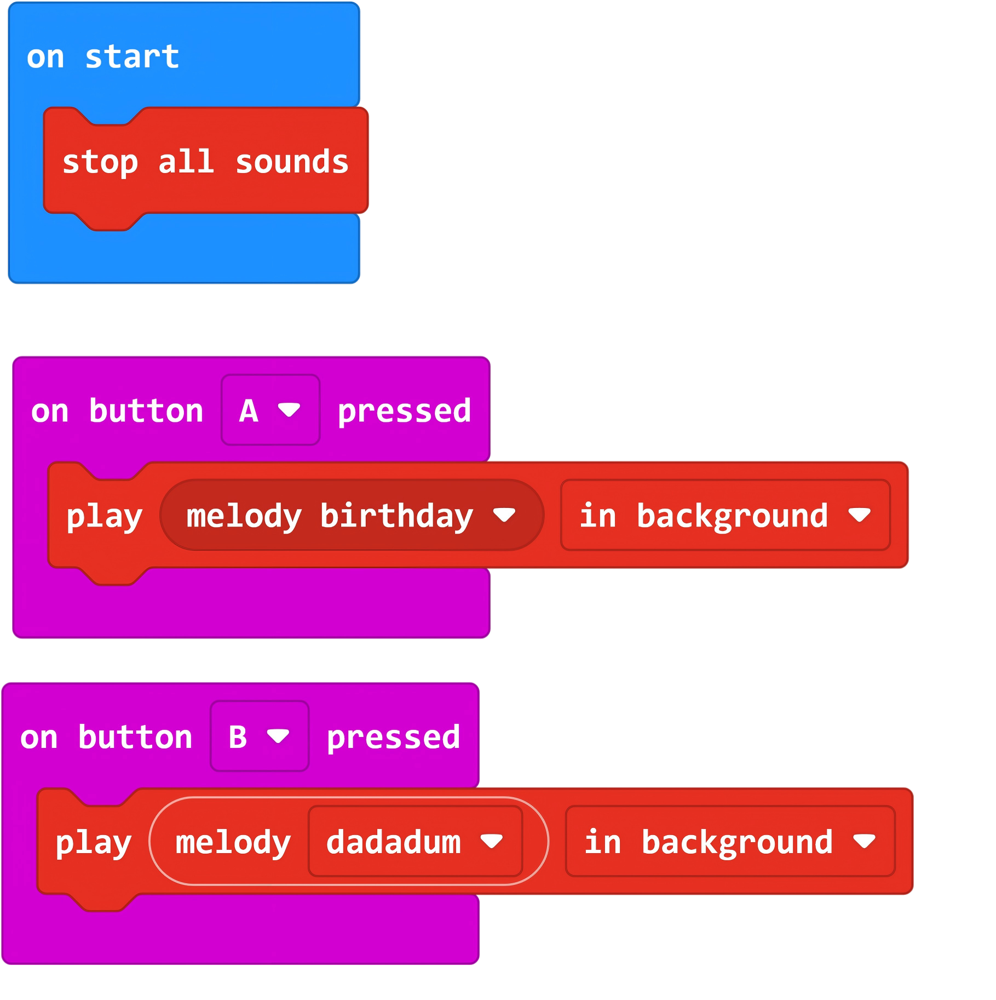

Program link: [MakeCode Project](https://makecode.microbit.org/_VaRRFA8DwHca)</br>

The program is also available for direct download via the following interface:

<FeishuForm url="https://makecode.microbit.org/_VaRRFA8DwHca"/>

**(3) Program Upload**


**(4) Demonstration and Operation**

After the program is uploaded, pressing Button A plays the song "Happy Birthday", and pressing Button B plays the melody "dadadum".

#### Case 5: Noise Detector

The location of the buzzer on the micro:bit board is shown below:


The location of the microphone on the micro:bit board is shown below:

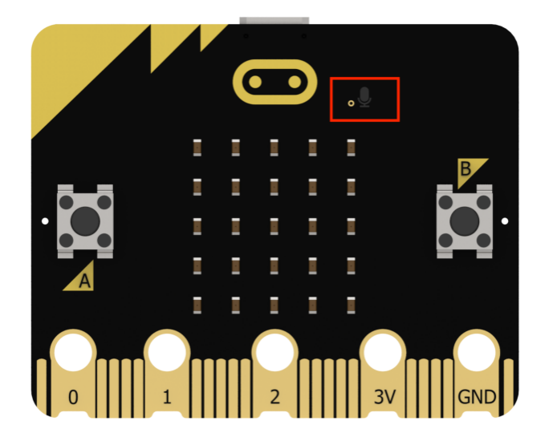

**(1) Learning Objectives**

Program sound detection and audio feedback routines.

**(2) Program Design**

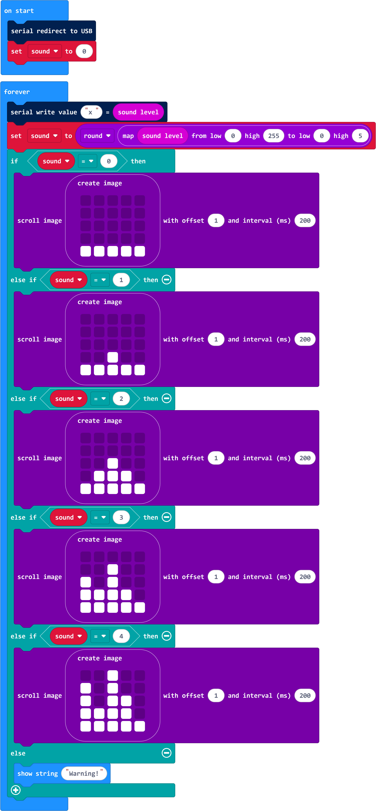

Program link: [MakeCode Project](https://makecode.microbit.org/_FYt9Wea889Fg)</br>

The program is also available for direct download via the following interface:

<FeishuForm url="https://makecode.microbit.org/_FYt9Wea889Fg"/>

**(3) Program Upload**


**(4) Demonstration and Operation**

After the program is uploaded, speak toward the microphone on the micro:bit board. The LED matrix reflects the detected sound intensity by illuminating bars of varying heights corresponding to the input volume.

#### Case 6: Night Alarm

The location of the LED matrix on the micro:bit board is shown below:

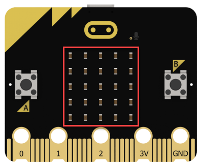

The location of the speaker on the micro:bit board is shown below:


**(1) Learning Objectives**

Program ambient light detection and sensory feedback routines.

**(2) Program Design**

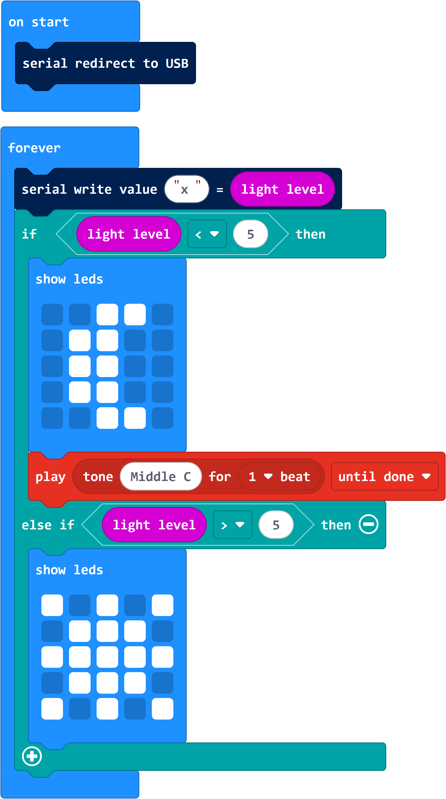

Program link: [MakeCode Project](https://makecode.microbit.org/_9LMVjLa2hTR4)</br>

The program is also available for direct download via the following interface:

<FeishuForm url="https://makecode.microbit.org/_9LMVjLa2hTR4"/>

**(3) Program Upload**


**(4) Demonstration and Operation**

After the program is uploaded, move the micro:bit board into darkness. The LED matrix displays a moon pattern, and the speaker emits an alert tone.

#### Case 7: Electronic Compass

The location of the magnetometer on the micro:bit board is shown below:

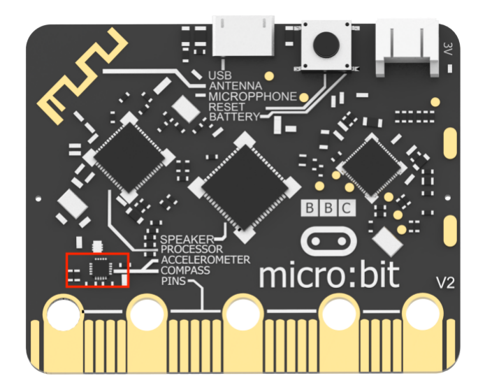

**(1) Learning Objectives**

Implement heading detection and display directional arrows on the LED matrix.

**(2) Program Design**

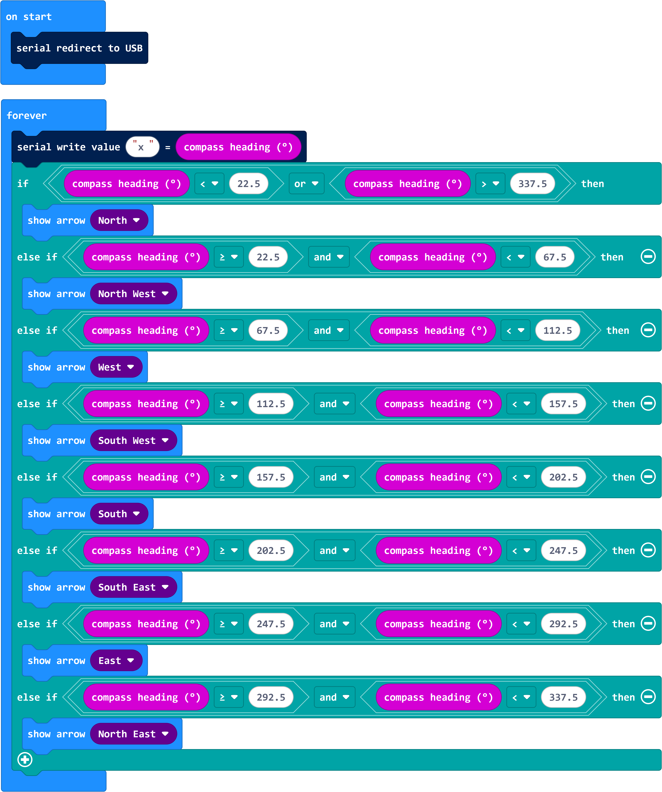

Program link: [MakeCode Project](https://makecode.microbit.org/_UbzFUjDctW1P)</br>

The program is also available for direct download via the following interface:

<FeishuForm url="https://makecode.microbit.org/_UbzFUjDctW1P"/>

**(3) Program Upload**


**(4) Demonstration and Operation**

After calibration is completed, rotate the controller board in different directions. The LED matrix displays arrows pointing toward the corresponding heading.

> [!NOTE]
>
> **After the program is uploaded, the micro:bit board scrolls the prompt "TILT TO FILL SCREEN". Calibration is required at this stage. Tilt the micro:bit board forward, backward, left, and right until all LEDs on the matrix light up.**

## 6.2 Nexbit AI Chassis Board

### 6.2.1 Overview

The Nexbit AI chassis features a compact form factor built on an immersion gold ENIG PCB. It integrates an array of electronic components, including a 4-channel line follower sensor with tuning knobs, RGB LEDs, DC geared motors, and an infrared receiver. These components support core functions such as line-following navigation, status indication, propulsion, and signal reception. The chassis also provides multiple servo ports and sensor expansion ports to support secondary development and hardware expansion.

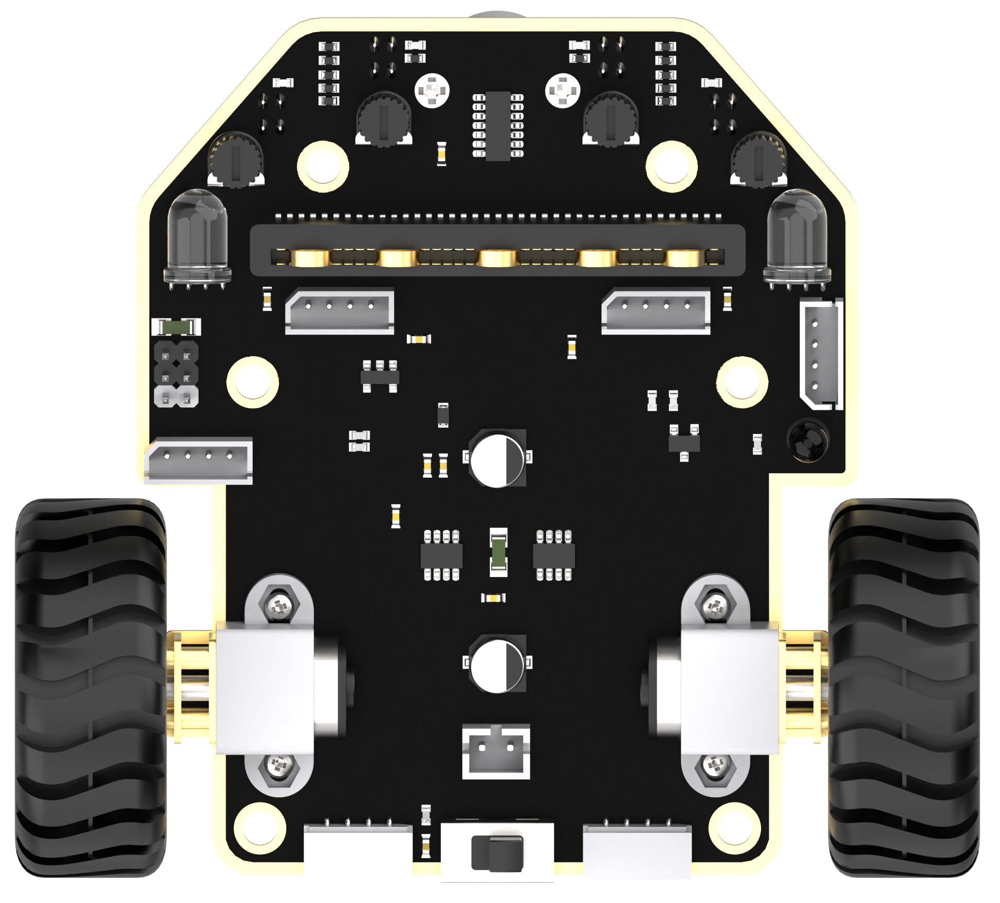

### 6.2.2 Hardware Layout

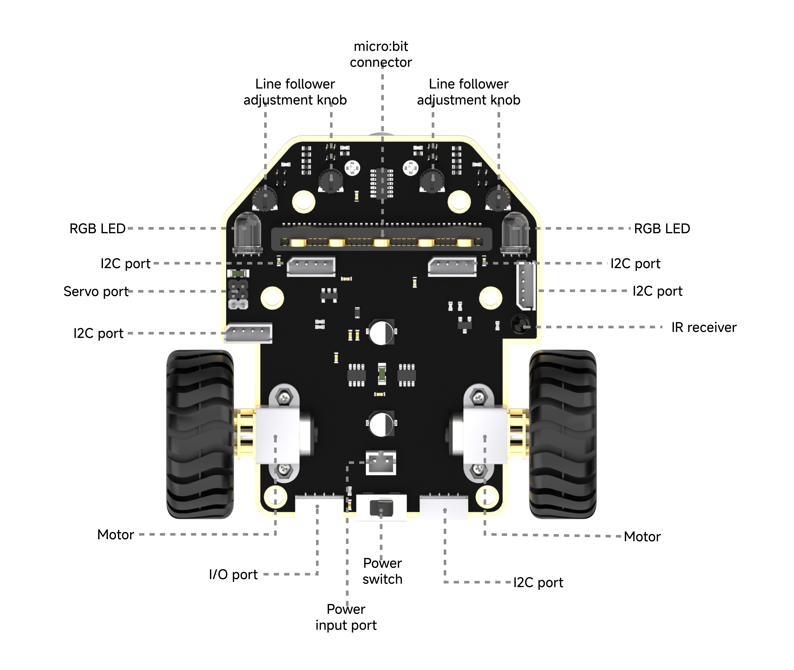

## 6.3 Microsoft MakeCode Programming Platform

### 6.3.1 Platform Overview

The micro:bit requires no local IDE installation. Programming is performed directly within a web browser. Access the environment by clicking [Microsoft MakeCode for micro:bit](https://makecode.microbit.org/), or copy the URL below into any web browser to open the website:

```
https://makecode.microbit.org/
```

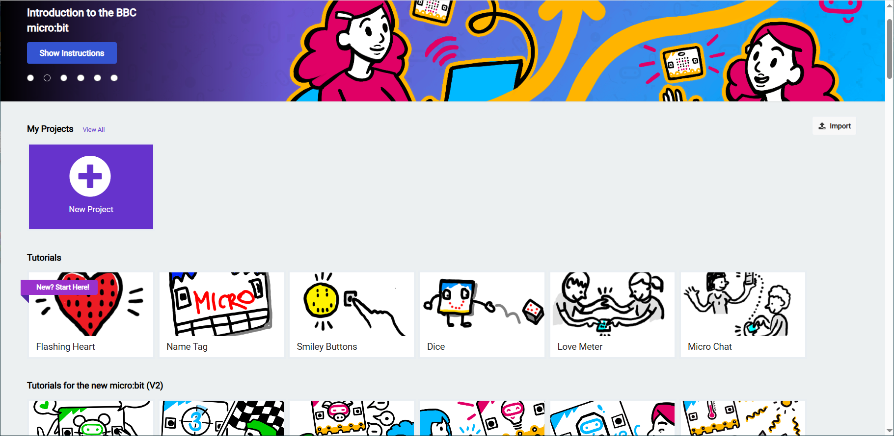

* **IDE Settings and Toolbar Introduction**

To start a new project, click **New Project**, enter the project name, and click **Create**.


Upon entering the programming workspace, the interface is organized into the functional sections shown below:

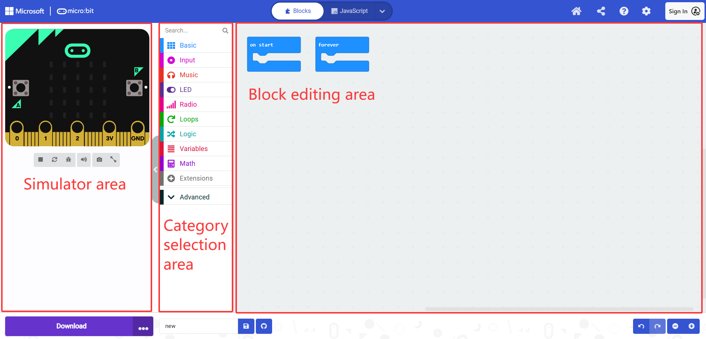

| Area | Function Description |
| :---: | :--- |
| Simulator | Simulates block execution in real time |
| Block Toolbox | Provides built-in categories and imported extension block menus |
| Workspace | Block programming canvas used to assemble, copy, paste, modify, and delete code blocks |

### 6.3.2 micro:bit Official Block Library

| Block | Category | Function Description |
| :---: | :---: | :--- |
|  |  | Displays the specified number on the LED matrix. |
|  |  | Displays a custom drawn pattern on the LED matrix. |
|  |  | Displays a built-in preset icon on the LED matrix. |
|  |  | Scrolls a specified text string across the LED matrix. |
|  |  | Clears all illuminated pixels from the LED matrix. |
|  |  | Infinite loop block that repeatedly executes nested code while powered on. |
|  |  | Startup event block that executes nested code once upon device power-on or program upload. |
|  |  | Pauses program execution for the specified duration in milliseconds before continuing. |
|  |  | Displays an arrow pointing in the specified direction on the LED matrix. |
|  |  | Button event block. Executes nested code when Button A is pressed. The dropdown menu toggles between Button A, Button B, and Button A+B. |
|  |  | Reads the current button state and returns a boolean value. |
|  |  | Reads the onboard accelerometer and returns acceleration values along the X, Y, or Z axis in milli-g (mg). |
| 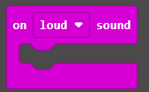 |  | Sound event trigger block. Executes nested code when the microphone detects a loud sound. |
|  |  | Executes nested code when the logo button on the controller board is pressed. Dropdown options configure trigger conditions such as pressed or released. |
|  |  | Reads the sound level captured by the microphone, returning a value from 0 to 255. |
|  |  | Reads ambient temperature measured by the onboard sensor on the micro:bit board, returning the value in degrees Celsius. |
|  |  | Plays a melody. Configures note sequences, tempo in BPM, and playback mode to drive the buzzer. |
|  |  | Immediately stops all playing sounds and melodies, disabling audio output from the buzzer. |
| 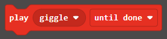 |  | Plays built-in sound effects. Selecting modes such as "until done" halts subsequent code execution until the sound completes. |
|  |  | Plays a specified tone through the buzzer. |
| 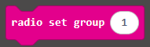 |  | Sets the radio communication group. Only devices configured to the same group can send and receive wireless data. |
|  |  | Broadcasts a specified numeric value wirelessly via the radio module. |
|  |  | Radio data received event block. Executes nested code when incoming wireless data arrives. |
|  |  | Repeats nested code for a specified number of iterations. Exits the loop and continues execution after completion. |
| 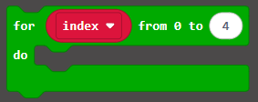 |  | Repeats nested code at periodic millisecond intervals to implement recurring tasks. |
| 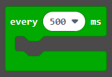 |  | For loop with an index variable. The index increments through sequential values (such as 0 to 4), executing nested code once per value. |
| 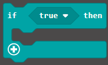 |  | Conditional statement block. Executes code inside the then clause when the condition is true. Click the plus icon to add else if branches. |
| 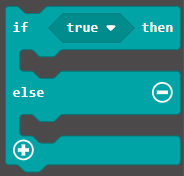 |  | Two-way conditional branch. Executes the then branch when true, or the else branch when false. |
| 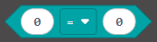 |  | Numeric comparison operation. Compares two numbers and returns a boolean value (true or false). |
|  |  | String comparison operation. Checks whether two text strings are identical and returns true or false. |
|  |  | Logical AND operation. Returns true only when both conditions are true. |
|  |  | Logical OR operation. Returns true if either condition is true. |
|  |  | Logical NOT operation. Inverts the boolean result of the input condition. |
|  |  | Boolean constant true value, representing an active or fulfilled condition. |
|  |  | Creates a custom variable. |
|  |  | Reads and retrieves the numeric value stored inside a variable. |
|  |  | Sets the specified variable to a designated value. |
|  |  | Changes the variable value by a specified increment or decrement amount. |
|  |  | Performs arithmetic calculations (addition, subtraction, multiplication, or division) and outputs the result. |
| 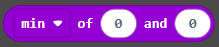 |  | Accepts two input numbers and returns either the minimum or maximum value. |
|  |  | Rounds a floating-point number, supporting round to nearest, round up, or round down. |
| 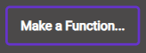 | <br> | Creates a custom function to encapsulate reusable program logic. |
|  | <br> | Defines a custom function named `doSomething` containing reusable code routines. |
|  | <br> | Calls the custom function named `doSomething` to execute its nested code. |
|  | <br> | Exits the function and returns a specified value. |
|  | <br> | Retrieves and returns the element at the specified index from an array. |
|  | <br> | Returns the total number of elements contained in the specified array. |
|  | <br> | Checks whether target text contains a specified character substring, returning true or false. |
|  | <br> | Parses a numeric string and converts it into a computable numerical value. |
|  | <br> | Concatenates multiple text strings together into a single combined string. |
|  | <br> | Finds the zero-based index position of a specified substring within text. |
|  | <br> | Extracts a substring of specified length starting at a given index within text. |
|  | <br> | Splits text into an array of substrings using a designated delimiter character. |
|  | <br> | Empty string constant. |
| 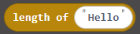 | <br> | Returns the total character count of a text string. |
| 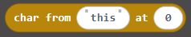 | <br> | Retrieves a single character from the specified index in a string. |

### 6.3.3 Nexbit Extension

#### 1. Importing the Extension

To load the Nexbit library, add the **https://github.com/Hiwonder/Nexbit** extension.

1. Click **Extensions**.


2. Copy the following link into the **Extensions** search bar and select **nexbit**:

```py
https://github.com/Hiwonder/Nexbit
```


#### 2. Extension Blocks Overview

| Block | Category | Function Description |
| :---: | :---: | :--- |
|  |  | Initializes Nexbit expansion board hardware, activating communication ports and the display driver. |
|  |  | Sets the target angle and duration for the specified servo, driving the servo through the angle motion. |
|  |  | Sets the rotational speeds of both DC motors simultaneously within a range of -100 to 100. Positive values indicate forward rotation, negative values indicate reverse rotation, and 0 indicates stop. |
| 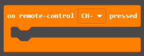 |  | Infrared remote event trigger block. Executes nested code when a button on the specified remote channel is pressed. |
| 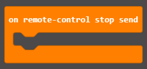 |  | Infrared transmission stop event block. Executes nested code when an infrared remote button is released. |
|  |  | Checks whether the specified line follower sensor detects a black line. Returns true if detected. Otherwise, it returns false. |
|  |  | Configures the RGB light mode and LED index on the ultrasonic sensor. Assigns colors via R, G, and B values to update the LED color immediately. |
|  |  | Reads the distance to an obstacle measured by the ultrasonic sensor in millimeters. |
|  |  | Plays the preset "Twinkle, Twinkle, Little Star" melody. |
|  | <br> | Sets RGB LED output brightness within a range of 0 to 255 to adjust overall light intensity. |
|  | <br> | Sets a preset RGB color for the designated LED index, storing the value in the color buffer without lighting up immediately. |
|  | <br> | Configures custom RGB color values for the designated LED index, storing the value in the color buffer without lighting up immediately. |
|  | <br> | Refreshes and outputs configured color settings to illuminate the RGB LEDs. |
| 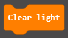 | <br> | Turns off all RGB LEDs, clearing color output on all pixels. |
|  | <br> | Reads the command identifier from received Bluetooth data packets, returning the command type to interpret mobile app instructions. |
|  | <br> | Extracts the parameter value at the specified index (starting from 1) from the Bluetooth packet, reading attached data such as speed or angle. |
|  | <br> | Dropdown enumeration block used to match the received Bluetooth command type. |
|  | <br> | Dropdown enumeration block containing vehicle motion commands to match incoming driving instructions over Bluetooth. |
|  | <br> | Converts an input value into ultrasonic ranging Bluetooth command format, transmitting ultrasonic read requests over Bluetooth. |

### 6.3.4 Handlebit Extension

#### 1. Importing the Extension

To load the Handlebit library, add the **https://github.com/HiwonderK12/Handlebit** extension.

1. Click **Extensions**.


2. Copy the following link into the **Extensions** search bar and select **Handlebit**:

```py
https://github.com/HiwonderK12/Handlebit
```


#### 2. Extension Blocks Overview

| Block | Category | Function Description |
| :---: | :---: | :--- |
|  |  | Completes initial configuration for the Handlebit controller module. |
| 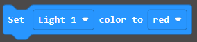 |  | Sets the specified LED index to a chosen color. |
| 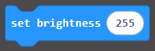 |  | Sets the overall brightness of the controller LEDs within a range of 0 to 255. |
| 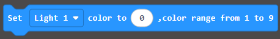 |  | Assigns a color to the LED using a numeric index, choosing from preset colors 1 through 6. |
| 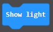 |  | Applies all light configurations and refreshes the controller LED display. |
| 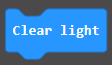 |  | Turns off all RGB LEDs on the controller, clearing light output. |
| 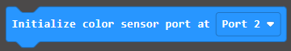 |  | Initializes the color sensor connected to the specified port. |
|  |  | Reads the color identified by the color sensor and returns the detection result. |
| 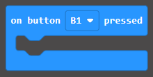 |  | Handlebit button event block. Executes nested code when the specified button is pressed. |
|  |  | Reads sensor values along the corresponding axis of the controller joystick. |
| 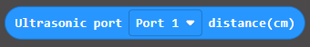 |  | Reads obstacle distance in centimeters from the ultrasonic sensor connected to the specified port. |
| 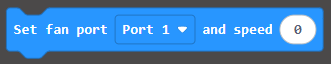 |  | Sets the fan speed on the specified port within a range of 0 to 100, where 0 indicates stop. |
|  |  | Reads the potentiometer knob value from the specified port, returning a number between 0 and 100. |
|  |  | Plays the preset "Twinkle, Twinkle, Little Star" melody. |
|  |  | Enables or disables the controller vibration motor by selecting ON or OFF from the dropdown. |

### 6.3.5 WonderLLM_S3 Extension

#### 1. Importing the Extension

To load the WonderLLM_S3 library, add the **https://github.com/hiwonderk12/WonderLLM_S3** extension.

1. Click **Extensions**.


2. Copy the following link into the **Extensions** search bar and select **WonderLLM_S3**:

```py
https://github.com/hiwonderk12/WonderLLM_S3
```


#### 2. Extension Blocks Overview

| Block | Category | Function Description |
| :---: | :---: | :--- |
|  |  | Initializes the WonderLLM AI vision module upon power-on and establishes communication. |
|  |  | Configures Model Context Protocol (MCP) tool information, defining the tool name, description, and input parameters callable by the AI, and configuring whether execution blocks until completion. |
| 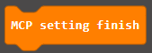 |  | Dispatches configured MCP tool settings to the AI module to activate the configuration. |
|  |  | Sends a notification to the AI module indicating that the current tool execution task is finished. |
|  |  | Returns data to the AI module within a custom function, passing the content inside the parentheses as the result for the AI to parse and trigger subsequent actions. |
|  |  | Reads returned execution data after the AI calls a tool. |

### 6.3.6 Bluetooth Extension

To load the Bluetooth library, add the **bluetooth** extension.

#### 1. Importing the Extension

1. Click **Extensions**.


2. Copy the term below into the **Extensions** search bar and select **bluetooth**:

```py
bluetooth
```


3. In the confirmation dialog, select **Remove extension(s) and add bluetooth**.


4. Next, set project pairing to **No Pairing Required: Anyone can connect via Bluetooth**.


#### 2. Extension Blocks Overview

| Block | Category | Function Description |
| :---: | :---: | :--- |
| 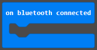 |  | Connection event block. Executes nested code immediately when a Bluetooth connection is established. |
|  |  | Disconnection event block. Executes nested code immediately when the Bluetooth connection is severed. |
| 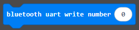 | <br> | Transmits numeric data via Bluetooth UART, sending entered values to a smartphone or computer. |
|  | <br> | Transmits a text string via Bluetooth UART to send prompts or sensor readings. |
|  | <br> | Reads Bluetooth serial data synchronously until a newline character is encountered, returning the complete line of received text. |

## 6.4 Wonderbit App

### 6.4.1 Overview

Wonderbit is a dedicated mobile control app developed specifically for the micro:bit robot series.


### 6.4.2 Downloading the Wonderbit App

- Click [Wonderbit](https://www.hiwonder.com.cn/download/foreignSofts?get_app=2) to download.

- Scan the QR code to download:


- Open the app. In the pop-up main interface, tap the hamburger menu icon with three horizontal bars, scroll down, and switch the device to **Nexbit AI**.


- Access the main control interface:


### 6.4.3 Wonderbit Bluetooth Connection

- After uploading the program, power on the Nexbit AI robot and tap  to search for devices.


- Tap **BBC micro:bit** to connect. Returning to the main interface confirms a successful connection, allowing robot control and testing.


## 6.5 Electronic Modules

### 6.5.1 Motors

#### 1. Overview

These DC geared motors are onboard components integrated into the Nexbit AI chassis. Motor control is implemented via pulse width modulation, also known as PWM. As continuous rotation motors, PWM signals regulate rotational speed and direction, but do not provide direct rotational angle positioning.

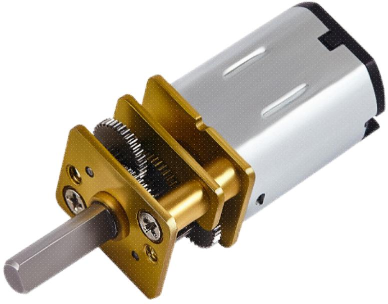

#### 2. Technical Specifications

| Parameter | Specification |
| :---: | :--- |
| Motor Model | N20 (3 V, 10,000 rpm) |
| Communication Method | PWM duty cycle control |
| Rotation Range | 0° to 360° |
| Stall Torque | 0.12 kg·cm |

#### 3. Practical Demo

**Project Overview**: Button-controlled motor rotation.

**Program Logic**: Pressing Button A drives the motor clockwise at a speed of 50. Pressing Button B drives the motor counterclockwise at a speed of -50. Pressing Button A and Button B simultaneously stops the motor.

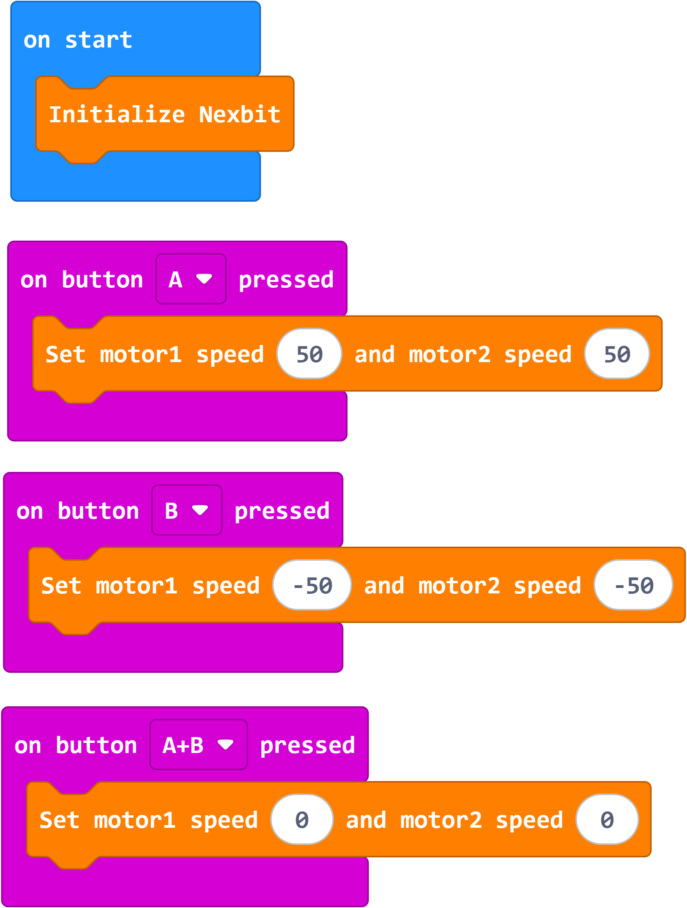

Program link: [MakeCode Project](https://makecode.microbit.org/_arJ7FXHspUDU)</br>

The program is also available for direct download via the following interface:

<FeishuForm url="https://makecode.microbit.org/_arJ7FXHspUDU"/>

Program upload instructions:


### 6.5.2 Glowy Ultrasonic Sensor

#### 1. Overview

This illuminated ultrasonic ranging module incorporates an industrial-grade ultrasonic ranging chip integrating ultrasonic transmitter, receiver, and digital signal processing circuits. The module utilizes an I2C communication interface to retrieve distance measurements detected by the ultrasonic sensor.


#### 2. Technical Specifications

| Parameter | Specification |
| :---: | :--- |
| Operating Voltage | DC 5 V |
| Operating Current | 2 mA |
| Operating Frequency | 40 Hz |
| Effective Range | 2 cm to 400 cm |
| Communication Method | I2C |
| Connector Model | 5264-4AW |
| Product Dimensions | 55.5 × 23.5 × 23.8 mm |

#### 3. Practical Demo

**Project Overview**: Real-time ultrasonic distance display.

**Program Logic**: The program executes a continuous loop displaying the obstacle distance detected by the ultrasonic sensor in centimeters, refreshing every 100 ms.

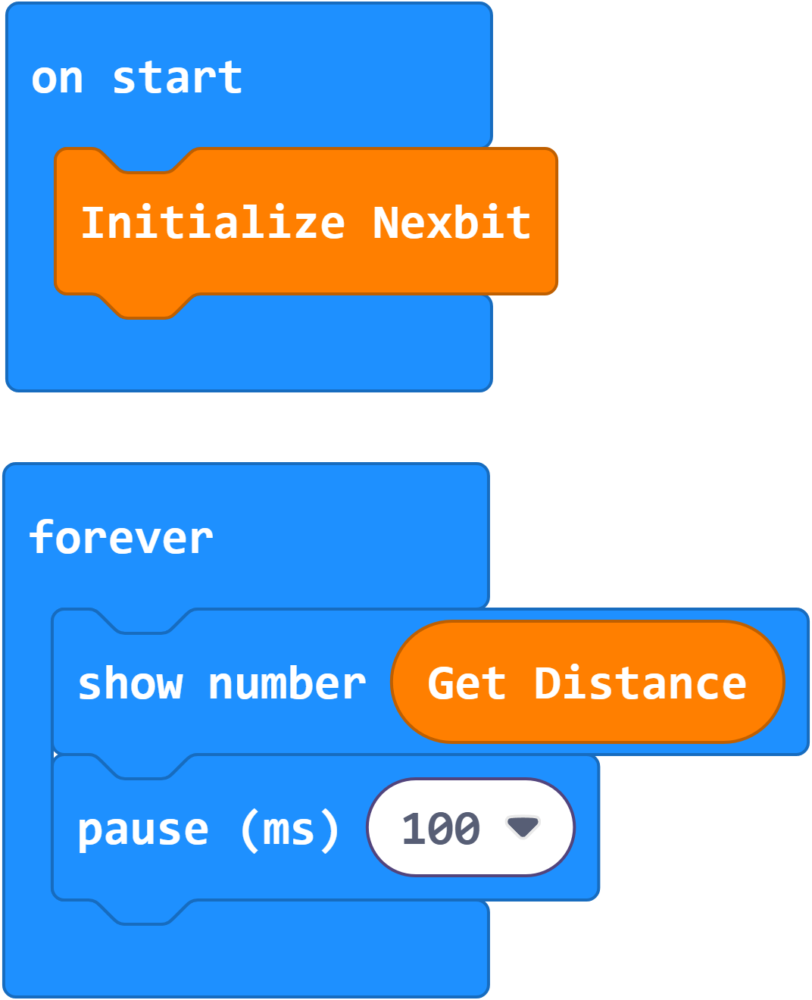

Program link: [MakeCode Project](https://makecode.microbit.org/_WkdTJ3CJ7EhH)</br>

The program is also available for direct download via the following interface:

<FeishuForm url="https://makecode.microbit.org/_WkdTJ3CJ7EhH"/>

Program upload instructions:


### 6.5.3 4-Channel Line Follower Sensor

#### 1. Overview

The 4-channel line follower sensor is mounted directly beneath the Nexbit AI chassis, utilizing miniature high-precision infrared probes to achieve accurate grayscale sensing within a range of 1 mm to 10 cm. The module integrates four independent sensitivity adjustment knobs with a 150° tuning range. Equipped with this 4-channel tracking array, the robot can execute demanding line-following tasks including right-angle turns, intersections, sharp turns, crossroads, and T-junctions.

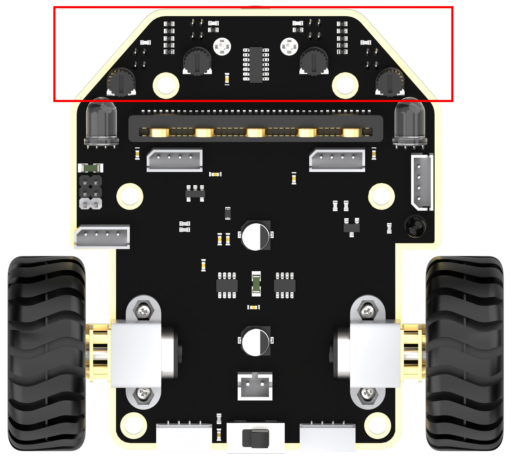

#### 2. Technical Specifications

| Parameter | Specification |
| :---: | :--- |
| Operating Voltage | 3.3 V to 5 V |
| Operating Current | 10 mA to 50 mA |
| Operating Temperature | -10 °C to 50 °C |
| Sensitivity Adjustment | Miniature potentiometers with 4 adjustment knobs |
| Detection Range | 1 mm to 10 cm adjustable, approx. 0.8 cm recommended |
| Communication Method | I2C |

#### 3. Practical Demo

**Project Overview**: Line follower sensor black line detection.

**Program Logic**: Upon startup, the program initializes the Nexbit robot car. The program then enters a continuous loop, reading line follower sensor 1 to check for black lines. Once sensor 1 detects a black line, all RGB LEDs illuminate red. The routine pauses for 100 ms after each cycle before scanning again.

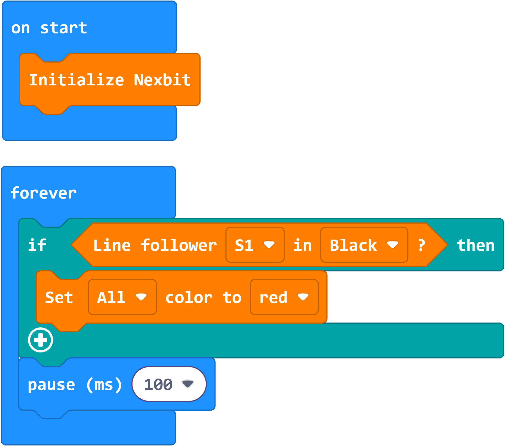

Program link: [MakeCode Project](https://makecode.microbit.org/_PXq2uMcC76a5)</br>

The program is also available for direct download via the following interface:

<FeishuForm url="https://makecode.microbit.org/_PXq2uMcC76a5"/>

Program upload instructions:


<a id="section-7-6"></a>

## 6.6 WonderLLM Module

<a id="section-7-6-1"></a>

### 6.6.1 Module Overview

#### (1) Module Introduction

The WonderLLM is an intelligent multimodal AI module powered by a high-performance ESP32-S3 chip. It integrates a 2MP camera, a microphone, a high-resolution display, an onboard speaker, and a CI1302 voice recognition chip, seamlessly combining multimodal AI capabilities across text, speech, and vision.

Designed for intuitive operation, the module serves as a super brain when paired with robotic platforms. It accurately interprets complex commands and endows robots with advanced perception, reasoning, and execution capabilities, delivering a responsive and natural human-robot interaction experience.


#### (2) Operating Principle

* The module uses command wake-up mode. Speaking the wake-up word activates WonderLLM to enable human-robot interaction. English recognition requires flashing the English voice recognition firmware. After switching to the English firmware, the wake-up keyword becomes **"Hello Hiwonder"**.

* Once the module detects the wake-up word, the buzzer emits a beep, indicating readiness for interaction. The module supports English conversations, automatically detecting and switching the language based on incoming speech. If no voice input is detected within 1 minute, the module enters sleep mode and requires waking up before further interaction.

#### (3) Hardware Port Description

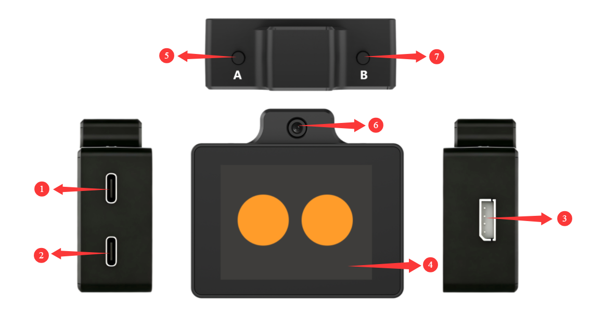

| Number | Description                                                  |
| :----: | :----------------------------------------------------------- |
|   1    | Top Type-C port: Used for flashing program firmware to the ESP32-S3 chip |
|   2    | Bottom Type-C port: Used for flashing voice recognition firmware to the CI1302 chip |
|   3    | 4-pin I2C port: Available for secondary development          |
|   4    | Capacitive touch screen: Used for screen display and volume adjustment |
|   5    | Left pushbutton: Used for toggling expressions and chat modes |
|   6    | HD camera: Captures real-time images                         |
|   7    | Right pushbutton: Used for network configuration and interactive control |

#### (4) Precautions

1. Supply power using a 5 V voltage source. Voltages outside this specification may damage the module.

2. Operate the module in a quiet environment, as background noise can degrade recognition performance.

3. Speak clearly and at a moderate pace, maintaining a distance within 5 m of the module.

<a id="section-7-6-2"></a>

### 6.6.2 Module Configuration

<a id="section-7-6-2-1"></a>

#### (1) Powering On

1. The module supports power input through any of the following ports: **① Top Type-C port**, **② Bottom Type-C port**, or **③ 4-pin I2C port**. Connect an external power supply to any of these ports, and the module powers on automatically.

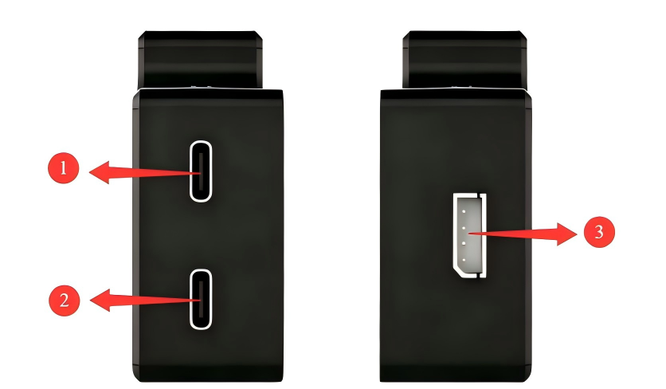

2. After powering on, the screen displays **Hiwonder**, indicating that loading is in progress. Once the screen displays the **device hotspot name** and **browser configuration URL** accompanied by a voice broadcast, proceed to [6.6.2 (2) Module Networking](#section-7-6-2-2) to configure the Wi-Fi connection.

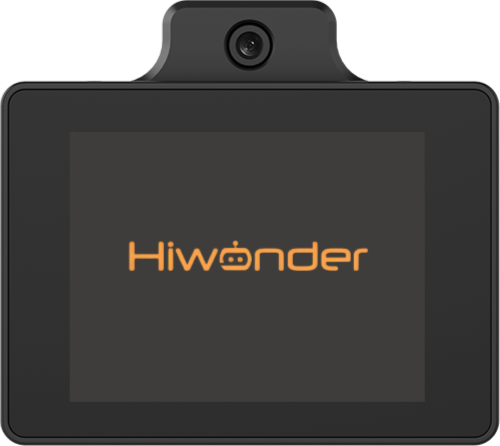


3. After completing network configuration, bind the module to a platform agent. When the screen displays the **Device ID** and **platform binding URL** while announcing the binding verification code, follow [6.6.2 (3) Device Binding](#section-7-6-2-3) to complete the process.

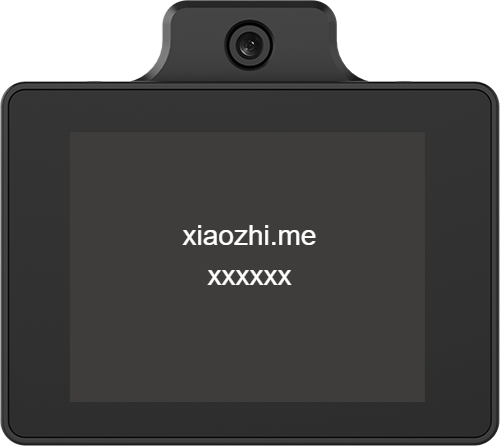

4. Upon powering on a previously bound device, the screen displays **Hiwonder** while the module attempts to connect automatically using saved Wi-Fi credentials. If the connection fails, the screen displays the **device hotspot name** and **browser configuration URL** along with voice prompts. Follow [6.6.2 (2) Module Networking](#section-7-6-2-2) to configure available Wi-Fi credentials for the current environment.


5. When the device is already bound and the configured Wi-Fi network is available, the screen shows **Hiwonder** during initialization, completes the connection, and transitions to the expression interface. At this stage, all module settings are operational. Wake the module to begin human-robot interaction.


<a id="section-7-6-2-2"></a>

#### (2) Module Networking

* **Operation Overview**

The module enters network configuration mode under three conditions: ① Initial operation or following firmware flashing when no valid Wi-Fi credentials exist in memory. ② No matching hotspot is available in the current environment. ③ Manual entry triggered by long-pressing Button B.

* **Operation Steps**

1. The module initiates network connection upon powering on. The screen displays the **device hotspot name** and **browser configuration URL** accompanied by a voice broadcast. The module activates its built-in hotspot for configuration. Hotspot names vary across devices and follow the format **"Robot-xxxx"**. The following guide uses hotspot Robot-B7B9 as an example.


2. Search for and connect to the corresponding hotspot using a computer or smartphone. The hotspot requires no password.

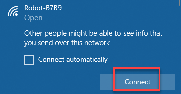


3. Click the hyperlink [Network Configuration](http://192.168.4.1/) or copy the following URL into any browser to open the configuration portal:

```py
http://192.168.4.1
```


4. Enter the target Wi-Fi name in field ① and the corresponding password in field ②. Click **Connect** in field ③. The module attempts to locate and connect to the specified network in the current environment.


5. If the following prompt appears, the network could not be located in the current environment, or the password was incorrect. Re-enter the credentials.


6. When the following prompt appears, the module has connected successfully to the hotspot. The module restarts automatically and connects to the specified network.


> [!NOTE]
>
> * **Do not enter hotspots that cannot be scanned in the current environment, have excessively weak signals, or lack Internet connectivity.**
>
> * **If network credentials were saved previously, newly saved hotspot information coexists with existing profiles. Upon subsequent power-ups, the module checks stored profiles sequentially in order of storage to attempt a connection.**
>
> * **If the prompt "Error: Failed to check for new version, will retry in xx seconds" appears after network configuration, the hotspot may lack Internet access or provide poor connection quality. Switch to a reliable network.**

* **Entering Configuration Mode Manually**

1. The WonderLLM module supports manual entry into configuration mode to accommodate specific network selection requirements.

2. **Procedure:** When the module is powered on, long-press the right button to send a restart command. The screen turns off upon receiving the command. Continue holding the button. As the module restarts and begins connecting to the network, a white circular progress bar appears on screen. Upon detecting the long-press on the right button, the module halts external network matching and enters configuration mode directly. Release the button at this point.

3. Existing hotspot configuration profiles remain intact upon entering configuration mode. Access the network configuration portal or short-press the right button to exit configuration mode.

4. After exiting configuration mode, the module continues attempting connections based on saved network profiles. If no connection can be established, it re-enters configuration mode.

* **Managing Saved Wi-Fi Profiles**

1. While the module is in configuration mode, connect to its hotspot and open the configuration portal to view all saved Wi-Fi profiles, if configured previously, as shown below:

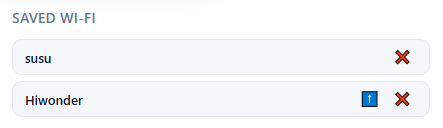

2. Click the delete icon  next to any saved profile to remove it. Click the up-arrow icon  to raise its connection priority during matching, with priority decreasing from top to bottom.

<a id="section-7-6-2-3"></a>

#### (3) Device Binding

* **Operation Overview**

Upon completing network configuration on first use, the screen displays a **6-digit Device ID** and the **platform binding URL**, accompanied by a voice broadcast. Follow the steps below to bind the module to a platform agent.


* **Operation Steps**

1. Click the hyperlink [XiaoZhi AI Chatbot](https://xiaozhi.me/) or copy the following URL into any browser to open the binding portal:

```py
https://xiaozhi.me
```


2. Click **Console** to access the XiaoZhi AI agent management platform.


3. For first-time visitors, register or log in to a platform account.


4. Fill in the required credentials and click **Send code** to obtain the verification code.


5. Check the box agreeing to the User Agreement and Privacy Policy, then click **Login**.


6. Complete the required profile information, then click **Confirm** to complete registration and log in.


7. Upon completing registration and logging in, the following dashboard appears.

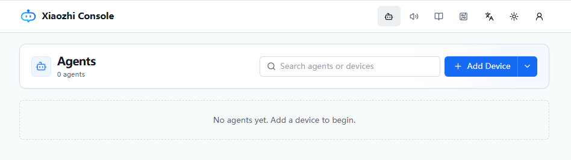

8. Click the dropdown arrow **∨** next to **+ Add Device**, then click **+ Create Agent**.

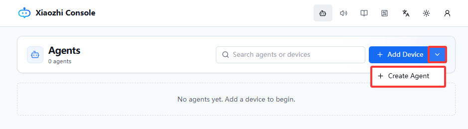

9. Enter the agent name, then click **Confirm** to create the agent.

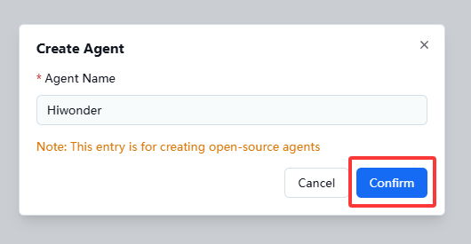

10. Click **Configure** to adjust agent features.


11. Click **Role** to configure the agent role. Select the desired conversation language in field ①, the character voice in field ②, and configure speech settings under **Voice settings** in field ③.


12. Click **Model & memory**. Select **Xiaozhi Lite** under **Language Model**, toggle off **Memory**, and retain default selections for other settings.

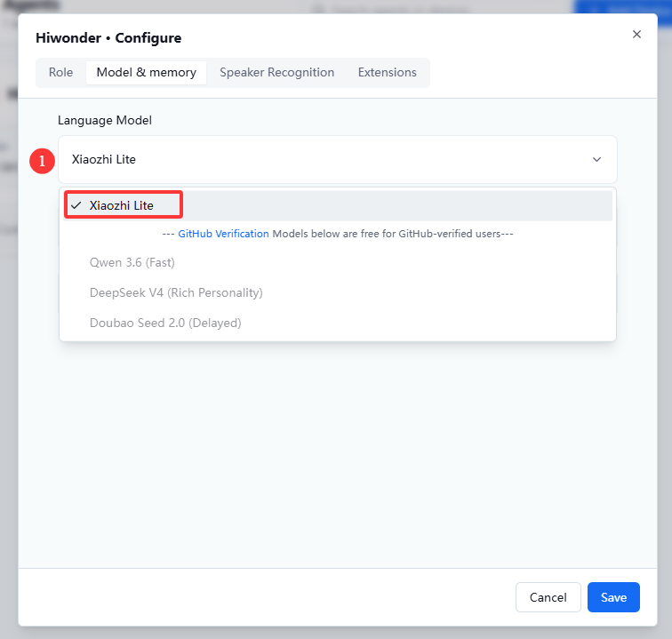


> [!NOTE]
>
> **Accounts without developer verification on the XiaoZhi AI platform can only select entry-level models such as XiaoZhi Lite. To use more capable models such as Qwen 3.6 or DeepSeek V4, complete the verification outlined in [6.6.2 (5) Platform Developer Verification](#section-7-6-2-5) before returning to this menu.**

13. Click **Extensions** to toggle official platform features. Features are enabled by default for new agents. Click **Save** once selections are complete.

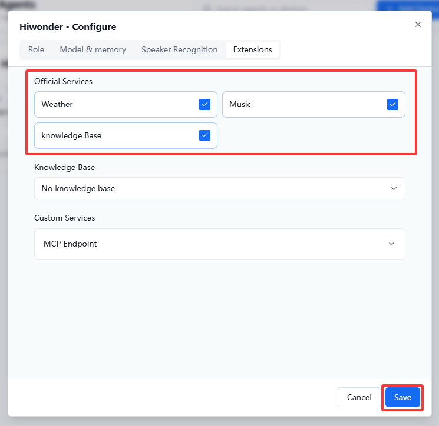

14. Click **Devices (0)** to open device management.

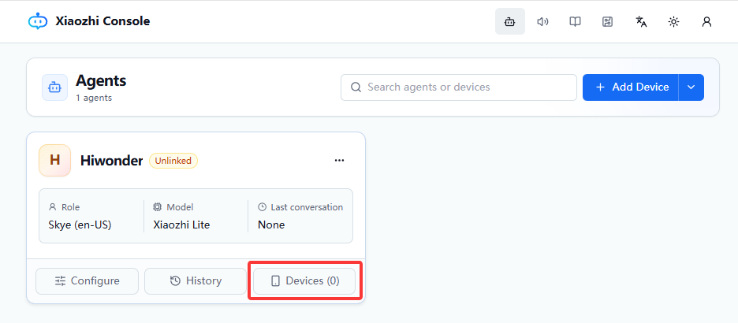

15. Click **+ Link new device**, enter the **6-digit verification code** announced by the device, and click **Link**.

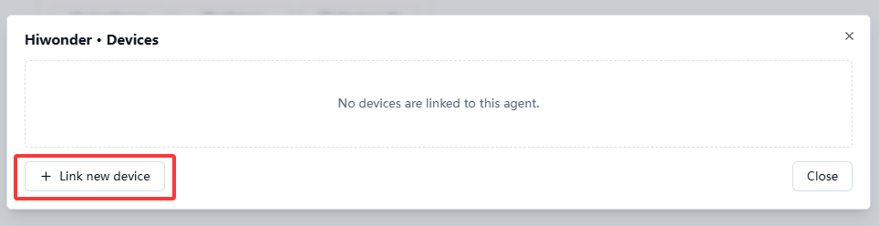


16. Once linked successfully, the notification **Device added successfully** appears. Select **Open Source**, then click **Start Using**.

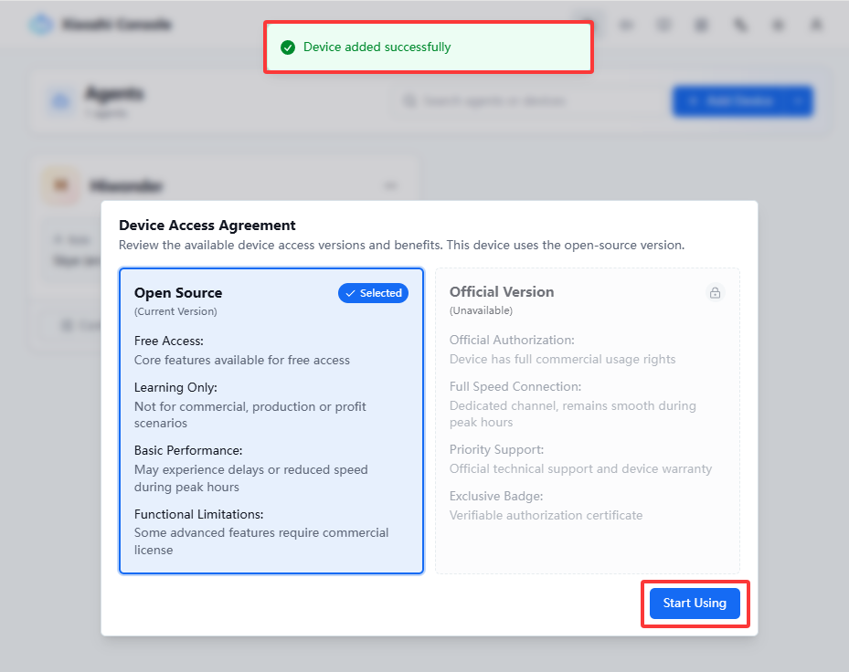

<a id="section-7-6-2-4"></a>

#### (4) Device Unbinding

* **Operation Overview**

Follow the steps below to unbind a device if necessary.

* **Operation Steps**

1. Click the hyperlink [XiaoZhi AI Chatbot](https://xiaozhi.me/) or copy the following URL into any browser to open the portal:

```py
https://xiaozhi.me
```


2. Click **Console** to access the XiaoZhi AI agent management platform.


3. Click **Devices** to open device management.


4. Locate the device to unbind, click the corresponding unbind icon , and click **Unbind** in the confirmation modal.

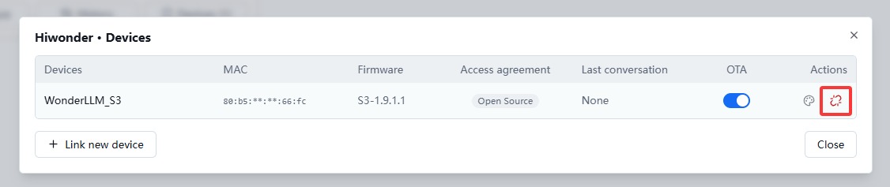

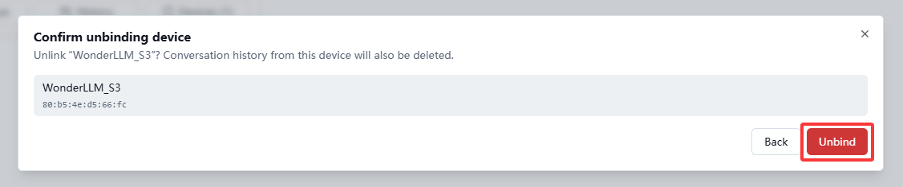

5. Upon successful unbinding, the prompt **Device unbound successfully** appears on screen.

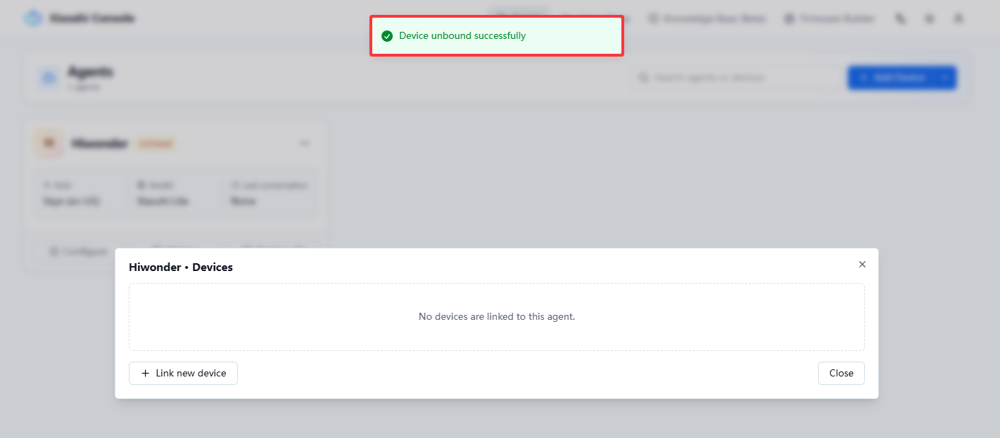

<a id="section-7-6-2-5"></a>

#### (5) Platform Developer Verification

> [!NOTE]
>
> **Unverified accounts can use the module normally, but with feature restrictions. The differences between verified and unverified accounts are shown below:**
>
> |          Feature           |           Unverified           |                       Verified                       |
> | :------------------------: | :----------------------------: | :--------------------------------------------------: |
> |      Model selection       |          Xiaozhi Lite          | Xiaozhi Lite, Qwen 3.6, DeepSeek V4, Doubao Seed 2.0 |
> |     Bound device limit     |               10               |                         100                          |
> | Official platform services | Weather, music, knowledge base |      Weather, joke, music, news, knowledge base      |

* **Logging into GitHub**

1. On the XiaoZhi platform, click **GitHub Verification** under the icon . Wait for the interface to load, then click **Link GitHub**.


2. Wait for the page to redirect to the GitHub login portal.

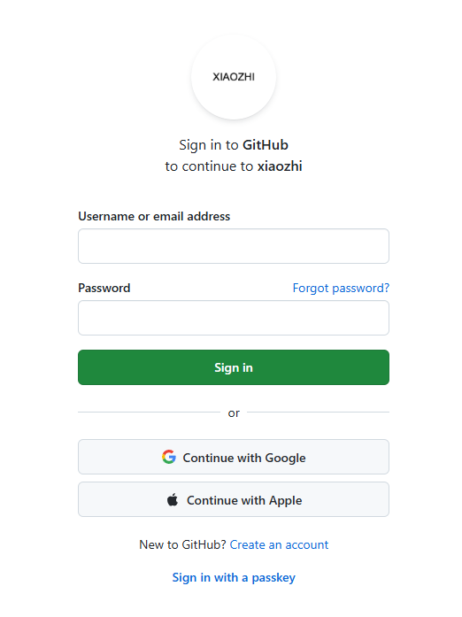

3. If an account already exists, enter credentials to log in, proceeding directly to [6.6.2 (5) Binding XiaoZhi Platform with GitHub](#section-7-6-2-5-2). If no account exists, click **Create an account**.


4. In the registration interface, enter an email address, password, username, and country or region info. Click **Create account** to submit the registration details.


5. Click **Visual puzzle** on the page to begin image verification.


6. Upon completing image verification, GitHub sends a verification email to the registered address. Open the email, copy the verification code, and enter it into the webpage.


7. After registration finishes, the page redirects to the login screen, displaying a registration success notification modal.


<a id="section-7-6-2-5-2"></a>

* **Binding XiaoZhi Platform with GitHub**

1. Click **Authorize tenclass** to complete binding between the XiaoZhi platform and GitHub.

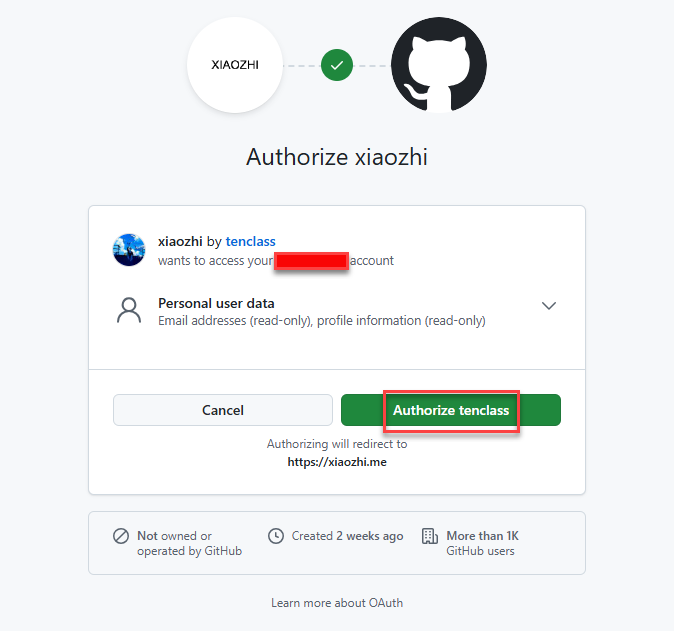

2. Once bound, verification is complete. The page automatically returns to the previous verification screen, displaying the confirmation status.


3. Click **Agents** to return to the console. When creating a new agent, all previously restricted features are unlocked.

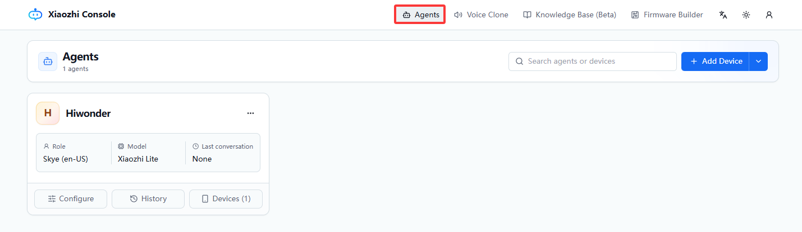

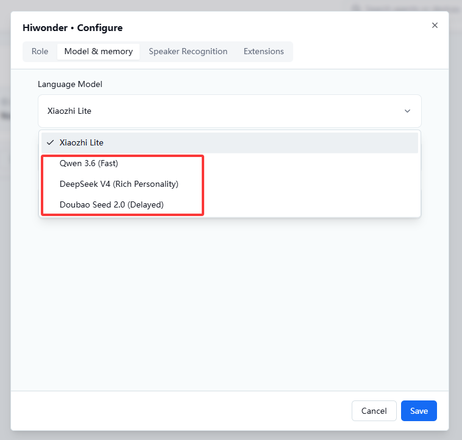

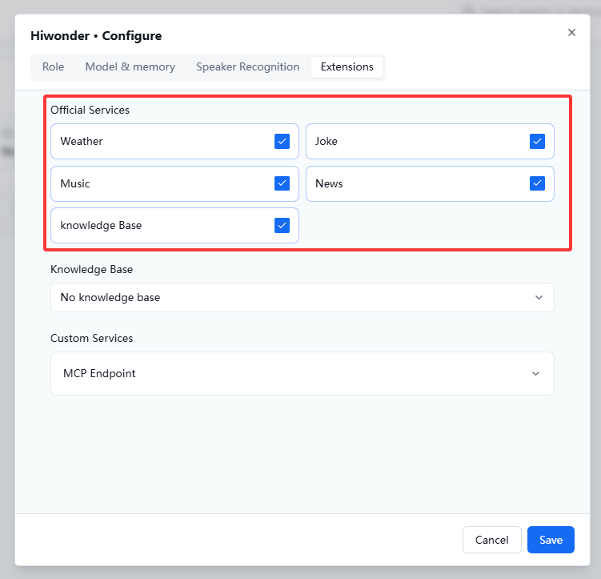

<a id="section-7-6-2-6"></a>

#### (6) Device Restarting

1. The module supports manual rebooting while powered on. Two methods are available without disconnecting the power supply: **① Long-press the left button, Button A**, or **② Long-press the right button, Button B**.

2. When detecting a long-press restart command, the module shuts down and restarts automatically. The screen turns off immediately. Release the button at this point. The module powers on shortly after.

3. When restarting via **long-pressing the right button, Button B**, failing to release the button promptly upon reboot may cause the module to enter configuration mode by mistake. Therefore, rebooting via the left button is recommended.

<a id="section-7-6-3"></a>

### 6.6.3 Volume Control

> [!NOTE]
>
> **Volume adjustments made while WonderLLM is speaking take effect during the next round of speech.**

#### (1) Touchscreen Control

1. After the module powers on and connects to an external Wi-Fi hotspot, volume can be adjusted via touchscreen swipes in two interfaces: ① Expression interface, and ② Chat interface.

2. Swipe vertically anywhere on the screen: swiping upward increases the volume, while swiping downward decreases it. The adjustment magnitude corresponds to the swipe distance. Multiple consecutive swipes are supported.

3. A live volume reading appears at the top of the screen during swiping. The figure below illustrates swiping upward on the **expression interface** to increase the volume:

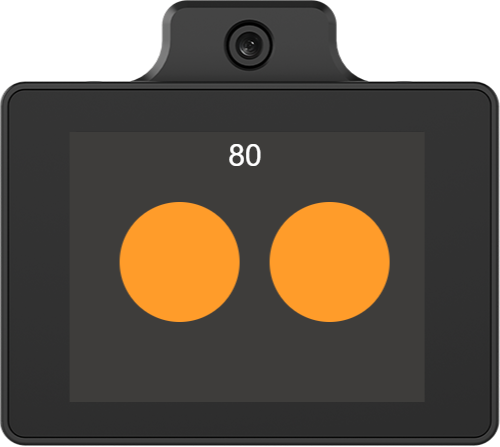

#### (2) Voice-Controlled Adjustment

1. Volume can also be adjusted by speaking voice commands during interaction with WonderLLM.

2. To adjust volume by voice, speak the wake-up word or short-press the right button to enter the **chat interface**. Once the module is active, refer to phrasing such as: **① "Set volume to xx", with a valid integer range of 0 to 100 or expressed as a percentage**, or **② "Increase volume", using relative phrasing where the module adjusts automatically**.

3. Upon recognition, the chat box returns the invoked volume adjustment function, followed by a generated response displayed on screen and announced via speaker — dynamically generated to ensure appropriate phrasing.

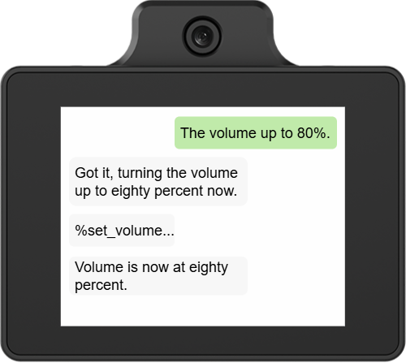

<a id="section-7-6-4"></a>

### 6.6.4 Chat Mode

#### (1) Mode Overview

1. In this mode, the module listens to and comprehends speech input, providing appropriate responses.

2. **Entering Chat Mode**: Speak the **wake-up word** or **short-press the right button** to enter chat mode.

> [!NOTE]
>
> **When not in chat mode, short-pressing the right button still prompts the model to listen, comprehend, and respond appropriately, but the display remains outside the chat interface.**


#### (2) Operation Instructions

1. After completing network configuration, the module opens the expression interface by default, as shown below:


2. Speak the designated wake-up word **Hello Hiwonder**, or **short-press the right button, Button B,** to enter chat mode. The buzzer sounds a tone to indicate successful activation, and the module begins listening.

3. When entering chat mode via **wake-up word**, the module automatically sends **Hello** as an opening prompt on behalf of the conversational partner. The model displays and speaks a greeting, which can be interrupted to skip ahead as detailed in [6.6.8 Free Chat](#section-7-6-8). The module then begins listening for incoming speech.

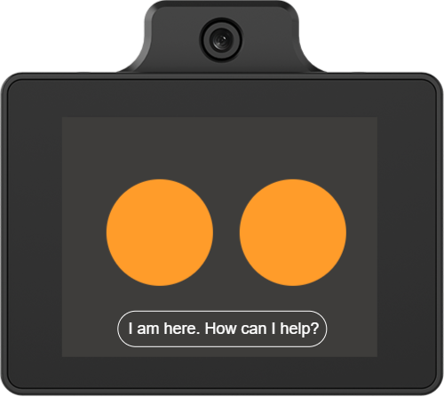

4. When entering chat mode by **short-pressing the right button**, the module **begins listening immediately**.

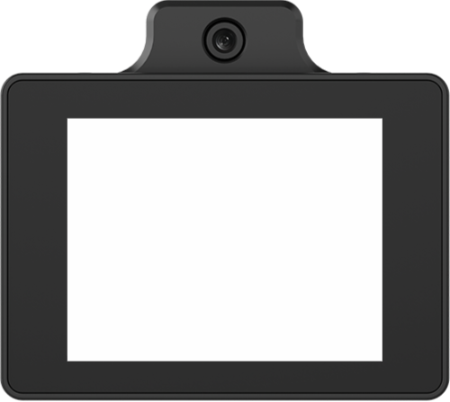

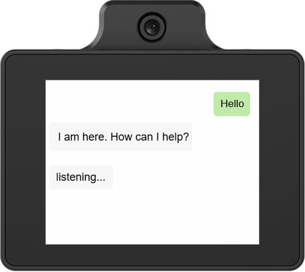

5. While interacting in chat mode, the interface can be toggled to **hide the chat box** and **maintain the expression interface continuously**. For detailed instructions, refer to the operational guide in [6.6.5 Expression Mode](#section-7-6-5).

<a id="section-7-6-5"></a>

### 6.6.5 Expression Mode

> [!NOTE]
>
> * **The module operates in Expression Mode while toggling modes with the left button. Short-pressing the left button to switch to Chat Mode does not wake up the module or activate live dialogue.**
>
> * **Specifically, if the display mode is set to "Chat Mode" via the left button, activating the module via wake-up word or the right button opens the chat box interface displaying the model's text responses.**
>
> * **If the display mode is set to "Expression Mode" via the left button, activating the module via wake-up word or the right button keeps the screen on the expression interface. The module mimics expressions appropriate to the response while displaying subtitles at the bottom of the screen.**

#### (1) Mode Overview

1. In this mode, the module simulates expressive facial reactions.

2. Methods for **entering expression mode**: **① Double-tap the screen in camera mode to enter expression mode, and ② Short-press the right button in chat mode, while the module is not speaking, to enter expression mode.**

#### (2) Operation Instructions

1. In expression mode, short-press the left button to toggle between **Chat Mode** and **Expression Mode**. The active mode is indicated at the top of the screen.

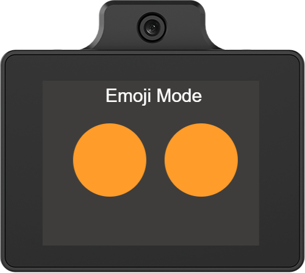


2. After toggling to **Expression Mode** via the left button, which configures the display to remain on facial expressions during chat, and activating the module via wake-up word or the right button, the module displays expressive reactions corresponding to dialogue. Common invocation approaches include: **① Describing a specific scenario, prompting the module to respond with an appropriate facial expression, and ② Requesting a specific expression, such as "Can you make a happy face?"**

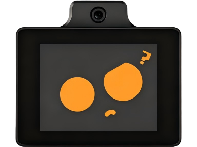

<a id="section-7-6-6"></a>

### 6.6.7 Camera Mode

#### (1) Mode Overview

1. In this mode, the module activates the camera to continuously capture and display real-time images.

2. Methods for entering camera mode: **① Double-tap the screen in expression mode to enter camera mode**. Direct switching from chat mode to camera mode is not supported.

#### (2) Operation Instructions

1. **Double-tap** anywhere on the screen in expression mode to switch to camera mode.

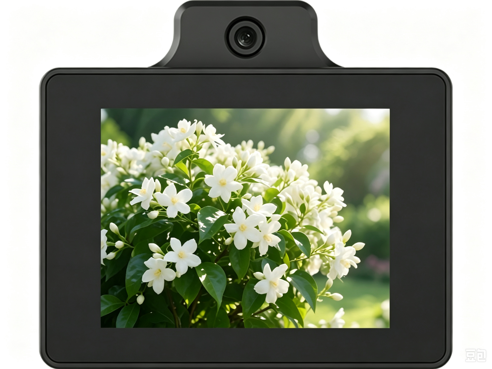

2. In camera mode, the module **continuously captures** and displays real-time camera imagery. Without additional interaction, the module remains in this mode.

3. Single-tapping anywhere on the screen in camera mode triggers the scene understanding feature, as detailed in [6.6.9 Scene Understanding](#section-7-6-9).

<a id="section-7-6-8"></a>

### 6.6.8 Free Chat

#### (1) General Operation

1. Once the module is powered on and connected to the network, wake the module by **speaking the wake-up word or short-pressing the right button** to enter chat mode.

2. Speak freely during interaction. The module communicates with cloud-based large models to comprehend input and respond via text and voice. Featuring contextual memory, the module supports continuous multi-turn dialogue.

3. After each conversational turn (including initial wake-up), the module continues listening. If no speech is detected for 2 consecutive minutes, listening terminates automatically, and the model announces a farewell phrase in the chat interface. To resume interaction, wake the module again by **speaking the designated wake-up word or short-pressing the right button**.

4. The WonderLLM module supports voice interruption. While the module is speaking, including **① Voice replies to speech, ② Spoken greetings, and ③ Spoken farewells**, short-pressing the right button immediately halts speech output and resumes listening for the next round of input.

5. The WonderLLM module supports bilingual recognition and speech in Chinese and English. Switch the operating language directly using phrases such as: **① "Can you speak Chinese with me?" or ② "Can we speak English?"**

#### (2) Special Feature Commands

* **Feature Overview**

The module includes built-in utility functions invocable via speech during conversation. Query all supported special features by asking: **① "What can you do?" or ② "Introduce your features."** Supported features are listed below:

| Number |     Feature      | Number |    Feature     |
| :----: | :--------------: | :----: | :------------: |
|   1    | Weather forecast |   4    |   Tell jokes   |
|   2    |  News broadcast  |   5    | Almanac lookup |
|   3    |  Outfit advice   |   6    | Music playback |

* **Usage Examples**

Invoke corresponding features using phrases such as the following:

1. Weather forecast: **"Check the weather in [Location]."**

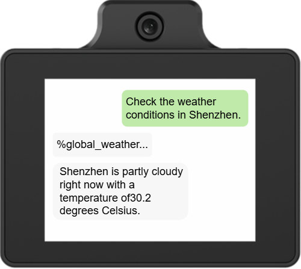

2. News broadcast: **① "Read today's news," or ② "What are today's trending topics?"**


3. Outfit advice: **"What should I wear when heading out today?"**


4. Tell jokes: **① "Tell me a joke," or ② "Can you tell a funny story?"**

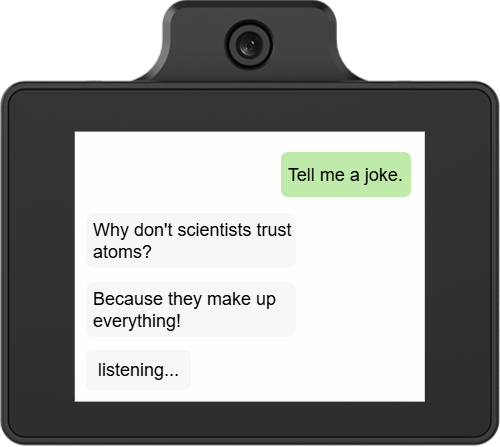

5. Almanac lookup: **"Check today's almanac."**


6. Music playback: **"Play a random song."** **Note: When using music playback, lowering the module volume is recommended.**

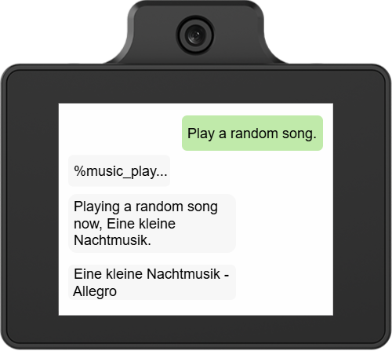

<a id="section-7-6-9"></a>

### 6.6.9 Scene Understanding

> [!NOTE]
>
> * **The scene understanding feature does not support continuous observation. It captures and analyzes a single real-time image upon receiving an activation command.**
>
> * **In camera mode, double-tapping the screen returns to the expression interface.**
>
> * **Before a single tap triggers the feature in camera mode, the module only captures and displays live camera imagery without invoking large models for analysis.**

#### (1) Voice-Controlled Trigger

1. Power on the module to enter the expression interface. Speak the **wake-up word or short-press the right button** to enter the chat interface and activate the module.

2. Command the WonderLLM module using phrases such as: **① "Describe what you see in front of you," or ② "Take a photo, please."**

3. Once the command is processed, the camera captures a still image and displays it briefly for confirmation. The chat window displays the invoked image capture function, followed by a generated analytical description displayed and announced via speech, with responses dynamically generated to ensure appropriate phrasing.


#### (2) Touchscreen Trigger

1. In expression mode, **double-tap** anywhere on the screen to enter camera mode. The screen displays the live camera view.


2. In camera mode, **single-tap** anywhere on the screen. The camera captures a still image, displays it briefly for confirmation, and returns to camera mode. The module automatically announces its analysis of the captured scene, with responses dynamically generated to ensure appropriate phrasing.

<a id="section-7-6-10"></a>

### 6.6.10 Firmware Flashing

<a id="section-7-6-10-1"></a>

#### (1) Large Model Firmware Flashing

1. Connect the top Type-C port of the WonderLLM module to a computer using a USB cable.

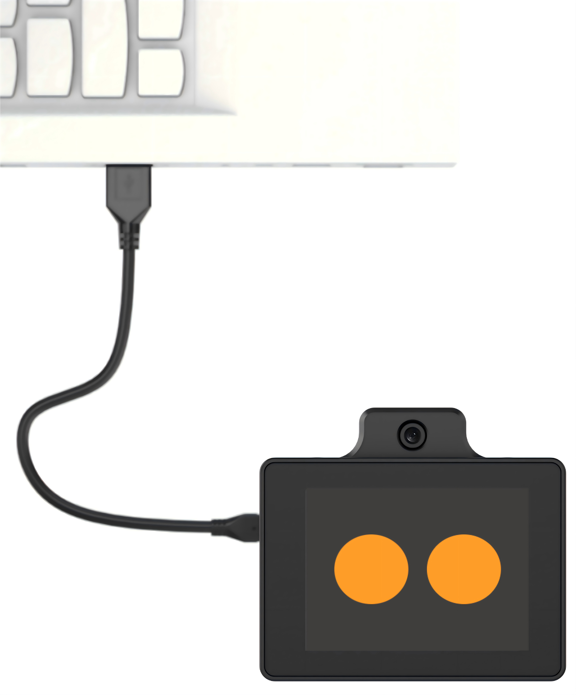

2. Open the file **flash_download_tool_3.9.7.exe** located in **[4. Appendix\01 WonderLLM Flashing Tool\01 ESP32-S3 Firmware Flashing Tool\flash_download_tool_3.9.7](https://drive.google.com/drive/folders/1hzuRXlqnWzxcf3HIhqwWyOVVGGoHmb6D?usp=sharing)**.


3. Select ChipType as **ESP32-S3**, leave other settings at their defaults, and click **OK**.


4. In the tool window, click **...** to select the firmware bin file: open **WonderLLM_S3-EN.bin** located in **[4. Appendix\02 WonderLLM Firmware Files\LLM Firmware](https://drive.google.com/drive/folders/1d2omBnvgcXARUFcagq5fOnvMyvP4Am3M?usp=sharing)**.


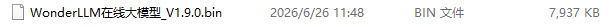

5. Check the box on the left and configure the remaining parameters as shown in the figure below. Select the COM port corresponding to the connected module. 

> [!NOTE]
>
> **If configuring SPI MODE to DIO as illustrated causes the module to malfunction after flashing, set SPI MODE to DOUT and reflash.**

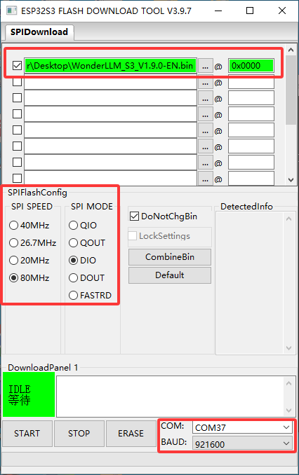

6. Click **ERASE** to wipe previously installed firmware, which is a mandatory step. Wait until the status bar displays **FINISH**.


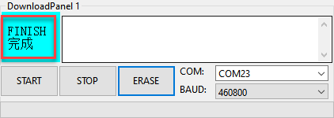

7. Click **START** to flash the selected firmware. Once the progress bar finishes loading, the firmware flashing process is complete.

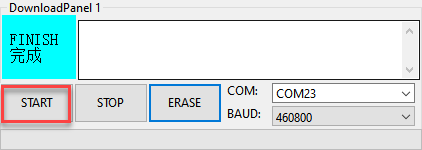

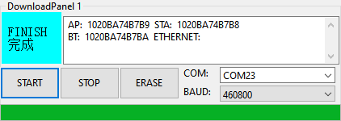

#### (2) Image Transmission Firmware Flashing

1. Connect the top Type-C port of the WonderLLM module to a computer using a USB cable.


2. Open the file **flash_download_tool_3.9.7.exe** located in **[4. Appendix\01 WonderLLM Flashing Tool\01 ESP32-S3 Firmware Flashing Tool\flash_download_tool_3.9.7](https://drive.google.com/drive/folders/1hzuRXlqnWzxcf3HIhqwWyOVVGGoHmb6D?usp=sharing)**.


3. Select Chip Type as **ESP32-S3**, leave other settings at their defaults, and click **OK**.


4. In the tool window, click **...** to select the firmware bin file: open **Image_transmission.bin** located in **[4. Appendix\02 WonderLLM Firmware Files\Image Transmission](https://drive.google.com/drive/folders/1T-IYEUdxbxuIeLbaYZeaS0nhT8nT6Mgi?usp=sharing)**.


5. Check the box on the left and configure the remaining parameters as shown in the figure below. Select the COM port corresponding to the connected module. 

> [!NOTE]
>
> **If configuring SPI MODE to DIO as illustrated causes the module to malfunction after flashing, set SPI MODE to DOUT and reflash.**

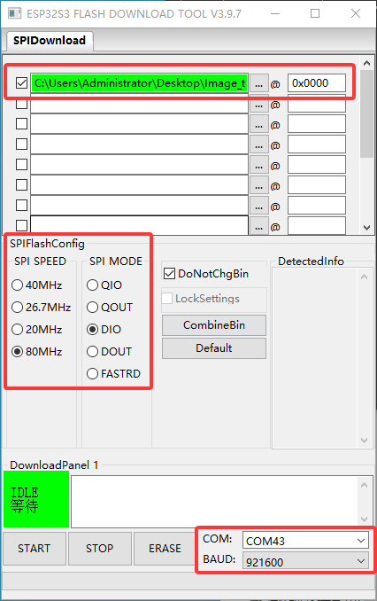

6. Click **ERASE** to wipe previously installed firmware, which is a mandatory step. Wait until the status bar displays **FINISH**.

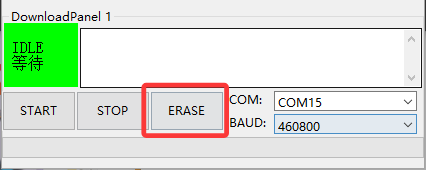


7. Click **START** to flash the selected firmware. Once the progress bar finishes loading, the firmware flashing process is complete.


#### (3) CI1302 Firmware Flashing

1. Connect the bottom Type-C port of the WonderLLM module to a computer using a USB cable.

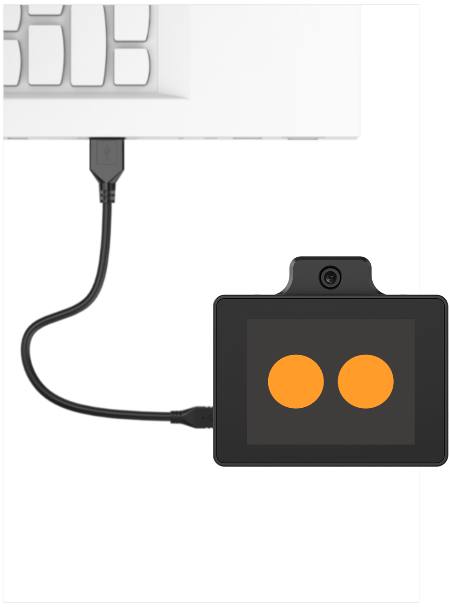

2. Open the file **PACK_UPDATE_TOOL.exe** located in **[4. Appendix\01 WonderLLM Flashing Tool\02 CI1302 Firmware Flashing Tool](https://drive.google.com/drive/folders/1lJfTzXZaq3qLbTeuznvu6-2uZRHI1Xs-?usp=sharing)**.

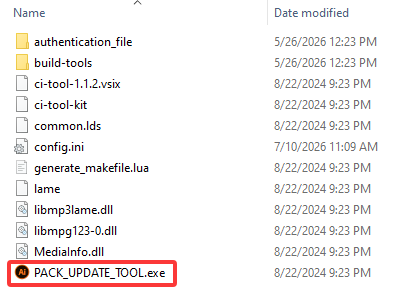

3. Select the **CI1302** chip, then click **Update**.

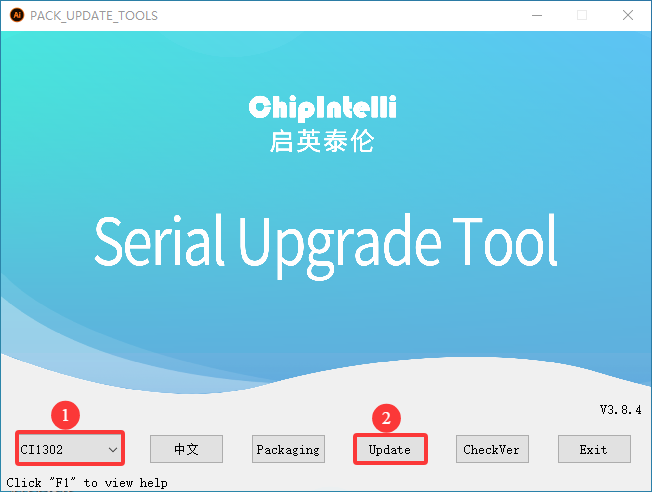

4. Click **Select Firmware** to choose the firmware bin file: open **CI1302-EN.bin** located in **[4. Appendix\02 WonderLLM Firmware Files\LLM Firmware](https://drive.google.com/drive/folders/1d2omBnvgcXARUFcagq5fOnvMyvP4Am3M?usp=sharing)**.

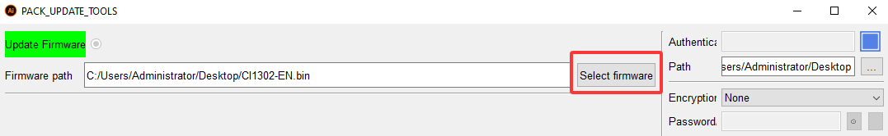


5. Locate the corresponding COM port and click to select it.

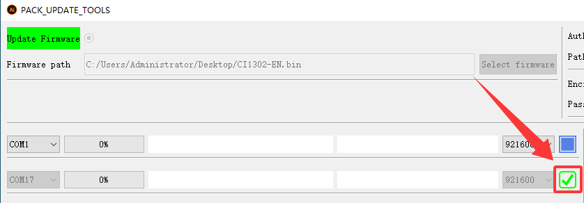

6. Long-press both pushbuttons, Buttons A and B, on the WonderLLM module simultaneously to initiate flashing, and wait for the flashing process to complete successfully.

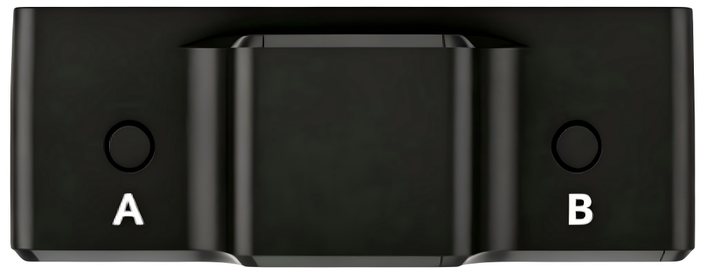

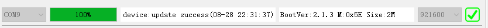
